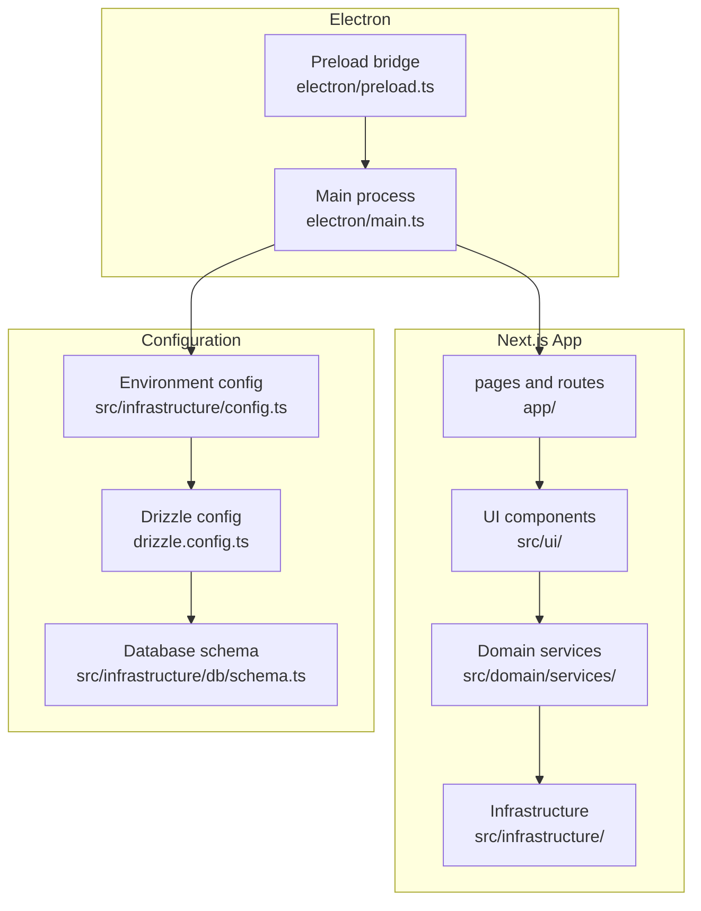
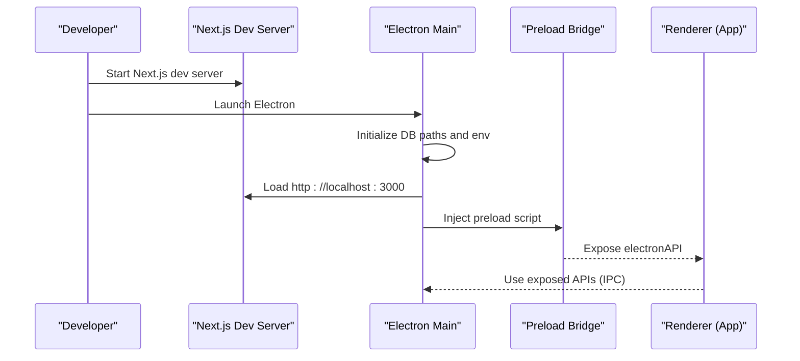
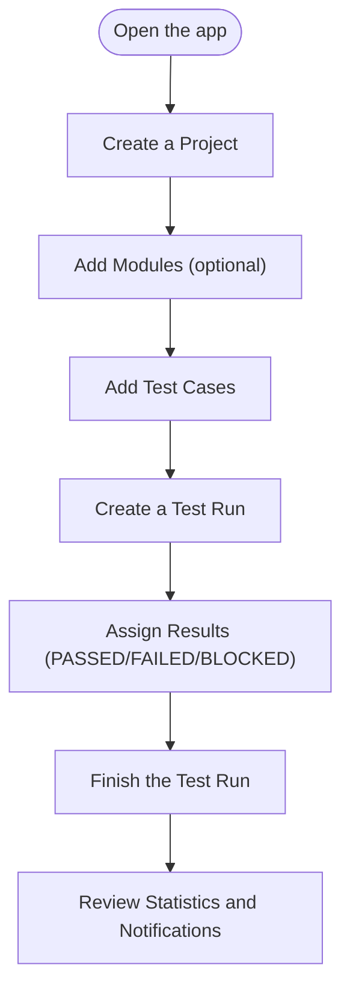
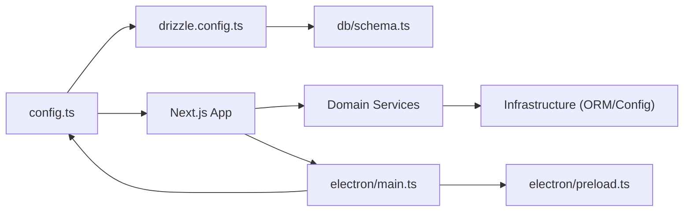

# Getting Started

<cite>
**Referenced Files in This Document**
- [package.json](file://package.json)
- [README.md](file://README.md)
- [README-ELECTRON.md](file://README-ELECTRON.md)
- [next.config.ts](file://next.config.ts)
- [tsconfig.json](file://tsconfig.json)
- [electron/main.ts](file://electron/main.ts)
- [electron/preload.ts](file://electron/preload.ts)
- [electron-builder.yml](file://electron-builder.yml)
- [src/infrastructure/config.ts](file://src/infrastructure/config.ts)
- [src/infrastructure/db/schema.ts](file://src/infrastructure/db/schema.ts)
- [drizzle.config.ts](file://drizzle.config.ts)
- [src/adapters/llm/GeminiAdapter.ts](file://src/adapters/llm/GeminiAdapter.ts)
- [src/domain/services/TestRunService.ts](file://src/domain/services/TestRunService.ts)
- [src/domain/services/ProjectService.ts](file://src/domain/services/ProjectService.ts)
</cite>

## Table of Contents
1. [Introduction](#introduction)
2. [Project Structure](#project-structure)
3. [Core Components](#core-components)
4. [Architecture Overview](#architecture-overview)
5. [Detailed Component Analysis](#detailed-component-analysis)
6. [Dependency Analysis](#dependency-analysis)
7. [Performance Considerations](#performance-considerations)
8. [Troubleshooting Guide](#troubleshooting-guide)
9. [Conclusion](#conclusion)
10. [Appendices](#appendices)

## Introduction
This guide helps you install, configure, and run the Test Plan Manager locally. It covers prerequisites, environment setup, database initialization, and both web and desktop (Electron) development workflows. You will also learn how to create your first project, add test cases, and run a test execution.

## Project Structure
The project is a Next.js application with an Electron wrapper for desktop distribution. It uses Drizzle ORM with SQLite for persistence and integrates with an LLM provider (default: Gemini) for AI-powered features.

**Diagram sources**
- [next.config.ts:1-54](file://next.config.ts#L1-L54)
- [tsconfig.json:1-42](file://tsconfig.json#L1-L42)
- [electron/main.ts:1-180](file://electron/main.ts#L1-L180)
- [electron/preload.ts:1-31](file://electron/preload.ts#L1-L31)
- [src/infrastructure/config.ts:1-28](file://src/infrastructure/config.ts#L1-L28)
- [drizzle.config.ts:1-11](file://drizzle.config.ts#L1-L11)
- [src/infrastructure/db/schema.ts:1-60](file://src/infrastructure/db/schema.ts#L1-L60)

**Section sources**
- [package.json:1-75](file://package.json#L1-L75)
- [README.md:11-26](file://README.md#L11-L26)
- [README-ELECTRON.md:38-53](file://README-ELECTRON.md#L38-L53)

## Core Components
- Environment configuration: centralized configuration reads environment variables for database, LLM, storage, and app settings.
- LLM adapter: Gemini integration for AI features, configured via API key.
- Database: SQLite via Drizzle ORM, with schema definitions for projects, modules, test cases, test runs, results, and attachments.
- Electron integration: main process initializes the window, sets up paths, and exposes safe IPC APIs to the renderer via a preload script.

**Section sources**
- [src/infrastructure/config.ts:7-27](file://src/infrastructure/config.ts#L7-L27)
- [src/adapters/llm/GeminiAdapter.ts:1-67](file://src/adapters/llm/GeminiAdapter.ts#L1-L67)
- [src/infrastructure/db/schema.ts:4-60](file://src/infrastructure/db/schema.ts#L4-L60)
- [electron/main.ts:23-112](file://electron/main.ts#L23-L112)
- [electron/preload.ts:4-30](file://electron/preload.ts#L4-L30)

## Architecture Overview
The desktop app runs a Next.js dev server and loads it inside an Electron BrowserWindow. The preload script exposes a controlled API surface to the renderer. Configuration and database paths are resolved at runtime, and environment variables drive behavior.

**Diagram sources**
- [README-ELECTRON.md:17-20](file://README-ELECTRON.md#L17-L20)
- [electron/main.ts:98-112](file://electron/main.ts#L98-L112)
- [electron/preload.ts:4-30](file://electron/preload.ts#L4-L30)

## Detailed Component Analysis

### Prerequisites and System Dependencies
- Node.js: Required for running the Next.js app and scripts. See the project’s scripts and configuration for compatibility.
- Operating system: Electron supports macOS, Windows, and Linux; builds are configured accordingly.
- Optional: For AI features, you need a valid Gemini API key.

Verification steps:
- Confirm Node.js is installed and accessible in your terminal.
- Verify the project’s scripts and TypeScript configuration.

**Section sources**
- [package.json:7-27](file://package.json#L7-L27)
- [tsconfig.json:1-42](file://tsconfig.json#L1-L42)
- [README.md:13](file://README.md#L13)

### Installation and Setup
Step-by-step:
1. Install dependencies:
   - Run the standard dependency installer for the project.
2. Configure the LLM API key:
   - Set the Gemini API key in the environment configuration file.
3. Start the web app:
   - Launch the Next.js development server.
4. Optional: Start the desktop app:
   - Use the combined Electron dev command to launch both the Next.js server and Electron.

Notes:
- The desktop app expects the Next.js dev server to be ready before launching Electron.
- The Electron builder configuration defines packaging targets and resources.

**Section sources**
- [README.md:16-20](file://README.md#L16-L20)
- [README-ELECTRON.md:17-20](file://README-ELECTRON.md#L17-L20)
- [electron-builder.yml:1-83](file://electron-builder.yml#L1-L83)

### Environment Variables and Configuration
Key variables and their roles:
- GEMINI_API_KEY or LLM_API_KEY: Enables AI features via the Gemini adapter.
- DATABASE_URL: Drizzle connection string for SQLite.
- FILES_PATH: Directory for storing uploaded attachments.
- APP_URL and NODE_ENV: Application URL and environment.

Configuration resolution:
- The centralized config reads environment variables and provides typed access across the app.
- The Electron main process sets database and file paths at runtime.

**Section sources**
- [src/infrastructure/config.ts:7-27](file://src/infrastructure/config.ts#L7-L27)
- [src/adapters/llm/GeminiAdapter.ts:10-20](file://src/adapters/llm/GeminiAdapter.ts#L10-L20)
- [electron/main.ts:58-60](file://electron/main.ts#L58-L60)

### Database Initialization and Management
- Default database: SQLite file managed by Drizzle ORM.
- Schema: Projects, Modules, TestCases, TestRuns, TestResults, and Attachments.
- Management commands: studio, generate, migrate, push.

Initial steps:
- Ensure the database file exists or is generated/migrated.
- Optionally open the Drizzle Studio GUI for inspection.

**Section sources**
- [README.md:27-47](file://README.md#L27-L47)
- [drizzle.config.ts:1-11](file://drizzle.config.ts#L1-L11)
- [src/infrastructure/db/schema.ts:4-60](file://src/infrastructure/db/schema.ts#L4-L60)

### First-Time User Workflow
Creating a project, adding test cases, and running a test execution:

This flow maps to service operations:
- Project lifecycle: create, update, delete.
- Test run lifecycle: create, rename, update results, finish, delete.
- Notifications and webhooks are triggered during lifecycle events.

**Diagram sources**
- [src/domain/services/ProjectService.ts:22-36](file://src/domain/services/ProjectService.ts#L22-L36)
- [src/domain/services/TestRunService.ts:33-51](file://src/domain/services/TestRunService.ts#L33-L51)
- [src/domain/services/TestRunService.ts:65-72](file://src/domain/services/TestRunService.ts#L65-L72)
- [src/domain/services/TestRunService.ts:86-123](file://src/domain/services/TestRunService.ts#L86-L123)

### Desktop Application Setup (Electron)
- Development:
  - Use the combined dev command to launch both Next.js and Electron.
  - Alternatively, run the Next.js dev server and Electron separately.
- Packaging:
  - Build for macOS, Windows, or all platforms using the provided scripts.
  - Electron builder configuration defines outputs, icons, entitlements, and publishing.

**Section sources**
- [README-ELECTRON.md:17-36](file://README-ELECTRON.md#L17-L36)
- [electron-builder.yml:1-83](file://electron-builder.yml#L1-L83)
- [electron/main.ts:98-112](file://electron/main.ts#L98-L112)

## Dependency Analysis
High-level dependencies:
- Next.js app depends on UI components, domain services, and infrastructure (ORM, config).
- Electron main process depends on the Next.js dev server and exposes a controlled API via preload.
- Configuration and database layers are shared between web and desktop contexts.

**Diagram sources**
- [src/infrastructure/config.ts:1-28](file://src/infrastructure/config.ts#L1-L28)
- [drizzle.config.ts:1-11](file://drizzle.config.ts#L1-L11)
- [src/infrastructure/db/schema.ts:1-60](file://src/infrastructure/db/schema.ts#L1-L60)
- [electron/main.ts:1-180](file://electron/main.ts#L1-L180)
- [electron/preload.ts:1-31](file://electron/preload.ts#L1-L31)

**Section sources**
- [package.json:28-75](file://package.json#L28-L75)
- [next.config.ts:24-50](file://next.config.ts#L24-L50)

## Performance Considerations
- Watch behavior: The Next.js configuration adjusts watch options in development to avoid unnecessary reloads and to exclude Electron and database files from triggering hot reloads.
- Database I/O: Keep the SQLite file local and avoid frequent writes during development. Use migrations and studio for schema changes.
- Electron startup: The preload script minimizes exposure of Node.js APIs to the renderer for security and stability.

**Section sources**
- [next.config.ts:24-48](file://next.config.ts#L24-L48)
- [electron/preload.ts:1-31](file://electron/preload.ts#L1-L31)

## Troubleshooting Guide
Common issues and resolutions:
- Missing LLM API key:
  - Symptom: AI features fail or throw initialization errors.
  - Fix: Set the Gemini API key in the environment configuration file and restart the app.
- Database not found or migration errors:
  - Symptom: Errors related to schema or missing tables.
  - Fix: Run the database management commands to generate, migrate, or push schema changes.
- Electron fails to connect to Next.js:
  - Symptom: Blank Electron window or connection timeout.
  - Fix: Ensure the Next.js dev server is running on the expected port before launching Electron. Use the combined dev command to orchestrate both processes.
- Path-related errors on desktop:
  - Symptom: Files or database not found in expected locations.
  - Fix: Allow Electron to initialize database and file paths at runtime; check the userData directory behavior on your OS.

Verification steps:
- Confirm environment variables are loaded by checking configuration access in the app.
- Verify the database file exists and schema matches expectations.
- Test both web and desktop modes independently before combining them.

**Section sources**
- [src/adapters/llm/GeminiAdapter.ts:22-25](file://src/adapters/llm/GeminiAdapter.ts#L22-L25)
- [README.md:27-47](file://README.md#L27-L47)
- [README-ELECTRON.md:17-20](file://README-ELECTRON.md#L17-L20)
- [electron/main.ts:58-60](file://electron/main.ts#L58-L60)

## Conclusion
You now have the essentials to install, configure, and run the Test Plan Manager locally. Start with the web app, set up your LLM key, initialize the database, and then optionally run the desktop app. Use the provided services and UI components to manage projects, test cases, and test runs. Refer to the troubleshooting section if you encounter setup issues.

## Appendices

### Quick Commands Reference
- Install dependencies: see the project’s dependency installer.
- Start web app: run the Next.js development server.
- Start desktop app: run the combined Electron dev command.
- Database management: studio, generate, migrate, push.

**Section sources**
- [README.md:16-26](file://README.md#L16-L26)
- [README.md:33-46](file://README.md#L33-L46)
- [README-ELECTRON.md:17-20](file://README-ELECTRON.md#L17-L20)