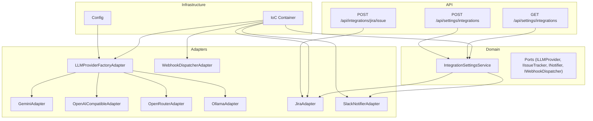
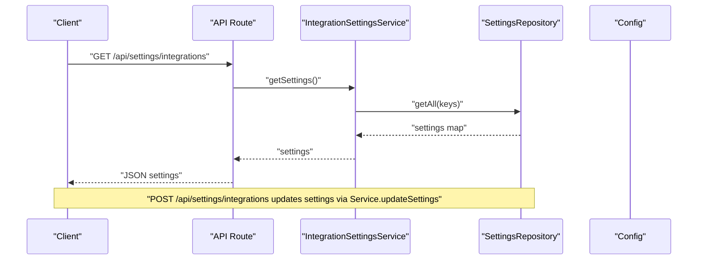
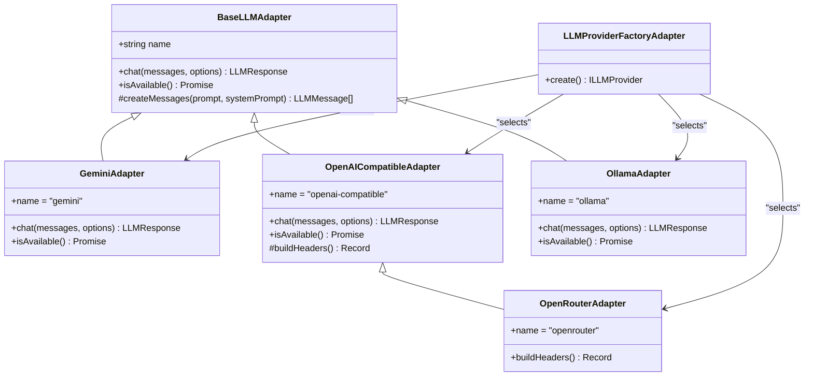
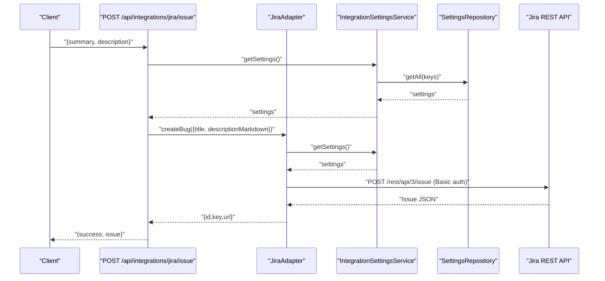
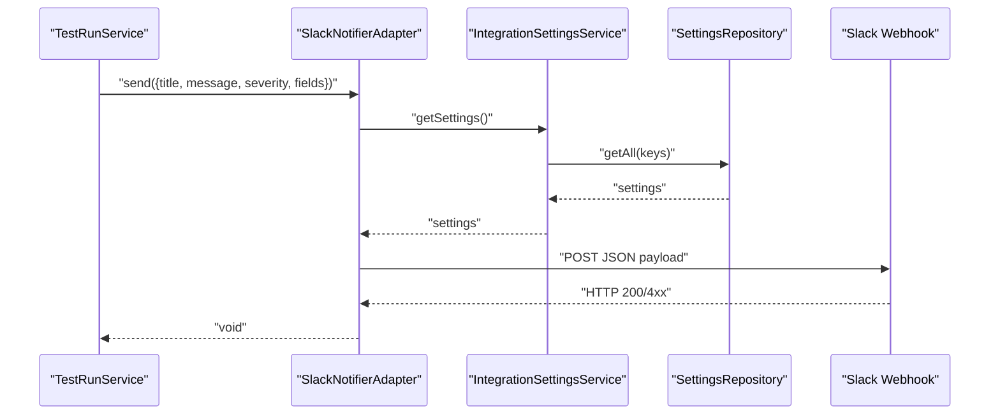
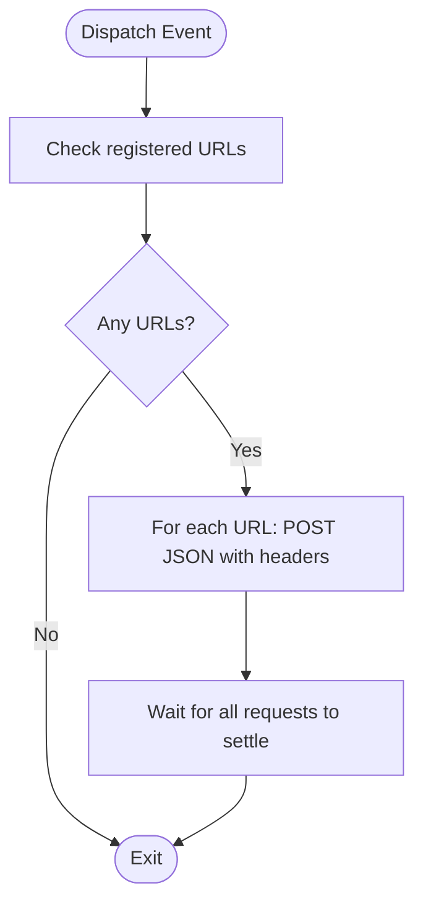
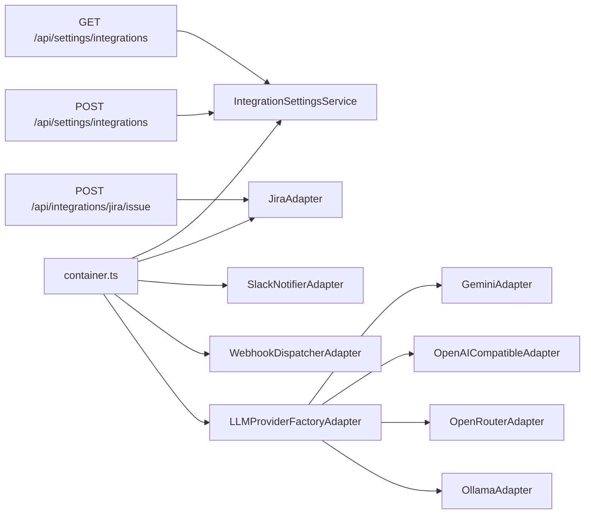

# Integrations and External Services

<cite>
**Referenced Files in This Document**
- [BaseLLMAdapter.ts](file://src/adapters/llm/BaseLLMAdapter.ts)
- [GeminiAdapter.ts](file://src/adapters/llm/GeminiAdapter.ts)
- [OpenAICompatibleAdapter.ts](file://src/adapters/llm/OpenAICompatibleAdapter.ts)
- [OllamaAdapter.ts](file://src/adapters/llm/OllamaAdapter.ts)
- [OpenRouterAdapter.ts](file://src/adapters/llm/OpenRouterAdapter.ts)
- [LLMProviderFactoryAdapter.ts](file://src/adapters/llm/LLMProviderFactoryAdapter.ts)
- [JiraAdapter.ts](file://src/adapters/issue-tracker/JiraAdapter.ts)
- [SlackNotifierAdapter.ts](file://src/adapters/notifier/SlackNotifierAdapter.ts)
- [WebhookDispatcherAdapter.ts](file://src/adapters/webhook/WebhookDispatcherAdapter.ts)
- [IntegrationSettingsService.ts](file://src/domain/services/IntegrationSettingsService.ts)
- [container.ts](file://src/infrastructure/container.ts)
- [config.ts](file://src/infrastructure/config.ts)
- [schemas.ts](file://app/api/_lib/schemas.ts)
- [route.ts (settings integrations)](file://app/api/settings/integrations/route.ts)
- [route.ts (jira issue)](file://app/api/integrations/jira/issue/route.ts)
</cite>

## Table of Contents
1. [Introduction](#introduction)
2. [Project Structure](#project-structure)
3. [Core Components](#core-components)
4. [Architecture Overview](#architecture-overview)
5. [Detailed Component Analysis](#detailed-component-analysis)
6. [Dependency Analysis](#dependency-analysis)
7. [Performance Considerations](#performance-considerations)
8. [Troubleshooting Guide](#troubleshooting-guide)
9. [Conclusion](#conclusion)
10. [Appendices](#appendices)

## Introduction
This document explains how Test Plan Manager integrates with external services and LLM providers using a pluggable adapter pattern. It covers:
- LLM provider integrations (Gemini, OpenAI-compatible, Ollama, OpenRouter) with configuration and API key management
- Issue tracker integration with Jira (authentication, project mapping, and issue creation)
- Notification systems (Slack webhooks for test run alerts)
- Webhook dispatching for external system notifications
- Troubleshooting, security considerations, and best practices

## Project Structure
The integration layer is organized around domain ports and adapter implementations:
- LLM adapters implement a common interface and are constructed by a factory that reads persisted settings or defaults from configuration
- Issue tracker and notifier adapters depend on a shared IntegrationSettingsService to retrieve credentials and endpoints
- Webhook dispatcher posts events to configured URLs
- API routes expose settings and Jira issue creation endpoints

**Diagram sources**
- [container.ts:33-91](file://src/infrastructure/container.ts#L33-L91)
- [LLMProviderFactoryAdapter.ts:15-42](file://src/adapters/llm/LLMProviderFactoryAdapter.ts#L15-L42)
- [IntegrationSettingsService.ts:8-37](file://src/domain/services/IntegrationSettingsService.ts#L8-L37)
- [JiraAdapter.ts:4-82](file://src/adapters/issue-tracker/JiraAdapter.ts#L4-L82)
- [SlackNotifierAdapter.ts:4-56](file://src/adapters/notifier/SlackNotifierAdapter.ts#L4-L56)
- [WebhookDispatcherAdapter.ts:11-38](file://src/adapters/webhook/WebhookDispatcherAdapter.ts#L11-L38)
- [route.ts (settings integrations):8-18](file://app/api/settings/integrations/route.ts#L8-L18)
- [route.ts (jira issue):8-19](file://app/api/integrations/jira/issue/route.ts#L8-L19)

**Section sources**
- [container.ts:33-91](file://src/infrastructure/container.ts#L33-L91)
- [config.ts:7-27](file://src/infrastructure/config.ts#L7-L27)

## Core Components
- LLMProviderFactoryAdapter constructs the appropriate LLM provider based on persisted settings or defaults
- GeminiAdapter, OpenAICompatibleAdapter, OpenRouterAdapter, and OllamaAdapter implement a common base and expose a unified chat interface
- JiraAdapter creates issues using Jira REST API with Basic authentication
- SlackNotifierAdapter posts formatted messages to a Slack webhook
- WebhookDispatcherAdapter dispatches events to registered URLs
- IntegrationSettingsService persists and retrieves integration settings
- API routes expose settings and Jira issue creation

**Section sources**
- [LLMProviderFactoryAdapter.ts:15-42](file://src/adapters/llm/LLMProviderFactoryAdapter.ts#L15-L42)
- [GeminiAdapter.ts:5-67](file://src/adapters/llm/GeminiAdapter.ts#L5-L67)
- [OpenAICompatibleAdapter.ts:8-97](file://src/adapters/llm/OpenAICompatibleAdapter.ts#L8-L97)
- [OpenRouterAdapter.ts:10-28](file://src/adapters/llm/OpenRouterAdapter.ts#L10-L28)
- [OllamaAdapter.ts:4-70](file://src/adapters/llm/OllamaAdapter.ts#L4-L70)
- [JiraAdapter.ts:4-82](file://src/adapters/issue-tracker/JiraAdapter.ts#L4-L82)
- [SlackNotifierAdapter.ts:4-56](file://src/adapters/notifier/SlackNotifierAdapter.ts#L4-L56)
- [WebhookDispatcherAdapter.ts:11-38](file://src/adapters/webhook/WebhookDispatcherAdapter.ts#L11-L38)
- [IntegrationSettingsService.ts:8-37](file://src/domain/services/IntegrationSettingsService.ts#L8-L37)
- [route.ts (settings integrations):8-18](file://app/api/settings/integrations/route.ts#L8-L18)
- [route.ts (jira issue):8-19](file://app/api/integrations/jira/issue/route.ts#L8-L19)

## Architecture Overview
The system uses a layered architecture:
- Domain defines ports for LLM, issue tracking, notifications, and webhooks
- Adapter implementations encapsulate external service specifics
- IoC container wires repositories, adapters, and services
- API routes delegate to adapters/services and return JSON responses

**Diagram sources**
- [route.ts (settings integrations):8-18](file://app/api/settings/integrations/route.ts#L8-L18)
- [IntegrationSettingsService.ts:11-17](file://src/domain/services/IntegrationSettingsService.ts#L11-L17)
- [container.ts:46-46](file://src/infrastructure/container.ts#L46-L46)
- [config.ts:13-18](file://src/infrastructure/config.ts#L13-L18)

## Detailed Component Analysis

### LLM Provider Integrations
The LLM subsystem uses an adapter pattern with a factory that selects the provider based on persisted settings or defaults.

**Diagram sources**
- [BaseLLMAdapter.ts:3-25](file://src/adapters/llm/BaseLLMAdapter.ts#L3-L25)
- [GeminiAdapter.ts:5-67](file://src/adapters/llm/GeminiAdapter.ts#L5-L67)
- [OpenAICompatibleAdapter.ts:8-97](file://src/adapters/llm/OpenAICompatibleAdapter.ts#L8-L97)
- [OpenRouterAdapter.ts:10-28](file://src/adapters/llm/OpenRouterAdapter.ts#L10-L28)
- [OllamaAdapter.ts:4-70](file://src/adapters/llm/OllamaAdapter.ts#L4-L70)
- [LLMProviderFactoryAdapter.ts:15-42](file://src/adapters/llm/LLMProviderFactoryAdapter.ts#L15-L42)

#### Configuration and Setup
- Provider selection: persisted setting or default from configuration
- API keys and endpoints: environment variables or persisted settings
- Model selection: persisted setting or default from configuration

Key configuration sources:
- Environment variables and defaults: [config.ts:13-18](file://src/infrastructure/config.ts#L13-L18)
- Settings retrieval and update: [IntegrationSettingsService.ts:11-35](file://src/domain/services/IntegrationSettingsService.ts#L11-L35)
- Factory construction: [LLMProviderFactoryAdapter.ts:18-41](file://src/adapters/llm/LLMProviderFactoryAdapter.ts#L18-L41)

#### API Key Management
- Gemini: API key resolved from constructor argument, environment variables, or defaults
- OpenAI-compatible and OpenRouter: API key passed to constructor or retrieved from settings/config
- Ollama: no API key required; uses local endpoint and model

References:
- [GeminiAdapter.ts:10-20](file://src/adapters/llm/GeminiAdapter.ts#L10-L20)
- [OpenAICompatibleAdapter.ts:14-19](file://src/adapters/llm/OpenAICompatibleAdapter.ts#L14-L19)
- [OpenRouterAdapter.ts:15-17](file://src/adapters/llm/OpenRouterAdapter.ts#L15-L17)
- [OllamaAdapter.ts:9-16](file://src/adapters/llm/OllamaAdapter.ts#L9-L16)

#### Provider-Specific Notes
- Gemini
  - Chat uses system instruction and roles mapped to user/model
  - Response includes content and model name
  - Availability checks presence of initialized client
  - References: [GeminiAdapter.ts:22-61](file://src/adapters/llm/GeminiAdapter.ts#L22-L61), [GeminiAdapter.ts:63-65](file://src/adapters/llm/GeminiAdapter.ts#L63-L65)

- OpenAI-Compatible
  - Supports any OpenAI-compatible API (OpenAI, Mistral, Groq, etc.)
  - Adds Authorization header when API key is present
  - Includes optional JSON response format support
  - Availability checks /models endpoint
  - References: [OpenAICompatibleAdapter.ts:34-95](file://src/adapters/llm/OpenAICompatibleAdapter.ts#L34-L95)

- OpenRouter
  - Extends OpenAI-compatible with extra headers for analytics and attribution
  - Uses fixed base URL
  - References: [OpenRouterAdapter.ts:10-27](file://src/adapters/llm/OpenRouterAdapter.ts#L10-L27)

- Ollama
  - Uses local endpoint by default
  - Checks availability by listing local models
  - References: [OllamaAdapter.ts:18-68](file://src/adapters/llm/OllamaAdapter.ts#L18-L68)

### Issue Tracker Integration: Jira
- Authentication: Basic auth built from email and token
- Project mapping: uses project key from settings
- Issue creation: posts to Jira REST API v3 /issue endpoint with ADF description
- Validation: requires URL, email, token, and project key

**Diagram sources**
- [route.ts (jira issue):8-19](file://app/api/integrations/jira/issue/route.ts#L8-L19)
- [JiraAdapter.ts:7-80](file://src/adapters/issue-tracker/JiraAdapter.ts#L7-L80)
- [IntegrationSettingsService.ts:11-17](file://src/domain/services/IntegrationSettingsService.ts#L11-L17)

**Section sources**
- [JiraAdapter.ts:4-82](file://src/adapters/issue-tracker/JiraAdapter.ts#L4-L82)
- [route.ts (jira issue):8-19](file://app/api/integrations/jira/issue/route.ts#L8-L19)

### Notification System: Slack
- Webhook URL: persisted in settings
- Message formatting: title, severity-based color, optional fields, footer
- Delivery: HTTP POST to Slack webhook URL

**Diagram sources**
- [SlackNotifierAdapter.ts:14-54](file://src/adapters/notifier/SlackNotifierAdapter.ts#L14-L54)
- [IntegrationSettingsService.ts:11-17](file://src/domain/services/IntegrationSettingsService.ts#L11-L17)

**Section sources**
- [SlackNotifierAdapter.ts:4-56](file://src/adapters/notifier/SlackNotifierAdapter.ts#L4-L56)

### Webhook Dispatching
- Registered URLs: provided to the dispatcher constructor
- Event dispatch: HTTP POST with standardized headers and JSON body
- Parallel dispatch: all registered URLs are posted concurrently

**Diagram sources**
- [WebhookDispatcherAdapter.ts:14-36](file://src/adapters/webhook/WebhookDispatcherAdapter.ts#L14-L36)

**Section sources**
- [WebhookDispatcherAdapter.ts:11-38](file://src/adapters/webhook/WebhookDispatcherAdapter.ts#L11-L38)

## Dependency Analysis
- IoC container wires adapters and services; adapters depend on IntegrationSettingsService for credentials
- LLMProviderFactoryAdapter depends on persisted settings and configuration defaults
- API routes depend on container-provided services/adapters
- Settings are validated by schema before update

**Diagram sources**
- [container.ts:33-91](file://src/infrastructure/container.ts#L33-L91)
- [LLMProviderFactoryAdapter.ts:18-41](file://src/adapters/llm/LLMProviderFactoryAdapter.ts#L18-L41)
- [route.ts (settings integrations):8-18](file://app/api/settings/integrations/route.ts#L8-L18)
- [route.ts (jira issue):8-19](file://app/api/integrations/jira/issue/route.ts#L8-L19)

**Section sources**
- [container.ts:33-91](file://src/infrastructure/container.ts#L33-L91)
- [schemas.ts:31-41](file://app/api/_lib/schemas.ts#L31-L41)

## Performance Considerations
- LLM calls: network latency dominates; consider caching prompts and responses at higher layers if needed
- Jira API: keep requests minimal; avoid unnecessary conversions; ensure project key correctness to prevent retries
- Slack notifications: concurrent delivery is not implemented; consider batching if high volume
- Webhooks: dispatch to multiple URLs concurrently; handle failures gracefully without blocking

## Troubleshooting Guide
- LLM Providers
  - Gemini not initialized: ensure API key is provided or available in environment variables
  - OpenAI-compatible/OpenRouter connectivity: verify base URL and API key; check /models endpoint availability
  - Ollama not available: confirm local service is running and the requested model exists
  - References: [GeminiAdapter.ts:23-25](file://src/adapters/llm/GeminiAdapter.ts#L23-L25), [OpenAICompatibleAdapter.ts:87-95](file://src/adapters/llm/OpenAICompatibleAdapter.ts#L87-L95), [OllamaAdapter.ts:56-68](file://src/adapters/llm/OllamaAdapter.ts#L56-L68)

- Jira
  - Missing configuration: ensure URL, email, token, and project key are set
  - Authentication failure: verify credentials and permissions; confirm Basic auth encoding
  - References: [JiraAdapter.ts:14-16](file://src/adapters/issue-tracker/JiraAdapter.ts#L14-L16), [JiraAdapter.ts:56-71](file://src/adapters/issue-tracker/JiraAdapter.ts#L56-L71)

- Slack
  - No webhook configured: notifications are skipped; set webhook URL in settings
  - Delivery failures: inspect HTTP status; ensure webhook URL validity
  - References: [SlackNotifierAdapter.ts:18-21](file://src/adapters/notifier/SlackNotifierAdapter.ts#L18-L21), [SlackNotifierAdapter.ts:48-50](file://src/adapters/notifier/SlackNotifierAdapter.ts#L48-L50)

- Webhooks
  - No registered URLs: dispatch exits early; configure URLs to receive events
  - Network errors: logged per URL; verify external endpoint availability
  - References: [WebhookDispatcherAdapter.ts:14-36](file://src/adapters/webhook/WebhookDispatcherAdapter.ts#L14-L36)

## Conclusion
The integration architecture cleanly separates domain concerns from external services via adapters and a factory. Settings are centrally managed and validated, enabling flexible provider selection and secure credential handling. The design supports extensibility for additional providers and external systems.

## Appendices

### API Definitions

- Settings
  - GET /api/settings/integrations
    - Returns current integration settings
    - Schema keys: provider, model, baseUrl, apiKey, jiraUrl, jiraEmail, jiraToken, jiraProject, slackWebhook
    - References: [route.ts (settings integrations):8-11](file://app/api/settings/integrations/route.ts#L8-L11), [schemas.ts:31-41](file://app/api/_lib/schemas.ts#L31-L41)

  - POST /api/settings/integrations
    - Updates integration settings
    - Validates payload against schema
    - References: [route.ts (settings integrations):13-18](file://app/api/settings/integrations/route.ts#L13-L18), [schemas.ts:31-41](file://app/api/_lib/schemas.ts#L31-L41)

- Jira Issue Creation
  - POST /api/integrations/jira/issue
    - Creates a Bug issue in Jira
    - Requires summary; description optional
    - References: [route.ts (jira issue):8-19](file://app/api/integrations/jira/issue/route.ts#L8-L19), [schemas.ts:66-70](file://app/api/_lib/schemas.ts#L66-L70)

### Security Considerations and Best Practices
- Store secrets in environment variables or encrypted settings; avoid logging sensitive data
- Validate and sanitize all inputs from API routes
- Use HTTPS endpoints for external services
- Limit webhook URLs to trusted domains and monitor delivery
- Prefer scoped API keys and least privilege access for external services