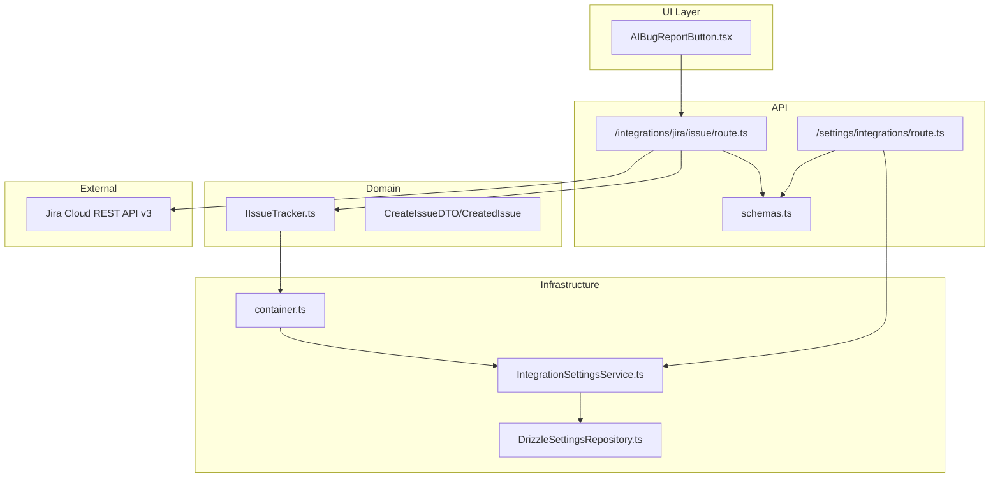
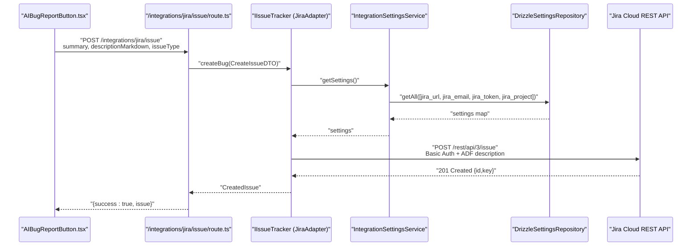
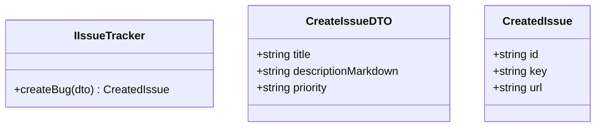
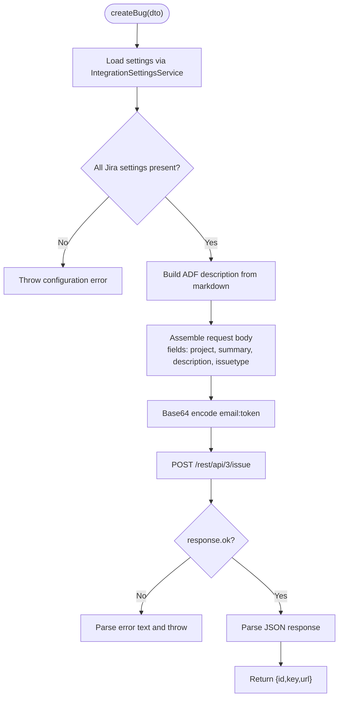
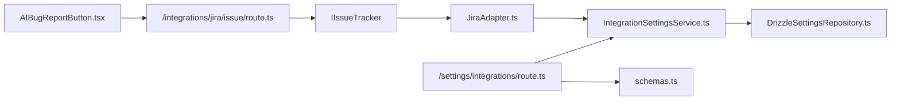

# Issue Tracker Integration

<cite>
**Referenced Files in This Document**
- [JiraAdapter.ts](file://src/adapters/issue-tracker/JiraAdapter.ts)
- [IIssueTracker.ts](file://src/domain/ports/IIssueTracker.ts)
- [IntegrationSettingsService.ts](file://src/domain/services/IntegrationSettingsService.ts)
- [container.ts](file://src/infrastructure/container.ts)
- [schemas.ts](file://app/api/_lib/schemas.ts)
- [route.ts](file://app/api/integrations/jira/issue/route.ts)
- [route.ts](file://app/api/settings/integrations/route.ts)
- [DrizzleSettingsRepository.ts](file://src/adapters/persistence/drizzle/DrizzleSettingsRepository.ts)
- [ISettingsRepository.ts](file://src/domain/ports/repositories/ISettingsRepository.ts)
- [AIBugReportButton.tsx](file://src/ui/test-run/AIBugReportButton.tsx)
- [AIBugReportService.ts](file://src/domain/services/AIBugReportService.ts)
</cite>

## Table of Contents
1. [Introduction](#introduction)
2. [Project Structure](#project-structure)
3. [Core Components](#core-components)
4. [Architecture Overview](#architecture-overview)
5. [Detailed Component Analysis](#detailed-component-analysis)
6. [Dependency Analysis](#dependency-analysis)
7. [Performance Considerations](#performance-considerations)
8. [Troubleshooting Guide](#troubleshooting-guide)
9. [Security and Best Practices](#security-and-best-practices)
10. [Integration Testing Procedures](#integration-testing-procedures)
11. [Conclusion](#conclusion)

## Introduction
This document explains the issue tracker integration with Jira, focusing on the Jira adapter implementation. It covers the IIssueTracker interface contract, how JiraAdapter implements external issue creation and management, authentication setup, configuration, workflows triggered by failed test cases, and operational guidance for secure and reliable integration.

## Project Structure
The integration spans domain, infrastructure, API, and UI layers:
- Domain defines the port and DTOs for issue creation.
- Infrastructure wires the Jira adapter and settings service into a container.
- API routes expose endpoints for pushing issues to Jira and managing integration settings.
- UI components orchestrate AI-generated bug reports and trigger Jira creation.

**Diagram sources**
- [AIBugReportButton.tsx:56-84](file://src/ui/test-run/AIBugReportButton.tsx#L56-L84)
- [route.ts:8-19](file://app/api/integrations/jira/issue/route.ts#L8-L19)
- [IIssueTracker.ts:13-15](file://src/domain/ports/IIssueTracker.ts#L13-L15)
- [container.ts:46-47](file://src/infrastructure/container.ts#L46-L47)
- [IntegrationSettingsService.ts:11-17](file://src/domain/services/IntegrationSettingsService.ts#L11-L17)
- [DrizzleSettingsRepository.ts:18-27](file://src/adapters/persistence/drizzle/DrizzleSettingsRepository.ts#L18-L27)
- [schemas.ts:66-70](file://app/api/_lib/schemas.ts#L66-L70)
- [route.ts:8-18](file://app/api/settings/integrations/route.ts#L8-L18)

**Section sources**
- [AIBugReportButton.tsx:56-84](file://src/ui/test-run/AIBugReportButton.tsx#L56-L84)
- [route.ts:8-19](file://app/api/integrations/jira/issue/route.ts#L8-L19)
- [IIssueTracker.ts:13-15](file://src/domain/ports/IIssueTracker.ts#L13-L15)
- [container.ts:46-47](file://src/infrastructure/container.ts#L46-L47)
- [IntegrationSettingsService.ts:11-17](file://src/domain/services/IntegrationSettingsService.ts#L11-L17)
- [DrizzleSettingsRepository.ts:18-27](file://src/adapters/persistence/drizzle/DrizzleSettingsRepository.ts#L18-L27)
- [schemas.ts:66-70](file://app/api/_lib/schemas.ts#L66-L70)
- [route.ts:8-18](file://app/api/settings/integrations/route.ts#L8-L18)

## Core Components
- IIssueTracker: Defines the contract for creating bugs, including the CreateIssueDTO and CreatedIssue shapes.
- JiraAdapter: Implements the contract by fetching Jira settings, validating configuration, building an Atlassian Document Format (ADF) description, and posting to the Jira REST API v3 endpoint.
- IntegrationSettingsService: Loads and persists integration settings (including Jira URL, email, token, and project key) via a settings repository.
- API routes: Expose endpoints to push issues to Jira and to manage integration settings.
- UI component: Orchestrates AI-generated bug reports and triggers Jira creation.

**Section sources**
- [IIssueTracker.ts:1-16](file://src/domain/ports/IIssueTracker.ts#L1-L16)
- [JiraAdapter.ts:4-81](file://src/adapters/issue-tracker/JiraAdapter.ts#L4-L81)
- [IntegrationSettingsService.ts:8-36](file://src/domain/services/IntegrationSettingsService.ts#L8-L36)
- [route.ts:8-19](file://app/api/integrations/jira/issue/route.ts#L8-L19)
- [route.ts:8-18](file://app/api/settings/integrations/route.ts#L8-L18)
- [AIBugReportButton.tsx:56-84](file://src/ui/test-run/AIBugReportButton.tsx#L56-L84)

## Architecture Overview
The system follows a clean architecture with a clear separation of concerns:
- UI triggers generation of a bug report.
- API validates payload and delegates to the adapter.
- Adapter reads settings from the settings service/repository.
- Adapter performs HTTP request to Jira Cloud REST API v3.
- Response returns a CreatedIssue with id, key, and browse URL.

**Diagram sources**
- [AIBugReportButton.tsx:63-71](file://src/ui/test-run/AIBugReportButton.tsx#L63-L71)
- [route.ts:8-19](file://app/api/integrations/jira/issue/route.ts#L8-L19)
- [JiraAdapter.ts:7-80](file://src/adapters/issue-tracker/JiraAdapter.ts#L7-L80)
- [IntegrationSettingsService.ts:11-17](file://src/domain/services/IntegrationSettingsService.ts#L11-L17)
- [DrizzleSettingsRepository.ts:18-27](file://src/adapters/persistence/drizzle/DrizzleSettingsRepository.ts#L18-L27)

## Detailed Component Analysis

### IIssueTracker Interface
Defines the contract for creating bugs:
- CreateIssueDTO: title, descriptionMarkdown, priority.
- CreatedIssue: id, key, url.
- createBug(dto): Promise resolving to CreatedIssue.

**Diagram sources**
- [IIssueTracker.ts:1-16](file://src/domain/ports/IIssueTracker.ts#L1-L16)

**Section sources**
- [IIssueTracker.ts:1-16](file://src/domain/ports/IIssueTracker.ts#L1-L16)

### JiraAdapter Implementation
Responsibilities:
- Load settings via IntegrationSettingsService.
- Validate presence of jira_url, jira_email, jira_token, jira_project.
- Normalize base URL by removing trailing slash.
- Build ADF description from markdown.
- POST to Jira REST API v3 endpoint with Basic Authentication.
- Parse response and return CreatedIssue with browse URL.

**Diagram sources**
- [JiraAdapter.ts:7-80](file://src/adapters/issue-tracker/JiraAdapter.ts#L7-L80)

**Section sources**
- [JiraAdapter.ts:4-81](file://src/adapters/issue-tracker/JiraAdapter.ts#L4-L81)

### IntegrationSettingsService
- Provides typed access to integration settings.
- Reads/writes jira_url, jira_email, jira_token, jira_project via ISettingsRepository.
- Ensures settings are loaded in a single call for performance.

**Section sources**
- [IntegrationSettingsService.ts:8-36](file://src/domain/services/IntegrationSettingsService.ts#L8-L36)
- [ISettingsRepository.ts:1-6](file://src/domain/ports/repositories/ISettingsRepository.ts#L1-L6)
- [DrizzleSettingsRepository.ts:6-28](file://src/adapters/persistence/drizzle/DrizzleSettingsRepository.ts#L6-L28)

### API Routes
- Jira issue creation route:
  - Validates payload with createJiraIssueSchema.
  - Calls jiraAdapter.createBug with a constructed CreateIssueDTO.
  - Returns success and the created issue.
- Integration settings route:
  - GET returns current settings.
  - POST updates settings via IntegrationSettingsService.

**Section sources**
- [route.ts:8-19](file://app/api/integrations/jira/issue/route.ts#L8-L19)
- [schemas.ts:66-70](file://app/api/_lib/schemas.ts#L66-L70)
- [route.ts:8-18](file://app/api/settings/integrations/route.ts#L8-L18)

### UI Integration
- AIBugReportButton orchestrates:
  - Generating a bug report from failed/blocked test results.
  - Pushing the report to Jira via the API route.
  - Displaying success/error messages and the created issue key.

**Section sources**
- [AIBugReportButton.tsx:56-84](file://src/ui/test-run/AIBugReportButton.tsx#L56-L84)

## Dependency Analysis
The adapter depends on the settings service, which depends on the settings repository. The API routes depend on the adapter and schema validation. The UI depends on the API route.

**Diagram sources**
- [AIBugReportButton.tsx:63-71](file://src/ui/test-run/AIBugReportButton.tsx#L63-L71)
- [route.ts:8-19](file://app/api/integrations/jira/issue/route.ts#L8-L19)
- [JiraAdapter.ts:4-5](file://src/adapters/issue-tracker/JiraAdapter.ts#L4-L5)
- [IntegrationSettingsService.ts:8-9](file://src/domain/services/IntegrationSettingsService.ts#L8-L9)
- [DrizzleSettingsRepository.ts:1-4](file://src/adapters/persistence/drizzle/DrizzleSettingsRepository.ts#L1-L4)
- [route.ts:8-18](file://app/api/settings/integrations/route.ts#L8-L18)
- [schemas.ts:66-70](file://app/api/_lib/schemas.ts#L66-L70)

**Section sources**
- [container.ts:46-47](file://src/infrastructure/container.ts#L46-L47)
- [IntegrationSettingsService.ts:11-17](file://src/domain/services/IntegrationSettingsService.ts#L11-L17)
- [DrizzleSettingsRepository.ts:18-27](file://src/adapters/persistence/drizzle/DrizzleSettingsRepository.ts#L18-L27)

## Performance Considerations
- Single settings retrieval: IntegrationSettingsService fetches all required keys in one call to reduce roundtrips.
- Minimal payload: Only essential fields are sent to Jira.
- Avoid unnecessary conversions: ADF is kept minimal to reduce overhead.

[No sources needed since this section provides general guidance]

## Troubleshooting Guide
Common issues and resolutions:
- Authentication failures:
  - Verify jira_email and jira_token are set and correct.
  - Confirm the token has appropriate scopes for creating issues.
- Configuration errors:
  - Ensure jira_url, jira_email, jira_token, and jira_project are present.
  - Remove trailing slashes from jira_url.
- API errors:
  - Inspect the returned error text from the Jira API for details.
  - Confirm the project key exists and the issuetype "Bug" is available.
- Network connectivity:
  - Ensure outbound access to https://your-domain.atlassian.net/rest/api/3/issue.

**Section sources**
- [JiraAdapter.ts:14-16](file://src/adapters/issue-tracker/JiraAdapter.ts#L14-L16)
- [JiraAdapter.ts:68-71](file://src/adapters/issue-tracker/JiraAdapter.ts#L68-L71)
- [IntegrationSettingsService.ts:11-17](file://src/domain/services/IntegrationSettingsService.ts#L11-L17)

## Security and Best Practices
- Credential storage:
  - Store jira_token securely via the settings repository; avoid logging tokens.
  - Restrict access to settings endpoints and ensure HTTPS in production.
- Least privilege:
  - Use a Jira API token scoped to minimal permissions required for issue creation.
- Input sanitization:
  - Treat markdown input carefully; the current implementation embeds raw markdown into ADF text nodes.
- Audit trail:
  - Log successful issue creations with identifiers for traceability.
- Idempotency:
  - Consider adding deduplication mechanisms (e.g., external ID) to prevent duplicate issues if retries occur.

[No sources needed since this section provides general guidance]

## Integration Testing Procedures
- Configure Jira:
  - Set jira_url, jira_email, jira_token, and jira_project in settings.
- Trigger creation:
  - Generate a bug report via the UI component.
  - Click "Push to Jira" to call the API route.
- Validate:
  - Confirm the API returns success and includes the created issue key.
  - Navigate to the returned browse URL in Jira to verify the issue fields.

**Section sources**
- [AIBugReportButton.tsx:63-71](file://src/ui/test-run/AIBugReportButton.tsx#L63-L71)
- [route.ts:8-19](file://app/api/integrations/jira/issue/route.ts#L8-L19)

## Conclusion
The Jira integration is implemented as a clean, testable adapter that adheres to the IIssueTracker interface. It relies on a dedicated settings service and repository for configuration, exposes straightforward API endpoints, and integrates with the UI to streamline bug reporting workflows. By following the configuration, troubleshooting, and security guidance herein, teams can deploy a robust and maintainable integration.