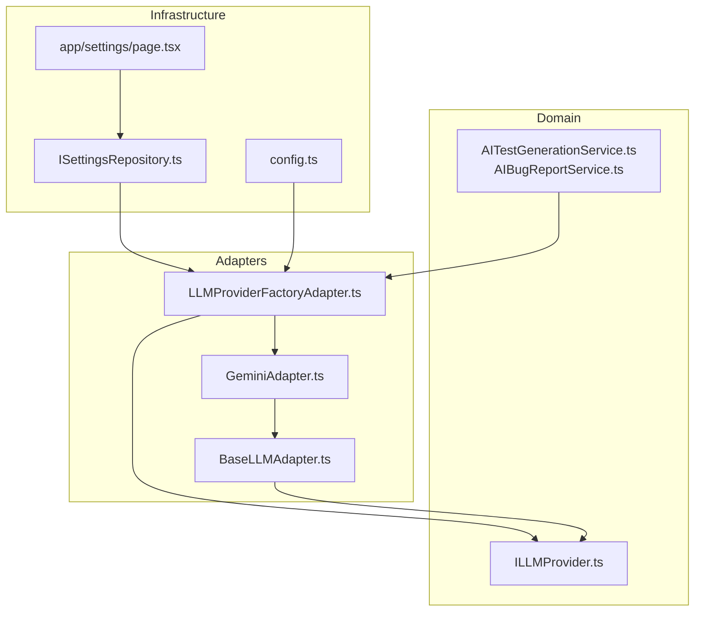
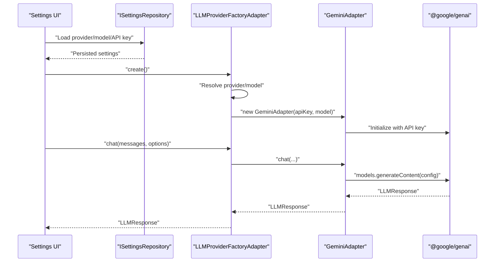
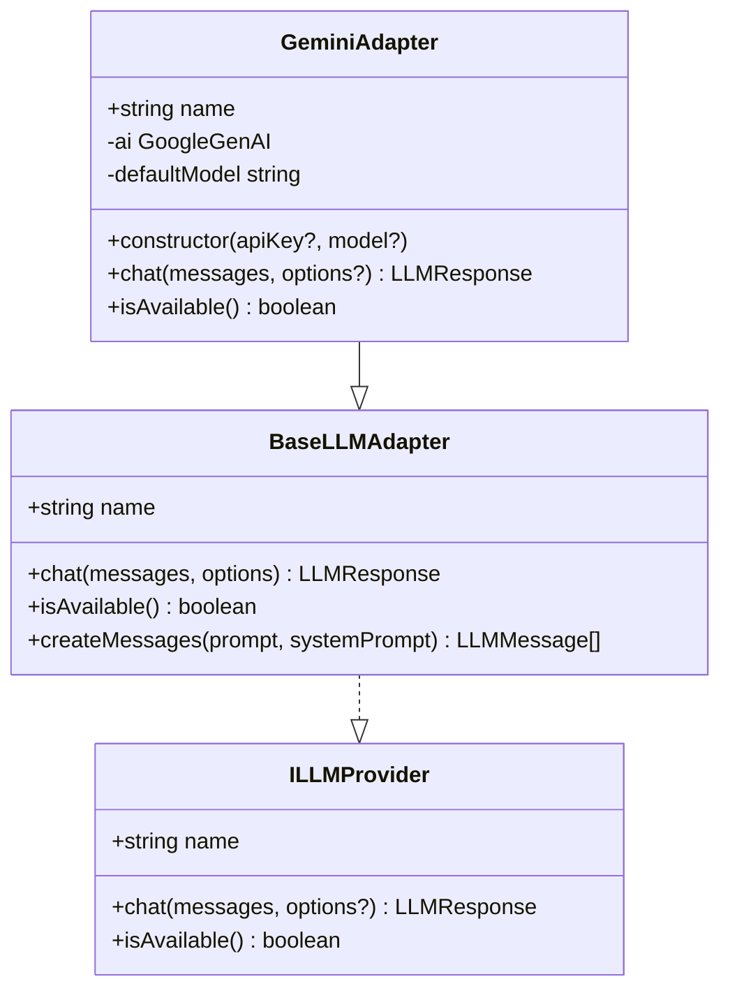
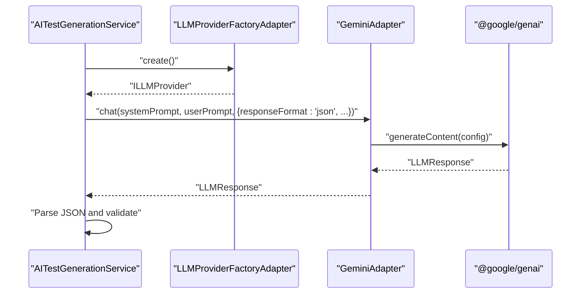
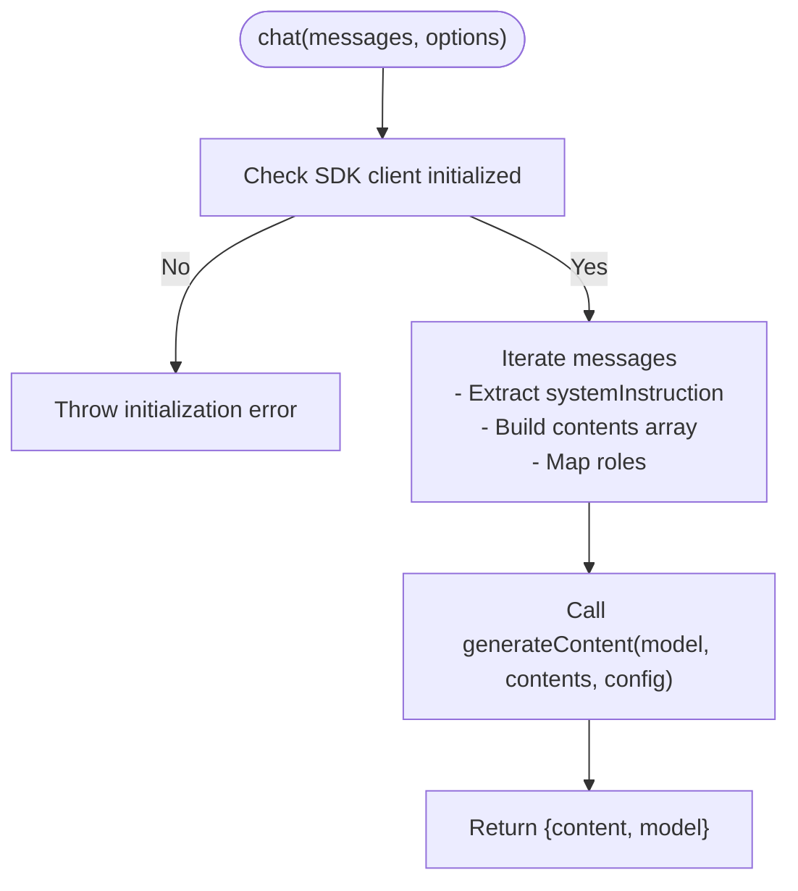
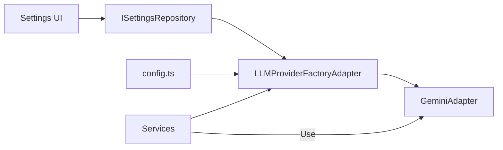

# Gemini Integration

<cite>
**Referenced Files in This Document**
- [GeminiAdapter.ts](file://src/adapters/llm/GeminiAdapter.ts)
- [BaseLLMAdapter.ts](file://src/adapters/llm/BaseLLMAdapter.ts)
- [ILLMProvider.ts](file://src/domain/ports/ILLMProvider.ts)
- [LLMProviderFactoryAdapter.ts](file://src/adapters/llm/LLMProviderFactoryAdapter.ts)
- [config.ts](file://src/infrastructure/config.ts)
- [AITestGenerationService.ts](file://src/domain/services/AITestGenerationService.ts)
- [AIBugReportService.ts](file://src/domain/services/AIBugReportService.ts)
- [page.tsx](file://app/settings/page.tsx)
- [ISettingsRepository.ts](file://src/domain/ports/repositories/ISettingsRepository.ts)
</cite>

## Table of Contents
1. [Introduction](#introduction)
2. [Project Structure](#project-structure)
3. [Core Components](#core-components)
4. [Architecture Overview](#architecture-overview)
5. [Detailed Component Analysis](#detailed-component-analysis)
6. [Dependency Analysis](#dependency-analysis)
7. [Performance Considerations](#performance-considerations)
8. [Troubleshooting Guide](#troubleshooting-guide)
9. [Conclusion](#conclusion)
10. [Appendices](#appendices)

## Introduction
This document explains the Gemini LLM provider integration, focusing on the GeminiAdapter implementation, configuration, model selection, request/response handling, authentication setup, rate limiting considerations, quota management, prompt formatting, response processing, error handling, timeouts, retries, and practical usage examples. It also provides troubleshooting guidance and performance best practices tailored to Gemini.

## Project Structure
The Gemini integration spans three layers:
- Domain: Ports and services define the contract and orchestrate AI tasks.
- Adapters: Concrete LLM provider implementations and factory.
- Infrastructure: Configuration and UI for managing provider settings.

**Diagram sources**
- [ILLMProvider.ts:1-32](file://src/domain/ports/ILLMProvider.ts#L1-L32)
- [AITestGenerationService.ts:1-82](file://src/domain/services/AITestGenerationService.ts#L1-L82)
- [AIBugReportService.ts:1-70](file://src/domain/services/AIBugReportService.ts#L1-L70)
- [LLMProviderFactoryAdapter.ts:1-43](file://src/adapters/llm/LLMProviderFactoryAdapter.ts#L1-L43)
- [GeminiAdapter.ts:1-67](file://src/adapters/llm/GeminiAdapter.ts#L1-L67)
- [BaseLLMAdapter.ts:1-26](file://src/adapters/llm/BaseLLMAdapter.ts#L1-L26)
- [config.ts:1-28](file://src/infrastructure/config.ts#L1-L28)
- [page.tsx:1-335](file://app/settings/page.tsx#L1-L335)
- [ISettingsRepository.ts:1-6](file://src/domain/ports/repositories/ISettingsRepository.ts#L1-L6)

**Section sources**
- [LLMProviderFactoryAdapter.ts:1-43](file://src/adapters/llm/LLMProviderFactoryAdapter.ts#L1-L43)
- [config.ts:1-28](file://src/infrastructure/config.ts#L1-L28)
- [page.tsx:1-335](file://app/settings/page.tsx#L1-L335)

## Core Components
- GeminiAdapter: Implements the Gemini provider using the official SDK, handles initialization, message conversion, and generation.
- BaseLLMAdapter: Provides the common interface and helper utilities for message creation.
- ILLMProvider: Defines the provider contract for chat and availability checks.
- LLMProviderFactoryAdapter: Builds the appropriate provider based on persisted settings or defaults.
- Configuration: Centralizes environment-driven settings for provider, model, and base URL.
- Services: Orchestrate AI tasks using the provider abstraction (test generation and bug report).
- UI: Allows users to select provider, model, and API key.

**Section sources**
- [GeminiAdapter.ts:1-67](file://src/adapters/llm/GeminiAdapter.ts#L1-L67)
- [BaseLLMAdapter.ts:1-26](file://src/adapters/llm/BaseLLMAdapter.ts#L1-L26)
- [ILLMProvider.ts:1-32](file://src/domain/ports/ILLMProvider.ts#L1-L32)
- [LLMProviderFactoryAdapter.ts:1-43](file://src/adapters/llm/LLMProviderFactoryAdapter.ts#L1-L43)
- [config.ts:1-28](file://src/infrastructure/config.ts#L1-L28)
- [AITestGenerationService.ts:1-82](file://src/domain/services/AITestGenerationService.ts#L1-L82)
- [AIBugReportService.ts:1-70](file://src/domain/services/AIBugReportService.ts#L1-L70)
- [page.tsx:1-335](file://app/settings/page.tsx#L1-L335)

## Architecture Overview
The system retrieves provider settings from persistent storage or configuration, constructs the Gemini adapter, and uses it to generate content from structured prompts. Services encapsulate prompt engineering and response parsing.

**Diagram sources**
- [LLMProviderFactoryAdapter.ts:18-41](file://src/adapters/llm/LLMProviderFactoryAdapter.ts#L18-L41)
- [GeminiAdapter.ts:10-20](file://src/adapters/llm/GeminiAdapter.ts#L10-L20)
- [GeminiAdapter.ts:22-61](file://src/adapters/llm/GeminiAdapter.ts#L22-L61)
- [config.ts:13-18](file://src/infrastructure/config.ts#L13-L18)
- [ISettingsRepository.ts:1-6](file://src/domain/ports/repositories/ISettingsRepository.ts#L1-L6)

## Detailed Component Analysis

### GeminiAdapter Implementation
GeminiAdapter extends the base adapter and integrates with the official SDK. It supports:
- Authentication via API key resolution from constructor, environment, or fallback.
- Model selection via constructor or default.
- Message conversion from the internal format to the SDK’s expected format.
- Generation with configurable temperature, max tokens, and response MIME type.
- Availability check based on initialization state.

**Diagram sources**
- [BaseLLMAdapter.ts:3-25](file://src/adapters/llm/BaseLLMAdapter.ts#L3-L25)
- [GeminiAdapter.ts:5-20](file://src/adapters/llm/GeminiAdapter.ts#L5-L20)
- [ILLMProvider.ts:12-31](file://src/domain/ports/ILLMProvider.ts#L12-L31)

Key behaviors:
- Initialization: Resolves API key from constructor, environment variables, and sets up the SDK client.
- Chat pipeline: Converts roles, extracts system instruction, builds SDK request, and returns normalized response.
- Options mapping: Temperature, max output tokens, and response MIME type are forwarded to the SDK.

**Section sources**
- [GeminiAdapter.ts:10-20](file://src/adapters/llm/GeminiAdapter.ts#L10-L20)
- [GeminiAdapter.ts:22-61](file://src/adapters/llm/GeminiAdapter.ts#L22-L61)

### Prompt Formatting and Response Processing
Services demonstrate how to structure prompts and handle responses:
- AITestGenerationService: Uses a strict JSON schema prompt and enforces JSON output with a specific response format option.
- AIBugReportService: Uses a markdown-focused prompt and requests text output.
- Both services rely on the provider’s chat method and normalize results.

**Diagram sources**
- [AITestGenerationService.ts:28-80](file://src/domain/services/AITestGenerationService.ts#L28-L80)
- [LLMProviderFactoryAdapter.ts:38-40](file://src/adapters/llm/LLMProviderFactoryAdapter.ts#L38-L40)
- [GeminiAdapter.ts:22-61](file://src/adapters/llm/GeminiAdapter.ts#L22-L61)

**Section sources**
- [AITestGenerationService.ts:28-80](file://src/domain/services/AITestGenerationService.ts#L28-L80)
- [AIBugReportService.ts:16-68](file://src/domain/services/AIBugReportService.ts#L16-L68)

### Authentication Setup
- API key resolution order: Constructor argument → GEMINI_API_KEY → LLM_API_KEY.
- Availability check: isAvailable returns true only after successful initialization.
- UI support: Settings page allows selecting provider and entering API keys for providers that require them.

Practical guidance:
- Set the API key in environment variables or through the UI for Gemini.
- Verify availability before sending requests.

**Section sources**
- [GeminiAdapter.ts:12-16](file://src/adapters/llm/GeminiAdapter.ts#L12-L16)
- [GeminiAdapter.ts:63-65](file://src/adapters/llm/GeminiAdapter.ts#L63-L65)
- [page.tsx:202-218](file://app/settings/page.tsx#L202-L218)

### Model Selection
- Default model is set internally; can be overridden via constructor or configuration.
- The UI exposes a model field with provider-specific placeholders.
- Factory resolves provider and model from persisted settings or configuration.

Supported models in practice depend on the SDK and account permissions. The adapter forwards the selected model to the SDK.

**Section sources**
- [GeminiAdapter.ts:8](file://src/adapters/llm/GeminiAdapter.ts#L8)
- [GeminiAdapter.ts:17-19](file://src/adapters/llm/GeminiAdapter.ts#L17-L19)
- [page.tsx:172-186](file://app/settings/page.tsx#L172-L186)
- [config.ts:17](file://src/infrastructure/config.ts#L17)
- [LLMProviderFactoryAdapter.ts:19-20](file://src/adapters/llm/LLMProviderFactoryAdapter.ts#L19-L20)

### Request/Response Handling
- Messages: Converted from internal format to SDK format, mapping assistant to model and preserving user/system roles.
- System instruction: Extracted from system messages and passed to the SDK.
- Generation: Uses generateContent with model, contents, and config options.
- Response: Normalized to content and model; tokensUsed is not populated by this adapter.

**Diagram sources**
- [GeminiAdapter.ts:22-61](file://src/adapters/llm/GeminiAdapter.ts#L22-L61)

**Section sources**
- [GeminiAdapter.ts:22-61](file://src/adapters/llm/GeminiAdapter.ts#L22-L61)

### Rate Limiting and Quota Management
- The adapter does not implement client-side rate limiting or quota guards.
- Recommendations:
  - Implement exponential backoff and retry on transient errors.
  - Monitor provider-side quotas and adjust concurrency.
  - Use smaller batch sizes and stagger requests during high load.
  - Consider caching repeated prompts where appropriate.

[No sources needed since this section provides general guidance]

### Timeout Handling and Retries
- The adapter does not wrap SDK calls with explicit timeouts or retry logic.
- Recommendations:
  - Wrap SDK calls with a timeout using AbortController or similar.
  - Implement retry with exponential backoff for 429/5xx and network errors.
  - Log retry attempts and final outcomes for observability.

[No sources needed since this section provides general guidance]

### Practical Examples
- Test plan generation (JSON):
  - System prompt enforces JSON schema.
  - Response format requested as JSON.
  - Post-process to remove markdown wrappers and parse JSON.
- Bug report generation (Markdown):
  - System prompt enforces markdown structure.
  - Response format requested as text.
  - Return content directly.

**Section sources**
- [AITestGenerationService.ts:28-80](file://src/domain/services/AITestGenerationService.ts#L28-L80)
- [AIBugReportService.ts:16-68](file://src/domain/services/AIBugReportService.ts#L16-L68)

## Dependency Analysis
The provider is constructed by the factory, which reads settings from a repository or configuration. The UI persists settings that influence provider instantiation.

**Diagram sources**
- [LLMProviderFactoryAdapter.ts:18-41](file://src/adapters/llm/LLMProviderFactoryAdapter.ts#L18-L41)
- [config.ts:13-18](file://src/infrastructure/config.ts#L13-L18)
- [ISettingsRepository.ts:1-6](file://src/domain/ports/repositories/ISettingsRepository.ts#L1-L6)
- [page.tsx:30-51](file://app/settings/page.tsx#L30-L51)

**Section sources**
- [LLMProviderFactoryAdapter.ts:18-41](file://src/adapters/llm/LLMProviderFactoryAdapter.ts#L18-L41)
- [config.ts:13-18](file://src/infrastructure/config.ts#L13-L18)
- [ISettingsRepository.ts:1-6](file://src/domain/ports/repositories/ISettingsRepository.ts#L1-L6)
- [page.tsx:30-51](file://app/settings/page.tsx#L30-L51)

## Performance Considerations
- Keep prompts concise and scoped to reduce latency and cost.
- Use lower temperature for deterministic outputs when generating structured data.
- Limit max tokens for shorter responses to reduce overhead.
- Batch and cache repeated prompts where feasible.
- Prefer smaller models for rapid iteration; switch to larger models for complex reasoning.

[No sources needed since this section provides general guidance]

## Troubleshooting Guide
Common issues and resolutions:
- Authentication failures:
  - Ensure API key is present in environment variables or UI settings.
  - Confirm provider is set to Gemini in settings.
  - Verify isAvailable returns true before sending requests.
- Quota exceeded or rate limited:
  - Implement retries with exponential backoff.
  - Reduce concurrency and request frequency.
  - Monitor provider dashboards for quota consumption.
- Network connectivity issues:
  - Add timeouts around SDK calls.
  - Retry transient network errors.
  - Validate outbound access to the Gemini endpoint.
- JSON parsing errors:
  - Ensure responseFormat is set to JSON for services expecting structured output.
  - Sanitize LLM output by trimming markdown markers before parsing.

**Section sources**
- [GeminiAdapter.ts:12-16](file://src/adapters/llm/GeminiAdapter.ts#L12-L16)
- [GeminiAdapter.ts:63-65](file://src/adapters/llm/GeminiAdapter.ts#L63-L65)
- [AITestGenerationService.ts:66-79](file://src/domain/services/AITestGenerationService.ts#L66-L79)
- [page.tsx:202-218](file://app/settings/page.tsx#L202-L218)

## Conclusion
The Gemini integration provides a clean, extensible adapter layered behind a factory and service orchestration. It supports flexible configuration, structured prompts, and robust response handling. For production use, augment the adapter with timeouts, retries, and quota-aware scheduling to ensure reliability and cost efficiency.

[No sources needed since this section summarizes without analyzing specific files]

## Appendices

### Configuration Reference
- Environment variables:
  - LLM_PROVIDER or GEMINI_API_KEY or LLM_API_KEY
  - LLM_MODEL
- Defaults:
  - Provider: gemini
  - Model: gemini-2.5-flash

**Section sources**
- [config.ts:13-18](file://src/infrastructure/config.ts#L13-L18)

### Prompt Engineering Best Practices for Gemini
- Be explicit about output format (JSON vs text).
- Include a concise system instruction for role and tone.
- Provide clear examples when requesting structured outputs.
- Keep user prompts focused and avoid ambiguous phrasing.

**Section sources**
- [AITestGenerationService.ts:31-48](file://src/domain/services/AITestGenerationService.ts#L31-L48)
- [AIBugReportService.ts:27-36](file://src/domain/services/AIBugReportService.ts#L27-L36)