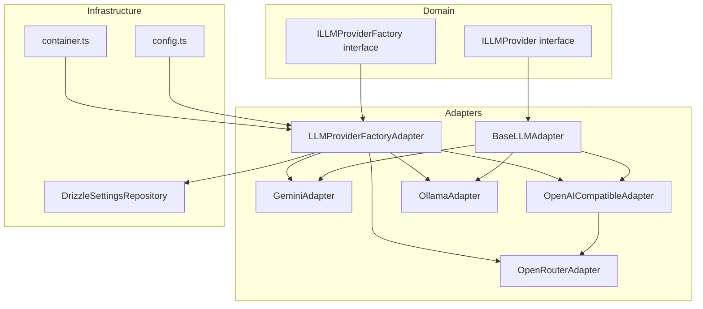
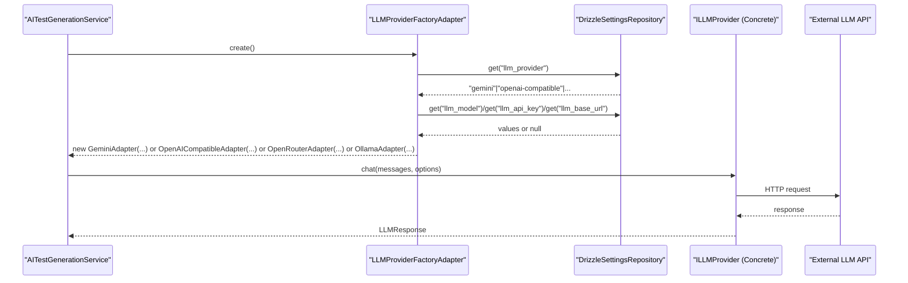
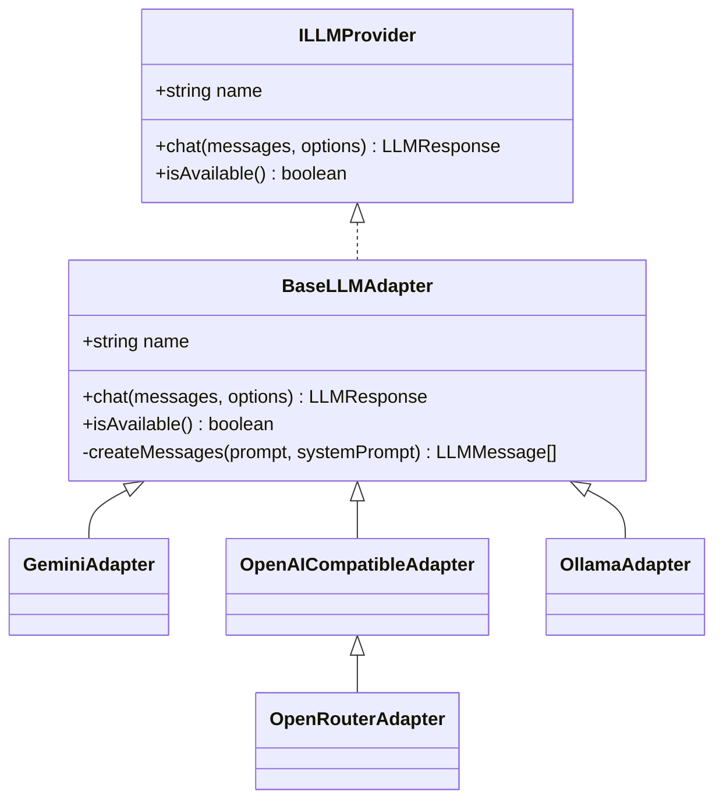
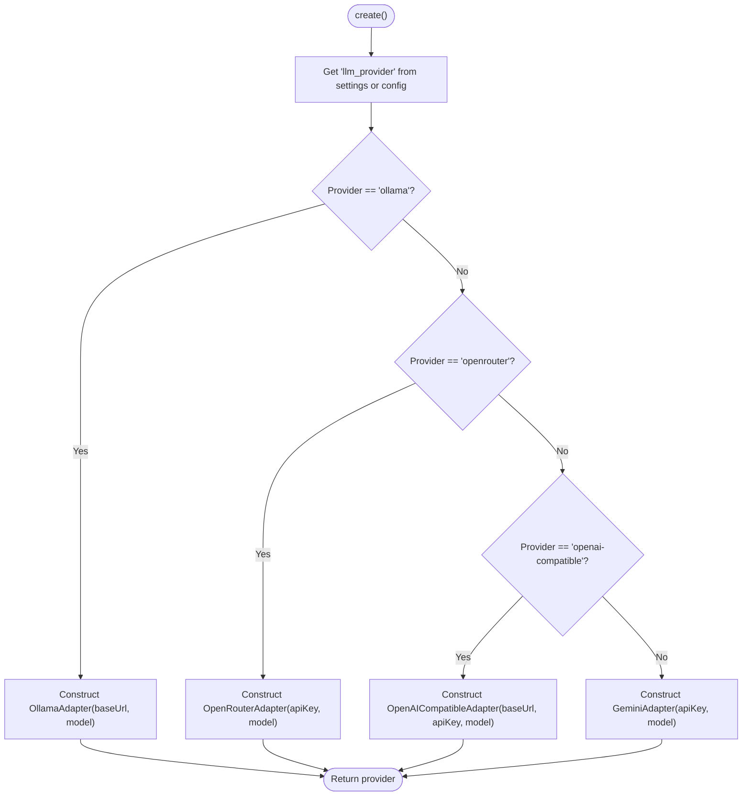
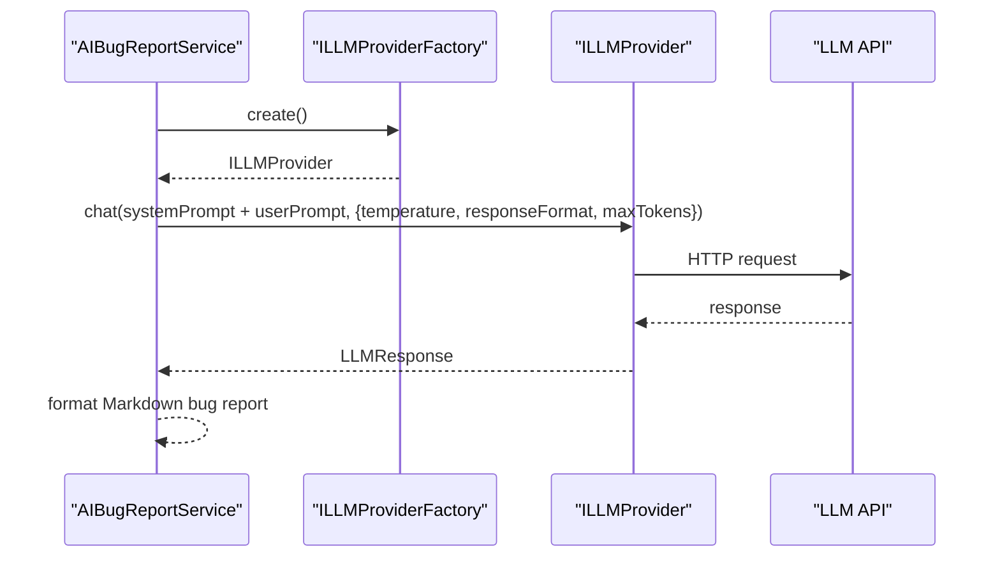
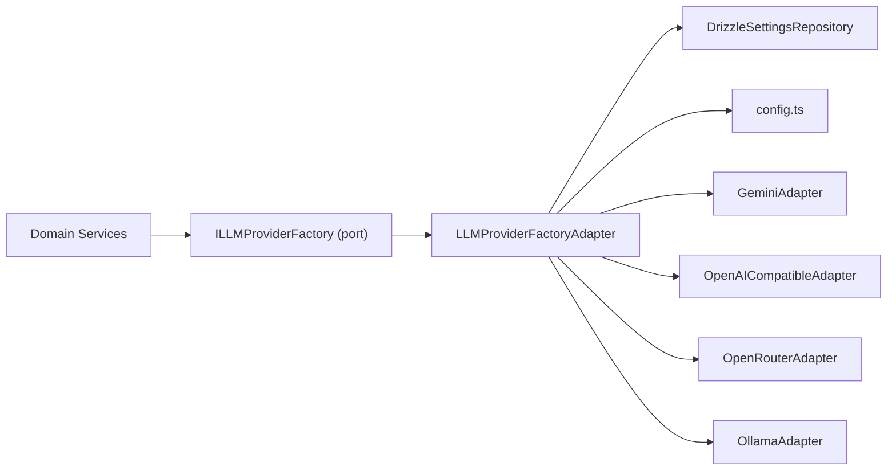

# LLM Provider Integration

<cite>
**Referenced Files in This Document**
- [BaseLLMAdapter.ts](file://src/adapters/llm/BaseLLMAdapter.ts)
- [GeminiAdapter.ts](file://src/adapters/llm/GeminiAdapter.ts)
- [OpenAICompatibleAdapter.ts](file://src/adapters/llm/OpenAICompatibleAdapter.ts)
- [OllamaAdapter.ts](file://src/adapters/llm/OllamaAdapter.ts)
- [OpenRouterAdapter.ts](file://src/adapters/llm/OpenRouterAdapter.ts)
- [LLMProviderFactoryAdapter.ts](file://src/adapters/llm/LLMProviderFactoryAdapter.ts)
- [ILLMProvider.ts](file://src/domain/ports/ILLMProvider.ts)
- [ILLMProviderFactory.ts](file://src/domain/ports/ILLMProviderFactory.ts)
- [config.ts](file://src/infrastructure/config.ts)
- [AITestGenerationService.ts](file://src/domain/services/AITestGenerationService.ts)
- [AIBugReportService.ts](file://src/domain/services/AIBugReportService.ts)
- [container.ts](file://src/infrastructure/container.ts)
- [DrizzleSettingsRepository.ts](file://src/adapters/persistence/drizzle/DrizzleSettingsRepository.ts)
</cite>

## Table of Contents
1. [Introduction](#introduction)
2. [Project Structure](#project-structure)
3. [Core Components](#core-components)
4. [Architecture Overview](#architecture-overview)
5. [Detailed Component Analysis](#detailed-component-analysis)
6. [Dependency Analysis](#dependency-analysis)
7. [Performance Considerations](#performance-considerations)
8. [Troubleshooting Guide](#troubleshooting-guide)
9. [Conclusion](#conclusion)
10. [Appendices](#appendices)

## Introduction
This document explains the LLM provider integration in Test Plan Manager. It covers the factory pattern that dynamically selects and instantiates LLM adapters based on configuration, the supported providers (Gemini, OpenAI-compatible, Ollama, and OpenRouter), and how the system resolves credentials, base URLs, and models. It also documents the ILLMProvider interface, adapter implementations, provider switching, availability checks, error handling, and practical setup and troubleshooting guidance.

## Project Structure
The LLM integration spans three layers:
- Domain: Ports define the provider contract and factory abstraction.
- Adapters: Concrete provider implementations and the factory adapter.
- Infrastructure: Configuration and dependency injection container.

**Diagram sources**
- [ILLMProvider.ts:12-31](file://src/domain/ports/ILLMProvider.ts#L12-L31)
- [ILLMProviderFactory.ts:8-10](file://src/domain/ports/ILLMProviderFactory.ts#L8-L10)
- [BaseLLMAdapter.ts:3-25](file://src/adapters/llm/BaseLLMAdapter.ts#L3-L25)
- [GeminiAdapter.ts:5-66](file://src/adapters/llm/GeminiAdapter.ts#L5-L66)
- [OpenAICompatibleAdapter.ts:8-96](file://src/adapters/llm/OpenAICompatibleAdapter.ts#L8-L96)
- [OpenRouterAdapter.ts:10-27](file://src/adapters/llm/OpenRouterAdapter.ts#L10-L27)
- [OllamaAdapter.ts:4-69](file://src/adapters/llm/OllamaAdapter.ts#L4-L69)
- [LLMProviderFactoryAdapter.ts:15-42](file://src/adapters/llm/LLMProviderFactoryAdapter.ts#L15-L42)
- [config.ts:7-27](file://src/infrastructure/config.ts#L7-L27)
- [container.ts:33-91](file://src/infrastructure/container.ts#L33-L91)
- [DrizzleSettingsRepository.ts:6-28](file://src/adapters/persistence/drizzle/DrizzleSettingsRepository.ts#L6-L28)

**Section sources**
- [ILLMProvider.ts:12-31](file://src/domain/ports/ILLMProvider.ts#L12-L31)
- [ILLMProviderFactory.ts:8-10](file://src/domain/ports/ILLMProviderFactory.ts#L8-L10)
- [BaseLLMAdapter.ts:3-25](file://src/adapters/llm/BaseLLMAdapter.ts#L3-L25)
- [LLMProviderFactoryAdapter.ts:15-42](file://src/adapters/llm/LLMProviderFactoryAdapter.ts#L15-L42)
- [config.ts:7-27](file://src/infrastructure/config.ts#L7-L27)
- [container.ts:33-91](file://src/infrastructure/container.ts#L33-L91)
- [DrizzleSettingsRepository.ts:6-28](file://src/adapters/persistence/drizzle/DrizzleSettingsRepository.ts#L6-L28)

## Core Components
- ILLMProvider: Defines the provider contract with name, chat, and availability checks.
- BaseLLMAdapter: Shared behavior for all providers, including a helper to convert prompts to message arrays.
- Concrete Providers:
  - GeminiAdapter: Uses Google GenAI SDK with API key resolution from environment.
  - OpenAICompatibleAdapter: Generic OpenAI-compatible API support with base URL, API key, and model.
  - OpenRouterAdapter: Specialization of OpenAI-compatible with required headers.
  - OllamaAdapter: Local inference via Ollama API with local model availability check.
- LLMProviderFactoryAdapter: Selects provider based on persisted settings or defaults, constructs the adapter with resolved credentials and model.
- Configuration: Centralized environment-driven defaults for provider, API key, base URL, and model.
- Dependency Injection: IoC container wires the factory and exposes services that depend on ILLMProviderFactory.

**Section sources**
- [ILLMProvider.ts:12-31](file://src/domain/ports/ILLMProvider.ts#L12-L31)
- [BaseLLMAdapter.ts:3-25](file://src/adapters/llm/BaseLLMAdapter.ts#L3-L25)
- [GeminiAdapter.ts:5-66](file://src/adapters/llm/GeminiAdapter.ts#L5-L66)
- [OpenAICompatibleAdapter.ts:8-96](file://src/adapters/llm/OpenAICompatibleAdapter.ts#L8-L96)
- [OpenRouterAdapter.ts:10-27](file://src/adapters/llm/OpenRouterAdapter.ts#L10-L27)
- [OllamaAdapter.ts:4-69](file://src/adapters/llm/OllamaAdapter.ts#L4-L69)
- [LLMProviderFactoryAdapter.ts:15-42](file://src/adapters/llm/LLMProviderFactoryAdapter.ts#L15-L42)
- [config.ts:7-27](file://src/infrastructure/config.ts#L7-L27)
- [container.ts:33-91](file://src/infrastructure/container.ts#L33-L91)

## Architecture Overview
The system uses a factory to decouple domain services from concrete providers. Domain services request a provider via the factory, which reads persisted settings and environment configuration to instantiate the appropriate adapter.

**Diagram sources**
- [AITestGenerationService.ts:25-80](file://src/domain/services/AITestGenerationService.ts#L25-L80)
- [LLMProviderFactoryAdapter.ts:18-41](file://src/adapters/llm/LLMProviderFactoryAdapter.ts#L18-L41)
- [DrizzleSettingsRepository.ts:7-16](file://src/adapters/persistence/drizzle/DrizzleSettingsRepository.ts#L7-L16)
- [GeminiAdapter.ts:22-61](file://src/adapters/llm/GeminiAdapter.ts#L22-L61)
- [OpenAICompatibleAdapter.ts:34-81](file://src/adapters/llm/OpenAICompatibleAdapter.ts#L34-L81)
- [OpenRouterAdapter.ts:15-26](file://src/adapters/llm/OpenRouterAdapter.ts#L15-L26)
- [OllamaAdapter.ts:18-54](file://src/adapters/llm/OllamaAdapter.ts#L18-L54)

## Detailed Component Analysis

### ILLMProvider Interface and BaseLLMAdapter
- Contract: name, chat(messages, options), isAvailable().
- Options: temperature, maxTokens, responseFormat ('text' | 'json').
- BaseLLMAdapter provides a helper to convert a plain prompt into a messages array with optional system prompt.

**Diagram sources**
- [ILLMProvider.ts:12-31](file://src/domain/ports/ILLMProvider.ts#L12-L31)
- [BaseLLMAdapter.ts:3-25](file://src/adapters/llm/BaseLLMAdapter.ts#L3-L25)
- [GeminiAdapter.ts:5-66](file://src/adapters/llm/GeminiAdapter.ts#L5-L66)
- [OpenAICompatibleAdapter.ts:8-96](file://src/adapters/llm/OpenAICompatibleAdapter.ts#L8-L96)
- [OpenRouterAdapter.ts:10-27](file://src/adapters/llm/OpenRouterAdapter.ts#L10-L27)
- [OllamaAdapter.ts:4-69](file://src/adapters/llm/OllamaAdapter.ts#L4-L69)

**Section sources**
- [ILLMProvider.ts:12-31](file://src/domain/ports/ILLMProvider.ts#L12-L31)
- [BaseLLMAdapter.ts:3-25](file://src/adapters/llm/BaseLLMAdapter.ts#L3-L25)

### GeminiAdapter
- Provider name: "gemini".
- Initializes Google GenAI SDK using GEMINI_API_KEY or LLM_API_KEY from environment.
- Converts roles to Gemini SDK expectations and supports response format and token limits.
- Throws descriptive errors on initialization or API failures.

Setup notes:
- API key: Set GEMINI_API_KEY or LLM_API_KEY.
- Model: Defaults to gemini-2.5-flash; configurable via constructor or environment.
- Availability: True if initialized with a key.

**Section sources**
- [GeminiAdapter.ts:5-66](file://src/adapters/llm/GeminiAdapter.ts#L5-L66)
- [config.ts:13-18](file://src/infrastructure/config.ts#L13-L18)

### OpenAI-Compatible Adapter
- Provider name: "openai-compatible".
- Accepts base URL, API key, and model; defaults to OpenAI-compatible endpoint if none provided.
- Builds Authorization header when API key is present.
- Supports response_format json_object and max_tokens.

Availability check:
- Calls /models endpoint with configured headers; returns false if unauthorized or offline.

**Section sources**
- [OpenAICompatibleAdapter.ts:8-96](file://src/adapters/llm/OpenAICompatibleAdapter.ts#L8-L96)
- [config.ts:13-18](file://src/infrastructure/config.ts#L13-L18)

### OpenRouter Adapter
- Provider name: "openrouter".
- Extends OpenAI-compatible adapter with required headers for analytics and attribution.
- Hardcodes base URL to OpenRouter API.

**Section sources**
- [OpenRouterAdapter.ts:10-27](file://src/adapters/llm/OpenRouterAdapter.ts#L10-L27)

### Ollama Adapter
- Provider name: "ollama".
- Defaults to http://localhost:11434 and llama3 if environment variables are missing.
- Validates model availability by querying /api/tags.
- Supports response format "json" and maxTokens via num_predict.

**Section sources**
- [OllamaAdapter.ts:4-69](file://src/adapters/llm/OllamaAdapter.ts#L4-L69)
- [config.ts:13-18](file://src/infrastructure/config.ts#L13-L18)

### LLMProviderFactoryAdapter
- Reads persisted settings for provider, model, API key, and base URL.
- Falls back to config defaults if settings are missing.
- Creates the appropriate adapter based on provider value:
  - "ollama" -> OllamaAdapter
  - "openrouter" -> OpenRouterAdapter
  - "openai-compatible" -> OpenAICompatibleAdapter
  - default -> GeminiAdapter

**Diagram sources**
- [LLMProviderFactoryAdapter.ts:18-41](file://src/adapters/llm/LLMProviderFactoryAdapter.ts#L18-L41)

**Section sources**
- [LLMProviderFactoryAdapter.ts:15-42](file://src/adapters/llm/LLMProviderFactoryAdapter.ts#L15-L42)
- [DrizzleSettingsRepository.ts:7-16](file://src/adapters/persistence/drizzle/DrizzleSettingsRepository.ts#L7-L16)
- [config.ts:13-18](file://src/infrastructure/config.ts#L13-L18)

### Configuration and Settings Resolution
- Environment-driven defaults:
  - LLM_PROVIDER: default "gemini"
  - LLM_API_KEY: fallback to GEMINI_API_KEY
  - LLM_BASE_URL: optional
  - LLM_MODEL: default model name
- Settings repository persists and retrieves provider-specific settings per project/environment.

**Section sources**
- [config.ts:13-18](file://src/infrastructure/config.ts#L13-L18)
- [DrizzleSettingsRepository.ts:7-16](file://src/adapters/persistence/drizzle/DrizzleSettingsRepository.ts#L7-L16)

### Integration in Domain Services
- AITestGenerationService depends on ILLMProviderFactory to generate test plans from code.
- AIBugReportService depends on ILLMProviderFactory to generate bug reports from failed test results.
- Both services call provider.chat with structured prompts and options.

**Diagram sources**
- [AIBugReportService.ts:10-68](file://src/domain/services/AIBugReportService.ts#L10-L68)
- [LLMProviderFactoryAdapter.ts:18-41](file://src/adapters/llm/LLMProviderFactoryAdapter.ts#L18-L41)

**Section sources**
- [AITestGenerationService.ts:25-80](file://src/domain/services/AITestGenerationService.ts#L25-L80)
- [AIBugReportService.ts:10-68](file://src/domain/services/AIBugReportService.ts#L10-L68)

## Dependency Analysis
- Domain depends only on ports (ILLMProvider, ILLMProviderFactory).
- Adapters implement the ports and encapsulate provider specifics.
- Factory depends on settings repository and config to resolve runtime values.
- IoC container wires the factory and exposes services that consume it.

**Diagram sources**
- [container.ts:54-57](file://src/infrastructure/container.ts#L54-L57)
- [LLMProviderFactoryAdapter.ts:15-42](file://src/adapters/llm/LLMProviderFactoryAdapter.ts#L15-L42)
- [DrizzleSettingsRepository.ts:6-28](file://src/adapters/persistence/drizzle/DrizzleSettingsRepository.ts#L6-L28)
- [config.ts:7-27](file://src/infrastructure/config.ts#L7-L27)

**Section sources**
- [container.ts:54-57](file://src/infrastructure/container.ts#L54-L57)
- [LLMProviderFactoryAdapter.ts:15-42](file://src/adapters/llm/LLMProviderFactoryAdapter.ts#L15-L42)

## Performance Considerations
- Temperature and maxTokens: Adjust for deterministic outputs vs. creativity. Lower temperature reduces hallucinations.
- Response format: Prefer JSON for structured parsing; ensure provider supports it.
- Model selection: Choose smaller models for local Ollama to reduce latency; larger cloud models for complex tasks.
- Network locality: Use Ollama for low-latency local runs; Gemini/OpenRouter/OpenAI-compatible for higher throughput.
- Token limits: Respect provider quotas and adjust maxTokens to avoid truncation.
- Retry/backoff: Implement at the caller level if needed (not present in current adapters).

[No sources needed since this section provides general guidance]

## Troubleshooting Guide
Common issues and resolutions:
- Initialization failures:
  - Gemini: Ensure GEMINI_API_KEY or LLM_API_KEY is set; otherwise adapter throws an error.
  - OpenAI-compatible: Verify base URL and API key; check /models endpoint accessibility.
  - OpenRouter: Confirm API key and required headers; ensure APP_URL is set for referer.
  - Ollama: Confirm local service is running and model exists; check /api/tags.
- JSON parsing errors:
  - AITestGenerationService trims and strips markdown wrappers; ensure provider returns valid JSON.
- Network errors:
  - Verify connectivity to provider endpoint; firewall/proxy restrictions.
- Model not found:
  - Ollama requires the model to be pulled locally; confirm model name matches configured LLM_MODEL.

**Section sources**
- [GeminiAdapter.ts:22-25](file://src/adapters/llm/GeminiAdapter.ts#L22-L25)
- [OpenAICompatibleAdapter.ts:62-65](file://src/adapters/llm/OpenAICompatibleAdapter.ts#L62-L65)
- [OpenRouterAdapter.ts:19-26](file://src/adapters/llm/OpenRouterAdapter.ts#L19-L26)
- [OllamaAdapter.ts:40-42](file://src/adapters/llm/OllamaAdapter.ts#L40-L42)
- [AITestGenerationService.ts:66-79](file://src/domain/services/AITestGenerationService.ts#L66-L79)

## Conclusion
The LLM integration cleanly separates domain logic from provider specifics using a factory and adapter pattern. Configuration is environment-driven with overrides via persisted settings. The adapters encapsulate provider differences while exposing a uniform interface. This design enables easy switching between providers, robust availability checks, and straightforward troubleshooting.

[No sources needed since this section summarizes without analyzing specific files]

## Appendices

### Setup Instructions by Provider
- Gemini (default)
  - Set API key: GEMINI_API_KEY or LLM_API_KEY.
  - Optional model: LLM_MODEL (defaults to gemini-2.5-flash).
  - Availability: Enabled when API key is present.
  - Reference: [GeminiAdapter.ts:10-20](file://src/adapters/llm/GeminiAdapter.ts#L10-L20), [config.ts:13-18](file://src/infrastructure/config.ts#L13-L18)

- OpenAI-compatible
  - Base URL: LLM_BASE_URL (defaults to OpenAI-compatible endpoint if omitted).
  - API key: LLM_API_KEY (optional for local/self-hosted endpoints).
  - Model: LLM_MODEL (defaults to gpt-4o-mini if omitted).
  - Availability: Checks /models endpoint with Authorization header.
  - Reference: [OpenAICompatibleAdapter.ts:14-19](file://src/adapters/llm/OpenAICompatibleAdapter.ts#L14-L19), [OpenAICompatibleAdapter.ts:83-95](file://src/adapters/llm/OpenAICompatibleAdapter.ts#L83-L95)

- Ollama (local)
  - Base URL: LLM_BASE_URL (defaults to http://localhost:11434).
  - Model: LLM_MODEL (defaults to llama3).
  - Availability: Confirms model presence via /api/tags.
  - Reference: [OllamaAdapter.ts:9-16](file://src/adapters/llm/OllamaAdapter.ts#L9-L16), [OllamaAdapter.ts:56-68](file://src/adapters/llm/OllamaAdapter.ts#L56-L68)

- OpenRouter
  - API key: Required; set via LLM_API_KEY.
  - Model: LLM_MODEL (defaults to openai/gpt-4o-mini if omitted).
  - Headers: HTTP-Referer and X-Title are injected automatically.
  - Reference: [OpenRouterAdapter.ts:15-17](file://src/adapters/llm/OpenRouterAdapter.ts#L15-L17), [OpenRouterAdapter.ts:19-26](file://src/adapters/llm/OpenRouterAdapter.ts#L19-L26)

### Provider Switching Mechanism
- Persisted settings take precedence; otherwise fall back to config defaults.
- The factory constructs the adapter based on the resolved provider value.
- References:
  - [LLMProviderFactoryAdapter.ts:18-41](file://src/adapters/llm/LLMProviderFactoryAdapter.ts#L18-L41)
  - [DrizzleSettingsRepository.ts:7-16](file://src/adapters/persistence/drizzle/DrizzleSettingsRepository.ts#L7-L16)
  - [config.ts:13-18](file://src/infrastructure/config.ts#L13-L18)

### Error Handling
- Adapters wrap provider-specific errors with descriptive messages.
- AITestGenerationService validates JSON and strips formatting artifacts.
- References:
  - [GeminiAdapter.ts:57-60](file://src/adapters/llm/GeminiAdapter.ts#L57-L60)
  - [OpenAICompatibleAdapter.ts:75-80](file://src/adapters/llm/OpenAICompatibleAdapter.ts#L75-L80)
  - [OllamaAdapter.ts:50-53](file://src/adapters/llm/OllamaAdapter.ts#L50-L53)
  - [AITestGenerationService.ts:66-79](file://src/domain/services/AITestGenerationService.ts#L66-L79)