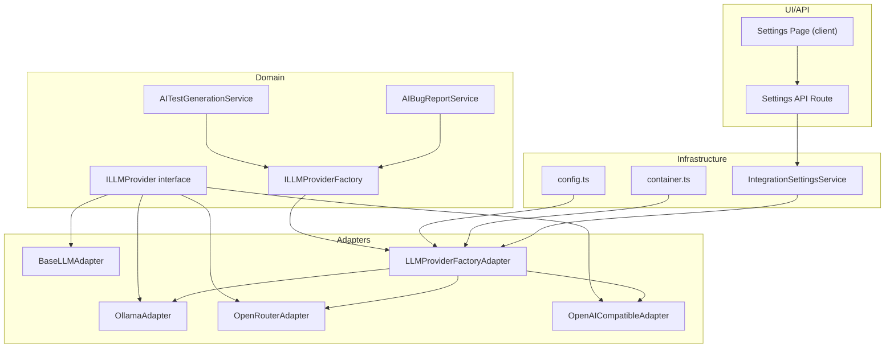
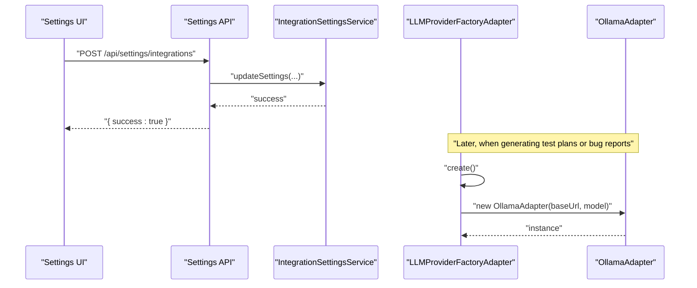
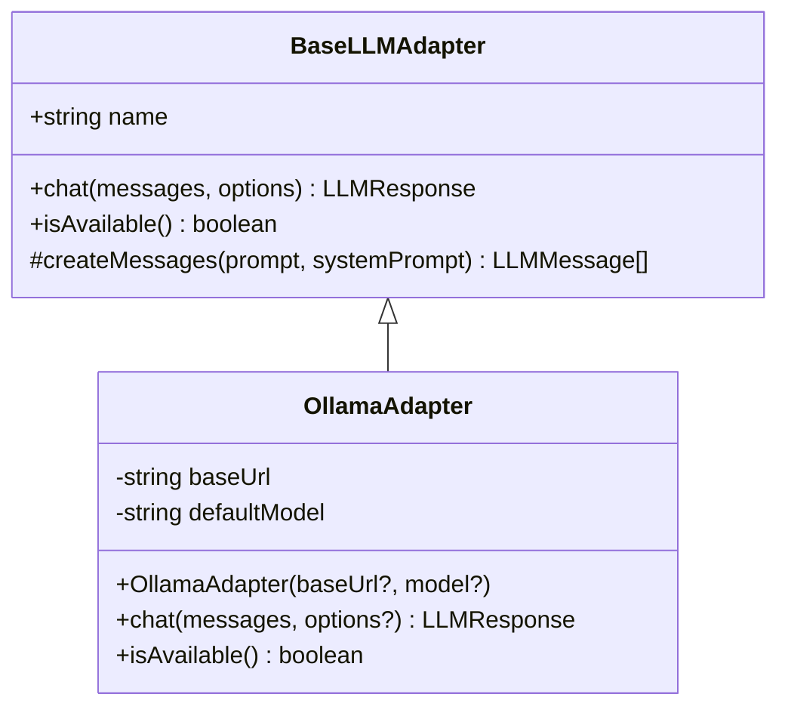
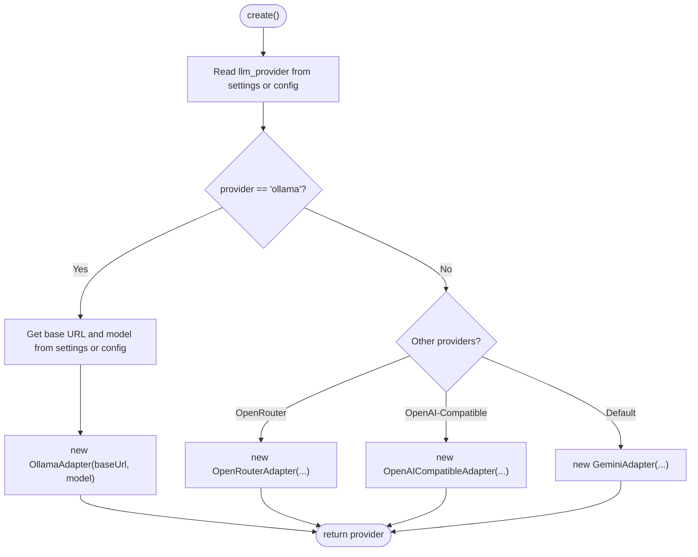
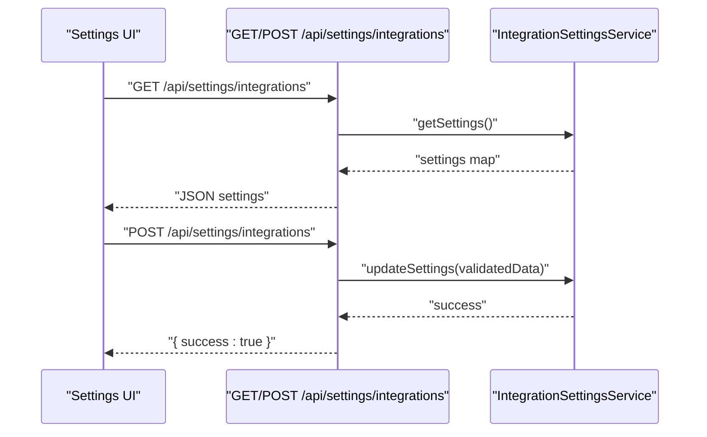
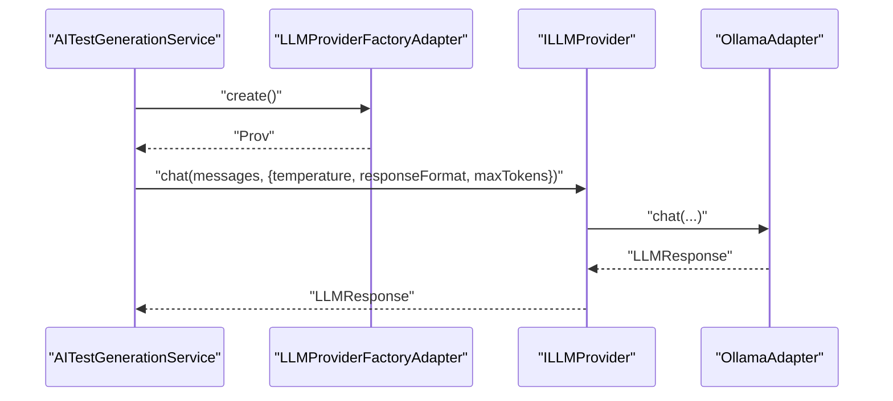
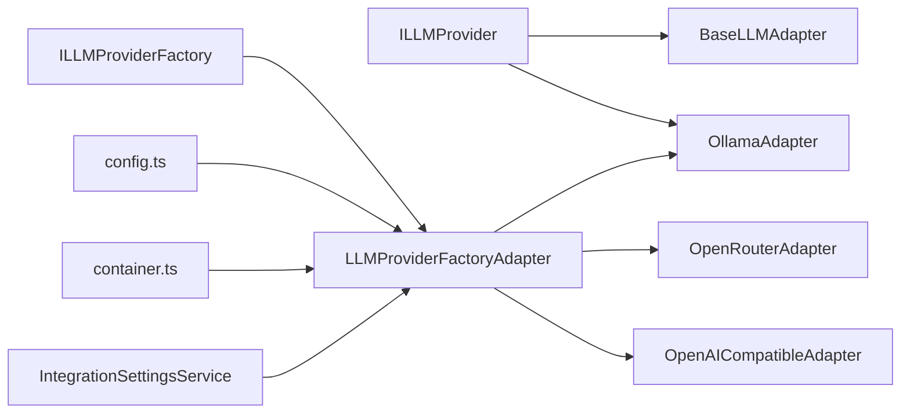

# Ollama Local Integration

<cite>
**Referenced Files in This Document**
- [OllamaAdapter.ts](file://src/adapters/llm/OllamaAdapter.ts)
- [BaseLLMAdapter.ts](file://src/adapters/llm/BaseLLMAdapter.ts)
- [ILLMProvider.ts](file://src/domain/ports/ILLMProvider.ts)
- [LLMProviderFactoryAdapter.ts](file://src/adapters/llm/LLMProviderFactoryAdapter.ts)
- [config.ts](file://src/infrastructure/config.ts)
- [container.ts](file://src/infrastructure/container.ts)
- [IntegrationSettingsService.ts](file://src/domain/services/IntegrationSettingsService.ts)
- [settings page.tsx](file://app/settings/page.tsx)
- [settings route.ts](file://app/api/settings/integrations/route.ts)
- [AITestGenerationService.ts](file://src/domain/services/AITestGenerationService.ts)
- [AIBugReportService.ts](file://src/domain/services/AIBugReportService.ts)
- [OpenRouterAdapter.ts](file://src/adapters/llm/OpenRouterAdapter.ts)
- [OpenAICompatibleAdapter.ts](file://src/adapters/llm/OpenAICompatibleAdapter.ts)
</cite>

## Table of Contents
1. [Introduction](#introduction)
2. [Project Structure](#project-structure)
3. [Core Components](#core-components)
4. [Architecture Overview](#architecture-overview)
5. [Detailed Component Analysis](#detailed-component-analysis)
6. [Dependency Analysis](#dependency-analysis)
7. [Performance Considerations](#performance-considerations)
8. [Troubleshooting Guide](#troubleshooting-guide)
9. [Conclusion](#conclusion)
10. [Appendices](#appendices)

## Introduction
This document explains how the application integrates with a local Ollama server as an LLM provider. It covers local server configuration, model availability checks, API communication, and how the system selects and configures models. It also provides practical guidance for setting up Ollama, installing models (such as llama3, mistral, gemma2), configuring inference parameters, and managing resources like GPU memory and disk space. Finally, it includes troubleshooting advice and best practices for reliable local operation.

## Project Structure
The Ollama integration lives in the adapters layer and is wired into the domain services via a factory. The settings subsystem persists provider configuration, while the UI exposes a settings page to manage provider, model, and base URL.

**Diagram sources**
- [OllamaAdapter.ts:1-70](file://src/adapters/llm/OllamaAdapter.ts#L1-L70)
- [BaseLLMAdapter.ts:1-26](file://src/adapters/llm/BaseLLMAdapter.ts#L1-L26)
- [ILLMProvider.ts:1-32](file://src/domain/ports/ILLMProvider.ts#L1-L32)
- [LLMProviderFactoryAdapter.ts:1-43](file://src/adapters/llm/LLMProviderFactoryAdapter.ts#L1-L43)
- [config.ts:1-28](file://src/infrastructure/config.ts#L1-L28)
- [container.ts:1-126](file://src/infrastructure/container.ts#L1-L126)
- [IntegrationSettingsService.ts:1-36](file://src/domain/services/IntegrationSettingsService.ts#L1-L36)
- [settings page.tsx:1-72](file://app/settings/page.tsx#L1-L72)
- [settings route.ts:1-19](file://app/api/settings/integrations/route.ts#L1-L19)

**Section sources**
- [OllamaAdapter.ts:1-70](file://src/adapters/llm/OllamaAdapter.ts#L1-L70)
- [LLMProviderFactoryAdapter.ts:1-43](file://src/adapters/llm/LLMProviderFactoryAdapter.ts#L1-L43)
- [config.ts:1-28](file://src/infrastructure/config.ts#L1-L28)
- [container.ts:1-126](file://src/infrastructure/container.ts#L1-L126)
- [IntegrationSettingsService.ts:1-36](file://src/domain/services/IntegrationSettingsService.ts#L1-L36)
- [settings page.tsx:1-72](file://app/settings/page.tsx#L1-L72)
- [settings route.ts:1-19](file://app/api/settings/integrations/route.ts#L1-L19)

## Core Components
- OllamaAdapter: Implements the local Ollama provider, sending chat requests to the /api/chat endpoint and checking model availability via /api/tags.
- BaseLLMAdapter: Defines the common interface and helper utilities for message formatting.
- ILLMProvider: The domain contract for any LLM provider.
- LLMProviderFactoryAdapter: Chooses the provider based on persisted settings or defaults, instantiating OllamaAdapter with configurable base URL and model.
- IntegrationSettingsService: Persists and retrieves provider settings (provider, model, base URL, API key).
- UI and API: Settings page and route to update and retrieve LLM configuration.

Key configuration points:
- Default base URL for Ollama is http://localhost:11434.
- Default model is llama3.
- Environment variables can override defaults for base URL and model.
- The factory reads persisted settings first, then falls back to config.

**Section sources**
- [OllamaAdapter.ts:1-70](file://src/adapters/llm/OllamaAdapter.ts#L1-L70)
- [BaseLLMAdapter.ts:1-26](file://src/adapters/llm/BaseLLMAdapter.ts#L1-L26)
- [ILLMProvider.ts:1-32](file://src/domain/ports/ILLMProvider.ts#L1-L32)
- [LLMProviderFactoryAdapter.ts:1-43](file://src/adapters/llm/LLMProviderFactoryAdapter.ts#L1-L43)
- [config.ts:13-18](file://src/infrastructure/config.ts#L13-L18)
- [IntegrationSettingsService.ts:11-36](file://src/domain/services/IntegrationSettingsService.ts#L11-L36)
- [settings page.tsx:13-28](file://app/settings/page.tsx#L13-L28)
- [settings route.ts:8-18](file://app/api/settings/integrations/route.ts#L8-L18)

## Architecture Overview
The system uses a factory to construct the appropriate LLM provider at runtime. The domain services depend only on the factory port, keeping the domain agnostic of concrete providers. The Ollama adapter communicates with the local server using the official API endpoints.

**Diagram sources**
- [settings route.ts:13-18](file://app/api/settings/integrations/route.ts#L13-L18)
- [IntegrationSettingsService.ts:19-35](file://src/domain/services/IntegrationSettingsService.ts#L19-L35)
- [LLMProviderFactoryAdapter.ts:18-25](file://src/adapters/llm/LLMProviderFactoryAdapter.ts#L18-L25)
- [OllamaAdapter.ts:9-16](file://src/adapters/llm/OllamaAdapter.ts#L9-L16)

## Detailed Component Analysis

### OllamaAdapter
Responsibilities:
- Construct a base URL with a trailing slash removal.
- Default model selection with environment override.
- Chat endpoint request construction with temperature, max tokens, and optional JSON response format.
- Availability check against /api/tags to confirm local model presence.

Behavior highlights:
- Uses fetch to communicate with the local Ollama server.
- Returns a normalized LLMResponse with content and model name.
- Throws a descriptive error on API failure.

**Diagram sources**
- [BaseLLMAdapter.ts:3-25](file://src/adapters/llm/BaseLLMAdapter.ts#L3-L25)
- [OllamaAdapter.ts:4-68](file://src/adapters/llm/OllamaAdapter.ts#L4-L68)

**Section sources**
- [OllamaAdapter.ts:9-16](file://src/adapters/llm/OllamaAdapter.ts#L9-L16)
- [OllamaAdapter.ts:18-54](file://src/adapters/llm/OllamaAdapter.ts#L18-L54)
- [OllamaAdapter.ts:56-68](file://src/adapters/llm/OllamaAdapter.ts#L56-L68)

### LLMProviderFactoryAdapter
Responsibilities:
- Reads persisted settings for provider, model, base URL, and API key.
- Creates OllamaAdapter when provider equals 'ollama'.
- Falls back to config defaults when settings are missing.
- Supports other providers (OpenRouter, OpenAI-compatible, Gemini) for comparison.

**Diagram sources**
- [LLMProviderFactoryAdapter.ts:18-41](file://src/adapters/llm/LLMProviderFactoryAdapter.ts#L18-L41)
- [config.ts:13-18](file://src/infrastructure/config.ts#L13-L18)

**Section sources**
- [LLMProviderFactoryAdapter.ts:18-41](file://src/adapters/llm/LLMProviderFactoryAdapter.ts#L18-L41)
- [config.ts:13-18](file://src/infrastructure/config.ts#L13-L18)

### Settings Management
- IntegrationSettingsService persists and retrieves LLM settings keys: provider, model, base URL, and API key.
- The settings page initializes state from the backend and posts updates via the settings API route.
- The settings route validates payload and delegates to the service.

**Diagram sources**
- [settings page.tsx:30-51](file://app/settings/page.tsx#L30-L51)
- [settings route.ts:8-18](file://app/api/settings/integrations/route.ts#L8-L18)
- [IntegrationSettingsService.ts:11-35](file://src/domain/services/IntegrationSettingsService.ts#L11-L35)

**Section sources**
- [IntegrationSettingsService.ts:11-35](file://src/domain/services/IntegrationSettingsService.ts#L11-L35)
- [settings page.tsx:30-51](file://app/settings/page.tsx#L30-L51)
- [settings route.ts:8-18](file://app/api/settings/integrations/route.ts#L8-L18)

### Service Usage of LLM Providers
- AITestGenerationService and AIBugReportService obtain a provider via the factory and call chat with provider-specific parameters (e.g., JSON vs text response, temperature, max tokens).
- These services demonstrate how the domain remains provider-agnostic while leveraging the adapter’s capabilities.

**Diagram sources**
- [AITestGenerationService.ts:28-64](file://src/domain/services/AITestGenerationService.ts#L28-L64)
- [AIBugReportService.ts:25-65](file://src/domain/services/AIBugReportService.ts#L25-L65)
- [LLMProviderFactoryAdapter.ts:18-25](file://src/adapters/llm/LLMProviderFactoryAdapter.ts#L18-L25)
- [OllamaAdapter.ts:18-54](file://src/adapters/llm/OllamaAdapter.ts#L18-L54)

**Section sources**
- [AITestGenerationService.ts:28-64](file://src/domain/services/AITestGenerationService.ts#L28-L64)
- [AIBugReportService.ts:25-65](file://src/domain/services/AIBugReportService.ts#L25-L65)
- [LLMProviderFactoryAdapter.ts:18-25](file://src/adapters/llm/LLMProviderFactoryAdapter.ts#L18-L25)

## Dependency Analysis
- The domain depends on ports (ILLMProvider, ILLMProviderFactory) only, ensuring isolation from concrete adapters.
- The factory depends on persisted settings and config to instantiate the correct adapter.
- The Ollama adapter depends on BaseLLMAdapter and the ILLMProvider contract.
- The container wires repositories, adapters, and services together, exposing named exports for API routes.

**Diagram sources**
- [ILLMProvider.ts:12-31](file://src/domain/ports/ILLMProvider.ts#L12-L31)
- [BaseLLMAdapter.ts:3-12](file://src/adapters/llm/BaseLLMAdapter.ts#L3-L12)
- [OllamaAdapter.ts:4-16](file://src/adapters/llm/OllamaAdapter.ts#L4-L16)
- [LLMProviderFactoryAdapter.ts:15-41](file://src/adapters/llm/LLMProviderFactoryAdapter.ts#L15-L41)
- [OpenRouterAdapter.ts:10-27](file://src/adapters/llm/OpenRouterAdapter.ts#L10-L27)
- [OpenAICompatibleAdapter.ts:8-39](file://src/adapters/llm/OpenAICompatibleAdapter.ts#L8-L39)
- [config.ts:13-18](file://src/infrastructure/config.ts#L13-L18)
- [container.ts:50-50](file://src/infrastructure/container.ts#L50-L50)

**Section sources**
- [ILLMProvider.ts:12-31](file://src/domain/ports/ILLMProvider.ts#L12-L31)
- [LLMProviderFactoryAdapter.ts:15-41](file://src/adapters/llm/LLMProviderFactoryAdapter.ts#L15-L41)
- [container.ts:50-50](file://src/infrastructure/container.ts#L50-L50)

## Performance Considerations
- Temperature and maxTokens influence inference quality and latency. Lower temperature improves determinism; cap maxTokens to control output size and reduce latency.
- Streaming is disabled in the adapter; enabling streaming would require adapting the response handling.
- Model size and quantization affect memory usage. Smaller models (e.g., GGUF quantized) fit better on constrained GPUs.
- Disk space: Models are stored locally; remove unused models to free space.
- GPU memory: Reduce batch sizes, lower maxTokens, or switch to smaller models when encountering out-of-memory conditions.

[No sources needed since this section provides general guidance]

## Troubleshooting Guide
Common issues and resolutions:
- Local server connectivity
  - Verify the base URL matches the running Ollama instance. The default is http://localhost:11434.
  - Use the availability check to confirm the model exists locally.
- Model loading failures
  - Ensure the model is pulled locally before use.
  - Confirm the model name matches the installed tag.
- GPU memory problems
  - Switch to a smaller model or adjust quantization.
  - Reduce maxTokens and temperature for faster responses.
- Settings not applied
  - Confirm settings are persisted and reloaded by the factory.
  - Check environment variables if settings are not taking effect.

Operational checks:
- Use the availability method to verify model presence.
- Inspect error logs for HTTP status codes and error messages from the adapter.

**Section sources**
- [OllamaAdapter.ts:56-68](file://src/adapters/llm/OllamaAdapter.ts#L56-L68)
- [settings page.tsx:30-51](file://app/settings/page.tsx#L30-L51)
- [settings route.ts:8-18](file://app/api/settings/integrations/route.ts#L8-L18)

## Conclusion
The Ollama integration is cleanly separated from the domain through an adapter and factory pattern. Configuration is centralized in settings and environment variables, with sensible defaults for local operation. The adapter communicates with the official Ollama API, supports model availability checks, and can be tuned for performance and reliability. Following the setup and troubleshooting guidance ensures smooth local LLM operation.

[No sources needed since this section summarizes without analyzing specific files]

## Appendices

### Practical Setup and Configuration
- Install Ollama locally and start the server.
- Pull desired models (e.g., llama3, mistral, gemma2) using the Ollama CLI.
- Configure provider, model, and base URL in the settings UI or via environment variables.
- Use the availability check to confirm readiness before generating content.

[No sources needed since this section provides general guidance]

### API Communication Details
- Chat endpoint: POST to /api/chat with model, messages, optional format, and options (temperature, num_predict).
- Tags endpoint: GET /api/tags to check local model availability.

**Section sources**
- [OllamaAdapter.ts:18-54](file://src/adapters/llm/OllamaAdapter.ts#L18-L54)
- [OllamaAdapter.ts:56-68](file://src/adapters/llm/OllamaAdapter.ts#L56-L68)