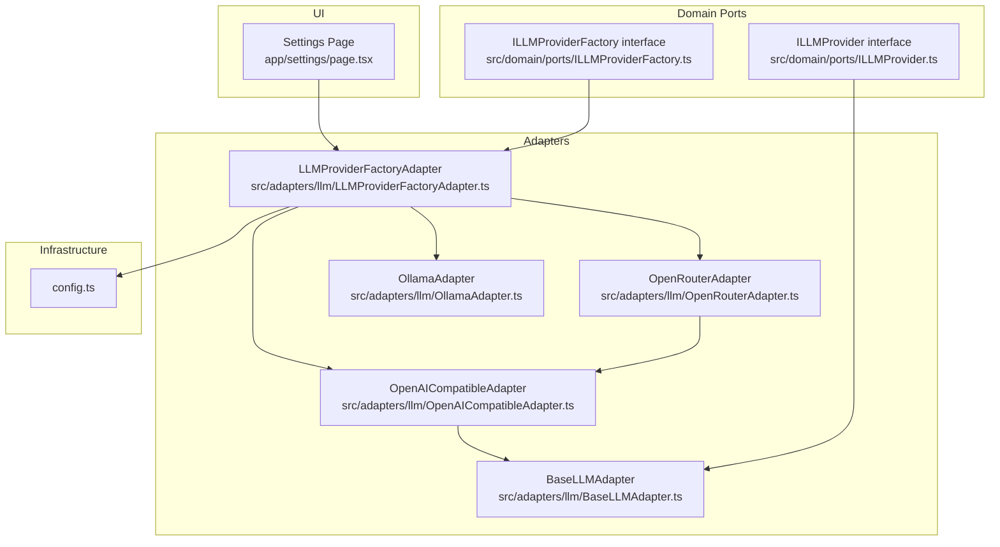
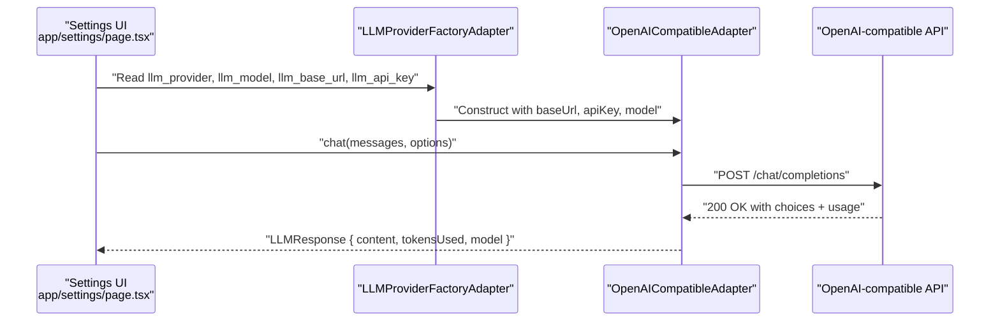
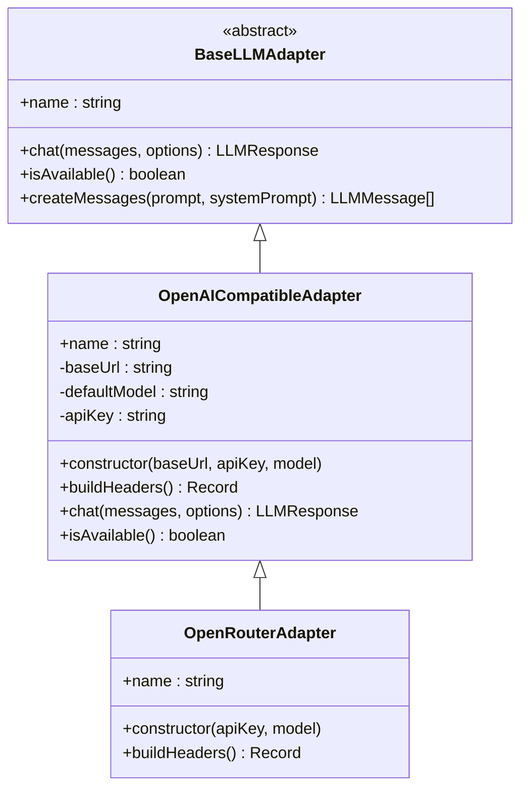
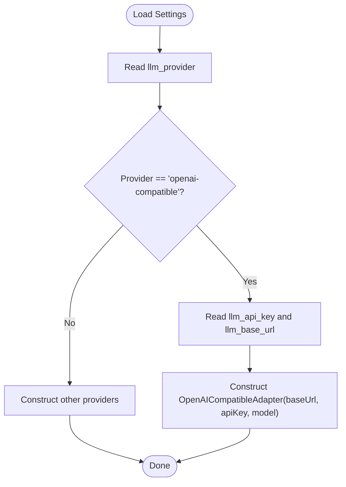
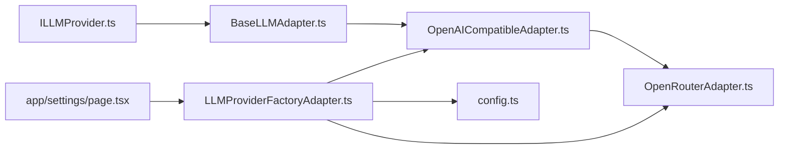

# OpenAI-Compatible Integration

<cite>
**Referenced Files in This Document**
- [OpenAICompatibleAdapter.ts](file://src/adapters/llm/OpenAICompatibleAdapter.ts)
- [BaseLLMAdapter.ts](file://src/adapters/llm/BaseLLMAdapter.ts)
- [ILLMProvider.ts](file://src/domain/ports/ILLMProvider.ts)
- [LLMProviderFactoryAdapter.ts](file://src/adapters/llm/LLMProviderFactoryAdapter.ts)
- [config.ts](file://src/infrastructure/config.ts)
- [OpenRouterAdapter.ts](file://src/adapters/llm/OpenRouterAdapter.ts)
- [OllamaAdapter.ts](file://src/adapters/llm/OllamaAdapter.ts)
- [page.tsx](file://app/settings/page.tsx)
- [route.ts](file://app/api/ai/generate-plan/route.ts)
</cite>

## Table of Contents
1. [Introduction](#introduction)
2. [Project Structure](#project-structure)
3. [Core Components](#core-components)
4. [Architecture Overview](#architecture-overview)
5. [Detailed Component Analysis](#detailed-component-analysis)
6. [Dependency Analysis](#dependency-analysis)
7. [Performance Considerations](#performance-considerations)
8. [Troubleshooting Guide](#troubleshooting-guide)
9. [Conclusion](#conclusion)
10. [Appendices](#appendices)

## Introduction
This document explains the OpenAI-compatible LLM provider integration in the project. It focuses on the OpenAICompatibleAdapter implementation, including base URL configuration, API key setup, and model parameter mapping. It also documents how to configure endpoints for various OpenAI-compatible services (OpenAI, Azure OpenAI, Groq, etc.), provides examples of endpoint configurations, authentication headers, and model name mappings, and details request/response formatting, parameter validation, and error handling. Finally, it offers troubleshooting guidance and performance/cost management strategies.

## Project Structure
The OpenAI-compatible integration lives in the adapters layer and is orchestrated by a factory that selects the provider based on persisted settings or centralized configuration. The UI exposes provider selection and configuration fields for OpenAI-compatible providers.

**Diagram sources**
- [page.tsx](file://app/settings/page.tsx)
- [ILLMProvider.ts](file://src/domain/ports/ILLMProvider.ts)
- [ILLMProviderFactory.ts](file://src/domain/ports/ILLMProviderFactory.ts)
- [BaseLLMAdapter.ts](file://src/adapters/llm/BaseLLMAdapter.ts)
- [OpenAICompatibleAdapter.ts](file://src/adapters/llm/OpenAICompatibleAdapter.ts)
- [OpenRouterAdapter.ts](file://src/adapters/llm/OpenRouterAdapter.ts)
- [OllamaAdapter.ts](file://src/adapters/llm/OllamaAdapter.ts)
- [LLMProviderFactoryAdapter.ts](file://src/adapters/llm/LLMProviderFactoryAdapter.ts)
- [config.ts](file://src/infrastructure/config.ts)

**Section sources**
- [page.tsx](file://app/settings/page.tsx)
- [LLMProviderFactoryAdapter.ts](file://src/adapters/llm/LLMProviderFactoryAdapter.ts)
- [config.ts](file://src/infrastructure/config.ts)

## Core Components
- OpenAICompatibleAdapter: Implements the OpenAI-compatible API contract, including base URL normalization, Authorization header building, chat completions request formatting, response parsing, and availability checks.
- BaseLLMAdapter: Defines the common interface and helper utilities for all LLM adapters.
- ILLMProvider: The domain interface specifying the provider contract.
- LLMProviderFactoryAdapter: Selects and constructs the appropriate provider based on persisted settings or centralized configuration.
- OpenRouterAdapter: Extends OpenAICompatibleAdapter to add required headers for OpenRouter.
- OllamaAdapter: Demonstrates an alternative OpenAI-compatible-like endpoint (/api/chat) for local inference servers.
- UI Settings: Provides provider selection and configuration fields for OpenAI-compatible providers.

Key responsibilities:
- Parameter mapping: model, messages, temperature, max_tokens, response_format.
- Authentication: Bearer token via Authorization header.
- Endpoint: /chat/completions for OpenAI-compatible APIs.
- Availability: GET /models endpoint validation.

**Section sources**
- [OpenAICompatibleAdapter.ts](file://src/adapters/llm/OpenAICompatibleAdapter.ts)
- [BaseLLMAdapter.ts](file://src/adapters/llm/BaseLLMAdapter.ts)
- [ILLMProvider.ts](file://src/domain/ports/ILLMProvider.ts)
- [LLMProviderFactoryAdapter.ts](file://src/adapters/llm/LLMProviderFactoryAdapter.ts)
- [OpenRouterAdapter.ts](file://src/adapters/llm/OpenRouterAdapter.ts)
- [OllamaAdapter.ts](file://src/adapters/llm/OllamaAdapter.ts)
- [page.tsx](file://app/settings/page.tsx)

## Architecture Overview
The system routes provider selection through a factory that reads persisted settings or centralized configuration. The OpenAI-compatible adapter encapsulates HTTP communication to the /chat/completions endpoint and normalizes responses into the domain’s LLMResponse.

**Diagram sources**
- [LLMProviderFactoryAdapter.ts](file://src/adapters/llm/LLMProviderFactoryAdapter.ts)
- [OpenAICompatibleAdapter.ts](file://src/adapters/llm/OpenAICompatibleAdapter.ts)
- [page.tsx](file://app/settings/page.tsx)

## Detailed Component Analysis

### OpenAICompatibleAdapter
Implements the OpenAI-compatible API:
- Constructor sets normalized base URL, optional API key, and default model.
- buildHeaders adds Content-Type and optional Authorization: Bearer header.
- chat formats the request body with model, messages, temperature, optional max_tokens, and response_format mapped to json_object when requested.
- Validates response.ok and parses JSON to extract content, total_tokens, and model.
- isAvailable performs a lightweight reachability check against /models using configured headers.

**Diagram sources**
- [BaseLLMAdapter.ts](file://src/adapters/llm/BaseLLMAdapter.ts)
- [OpenAICompatibleAdapter.ts](file://src/adapters/llm/OpenAICompatibleAdapter.ts)
- [OpenRouterAdapter.ts](file://src/adapters/llm/OpenRouterAdapter.ts)

**Section sources**
- [OpenAICompatibleAdapter.ts](file://src/adapters/llm/OpenAICompatibleAdapter.ts)

### Parameter Mapping and Request/Response Formatting
- Request body fields:
  - model: defaults to gpt-4o-mini if unspecified.
  - messages: role/content pairs copied from input.
  - temperature: defaults to 0.7 if not provided.
  - max_tokens: optional upper bound for generation length.
  - response_format: when 'json', maps to response_format.type=json_object.
- Response fields:
  - content: extracted from choices[0].message.content.
  - tokensUsed: usage.total_tokens.
  - model: returned model or fallback to default.

Validation and error handling:
- Non-OK HTTP responses trigger an error with HTTP status and raw body text.
- Exceptions during fetch or JSON parsing are caught and rethrown with a descriptive message.

**Section sources**
- [OpenAICompatibleAdapter.ts](file://src/adapters/llm/OpenAICompatibleAdapter.ts)
- [ILLMProvider.ts](file://src/domain/ports/ILLMProvider.ts)

### Provider Selection and Configuration
- LLMProviderFactoryAdapter chooses provider based on persisted settings or centralized config, constructing OpenAICompatibleAdapter with:
  - apiKey from settings or config.
  - baseUrl from settings or config (defaults to OpenAI endpoint if missing).
  - model from settings or config.
- UI Settings page exposes:
  - Provider dropdown including openai-compatible.
  - Model name input with provider-specific placeholders.
  - Base URL input for openai-compatible and ollama.
  - API Key input for providers requiring keys (excluding Ollama).

**Diagram sources**
- [LLMProviderFactoryAdapter.ts](file://src/adapters/llm/LLMProviderFactoryAdapter.ts)
- [config.ts](file://src/infrastructure/config.ts)
- [page.tsx](file://app/settings/page.tsx)

**Section sources**
- [LLMProviderFactoryAdapter.ts](file://src/adapters/llm/LLMProviderFactoryAdapter.ts)
- [config.ts](file://src/infrastructure/config.ts)
- [page.tsx](file://app/settings/page.tsx)

### OpenRouterAdapter
Extends OpenAICompatibleAdapter to support OpenRouter’s aggregator API:
- Hardcodes base URL to OpenRouter’s API.
- Adds required headers for analytics and attribution.
- Defaults model to an OpenRouter-friendly format when none provided.

**Section sources**
- [OpenRouterAdapter.ts](file://src/adapters/llm/OpenRouterAdapter.ts)

### OllamaAdapter
Provides an alternative OpenAI-compatible-like integration:
- Uses /api/chat endpoint.
- Supports JSON response format via format field.
- No Authorization header by default.

This demonstrates how adapters can adapt to different endpoints while sharing the same domain interface.

**Section sources**
- [OllamaAdapter.ts](file://src/adapters/llm/OllamaAdapter.ts)

### Example Endpoint Configurations
Below are typical endpoint configurations for popular OpenAI-compatible services. Replace placeholders with your actual values.

- OpenAI
  - Base URL: https://api.openai.com/v1
  - API Key: sk-...
  - Model: gpt-4o-mini, gpt-4o, o1-preview, etc.

- OpenRouter
  - Base URL: https://openrouter.ai/api/v1
  - API Key: sk-or-v1-...
  - Model: openai/gpt-4o-mini, anthropic/claude-3.5-sonnet, etc.

- Groq
  - Base URL: https://api.groq.com/openai/v1
  - API Key: gora-...
  - Model: llama3-70b-8192, llama3-8b-8192, mixtral-8x7b-32768, etc.

- Mistral
  - Base URL: https://api.mistral.ai/v1
  - API Key: mistral-...
  - Model: mistral-large-latest, open-mixtral-8x7b, codestral-latest, etc.

- Azure OpenAI (via compatible endpoint)
  - Base URL: https://{resource-name}.openai.azure.com/openai/deployments/{deployment-name}/chat/completions?api-version=2024-02-15
  - API Key: (optional depending on auth mode)
  - Model: deployment name

Notes:
- Ensure the base URL does not have a trailing slash; the adapter normalizes it.
- For local/self-hosted servers (e.g., LM Studio, llama.cpp server, vLLM), use the server’s base URL and omit API key if not required.

**Section sources**
- [OpenAICompatibleAdapter.ts](file://src/adapters/llm/OpenAICompatibleAdapter.ts)
- [OpenRouterAdapter.ts](file://src/adapters/llm/OpenRouterAdapter.ts)
- [page.tsx](file://app/settings/page.tsx)

## Dependency Analysis
- OpenAICompatibleAdapter depends on BaseLLMAdapter and the domain ILLMProvider interface.
- LLMProviderFactoryAdapter depends on settings and centralized config to construct providers.
- OpenRouterAdapter depends on OpenAICompatibleAdapter and adds extra headers.
- UI Settings page depends on the factory to render provider-specific configuration fields.

**Diagram sources**
- [ILLMProvider.ts](file://src/domain/ports/ILLMProvider.ts)
- [BaseLLMAdapter.ts](file://src/adapters/llm/BaseLLMAdapter.ts)
- [OpenAICompatibleAdapter.ts](file://src/adapters/llm/OpenAICompatibleAdapter.ts)
- [OpenRouterAdapter.ts](file://src/adapters/llm/OpenRouterAdapter.ts)
- [LLMProviderFactoryAdapter.ts](file://src/adapters/llm/LLMProviderFactoryAdapter.ts)
- [config.ts](file://src/infrastructure/config.ts)
- [page.tsx](file://app/settings/page.tsx)

**Section sources**
- [LLMProviderFactoryAdapter.ts](file://src/adapters/llm/LLMProviderFactoryAdapter.ts)
- [OpenAICompatibleAdapter.ts](file://src/adapters/llm/OpenAICompatibleAdapter.ts)
- [OpenRouterAdapter.ts](file://src/adapters/llm/OpenRouterAdapter.ts)
- [config.ts](file://src/infrastructure/config.ts)
- [page.tsx](file://app/settings/page.tsx)

## Performance Considerations
- Prefer streaming when supported by the backend to reduce latency (not implemented in current adapter).
- Tune temperature and max_tokens to balance quality and speed.
- Reuse a single adapter instance per configuration to avoid repeated construction overhead.
- Cache model metadata locally if frequently checking availability.
- Monitor tokensUsed to estimate cost and adjust prompts accordingly.
- Batch requests at the application level when feasible to amortize connection overhead.

[No sources needed since this section provides general guidance]

## Troubleshooting Guide
Common issues and resolutions:

- Incorrect base URL
  - Symptom: 404 or connection timeout.
  - Resolution: Verify the base URL ends with /v1 for OpenAI-compatible APIs; the adapter removes trailing slashes internally. For Azure OpenAI, ensure the api-version and deployment name are included in the path.

- Authentication failures
  - Symptom: 401 Unauthorized or 403 Forbidden.
  - Resolution: Confirm the API key is set and correct. For OpenRouter, ensure required headers are present. For local/self-hosted endpoints, confirm no API key is required or that it is configured appropriately.

- Model not available
  - Symptom: 404 Not Found for /chat/completions or model not found errors.
  - Resolution: Ensure the model name matches the provider’s accepted values. For OpenRouter, use provider-specific model identifiers (e.g., vendor/name).

- Network or CORS issues
  - Symptom: Fetch errors or CORS policy violations.
  - Resolution: Use a compatible endpoint and ensure the client can reach it. For self-hosted servers, expose the endpoint publicly or proxy it through your backend.

- Unexpected empty content
  - Symptom: Empty content in response.
  - Resolution: Check that the first choice exists and contains a message. Validate prompt formatting and roles.

- Availability checks failing
  - Symptom: isAvailable returns false.
  - Resolution: Ensure API key is provided for remote endpoints. The adapter skips availability checks for local endpoints without an API key.

**Section sources**
- [OpenAICompatibleAdapter.ts](file://src/adapters/llm/OpenAICompatibleAdapter.ts)

## Conclusion
The OpenAI-compatible integration provides a flexible, extensible foundation for connecting to numerous OpenAI-compatible LLM providers. By centralizing configuration, normalizing request/response formats, and offering provider-specific overrides (e.g., OpenRouter headers), the system supports diverse deployment scenarios while maintaining a consistent domain interface. Proper configuration of base URLs, API keys, and model names ensures reliable operation, and the built-in availability checks help diagnose connectivity issues early.

[No sources needed since this section summarizes without analyzing specific files]

## Appendices

### API Definition: OpenAI-Compatible Chat Completions
- Endpoint: POST /chat/completions
- Headers:
  - Content-Type: application/json
  - Authorization: Bearer <api_key> (when applicable)
- Request body fields:
  - model: string
  - messages: array of { role, content }
  - temperature: number (default 0.7)
  - max_tokens: number (optional)
  - response_format: { type: "json_object" } (optional)
- Response body fields:
  - choices: array of { message: { role, content }, ... }
  - usage: { total_tokens: number }
  - model: string

**Section sources**
- [OpenAICompatibleAdapter.ts](file://src/adapters/llm/OpenAICompatibleAdapter.ts)
- [ILLMProvider.ts](file://src/domain/ports/ILLMProvider.ts)