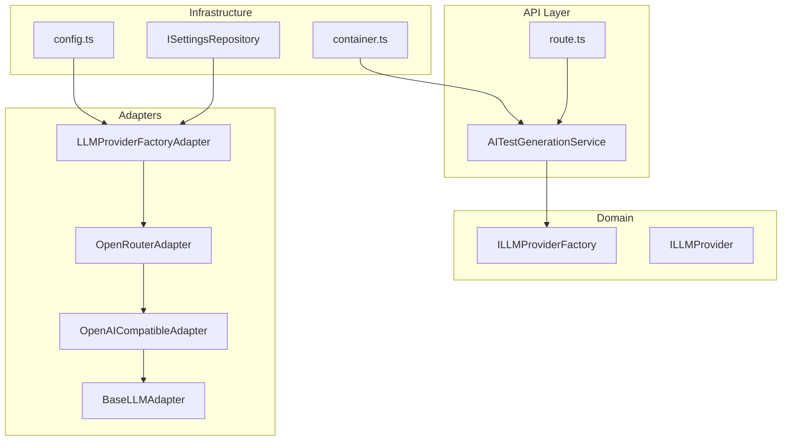
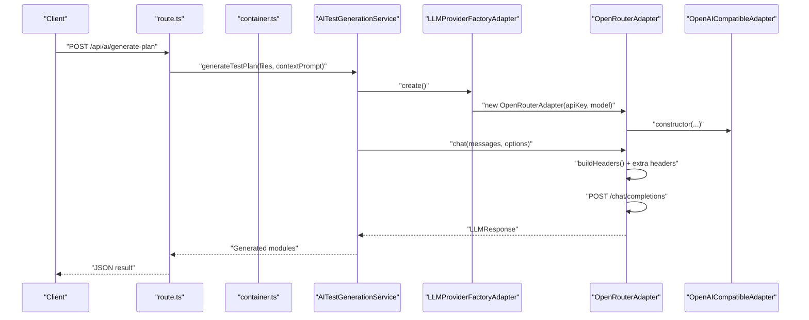
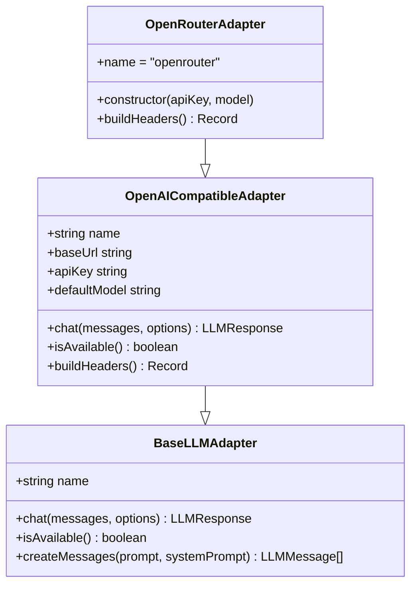
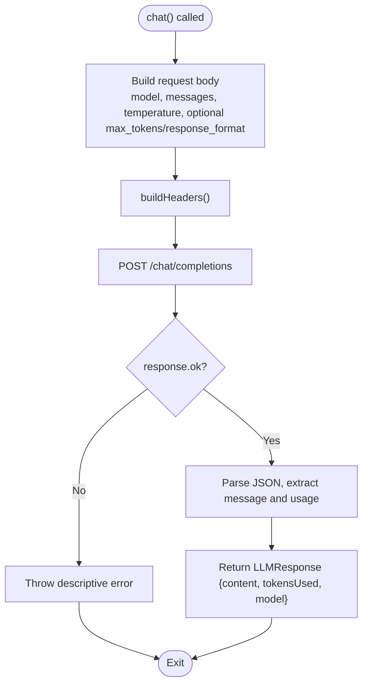
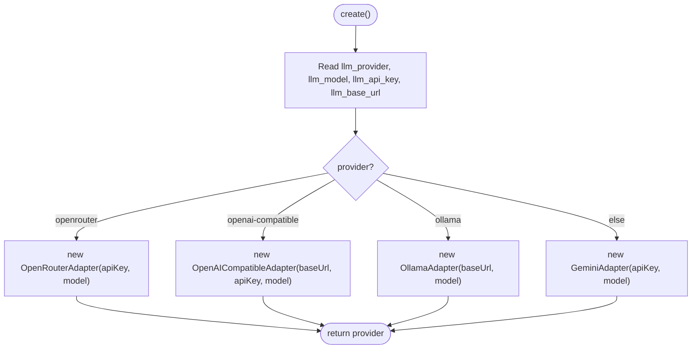
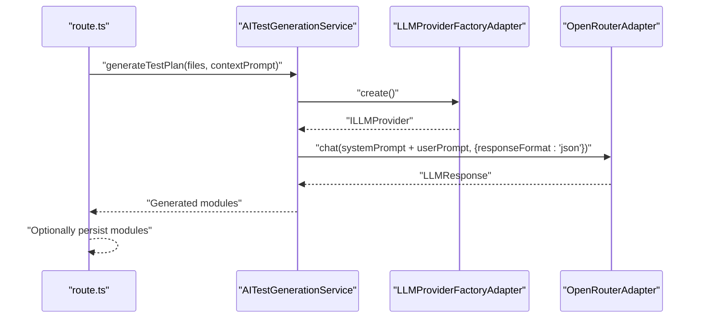
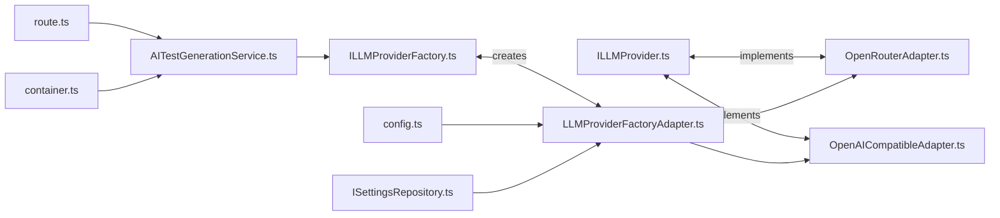

# OpenRouter Integration

<cite>
**Referenced Files in This Document**
- [OpenRouterAdapter.ts](file://src/adapters/llm/OpenRouterAdapter.ts)
- [OpenAICompatibleAdapter.ts](file://src/adapters/llm/OpenAICompatibleAdapter.ts)
- [BaseLLMAdapter.ts](file://src/adapters/llm/BaseLLMAdapter.ts)
- [LLMProviderFactoryAdapter.ts](file://src/adapters/llm/LLMProviderFactoryAdapter.ts)
- [ILLMProvider.ts](file://src/domain/ports/ILLMProvider.ts)
- [ILLMProviderFactory.ts](file://src/domain/ports/ILLMProviderFactory.ts)
- [config.ts](file://src/infrastructure/config.ts)
- [ISettingsRepository.ts](file://src/domain/ports/repositories/ISettingsRepository.ts)
- [AITestGenerationService.ts](file://src/domain/services/AITestGenerationService.ts)
- [container.ts](file://src/infrastructure/container.ts)
- [route.ts](file://app/api/ai/generate-plan/route.ts)
</cite>

## Table of Contents
1. [Introduction](#introduction)
2. [Project Structure](#project-structure)
3. [Core Components](#core-components)
4. [Architecture Overview](#architecture-overview)
5. [Detailed Component Analysis](#detailed-component-analysis)
6. [Dependency Analysis](#dependency-analysis)
7. [Performance Considerations](#performance-considerations)
8. [Troubleshooting Guide](#troubleshooting-guide)
9. [Conclusion](#conclusion)
10. [Appendices](#appendices)

## Introduction
This document explains how the application integrates with the OpenRouter LLM provider. It covers configuration of API keys, model selection, routing, authentication, and practical guidance for model availability, rate limiting, and dynamic selection. It also provides examples of routing strategies, fallback mechanisms, and cost optimization techniques tailored to the OpenRouter ecosystem.

## Project Structure
The OpenRouter integration lives in the adapters layer and is wired through a factory that selects the provider based on persisted settings or environment configuration. The AI generation pipeline consumes the selected provider to produce test plans.

**Diagram sources**
- [LLMProviderFactoryAdapter.ts:15-41](file://src/adapters/llm/LLMProviderFactoryAdapter.ts#L15-L41)
- [OpenRouterAdapter.ts:10-27](file://src/adapters/llm/OpenRouterAdapter.ts#L10-L27)
- [OpenAICompatibleAdapter.ts:8-96](file://src/adapters/llm/OpenAICompatibleAdapter.ts#L8-L96)
- [BaseLLMAdapter.ts:3-25](file://src/adapters/llm/BaseLLMAdapter.ts#L3-L25)
- [config.ts:7-27](file://src/infrastructure/config.ts#L7-L27)
- [ISettingsRepository.ts:1-6](file://src/domain/ports/repositories/ISettingsRepository.ts#L1-L6)
- [AITestGenerationService.ts:25-42](file://src/domain/services/AITestGenerationService.ts#L25-L42)
- [container.ts:73-78](file://src/infrastructure/container.ts#L73-L78)
- [route.ts:8-31](file://app/api/ai/generate-plan/route.ts#L8-L31)

**Section sources**
- [LLMProviderFactoryAdapter.ts:15-41](file://src/adapters/llm/LLMProviderFactoryAdapter.ts#L15-L41)
- [OpenRouterAdapter.ts:10-27](file://src/adapters/llm/OpenRouterAdapter.ts#L10-L27)
- [OpenAICompatibleAdapter.ts:8-96](file://src/adapters/llm/OpenAICompatibleAdapter.ts#L8-L96)
- [BaseLLMAdapter.ts:3-25](file://src/adapters/llm/BaseLLMAdapter.ts#L3-L25)
- [config.ts:7-27](file://src/infrastructure/config.ts#L7-L27)
- [ISettingsRepository.ts:1-6](file://src/domain/ports/repositories/ISettingsRepository.ts#L1-L6)
- [AITestGenerationService.ts:25-42](file://src/domain/services/AITestGenerationService.ts#L25-L42)
- [container.ts:73-78](file://src/infrastructure/container.ts#L73-L78)
- [route.ts:8-31](file://app/api/ai/generate-plan/route.ts#L8-L31)

## Core Components
- OpenRouterAdapter: Specialization of an OpenAI-compatible adapter that targets the OpenRouter endpoint and injects required headers for analytics and rate-limit attribution.
- OpenAICompatibleAdapter: Shared base for OpenAI-compatible APIs, handling chat completions, headers, and availability checks.
- BaseLLMAdapter: Defines the provider interface contract and helper utilities.
- LLMProviderFactoryAdapter: Factory that constructs the appropriate provider based on persisted settings or environment configuration.
- ILLMProvider and ILLMProviderFactory: Domain ports that decouple the domain from concrete implementations.
- config.ts: Centralized configuration for environment variables, including LLM provider defaults.
- ISettingsRepository: Abstraction for retrieving persisted settings (provider, model, API key, base URL).
- AITestGenerationService and API route: Orchestrate provider usage for AI-driven test plan generation.

**Section sources**
- [OpenRouterAdapter.ts:10-27](file://src/adapters/llm/OpenRouterAdapter.ts#L10-L27)
- [OpenAICompatibleAdapter.ts:8-96](file://src/adapters/llm/OpenAICompatibleAdapter.ts#L8-L96)
- [BaseLLMAdapter.ts:3-25](file://src/adapters/llm/BaseLLMAdapter.ts#L3-L25)
- [LLMProviderFactoryAdapter.ts:15-41](file://src/adapters/llm/LLMProviderFactoryAdapter.ts#L15-L41)
- [ILLMProvider.ts:12-31](file://src/domain/ports/ILLMProvider.ts#L12-L31)
- [ILLMProviderFactory.ts:8-10](file://src/domain/ports/ILLMProviderFactory.ts#L8-L10)
- [config.ts:7-27](file://src/infrastructure/config.ts#L7-L27)
- [ISettingsRepository.ts:1-6](file://src/domain/ports/repositories/ISettingsRepository.ts#L1-L6)
- [AITestGenerationService.ts:25-42](file://src/domain/services/AITestGenerationService.ts#L25-L42)
- [route.ts:8-31](file://app/api/ai/generate-plan/route.ts#L8-L31)

## Architecture Overview
The system uses a factory to instantiate the LLM provider. For OpenRouter, the adapter sets the base URL and adds required headers. The availability check leverages the provider’s models endpoint. The AI generation service requests the provider to produce structured outputs for test plan creation.

**Diagram sources**
- [route.ts:8-31](file://app/api/ai/generate-plan/route.ts#L8-L31)
- [container.ts:118-119](file://src/infrastructure/container.ts#L118-L119)
- [AITestGenerationService.ts:28-42](file://src/domain/services/AITestGenerationService.ts#L28-L42)
- [LLMProviderFactoryAdapter.ts:27-30](file://src/adapters/llm/LLMProviderFactoryAdapter.ts#L27-L30)
- [OpenRouterAdapter.ts:15-17](file://src/adapters/llm/OpenRouterAdapter.ts#L15-L17)
- [OpenAICompatibleAdapter.ts:34-81](file://src/adapters/llm/OpenAICompatibleAdapter.ts#L34-L81)

## Detailed Component Analysis

### OpenRouterAdapter
- Purpose: Provides OpenRouter access via an OpenAI-compatible interface while adding required headers for analytics and rate-limit attribution.
- Key behaviors:
  - Overrides the base URL to OpenRouter’s API endpoint.
  - Adds headers: HTTP-Referer and X-Title.
  - Defaults to a sensible model if none is provided.
- Authentication: Relies on the base adapter’s Authorization header built from the API key.
- Availability: Delegates to the base adapter’s availability check against the models endpoint.

**Diagram sources**
- [BaseLLMAdapter.ts:3-25](file://src/adapters/llm/BaseLLMAdapter.ts#L3-L25)
- [OpenAICompatibleAdapter.ts:8-96](file://src/adapters/llm/OpenAICompatibleAdapter.ts#L8-L96)
- [OpenRouterAdapter.ts:10-27](file://src/adapters/llm/OpenRouterAdapter.ts#L10-L27)

**Section sources**
- [OpenRouterAdapter.ts:10-27](file://src/adapters/llm/OpenRouterAdapter.ts#L10-L27)

### OpenAICompatibleAdapter
- Purpose: Generic OpenAI-compatible API handler supporting chat completions, optional JSON response format, and token usage reporting.
- Key behaviors:
  - Builds Authorization header when an API key is present.
  - Sends requests to /chat/completions with configurable temperature and optional max tokens.
  - Handles non-OK responses by throwing a descriptive error.
  - Availability check: attempts GET /models with current headers.
- Extensibility: Subclasses can override header building to add provider-specific headers.

**Diagram sources**
- [OpenAICompatibleAdapter.ts:34-81](file://src/adapters/llm/OpenAICompatibleAdapter.ts#L34-L81)

**Section sources**
- [OpenAICompatibleAdapter.ts:8-96](file://src/adapters/llm/OpenAICompatibleAdapter.ts#L8-L96)

### LLMProviderFactoryAdapter
- Purpose: Constructs the appropriate LLM provider based on persisted settings or environment configuration.
- Routing logic:
  - openrouter: Uses OpenRouterAdapter with apiKey and model.
  - openai-compatible: Uses OpenAICompatibleAdapter with baseUrl and apiKey.
  - ollama: Uses OllamaAdapter with baseUrl and model.
  - Default: GeminiAdapter with apiKey and model.
- Persistence: Reads provider, model, apiKey, and baseUrl from ISettingsRepository or falls back to config.ts.

**Diagram sources**
- [LLMProviderFactoryAdapter.ts:18-41](file://src/adapters/llm/LLMProviderFactoryAdapter.ts#L18-L41)
- [config.ts:13-18](file://src/infrastructure/config.ts#L13-L18)
- [ISettingsRepository.ts:1-6](file://src/domain/ports/repositories/ISettingsRepository.ts#L1-L6)

**Section sources**
- [LLMProviderFactoryAdapter.ts:15-41](file://src/adapters/llm/LLMProviderFactoryAdapter.ts#L15-L41)
- [config.ts:13-18](file://src/infrastructure/config.ts#L13-L18)
- [ISettingsRepository.ts:1-6](file://src/domain/ports/repositories/ISettingsRepository.ts#L1-L6)

### AI Pipeline Integration
- AITestGenerationService depends on ILLMProviderFactory to obtain a provider and invokes chat with a structured system prompt to produce JSON-formatted test plans.
- The API route triggers the service and optionally persists results.

**Diagram sources**
- [route.ts:8-31](file://app/api/ai/generate-plan/route.ts#L8-L31)
- [AITestGenerationService.ts:28-42](file://src/domain/services/AITestGenerationService.ts#L28-L42)
- [LLMProviderFactoryAdapter.ts:27-30](file://src/adapters/llm/LLMProviderFactoryAdapter.ts#L27-L30)
- [OpenRouterAdapter.ts:15-17](file://src/adapters/llm/OpenRouterAdapter.ts#L15-L17)

**Section sources**
- [AITestGenerationService.ts:25-42](file://src/domain/services/AITestGenerationService.ts#L25-L42)
- [route.ts:8-31](file://app/api/ai/generate-plan/route.ts#L8-L31)

## Dependency Analysis
- The domain depends only on ports (ILLMProvider, ILLMProviderFactory), ensuring loose coupling.
- The adapter layer implements concrete providers and the factory.
- The infrastructure layer supplies configuration and the IoC container wires services to repositories and adapters.

**Diagram sources**
- [ILLMProvider.ts:12-31](file://src/domain/ports/ILLMProvider.ts#L12-L31)
- [OpenRouterAdapter.ts:10-27](file://src/adapters/llm/OpenRouterAdapter.ts#L10-L27)
- [OpenAICompatibleAdapter.ts:8-96](file://src/adapters/llm/OpenAICompatibleAdapter.ts#L8-L96)
- [ILLMProviderFactory.ts:8-10](file://src/domain/ports/ILLMProviderFactory.ts#L8-L10)
- [LLMProviderFactoryAdapter.ts:15-41](file://src/adapters/llm/LLMProviderFactoryAdapter.ts#L15-L41)
- [config.ts:7-27](file://src/infrastructure/config.ts#L7-L27)
- [ISettingsRepository.ts:1-6](file://src/domain/ports/repositories/ISettingsRepository.ts#L1-L6)
- [AITestGenerationService.ts:25-42](file://src/domain/services/AITestGenerationService.ts#L25-L42)
- [route.ts:8-31](file://app/api/ai/generate-plan/route.ts#L8-L31)
- [container.ts:73-78](file://src/infrastructure/container.ts#L73-L78)

**Section sources**
- [ILLMProvider.ts:12-31](file://src/domain/ports/ILLMProvider.ts#L12-L31)
- [OpenRouterAdapter.ts:10-27](file://src/adapters/llm/OpenRouterAdapter.ts#L10-L27)
- [OpenAICompatibleAdapter.ts:8-96](file://src/adapters/llm/OpenAICompatibleAdapter.ts#L8-L96)
- [LLMProviderFactoryAdapter.ts:15-41](file://src/adapters/llm/LLMProviderFactoryAdapter.ts#L15-L41)
- [config.ts:7-27](file://src/infrastructure/config.ts#L7-L27)
- [ISettingsRepository.ts:1-6](file://src/domain/ports/repositories/ISettingsRepository.ts#L1-L6)
- [AITestGenerationService.ts:25-42](file://src/domain/services/AITestGenerationService.ts#L25-L42)
- [route.ts:8-31](file://app/api/ai/generate-plan/route.ts#L8-L31)
- [container.ts:73-78](file://src/infrastructure/container.ts#L73-L78)

## Performance Considerations
- Token efficiency: Prefer smaller, cheaper models for routine tasks and reserve larger models for complex reasoning. Adjust temperature and maxTokens to balance quality and cost.
- Rate limiting: OpenRouter enforces rate limits; implement retries with exponential backoff and consider fallback providers when encountering throttling.
- Model selection: Use the marketplace to pick models optimized for speed or accuracy depending on the use case. For test plan generation, choose models with strong JSON output formatting.
- Caching: Cache frequent prompts and deterministic outputs to reduce repeated calls.
- Streaming: If supported by the underlying provider, consider streaming responses to improve perceived latency.

## Troubleshooting Guide
Common OpenRouter-specific issues and resolutions:
- API key problems:
  - Symptom: Unauthorized or invalid API key errors.
  - Resolution: Verify the API key is set in settings or environment variables and matches the provider selection.
  - References: [LLMProviderFactoryAdapter.ts:27-30](file://src/adapters/llm/LLMProviderFactoryAdapter.ts#L27-L30), [OpenRouterAdapter.ts:15-17](file://src/adapters/llm/OpenRouterAdapter.ts#L15-L17), [OpenAICompatibleAdapter.ts:24-32](file://src/adapters/llm/OpenAICompatibleAdapter.ts#L24-L32)
- Model unavailability:
  - Symptom: 404 or 422 errors indicating the model is not available.
  - Resolution: Select a valid model from the OpenRouter marketplace and ensure it is enabled for your API key.
  - References: [OpenRouterAdapter.ts:15-17](file://src/adapters/llm/OpenRouterAdapter.ts#L15-L17), [OpenAICompatibleAdapter.ts:34-81](file://src/adapters/llm/OpenAICompatibleAdapter.ts#L34-L81)
- Routing failures:
  - Symptom: Requests routed to the wrong provider or missing settings.
  - Resolution: Confirm llm_provider setting and ensure it matches "openrouter". Verify llm_model and llm_api_key are set.
  - References: [LLMProviderFactoryAdapter.ts:18-30](file://src/adapters/llm/LLMProviderFactoryAdapter.ts#L18-L30), [config.ts:13-18](file://src/infrastructure/config.ts#L13-L18), [ISettingsRepository.ts:1-6](file://src/domain/ports/repositories/ISettingsRepository.ts#L1-L6)
- Availability checks:
  - Symptom: Provider appears unavailable despite correct credentials.
  - Resolution: Ensure network connectivity to the OpenRouter endpoint and that Authorization headers are included.
  - References: [OpenAICompatibleAdapter.ts:83-95](file://src/adapters/llm/OpenAICompatibleAdapter.ts#L83-L95)
- JSON formatting:
  - Symptom: Responses not in expected JSON format.
  - Resolution: Set responseFormat to json and ensure the model supports structured outputs.
  - References: [OpenAICompatibleAdapter.ts:52-54](file://src/adapters/llm/OpenAICompatibleAdapter.ts#L52-L54), [AITestGenerationService.ts:31-42](file://src/domain/services/AITestGenerationService.ts#L31-L42)

**Section sources**
- [LLMProviderFactoryAdapter.ts:18-30](file://src/adapters/llm/LLMProviderFactoryAdapter.ts#L18-L30)
- [OpenRouterAdapter.ts:15-17](file://src/adapters/llm/OpenRouterAdapter.ts#L15-L17)
- [OpenAICompatibleAdapter.ts:24-32](file://src/adapters/llm/OpenAICompatibleAdapter.ts#L24-L32)
- [OpenAICompatibleAdapter.ts:34-81](file://src/adapters/llm/OpenAICompatibleAdapter.ts#L34-L81)
- [OpenAICompatibleAdapter.ts:83-95](file://src/adapters/llm/OpenAICompatibleAdapter.ts#L83-L95)
- [AITestGenerationService.ts:31-42](file://src/domain/services/AITestGenerationService.ts#L31-L42)
- [config.ts:13-18](file://src/infrastructure/config.ts#L13-L18)
- [ISettingsRepository.ts:1-6](file://src/domain/ports/repositories/ISettingsRepository.ts#L1-L6)

## Conclusion
The OpenRouter integration is implemented as a thin specialization over an OpenAI-compatible adapter, enabling seamless access to the OpenRouter marketplace with minimal code changes. The factory-based design allows dynamic routing and easy fallbacks. By configuring API keys, selecting appropriate models, and applying rate-limiting and caching strategies, teams can achieve reliable, cost-effective AI-assisted test plan generation.

## Appendices

### Configuration Reference
- Environment variables:
  - LLM_PROVIDER: Selects the provider ("openrouter", "openai-compatible", "ollama", or default "gemini").
  - LLM_API_KEY: Provider API key.
  - LLM_BASE_URL: Base URL for compatible providers (e.g., OpenRouter).
  - LLM_MODEL: Default model name.
  - APP_URL: Used for OpenRouter headers (HTTP-Referer).
- Persisted settings keys:
  - llm_provider, llm_model, llm_api_key, llm_base_url.

**Section sources**
- [config.ts:13-18](file://src/infrastructure/config.ts#L13-L18)
- [ISettingsRepository.ts:1-6](file://src/domain/ports/repositories/ISettingsRepository.ts#L1-L6)
- [OpenRouterAdapter.ts:23-24](file://src/adapters/llm/OpenRouterAdapter.ts#L23-L24)

### Best Practices for OpenRouter
- Model selection:
  - Use fast, low-cost models for initial drafts; switch to higher-capability models for final review.
  - Prefer models explicitly marked for JSON/object output when generating structured content.
- Cost optimization:
  - Monitor token usage and adjust maxTokens and temperature.
  - Batch requests where feasible and cache repeated prompts.
- Reliability:
  - Implement retry logic with jitter for transient failures.
  - Maintain a fallback provider (e.g., Gemini) when OpenRouter is unavailable.
- Security:
  - Store API keys securely and rotate them periodically.
  - Limit model choices to those permitted by your subscription.