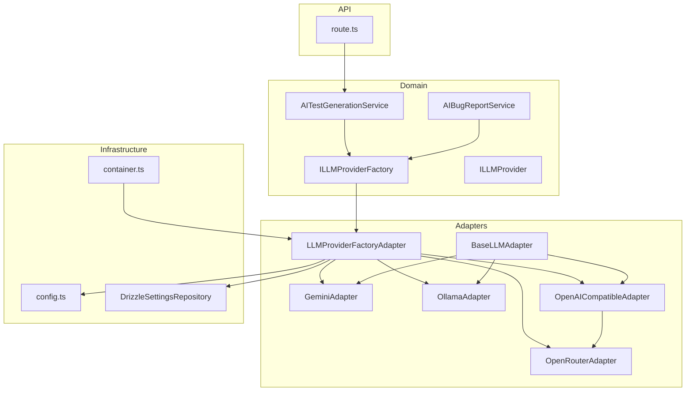
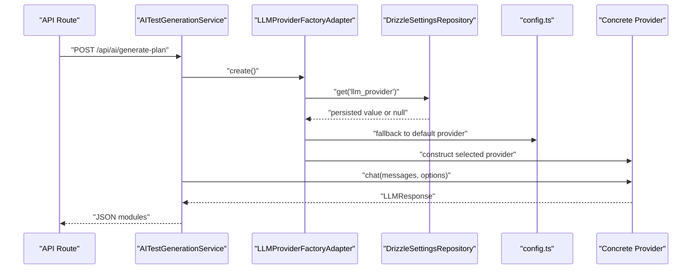
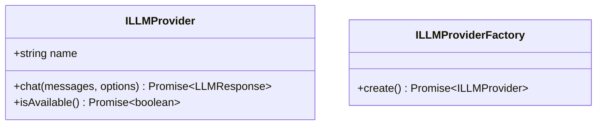
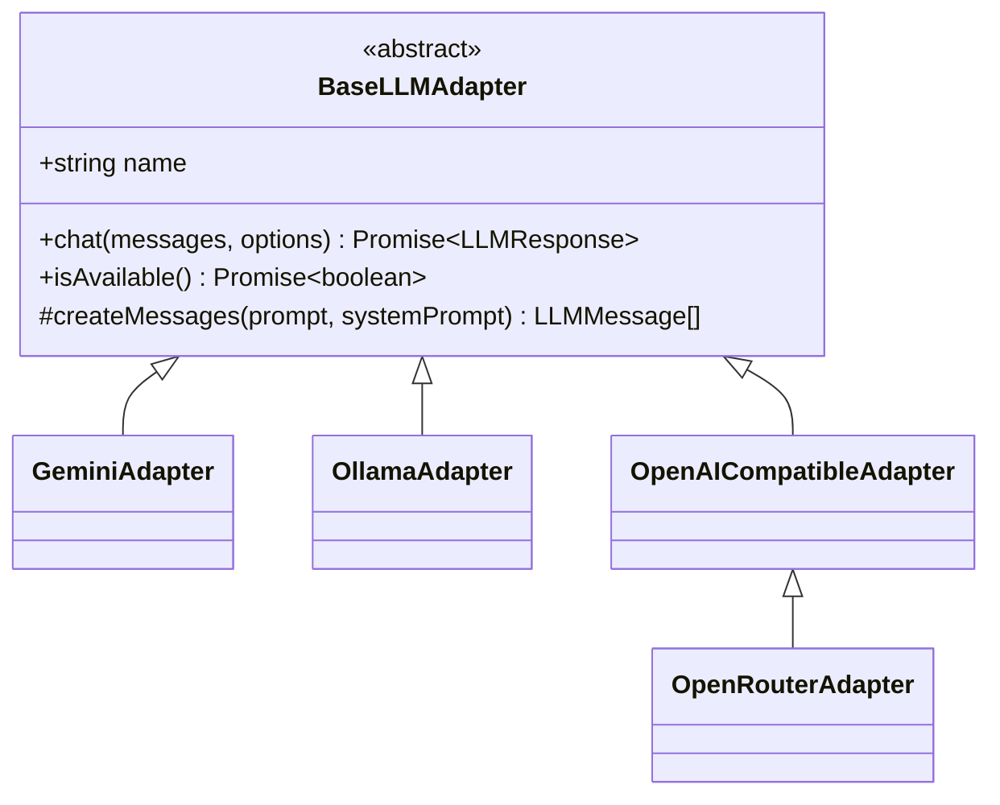
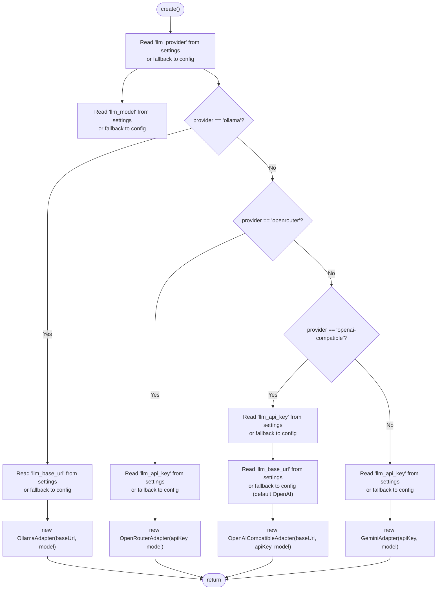
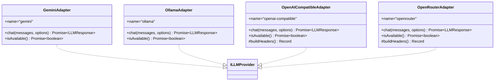
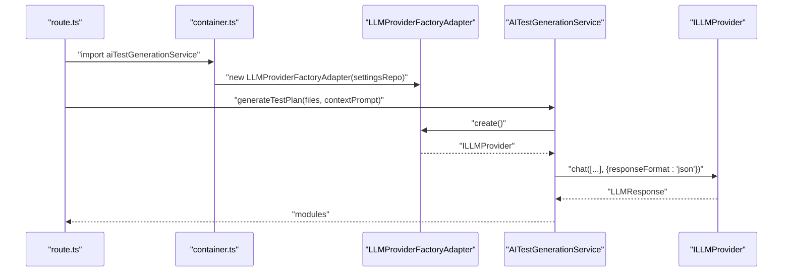
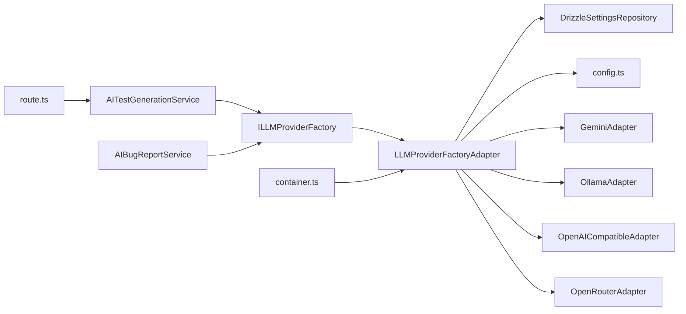

# Provider Factory Pattern

<cite>
**Referenced Files in This Document**
- [LLMProviderFactoryAdapter.ts](file://src/adapters/llm/LLMProviderFactoryAdapter.ts)
- [ILLMProviderFactory.ts](file://src/domain/ports/ILLMProviderFactory.ts)
- [ILLMProvider.ts](file://src/domain/ports/ILLMProvider.ts)
- [BaseLLMAdapter.ts](file://src/adapters/llm/BaseLLMAdapter.ts)
- [GeminiAdapter.ts](file://src/adapters/llm/GeminiAdapter.ts)
- [OllamaAdapter.ts](file://src/adapters/llm/OllamaAdapter.ts)
- [OpenAICompatibleAdapter.ts](file://src/adapters/llm/OpenAICompatibleAdapter.ts)
- [OpenRouterAdapter.ts](file://src/adapters/llm/OpenRouterAdapter.ts)
- [DrizzleSettingsRepository.ts](file://src/adapters/persistence/drizzle/DrizzleSettingsRepository.ts)
- [config.ts](file://src/infrastructure/config.ts)
- [container.ts](file://src/infrastructure/container.ts)
- [AITestGenerationService.ts](file://src/domain/services/AITestGenerationService.ts)
- [AIBugReportService.ts](file://src/domain/services/AIBugReportService.ts)
- [route.ts](file://app/api/ai/generate-plan/route.ts)
</cite>

## Table of Contents
1. [Introduction](#introduction)
2. [Project Structure](#project-structure)
3. [Core Components](#core-components)
4. [Architecture Overview](#architecture-overview)
5. [Detailed Component Analysis](#detailed-component-analysis)
6. [Dependency Analysis](#dependency-analysis)
7. [Performance Considerations](#performance-considerations)
8. [Troubleshooting Guide](#troubleshooting-guide)
9. [Conclusion](#conclusion)
10. [Appendices](#appendices)

## Introduction
This document explains the LLM provider factory pattern implementation used to dynamically select and instantiate LLM providers at runtime. It covers the factory’s responsibilities, how providers are registered and resolved, and how services consume the factory to remain agnostic of concrete implementations. It also documents provider switching, availability checks, and operational best practices.

## Project Structure
The factory lives in the adapters layer and is consumed by domain services through a clean port. Configuration is centralized and merged with persisted settings to decide which provider to create.

**Diagram sources**
- [LLMProviderFactoryAdapter.ts:15-42](file://src/adapters/llm/LLMProviderFactoryAdapter.ts#L15-L42)
- [ILLMProviderFactory.ts:8-10](file://src/domain/ports/ILLMProviderFactory.ts#L8-L10)
- [ILLMProvider.ts:12-31](file://src/domain/ports/ILLMProvider.ts#L12-L31)
- [BaseLLMAdapter.ts:3-25](file://src/adapters/llm/BaseLLMAdapter.ts#L3-L25)
- [GeminiAdapter.ts:5-66](file://src/adapters/llm/GeminiAdapter.ts#L5-L66)
- [OllamaAdapter.ts:4-68](file://src/adapters/llm/OllamaAdapter.ts#L4-L68)
- [OpenAICompatibleAdapter.ts:8-95](file://src/adapters/llm/OpenAICompatibleAdapter.ts#L8-L95)
- [OpenRouterAdapter.ts:10-27](file://src/adapters/llm/OpenRouterAdapter.ts#L10-L27)
- [DrizzleSettingsRepository.ts:6-27](file://src/adapters/persistence/drizzle/DrizzleSettingsRepository.ts#L6-L27)
- [config.ts:7-27](file://src/infrastructure/config.ts#L7-L27)
- [container.ts:33-91](file://src/infrastructure/container.ts#L33-L91)
- [AITestGenerationService.ts:25-80](file://src/domain/services/AITestGenerationService.ts#L25-L80)
- [AIBugReportService.ts:10-68](file://src/domain/services/AIBugReportService.ts#L10-L68)
- [route.ts:8-31](file://app/api/ai/generate-plan/route.ts#L8-L31)

**Section sources**
- [LLMProviderFactoryAdapter.ts:15-42](file://src/adapters/llm/LLMProviderFactoryAdapter.ts#L15-L42)
- [config.ts:7-27](file://src/infrastructure/config.ts#L7-L27)
- [DrizzleSettingsRepository.ts:6-27](file://src/adapters/persistence/drizzle/DrizzleSettingsRepository.ts#L6-L27)
- [container.ts:33-91](file://src/infrastructure/container.ts#L33-L91)
- [AITestGenerationService.ts:25-80](file://src/domain/services/AITestGenerationService.ts#L25-L80)
- [AIBugReportService.ts:10-68](file://src/domain/services/AIBugReportService.ts#L10-L68)
- [route.ts:8-31](file://app/api/ai/generate-plan/route.ts#L8-L31)

## Core Components
- ILLMProviderFactory: Defines a single contract to create an ILLMProvider asynchronously.
- ILLMProvider: Defines the provider interface for chat, availability checks, and metadata.
- BaseLLMAdapter: Abstract base implementing common helpers (e.g., message formatting) and declaring the contract.
- Concrete Providers: GeminiAdapter, OllamaAdapter, OpenAICompatibleAdapter, OpenRouterAdapter.
- LLMProviderFactoryAdapter: Resolves provider and model from persisted settings or defaults, then constructs the appropriate adapter.
- DrizzleSettingsRepository: Persists and retrieves provider configuration.
- config.ts: Centralized defaults for provider, model, base URL, and API key.
- container.ts: Registers the factory and exposes it to services and API routes.

**Section sources**
- [ILLMProviderFactory.ts:8-10](file://src/domain/ports/ILLMProviderFactory.ts#L8-L10)
- [ILLMProvider.ts:12-31](file://src/domain/ports/ILLMProvider.ts#L12-L31)
- [BaseLLMAdapter.ts:3-25](file://src/adapters/llm/BaseLLMAdapter.ts#L3-L25)
- [GeminiAdapter.ts:5-66](file://src/adapters/llm/GeminiAdapter.ts#L5-L66)
- [OllamaAdapter.ts:4-68](file://src/adapters/llm/OllamaAdapter.ts#L4-L68)
- [OpenAICompatibleAdapter.ts:8-95](file://src/adapters/llm/OpenAICompatibleAdapter.ts#L8-L95)
- [OpenRouterAdapter.ts:10-27](file://src/adapters/llm/OpenRouterAdapter.ts#L10-L27)
- [LLMProviderFactoryAdapter.ts:15-42](file://src/adapters/llm/LLMProviderFactoryAdapter.ts#L15-L42)
- [DrizzleSettingsRepository.ts:6-27](file://src/adapters/persistence/drizzle/DrizzleSettingsRepository.ts#L6-L27)
- [config.ts:7-27](file://src/infrastructure/config.ts#L7-L27)
- [container.ts:33-91](file://src/infrastructure/container.ts#L33-L91)

## Architecture Overview
The factory pattern decouples domain services from concrete provider implementations. At runtime, the factory reads persisted settings and falls back to centralized configuration to choose a provider. Services depend only on the factory port, ensuring low coupling and high testability.

**Diagram sources**
- [route.ts:8-31](file://app/api/ai/generate-plan/route.ts#L8-L31)
- [AITestGenerationService.ts:25-80](file://src/domain/services/AITestGenerationService.ts#L25-L80)
- [LLMProviderFactoryAdapter.ts:18-41](file://src/adapters/llm/LLMProviderFactoryAdapter.ts#L18-L41)
- [DrizzleSettingsRepository.ts:7-9](file://src/adapters/persistence/drizzle/DrizzleSettingsRepository.ts#L7-L9)
- [config.ts:13-18](file://src/infrastructure/config.ts#L13-L18)

## Detailed Component Analysis

### ILLMProviderFactory and ILLMProvider
- ILLMProviderFactory: Single method to create a provider instance asynchronously.
- ILLMProvider: Contract for provider identity, chat invocation with optional parameters, and availability checks.

**Diagram sources**
- [ILLMProvider.ts:12-31](file://src/domain/ports/ILLMProvider.ts#L12-L31)
- [ILLMProviderFactory.ts:8-10](file://src/domain/ports/ILLMProviderFactory.ts#L8-L10)

**Section sources**
- [ILLMProvider.ts:12-31](file://src/domain/ports/ILLMProvider.ts#L12-L31)
- [ILLMProviderFactory.ts:8-10](file://src/domain/ports/ILLMProviderFactory.ts#L8-L10)

### BaseLLMAdapter
- Provides a shared abstraction for all providers.
- Declares the contract and offers a helper to convert a single prompt into a messages array with optional system prompt.

**Diagram sources**
- [BaseLLMAdapter.ts:3-25](file://src/adapters/llm/BaseLLMAdapter.ts#L3-L25)
- [GeminiAdapter.ts:5-66](file://src/adapters/llm/GeminiAdapter.ts#L5-L66)
- [OllamaAdapter.ts:4-68](file://src/adapters/llm/OllamaAdapter.ts#L4-L68)
- [OpenAICompatibleAdapter.ts:8-95](file://src/adapters/llm/OpenAICompatibleAdapter.ts#L8-L95)
- [OpenRouterAdapter.ts:10-27](file://src/adapters/llm/OpenRouterAdapter.ts#L10-L27)

**Section sources**
- [BaseLLMAdapter.ts:3-25](file://src/adapters/llm/BaseLLMAdapter.ts#L3-L25)

### LLMProviderFactoryAdapter
- Reads persisted settings for provider, model, base URL, and API key.
- Falls back to centralized configuration when not set.
- Returns the appropriate adapter instance based on the resolved provider type.
- Supports ollama, openrouter, openai-compatible, and defaults to gemini.

**Diagram sources**
- [LLMProviderFactoryAdapter.ts:18-41](file://src/adapters/llm/LLMProviderFactoryAdapter.ts#L18-L41)
- [DrizzleSettingsRepository.ts:7-9](file://src/adapters/persistence/drizzle/DrizzleSettingsRepository.ts#L7-L9)
- [config.ts:13-18](file://src/infrastructure/config.ts#L13-L18)

**Section sources**
- [LLMProviderFactoryAdapter.ts:15-42](file://src/adapters/llm/LLMProviderFactoryAdapter.ts#L15-L42)
- [DrizzleSettingsRepository.ts:6-27](file://src/adapters/persistence/drizzle/DrizzleSettingsRepository.ts#L6-L27)
- [config.ts:13-18](file://src/infrastructure/config.ts#L13-L18)

### Concrete Providers
- GeminiAdapter: Uses a local SDK with explicit model and optional system instruction support.
- OllamaAdapter: Calls a local or remote Ollama endpoint with model selection and availability probing.
- OpenAICompatibleAdapter: Generic adapter for OpenAI-compatible APIs; supports JSON response format and token usage reporting.
- OpenRouterAdapter: Extends the compatible adapter to add required headers for OpenRouter.

**Diagram sources**
- [GeminiAdapter.ts:5-66](file://src/adapters/llm/GeminiAdapter.ts#L5-L66)
- [OllamaAdapter.ts:4-68](file://src/adapters/llm/OllamaAdapter.ts#L4-L68)
- [OpenAICompatibleAdapter.ts:8-95](file://src/adapters/llm/OpenAICompatibleAdapter.ts#L8-L95)
- [OpenRouterAdapter.ts:10-27](file://src/adapters/llm/OpenRouterAdapter.ts#L10-L27)
- [ILLMProvider.ts:12-31](file://src/domain/ports/ILLMProvider.ts#L12-L31)

**Section sources**
- [GeminiAdapter.ts:5-66](file://src/adapters/llm/GeminiAdapter.ts#L5-L66)
- [OllamaAdapter.ts:4-68](file://src/adapters/llm/OllamaAdapter.ts#L4-L68)
- [OpenAICompatibleAdapter.ts:8-95](file://src/adapters/llm/OpenAICompatibleAdapter.ts#L8-L95)
- [OpenRouterAdapter.ts:10-27](file://src/adapters/llm/OpenRouterAdapter.ts#L10-L27)

### Integration with Services and API
- Services depend on ILLMProviderFactory and call create() to obtain a provider instance.
- The IoC container wires the factory and exposes it to services and API routes.
- An API route invokes a service that generates a test plan using the selected provider.

**Diagram sources**
- [route.ts:8-31](file://app/api/ai/generate-plan/route.ts#L8-L31)
- [container.ts:50-54](file://src/infrastructure/container.ts#L50-L54)
- [AITestGenerationService.ts:25-80](file://src/domain/services/AITestGenerationService.ts#L25-L80)
- [LLMProviderFactoryAdapter.ts:18-41](file://src/adapters/llm/LLMProviderFactoryAdapter.ts#L18-L41)

**Section sources**
- [route.ts:8-31](file://app/api/ai/generate-plan/route.ts#L8-L31)
- [container.ts:50-54](file://src/infrastructure/container.ts#L50-L54)
- [AITestGenerationService.ts:25-80](file://src/domain/services/AITestGenerationService.ts#L25-L80)

## Dependency Analysis
- Factory depends on:
  - Settings repository for persisted overrides.
  - Centralized config for defaults.
  - Concrete adapters for instantiation.
- Services depend only on the factory port, preserving domain purity.
- API routes depend on services and indirectly on the factory via the container.

**Diagram sources**
- [LLMProviderFactoryAdapter.ts:15-42](file://src/adapters/llm/LLMProviderFactoryAdapter.ts#L15-L42)
- [DrizzleSettingsRepository.ts:6-27](file://src/adapters/persistence/drizzle/DrizzleSettingsRepository.ts#L6-L27)
- [config.ts:7-27](file://src/infrastructure/config.ts#L7-L27)
- [AITestGenerationService.ts:25-80](file://src/domain/services/AITestGenerationService.ts#L25-L80)
- [AIBugReportService.ts:10-68](file://src/domain/services/AIBugReportService.ts#L10-L68)
- [route.ts:8-31](file://app/api/ai/generate-plan/route.ts#L8-L31)
- [container.ts:33-91](file://src/infrastructure/container.ts#L33-L91)

**Section sources**
- [LLMProviderFactoryAdapter.ts:15-42](file://src/adapters/llm/LLMProviderFactoryAdapter.ts#L15-L42)
- [DrizzleSettingsRepository.ts:6-27](file://src/adapters/persistence/drizzle/DrizzleSettingsRepository.ts#L6-L27)
- [config.ts:7-27](file://src/infrastructure/config.ts#L7-L27)
- [AITestGenerationService.ts:25-80](file://src/domain/services/AITestGenerationService.ts#L25-L80)
- [AIBugReportService.ts:10-68](file://src/domain/services/AIBugReportService.ts#L10-L68)
- [route.ts:8-31](file://app/api/ai/generate-plan/route.ts#L8-L31)
- [container.ts:33-91](file://src/infrastructure/container.ts#L33-L91)

## Performance Considerations
- Minimize repeated factory invocations per request by caching the provider instance within a request-scoped context if needed.
- Prefer lightweight availability checks (e.g., model tags or minimal endpoints) during isAvailable() to avoid heavy network calls.
- Tune provider options (temperature, maxTokens) per use case to balance quality and latency.
- Consider lazy initialization of SDK clients inside adapters to reduce cold-start overhead.

## Troubleshooting Guide
Common issues and resolutions:
- Provider not initialized
  - Symptom: Provider throws an error indicating missing credentials.
  - Cause: Missing API key or base URL in settings or environment.
  - Resolution: Set llm_api_key and llm_base_url via settings or environment; confirm defaults in config.ts.

- Model not available locally
  - Symptom: isAvailable() returns false for Ollama.
  - Cause: Model not pulled or base URL incorrect.
  - Resolution: Pull the model locally or adjust llm_model and llm_base_url; verify endpoint accessibility.

- JSON parsing failure
  - Symptom: Service fails to parse provider JSON response.
  - Cause: Provider returned non-JSON or malformed content.
  - Resolution: Adjust responseFormat to text or refine prompts; ensure provider supports requested format.

- Runtime provider switching
  - Symptom: Switching provider mid-session yields unexpected behavior.
  - Cause: Cached provider instance or inconsistent settings.
  - Resolution: Ensure settings are updated persistently; avoid reusing stale provider instances across requests.

- API errors
  - Symptom: HTTP errors from provider endpoints.
  - Cause: Incorrect base URL, missing Authorization header, or rate limits.
  - Resolution: Verify headers and base URL; check provider quotas and retry policies.

**Section sources**
- [GeminiAdapter.ts:22-60](file://src/adapters/llm/GeminiAdapter.ts#L22-L60)
- [OllamaAdapter.ts:18-53](file://src/adapters/llm/OllamaAdapter.ts#L18-L53)
- [OpenAICompatibleAdapter.ts:34-80](file://src/adapters/llm/OpenAICompatibleAdapter.ts#L34-L80)
- [OpenRouterAdapter.ts:19-26](file://src/adapters/llm/OpenRouterAdapter.ts#L19-L26)
- [DrizzleSettingsRepository.ts:7-16](file://src/adapters/persistence/drizzle/DrizzleSettingsRepository.ts#L7-L16)
- [config.ts:13-18](file://src/infrastructure/config.ts#L13-L18)
- [AITestGenerationService.ts:66-79](file://src/domain/services/AITestGenerationService.ts#L66-L79)

## Conclusion
The factory pattern cleanly separates provider selection from service logic, enabling easy swapping and extension. By centralizing configuration and persisting user preferences, the system remains flexible and operable across environments. Following the best practices outlined here ensures reliable, maintainable, and performant LLM integration.

## Appendices

### Practical Examples

- Factory configuration
  - Persist provider settings via settings repository keys: llm_provider, llm_model, llm_base_url, llm_api_key.
  - Defaults are provided by config.ts when settings are absent.

- Provider instantiation
  - Obtain a provider in a service by calling the factory’s create() method.
  - Use the returned provider to send chat requests with desired options.

- Lifecycle management
  - Initialize the factory once per process (e.g., via the IoC container).
  - Reuse the factory instance across requests; avoid constructing multiple factories unnecessarily.

- Adding a new provider
  - Implement a new adapter extending BaseLLMAdapter or OpenAICompatibleAdapter.
  - Register the provider option in the factory switch logic.
  - Add any required environment variables or settings keys.

- Provider switching and fallback
  - Update llm_provider setting to switch providers at runtime.
  - Ensure isAvailable() returns true for the chosen provider before use.

- Load balancing and redundancy
  - Not implemented in current code; consider sharding requests across multiple providers or rotating base URLs for compatible providers.

[No sources needed since this section provides general guidance]