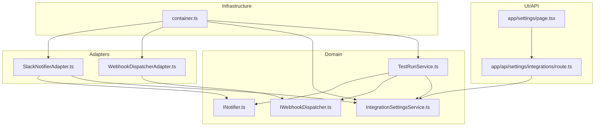
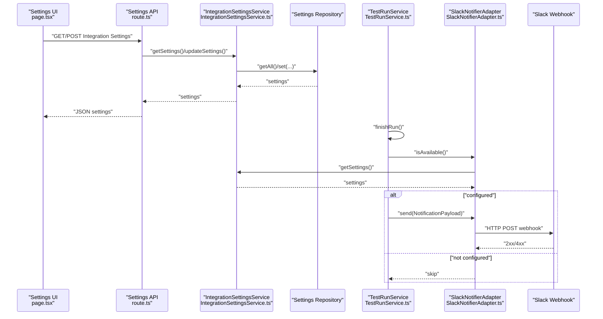
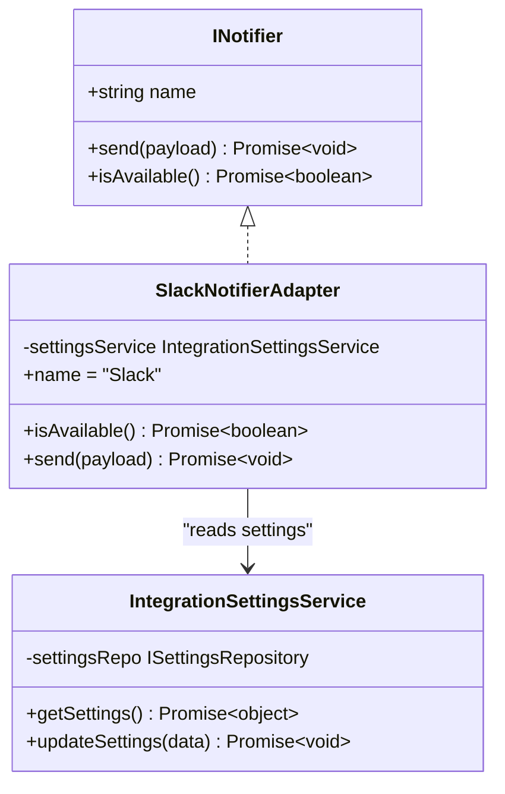
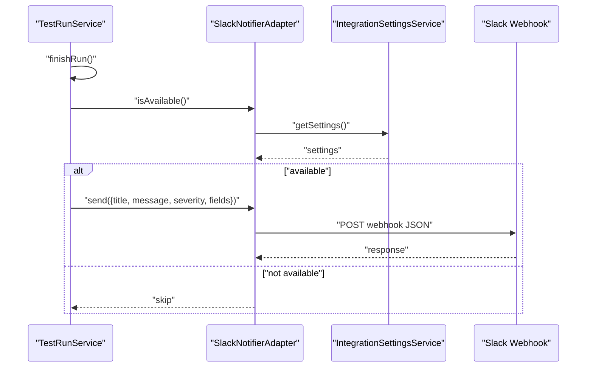
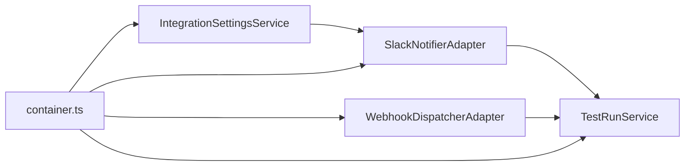

# Notification Systems

<cite>
**Referenced Files in This Document**
- [INotifier.ts](file://src/domain/ports/INotifier.ts)
- [SlackNotifierAdapter.ts](file://src/adapters/notifier/SlackNotifierAdapter.ts)
- [IntegrationSettingsService.ts](file://src/domain/services/IntegrationSettingsService.ts)
- [TestRunService.ts](file://src/domain/services/TestRunService.ts)
- [container.ts](file://src/infrastructure/container.ts)
- [route.ts](file://app/api/settings/integrations/route.ts)
- [page.tsx](file://app/settings/page.tsx)
- [IWebhookDispatcher.ts](file://src/domain/ports/IWebhookDispatcher.ts)
- [WebhookDispatcherAdapter.ts](file://src/adapters/webhook/WebhookDispatcherAdapter.ts)
</cite>

## Table of Contents
1. [Introduction](#introduction)
2. [Project Structure](#project-structure)
3. [Core Components](#core-components)
4. [Architecture Overview](#architecture-overview)
5. [Detailed Component Analysis](#detailed-component-analysis)
6. [Dependency Analysis](#dependency-analysis)
7. [Performance Considerations](#performance-considerations)
8. [Troubleshooting Guide](#troubleshooting-guide)
9. [Conclusion](#conclusion)

## Introduction
This document explains the notification system integration with a focus on the Slack notifier. It covers the INotifier interface, the SlackNotifierAdapter implementation, configuration of Slack webhooks, message formatting, and notification triggers. It also documents the integration settings service, the container wiring, and the frontend settings page. Guidance is included for webhook setup, permissions, customization options, troubleshooting, rate limiting considerations, and best practices.

## Project Structure
The notification system spans domain abstractions, an adapter implementation, infrastructure wiring, and a simple frontend settings UI. The key areas are:
- Domain ports and services define the contract and orchestration
- An adapter implements Slack notifications via Incoming Webhooks
- The IoC container wires the adapter into services
- API routes and a settings page expose configuration

**Diagram sources**
- [INotifier.ts:1-26](file://src/domain/ports/INotifier.ts#L1-L26)
- [IWebhookDispatcher.ts:1-20](file://src/domain/ports/IWebhookDispatcher.ts#L1-L20)
- [IntegrationSettingsService.ts:1-37](file://src/domain/services/IntegrationSettingsService.ts#L1-L37)
- [TestRunService.ts:1-125](file://src/domain/services/TestRunService.ts#L1-L125)
- [SlackNotifierAdapter.ts:1-56](file://src/adapters/notifier/SlackNotifierAdapter.ts#L1-L56)
- [WebhookDispatcherAdapter.ts:1-38](file://src/adapters/webhook/WebhookDispatcherAdapter.ts#L1-L38)
- [container.ts:1-126](file://src/infrastructure/container.ts#L1-L126)
- [route.ts:1-19](file://app/api/settings/integrations/route.ts#L1-L19)
- [page.tsx:290-335](file://app/settings/page.tsx#L290-L335)

**Section sources**
- [INotifier.ts:1-26](file://src/domain/ports/INotifier.ts#L1-L26)
- [SlackNotifierAdapter.ts:1-56](file://src/adapters/notifier/SlackNotifierAdapter.ts#L1-L56)
- [IntegrationSettingsService.ts:1-37](file://src/domain/services/IntegrationSettingsService.ts#L1-L37)
- [TestRunService.ts:1-125](file://src/domain/services/TestRunService.ts#L1-L125)
- [container.ts:1-126](file://src/infrastructure/container.ts#L1-L126)
- [route.ts:1-19](file://app/api/settings/integrations/route.ts#L1-L19)
- [page.tsx:290-335](file://app/settings/page.tsx#L290-L335)

## Core Components
- INotifier defines the notification contract with a human-readable channel name, a send method, and an availability check.
- SlackNotifierAdapter implements INotifier using Slack Incoming Webhooks, reads configuration via IntegrationSettingsService, and posts formatted messages.
- IntegrationSettingsService manages persisted integration settings including the Slack webhook URL.
- TestRunService orchestrates test run completion, computes severity, and triggers Slack notifications when configured.
- WebhookDispatcherAdapter and IWebhookDispatcher enable outbound HTTP webhooks for events like testrun.completed.

**Section sources**
- [INotifier.ts:9-26](file://src/domain/ports/INotifier.ts#L9-L26)
- [SlackNotifierAdapter.ts:4-55](file://src/adapters/notifier/SlackNotifierAdapter.ts#L4-L55)
- [IntegrationSettingsService.ts:8-36](file://src/domain/services/IntegrationSettingsService.ts#L8-L36)
- [TestRunService.ts:86-124](file://src/domain/services/TestRunService.ts#L86-L124)
- [IWebhookDispatcher.ts:1-20](file://src/domain/ports/IWebhookDispatcher.ts#L1-L20)
- [WebhookDispatcherAdapter.ts:1-38](file://src/adapters/webhook/WebhookDispatcherAdapter.ts#L1-L38)

## Architecture Overview
The system follows clean architecture:
- Domain defines ports and services
- Adapters implement ports and depend on infrastructure (HTTP fetch)
- Infrastructure container wires dependencies
- API routes and UI pages manage settings persistence and presentation

**Diagram sources**
- [page.tsx:290-335](file://app/settings/page.tsx#L290-L335)
- [route.ts:8-18](file://app/api/settings/integrations/route.ts#L8-L18)
- [IntegrationSettingsService.ts:11-35](file://src/domain/services/IntegrationSettingsService.ts#L11-L35)
- [TestRunService.ts:86-124](file://src/domain/services/TestRunService.ts#L86-L124)
- [SlackNotifierAdapter.ts:9-54](file://src/adapters/notifier/SlackNotifierAdapter.ts#L9-L54)

## Detailed Component Analysis

### INotifier Interface
Defines the notification contract:
- name: human-readable channel identifier
- send(payload): posts a notification
- isAvailable(): checks configuration readiness

NotificationPayload supports:
- title and message
- severity: info | warning | error | success
- optional fields array for key-value pairs
- optional metadata

**Section sources**
- [INotifier.ts:9-26](file://src/domain/ports/INotifier.ts#L9-L26)

### SlackNotifierAdapter Implementation
Responsibilities:
- Reads integration settings to determine availability
- Posts a structured Slack message via Incoming Webhooks
- Maps severity to a color and attaches fields

Behavior highlights:
- Availability: requires a non-empty slack_webhook setting
- Message format: includes a bold title, colored attachment, optional fields, and a footer
- Error handling: logs HTTP errors and exceptions

**Diagram sources**
- [INotifier.ts:17-26](file://src/domain/ports/INotifier.ts#L17-L26)
- [SlackNotifierAdapter.ts:4-12](file://src/adapters/notifier/SlackNotifierAdapter.ts#L4-L12)
- [IntegrationSettingsService.ts:8-17](file://src/domain/services/IntegrationSettingsService.ts#L8-L17)

**Section sources**
- [SlackNotifierAdapter.ts:4-55](file://src/adapters/notifier/SlackNotifierAdapter.ts#L4-L55)

### IntegrationSettingsService
Manages persisted integration settings:
- Retrieves a predefined set of keys including slack_webhook
- Updates settings for providers and Slack webhook URL

**Section sources**
- [IntegrationSettingsService.ts:11-35](file://src/domain/services/IntegrationSettingsService.ts#L11-L35)

### TestRunService Notification Trigger
Triggers:
- On test run completion, computes severity based on results
- Sends a Slack notification if the notifier is available
- Dispatches a testrun.completed webhook

Message composition:
- Title includes the run name
- Severity derived from results
- Fields include totals and counts

**Diagram sources**
- [TestRunService.ts:86-124](file://src/domain/services/TestRunService.ts#L86-L124)
- [SlackNotifierAdapter.ts:9-54](file://src/adapters/notifier/SlackNotifierAdapter.ts#L9-L54)
- [IntegrationSettingsService.ts:11-16](file://src/domain/services/IntegrationSettingsService.ts#L11-L16)

**Section sources**
- [TestRunService.ts:86-124](file://src/domain/services/TestRunService.ts#L86-L124)

### WebhookDispatcherAdapter and IWebhookDispatcher
- IWebhookDispatcher abstracts outbound HTTP webhooks
- WebhookDispatcherAdapter performs HTTP POST to registered URLs with standardized headers and payload
- Used to emit testrun.completed and other events

**Section sources**
- [IWebhookDispatcher.ts:1-20](file://src/domain/ports/IWebhookDispatcher.ts#L1-L20)
- [WebhookDispatcherAdapter.ts:11-37](file://src/adapters/webhook/WebhookDispatcherAdapter.ts#L11-L37)

### Settings Management (API and UI)
- API route exposes GET/POST endpoints for integration settings
- Frontend settings page renders a field for the Slack Incoming Webhook URL and a help note

**Section sources**
- [route.ts:8-18](file://app/api/settings/integrations/route.ts#L8-L18)
- [page.tsx:290-335](file://app/settings/page.tsx#L290-L335)

## Dependency Analysis
The IoC container wires the system:
- SlackNotifierAdapter depends on IntegrationSettingsService
- TestRunService depends on INotifier and IWebhookDispatcher
- WebhookDispatcherAdapter is wired separately

**Diagram sources**
- [container.ts:46-56](file://src/infrastructure/container.ts#L46-L56)
- [SlackNotifierAdapter.ts:7-7](file://src/adapters/notifier/SlackNotifierAdapter.ts#L7-L7)
- [WebhookDispatcherAdapter.ts:11-12](file://src/adapters/webhook/WebhookDispatcherAdapter.ts#L11-L12)
- [IntegrationSettingsService.ts:8-9](file://src/domain/services/IntegrationSettingsService.ts#L8-L9)
- [TestRunService.ts:14-21](file://src/domain/services/TestRunService.ts#L14-L21)

**Section sources**
- [container.ts:46-56](file://src/infrastructure/container.ts#L46-L56)

## Performance Considerations
- Network latency: Slack webhook POSTs are synchronous in the current implementation; consider offloading to an async queue in production for high volume.
- Rate limits: Slack Incoming Webhooks can be rate-limited; implement retries with exponential backoff and deduplication of identical messages.
- Payload size: Keep fields concise; avoid large metadata payloads.
- Concurrency: Multiple test runs finishing concurrently will trigger concurrent webhook calls; monitor upstream limits.

## Troubleshooting Guide
Common issues and resolutions:
- Slack webhook not configured
  - Symptom: No notification posted; logs indicate missing webhook.
  - Action: Enter a valid Incoming Webhook URL in Settings.
  - Section sources
    - [SlackNotifierAdapter.ts:18-21](file://src/adapters/notifier/SlackNotifierAdapter.ts#L18-L21)
    - [page.tsx:294-302](file://app/settings/page.tsx#L294-L302)

- HTTP error from Slack
  - Symptom: Logs show non-OK response status.
  - Action: Verify webhook URL, workspace permissions, and channel accessibility.
  - Section sources
    - [SlackNotifierAdapter.ts:48-50](file://src/adapters/notifier/SlackNotifierAdapter.ts#L48-L50)

- Exceptions during POST
  - Symptom: Errors logged for network or fetch failures.
  - Action: Check network connectivity, proxy settings, and firewall rules.
  - Section sources
    - [SlackNotifierAdapter.ts:51-53](file://src/adapters/notifier/SlackNotifierAdapter.ts#L51-L53)

- Notification not appearing in channel
  - Verify the webhook is configured for the intended channel and the app has been added to the channel.
  - Section sources
    - [page.tsx:294-302](file://app/settings/page.tsx#L294-L302)

- Duplicate or excessive notifications
  - Implement idempotency tokens and throttle by run identifiers.
  - Section sources
    - [TestRunService.ts:101-113](file://src/domain/services/TestRunService.ts#L101-L113)

## Conclusion
The Slack notification integration is implemented via a clean INotifier abstraction and a SlackNotifierAdapter that posts to Slack Incoming Webhooks. Configuration is centralized in IntegrationSettingsService and exposed through a simple API/UI. TestRunService triggers notifications on completion, computing severity from results and attaching summary fields. For production, consider asynchronous delivery, retry/backoff, and rate-limit awareness.