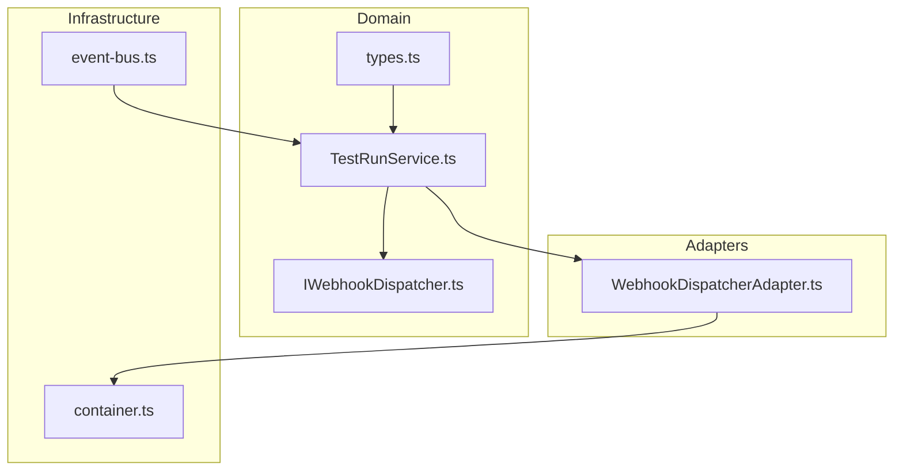
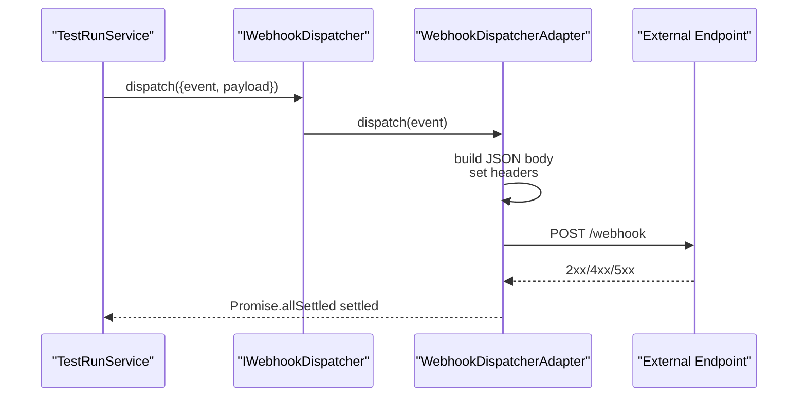
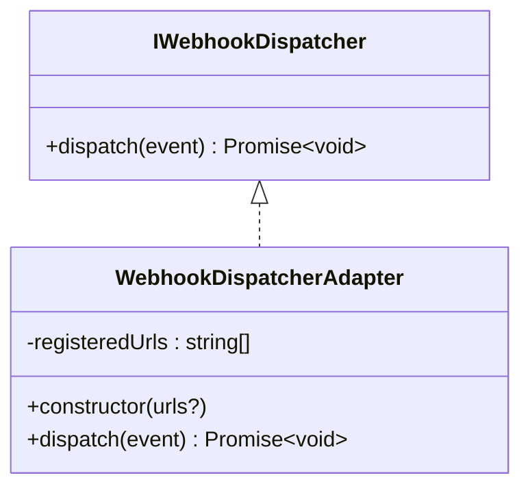
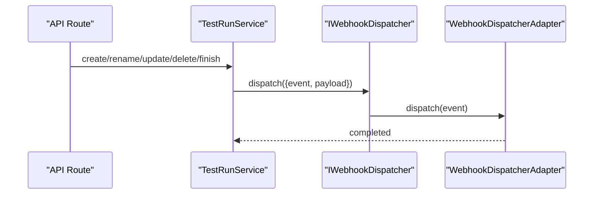
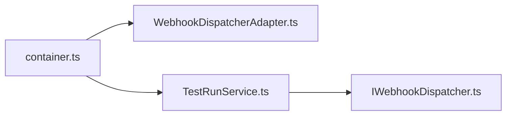
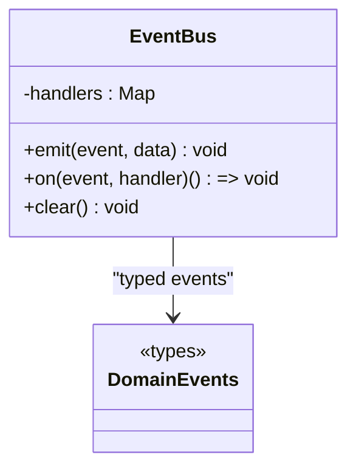
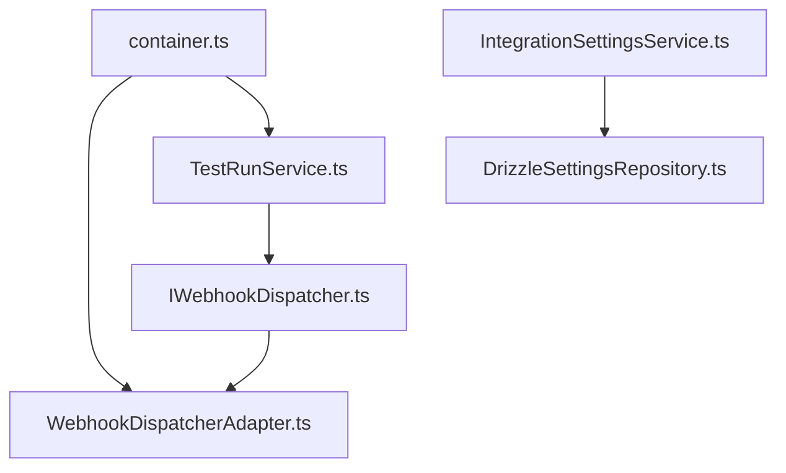

# Webhook Integration

<cite>
**Referenced Files in This Document**
- [IWebhookDispatcher.ts](file://src/domain/ports/IWebhookDispatcher.ts)
- [WebhookDispatcherAdapter.ts](file://src/adapters/webhook/WebhookDispatcherAdapter.ts)
- [TestRunService.ts](file://src/domain/services/TestRunService.ts)
- [container.ts](file://src/infrastructure/container.ts)
- [event-bus.ts](file://src/infrastructure/event-bus.ts)
- [types.ts](file://src/domain/events/types.ts)
- [IntegrationSettingsService.ts](file://src/domain/services/IntegrationSettingsService.ts)
- [DrizzleSettingsRepository.ts](file://src/adapters/persistence/drizzle/DrizzleSettingsRepository.ts)
- [route.ts](file://app/api/settings/integrations/route.ts)
</cite>

## Table of Contents
1. [Introduction](#introduction)
2. [Project Structure](#project-structure)
3. [Core Components](#core-components)
4. [Architecture Overview](#architecture-overview)
5. [Detailed Component Analysis](#detailed-component-analysis)
6. [Dependency Analysis](#dependency-analysis)
7. [Performance Considerations](#performance-considerations)
8. [Troubleshooting Guide](#troubleshooting-guide)
9. [Conclusion](#conclusion)
10. [Appendices](#appendices)

## Introduction
This document describes the webhook integration system in Test Plan Manager. It explains how event-driven notifications are produced and dispatched to external systems, focusing on the IWebhookDispatcher interface and the WebhookDispatcherAdapter implementation. It also documents supported event types, payload schemas, current delivery behavior, and operational guidance for consumers, testing, and troubleshooting.

## Project Structure
The webhook integration spans three layers:
- Domain: Defines the event contract and the IWebhookDispatcher port.
- Adapters: Implements HTTP-based webhook dispatch.
- Infrastructure: Provides dependency injection and event bus facilities.

**Diagram sources**
- [IWebhookDispatcher.ts:1-21](file://src/domain/ports/IWebhookDispatcher.ts#L1-L21)
- [WebhookDispatcherAdapter.ts:1-38](file://src/adapters/webhook/WebhookDispatcherAdapter.ts#L1-L38)
- [TestRunService.ts:1-125](file://src/domain/services/TestRunService.ts#L1-L125)
- [container.ts:1-126](file://src/infrastructure/container.ts#L1-L126)
- [event-bus.ts:1-52](file://src/infrastructure/event-bus.ts#L1-L52)
- [types.ts:1-62](file://src/domain/events/types.ts#L1-L62)

**Section sources**
- [IWebhookDispatcher.ts:1-21](file://src/domain/ports/IWebhookDispatcher.ts#L1-L21)
- [WebhookDispatcherAdapter.ts:1-38](file://src/adapters/webhook/WebhookDispatcherAdapter.ts#L1-L38)
- [TestRunService.ts:1-125](file://src/domain/services/TestRunService.ts#L1-L125)
- [container.ts:1-126](file://src/infrastructure/container.ts#L1-L126)
- [event-bus.ts:1-52](file://src/infrastructure/event-bus.ts#L1-L52)
- [types.ts:1-62](file://src/domain/events/types.ts#L1-L62)

## Core Components
- IWebhookDispatcher: Defines the contract for dispatching webhook events without binding to a specific transport.
- WebhookDispatcherAdapter: HTTP-based implementation that posts JSON payloads to configured endpoints.
- TestRunService: Produces domain events and triggers webhook dispatch for lifecycle actions.
- Dependency Injection: Registers the adapter and wires it into services.

Key responsibilities:
- IWebhookDispatcher: dispatch(event)
- WebhookDispatcherAdapter: dispatch(event) via HTTP POST
- TestRunService: emits testrun.created, testrun.updated, testrun.completed, testrun.deleted, testresult.updated

**Section sources**
- [IWebhookDispatcher.ts:13-21](file://src/domain/ports/IWebhookDispatcher.ts#L13-L21)
- [WebhookDispatcherAdapter.ts:11-38](file://src/adapters/webhook/WebhookDispatcherAdapter.ts#L11-L38)
- [TestRunService.ts:45-84](file://src/domain/services/TestRunService.ts#L45-L84)
- [TestRunService.ts:115-122](file://src/domain/services/TestRunService.ts#L115-L122)

## Architecture Overview
The system follows a publish-subscribe-like pattern:
- Domain services produce events and call IWebhookDispatcher.dispatch.
- The adapter performs asynchronous HTTP delivery to all registered endpoints.
- The event bus supports decoupled domain event emission elsewhere in the system.

**Diagram sources**
- [TestRunService.ts:45-84](file://src/domain/services/TestRunService.ts#L45-L84)
- [TestRunService.ts:115-122](file://src/domain/services/TestRunService.ts#L115-L122)
- [IWebhookDispatcher.ts:18-20](file://src/domain/ports/IWebhookDispatcher.ts#L18-L20)
- [WebhookDispatcherAdapter.ts:14-36](file://src/adapters/webhook/WebhookDispatcherAdapter.ts#L14-L36)

## Detailed Component Analysis

### IWebhookDispatcher Interface
- Purpose: Abstracts transport details from the domain.
- Contract: dispatch(event) -> Promise<void>
- Event shape: event (string union), payload (Record<string, unknown>)

Supported event names:
- testrun.created
- testrun.updated
- testrun.completed
- testrun.deleted
- testresult.updated

**Section sources**
- [IWebhookDispatcher.ts:1-11](file://src/domain/ports/IWebhookDispatcher.ts#L1-L11)
- [IWebhookDispatcher.ts:18-20](file://src/domain/ports/IWebhookDispatcher.ts#L18-L20)

### WebhookDispatcherAdapter Implementation
- Transport: HTTP POST using built-in fetch.
- Headers:
  - Content-Type: application/json
  - X-QA-Hub-Event: event name
  - User-Agent: QA-Hub-Webhook/1.0
- Body: JSON with event, timestamp, and data fields.
- Behavior:
  - Skips dispatch if no URLs are configured.
  - Sends to all registered URLs concurrently.
  - Errors are caught and logged; dispatch does not fail the overall operation.

**Diagram sources**
- [IWebhookDispatcher.ts:18-20](file://src/domain/ports/IWebhookDispatcher.ts#L18-L20)
- [WebhookDispatcherAdapter.ts:11-38](file://src/adapters/webhook/WebhookDispatcherAdapter.ts#L11-L38)

**Section sources**
- [WebhookDispatcherAdapter.ts:11-38](file://src/adapters/webhook/WebhookDispatcherAdapter.ts#L11-L38)

### Event Production and Dispatch
- TestRunService produces five webhook events during lifecycle operations:
  - testrun.created: after creating a run
  - testrun.updated: after renaming a run
  - testrun.completed: after finishing a run with aggregated stats
  - testrun.deleted: after deleting a run
  - testresult.updated: after updating a test result

Payloads are derived from domain entities and computed statistics.

**Diagram sources**
- [TestRunService.ts:33-51](file://src/domain/services/TestRunService.ts#L33-L51)
- [TestRunService.ts:53-63](file://src/domain/services/TestRunService.ts#L53-L63)
- [TestRunService.ts:65-72](file://src/domain/services/TestRunService.ts#L65-L72)
- [TestRunService.ts:74-84](file://src/domain/services/TestRunService.ts#L74-L84)
- [TestRunService.ts:86-123](file://src/domain/services/TestRunService.ts#L86-L123)
- [IWebhookDispatcher.ts:18-20](file://src/domain/ports/IWebhookDispatcher.ts#L18-L20)
- [WebhookDispatcherAdapter.ts:14-36](file://src/adapters/webhook/WebhookDispatcherAdapter.ts#L14-L36)

**Section sources**
- [TestRunService.ts:33-84](file://src/domain/services/TestRunService.ts#L33-L84)
- [TestRunService.ts:86-123](file://src/domain/services/TestRunService.ts#L86-L123)

### Dependency Injection and Wiring
- The IoC container instantiates WebhookDispatcherAdapter and injects it into TestRunService.
- Current constructor accepts an optional array of URLs; in a full system, URLs would be loaded from persistent settings.

**Diagram sources**
- [container.ts:49-56](file://src/infrastructure/container.ts#L49-L56)
- [container.ts:113-120](file://src/infrastructure/container.ts#L113-L120)
- [WebhookDispatcherAdapter.ts:11-12](file://src/adapters/webhook/WebhookDispatcherAdapter.ts#L11-L12)
- [TestRunService.ts:14-21](file://src/domain/services/TestRunService.ts#L14-L21)

**Section sources**
- [container.ts:49-56](file://src/infrastructure/container.ts#L49-L56)
- [container.ts:113-120](file://src/infrastructure/container.ts#L113-L120)

### Event Bus and Domain Events
- The event bus enables decoupled event emission across the system.
- While the webhook adapter currently uses a simple fetch-based approach, the event bus supports typed event handling elsewhere in the domain.

**Diagram sources**
- [event-bus.ts:9-52](file://src/infrastructure/event-bus.ts#L9-L52)
- [types.ts:8-62](file://src/domain/events/types.ts#L8-L62)

**Section sources**
- [event-bus.ts:1-52](file://src/infrastructure/event-bus.ts#L1-L52)
- [types.ts:1-62](file://src/domain/events/types.ts#L1-L62)

## Dependency Analysis
- TestRunService depends on IWebhookDispatcher to notify external systems.
- IWebhookDispatcher is implemented by WebhookDispatcherAdapter.
- The container wires the adapter into the service.
- IntegrationSettingsService and DrizzleSettingsRepository manage persisted settings for integrations; while not directly wiring webhook URLs, they illustrate the persistence model for integration configuration.

**Diagram sources**
- [TestRunService.ts:14-21](file://src/domain/services/TestRunService.ts#L14-L21)
- [IWebhookDispatcher.ts:18-20](file://src/domain/ports/IWebhookDispatcher.ts#L18-L20)
- [WebhookDispatcherAdapter.ts:11-12](file://src/adapters/webhook/WebhookDispatcherAdapter.ts#L11-L12)
- [container.ts:49-56](file://src/infrastructure/container.ts#L49-L56)
- [IntegrationSettingsService.ts:8-37](file://src/domain/services/IntegrationSettingsService.ts#L8-L37)
- [DrizzleSettingsRepository.ts:6-28](file://src/adapters/persistence/drizzle/DrizzleSettingsRepository.ts#L6-L28)

**Section sources**
- [TestRunService.ts:14-21](file://src/domain/services/TestRunService.ts#L14-L21)
- [container.ts:49-56](file://src/infrastructure/container.ts#L49-L56)
- [IntegrationSettingsService.ts:8-37](file://src/domain/services/IntegrationSettingsService.ts#L8-L37)
- [DrizzleSettingsRepository.ts:6-28](file://src/adapters/persistence/drizzle/DrizzleSettingsRepository.ts#L6-L28)

## Performance Considerations
- Concurrency: Webhooks are sent concurrently to all endpoints; failures in one endpoint do not block others.
- Asynchronous dispatch: The adapter uses Promise.allSettled to avoid blocking the domain operation.
- Network overhead: Each dispatch performs an HTTP request per endpoint; batching or queuing could reduce overhead in high-volume scenarios.
- Scalability: For many subscribers, consider moving to a queue-backed delivery mechanism.

[No sources needed since this section provides general guidance]

## Troubleshooting Guide
Common delivery issues and remedies:
- No outbound traffic observed:
  - Verify that registered URLs are provided to the adapter at construction time.
  - Confirm that the service methods emitting events are invoked (e.g., create, rename, finish, update result, delete).
- HTTP errors:
  - Inspect logs for "[WebhookDispatcherAdapter] Failed to POST to ..." messages indicating endpoint failures.
  - Check endpoint availability, timeouts, and response codes.
- Payload mismatch:
  - Review the event payload shapes emitted by TestRunService for each event type.
- Idempotency:
  - Consumers should treat events as potentially duplicated; implement idempotent handling.

Operational tips:
- Monitor endpoint health and response latency.
- Implement retries with exponential backoff at the consumer side.
- Log incoming webhook deliveries for auditability.

**Section sources**
- [WebhookDispatcherAdapter.ts:14-36](file://src/adapters/webhook/WebhookDispatcherAdapter.ts#L14-L36)
- [TestRunService.ts:45-84](file://src/domain/services/TestRunService.ts#L45-L84)
- [TestRunService.ts:115-122](file://src/domain/services/TestRunService.ts#L115-L122)

## Conclusion
The webhook integration provides a clean separation between domain logic and transport concerns. The IWebhookDispatcher port and WebhookDispatcherAdapter implementation enable event-driven notifications to external systems. Current delivery is synchronous HTTP POST with concurrent fan-out and basic error logging. Extending the system to support persisted webhook endpoints, authentication headers, signature verification, and retry/backoff would improve robustness and security for production use.

[No sources needed since this section summarizes without analyzing specific files]

## Appendices

### Supported Event Types and Payloads
- testrun.created
  - Payload fields: id, name, projectId
- testrun.updated
  - Payload fields: id, name
- testrun.completed
  - Payload fields: runId, name, stats (total, passed, failed, blocked, untested)
- testrun.deleted
  - Payload fields: id, name
- testresult.updated
  - Payload fields: id, status, notes (nullable)

**Section sources**
- [TestRunService.ts:45-84](file://src/domain/services/TestRunService.ts#L45-L84)
- [TestRunService.ts:115-122](file://src/domain/services/TestRunService.ts#L115-L122)

### Delivery Headers and Body
- Headers:
  - Content-Type: application/json
  - X-QA-Hub-Event: event name
  - User-Agent: QA-Hub-Webhook/1.0
- Body:
  - event: event name
  - timestamp: ISO date string
  - data: event-specific payload object

**Section sources**
- [WebhookDispatcherAdapter.ts:17-30](file://src/adapters/webhook/WebhookDispatcherAdapter.ts#L17-L30)

### Configuration and Persistence Model
- Current wiring:
  - WebhookDispatcherAdapter is instantiated without pre-configured URLs in the container.
- Persistence model:
  - IntegrationSettingsService and DrizzleSettingsRepository demonstrate how settings are persisted and retrieved.
- Future extension:
  - Store per-project webhook endpoints in the database and load them at dispatch time.
  - Add authentication headers and signature verification.

**Section sources**
- [container.ts:49](file://src/infrastructure/container.ts#L49)
- [IntegrationSettingsService.ts:11-35](file://src/domain/services/IntegrationSettingsService.ts#L11-L35)
- [DrizzleSettingsRepository.ts:7-27](file://src/adapters/persistence/drizzle/DrizzleSettingsRepository.ts#L7-L27)

### API for Integration Settings
- GET /api/settings/integrations returns current integration settings.
- POST /api/settings/integrations updates integration settings.

**Section sources**
- [route.ts:8-18](file://app/api/settings/integrations/route.ts#L8-L18)