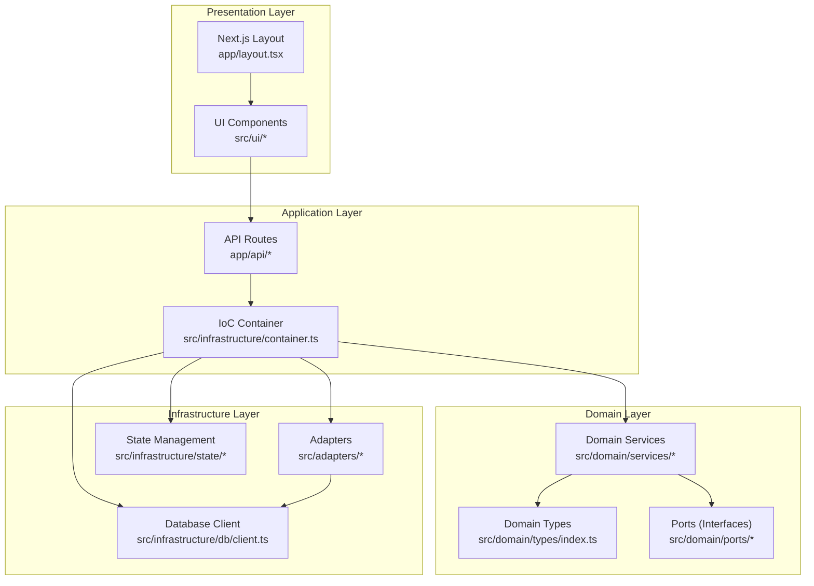
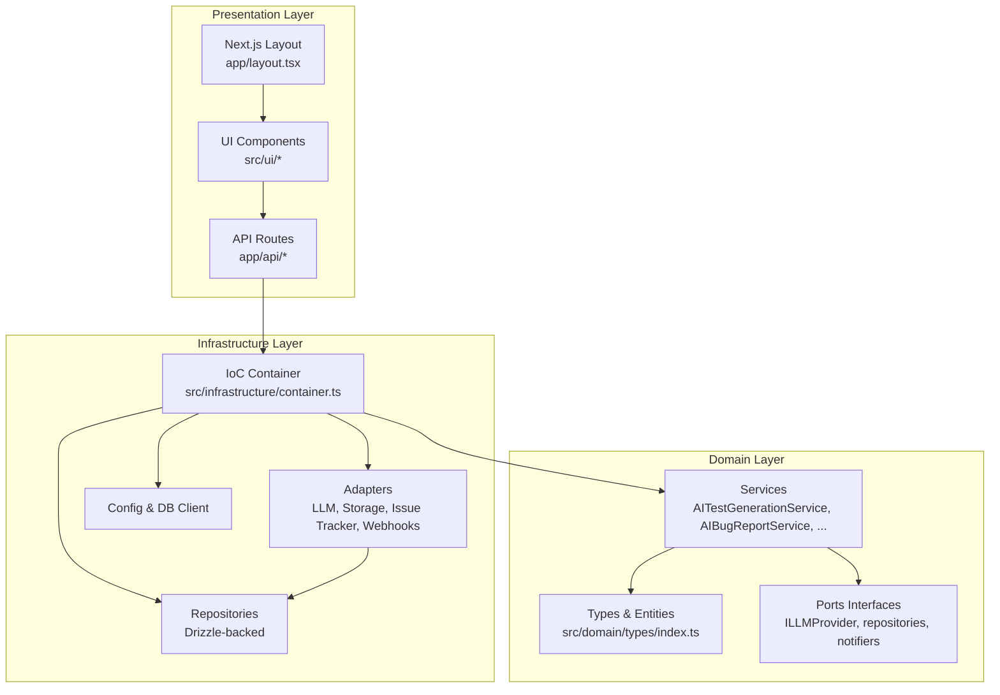
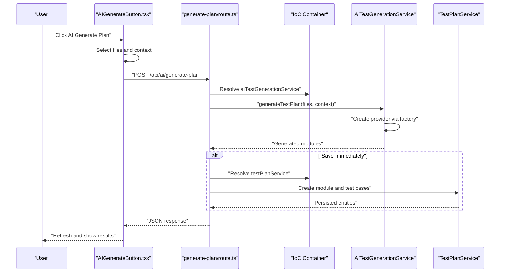
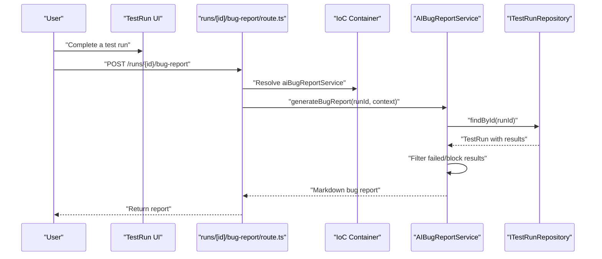
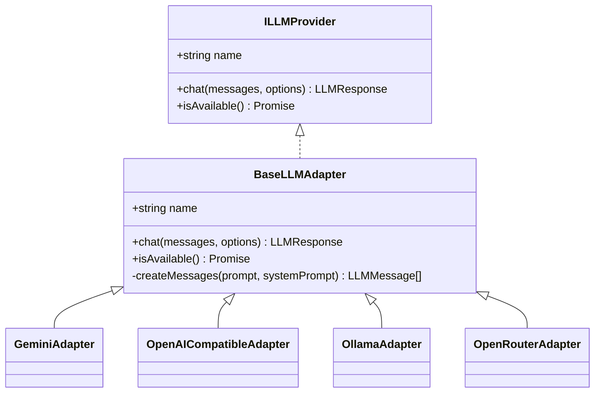
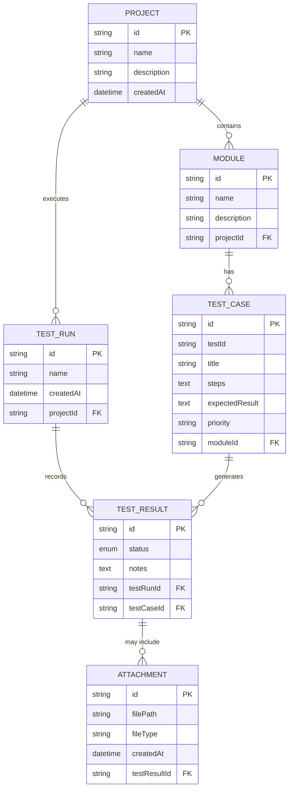
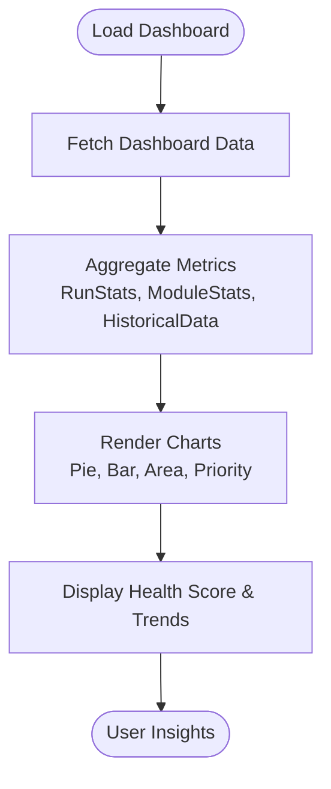
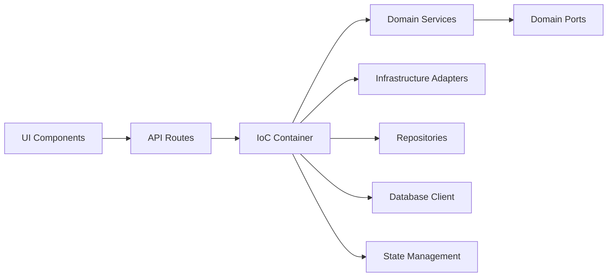

# Project Overview

<cite>
**Referenced Files in This Document**
- [README.md](file://README.md)
- [package.json](file://package.json)
- [app/layout.tsx](file://app/layout.tsx)
- [app/api/_lib/schemas.ts](file://app/api/_lib/schemas.ts)
- [app/api/ai/generate-plan/route.ts](file://app/api/ai/generate-plan/route.ts)
- [src/domain/types/index.ts](file://src/domain/types/index.ts)
- [src/domain/services/AITestGenerationService.ts](file://src/domain/services/AITestGenerationService.ts)
- [src/domain/services/AIBugReportService.ts](file://src/domain/services/AIBugReportService.ts)
- [src/domain/ports/ILLMProvider.ts](file://src/domain/ports/ILLMProvider.ts)
- [src/adapters/llm/BaseLLMAdapter.ts](file://src/adapters/llm/BaseLLMAdapter.ts)
- [src/ui/test-design/AIGenerateButton.tsx](file://src/ui/test-design/AIGenerateButton.tsx)
- [src/ui/dashboard/DashboardCharts.tsx](file://src/ui/dashboard/DashboardCharts.tsx)
- [src/infrastructure/container.ts](file://src/infrastructure/container.ts)
</cite>

## Table of Contents
1. [Introduction](#introduction)
2. [Project Structure](#project-structure)
3. [Core Components](#core-components)
4. [Architecture Overview](#architecture-overview)
5. [Detailed Component Analysis](#detailed-component-analysis)
6. [Dependency Analysis](#dependency-analysis)
7. [Performance Considerations](#performance-considerations)
8. [Troubleshooting Guide](#troubleshooting-guide)
9. [Conclusion](#conclusion)

## Introduction
Test Plan Manager is a comprehensive SaaS testing platform designed to streamline test case management, automate test execution orchestration, and accelerate quality assurance through AI-powered capabilities. It provides a unified experience across web and desktop environments, enabling teams to design robust test plans from source code, execute test runs, analyze outcomes in real time, and integrate with external systems such as Jira and Slack.

Key capabilities include:
- AI-powered test plan generation from source code
- Automated bug report generation from failed test results
- Real-time analytics and dashboards for test run insights
- External service integrations (Issue tracking, notifications, webhooks)
- Multi-platform deployment via Next.js (web) and Electron (desktop)

Target audience:
- QA engineers and testers automating manual processes
- Development teams seeking integrated test lifecycle management
- Organizations adopting AI-assisted test design and reporting

Competitive advantages:
- Clean architecture with domain-driven design principles
- Pluggable adapters for LLM providers, storage, and external systems
- Real-time analytics with customizable visualizations
- Seamless desktop experience via Electron while maintaining web scalability

## Project Structure
The project follows a layered, domain-driven structure with clear separation of concerns:
- app/: Next.js App Router pages and API routes
- src/domain/: Core domain models, services, ports, and types
- src/adapters/: Infrastructure adapters for persistence, LLMs, storage, and external services
- src/infrastructure/: DI container, database client, state management, and configuration
- src/ui/: Shared UI components and feature-specific components (test design, test run, dashboard)
- electron/: Electron main process and preload scripts for desktop builds

**Diagram sources**
- [app/layout.tsx:12-41](file://app/layout.tsx#L12-L41)
- [src/infrastructure/container.ts:33-91](file://src/infrastructure/container.ts#L33-L91)
- [src/domain/types/index.ts:1-196](file://src/domain/types/index.ts#L1-L196)

**Section sources**
- [README.md:1-47](file://README.md#L1-L47)
- [package.json:1-75](file://package.json#L1-L75)
- [app/layout.tsx:12-41](file://app/layout.tsx#L12-L41)
- [src/infrastructure/container.ts:33-91](file://src/infrastructure/container.ts#L33-L91)

## Core Components
- AI Test Generation Service: Analyzes source code files and generates structured test modules and cases using an LLM provider factory abstraction.
- AI Bug Report Service: Produces professional Markdown bug reports from failed or blocked test results.
- Domain Types: Strongly typed entities and DTOs for projects, modules, test cases, runs, results, and dashboard metrics.
- API Schemas: Zod-based validation for request payloads across API endpoints.
- UI Components: Feature-specific components for AI generation, test run management, and dashboard charts.
- Infrastructure Container: Centralized dependency injection wiring adapters, repositories, and services.

Practical workflows:
- AI-powered test plan creation: Select project files → Configure optional context → Generate and optionally save immediately to a project.
- Bug report generation: After a test run completes, generate a Markdown report highlighting failures and reproduction steps.
- Analytics dashboard: Visualize pass rates, module coverage, priority distributions, and historical trends.

**Section sources**
- [src/domain/services/AITestGenerationService.ts:25-81](file://src/domain/services/AITestGenerationService.ts#L25-L81)
- [src/domain/services/AIBugReportService.ts:10-69](file://src/domain/services/AIBugReportService.ts#L10-L69)
- [src/domain/types/index.ts:1-196](file://src/domain/types/index.ts#L1-L196)
- [app/api/_lib/schemas.ts:1-92](file://app/api/_lib/schemas.ts#L1-L92)
- [src/ui/test-design/AIGenerateButton.tsx:9-166](file://src/ui/test-design/AIGenerateButton.tsx#L9-L166)
- [src/ui/dashboard/DashboardCharts.tsx:25-177](file://src/ui/dashboard/DashboardCharts.tsx#L25-L177)
- [src/infrastructure/container.ts:33-91](file://src/infrastructure/container.ts#L33-L91)

## Architecture Overview
The system adheres to Clean Architecture and Domain-Driven Design:
- Domain Layer encapsulates core business logic and models without depending on frameworks or infrastructure.
- Application Layer coordinates use cases via services and orchestrates external integrations.
- Infrastructure Layer provides adapters for persistence, LLMs, storage, and external systems.
- Presentation Layer renders UI and exposes API endpoints.

**Diagram sources**
- [src/domain/types/index.ts:1-196](file://src/domain/types/index.ts#L1-L196)
- [src/domain/services/AITestGenerationService.ts:25-81](file://src/domain/services/AITestGenerationService.ts#L25-L81)
- [src/domain/services/AIBugReportService.ts:10-69](file://src/domain/services/AIBugReportService.ts#L10-L69)
- [src/domain/ports/ILLMProvider.ts:12-31](file://src/domain/ports/ILLMProvider.ts#L12-L31)
- [src/infrastructure/container.ts:33-91](file://src/infrastructure/container.ts#L33-L91)
- [app/layout.tsx:12-41](file://app/layout.tsx#L12-L41)

## Detailed Component Analysis

### AI Test Plan Generation Workflow
This workflow demonstrates the end-to-end flow from UI selection to API processing and optional persistence.

**Diagram sources**
- [src/ui/test-design/AIGenerateButton.tsx:45-80](file://src/ui/test-design/AIGenerateButton.tsx#L45-L80)
- [app/api/ai/generate-plan/route.ts:8-31](file://app/api/ai/generate-plan/route.ts#L8-L31)
- [src/infrastructure/container.ts:54-57](file://src/infrastructure/container.ts#L54-L57)
- [src/domain/services/AITestGenerationService.ts:28-80](file://src/domain/services/AITestGenerationService.ts#L28-L80)

**Section sources**
- [src/ui/test-design/AIGenerateButton.tsx:9-166](file://src/ui/test-design/AIGenerateButton.tsx#L9-L166)
- [app/api/ai/generate-plan/route.ts:8-31](file://app/api/ai/generate-plan/route.ts#L8-L31)
- [src/domain/services/AITestGenerationService.ts:25-81](file://src/domain/services/AITestGenerationService.ts#L25-L81)
- [src/infrastructure/container.ts:54-57](file://src/infrastructure/container.ts#L54-L57)

### AI Bug Report Generation Workflow
This workflow focuses on generating a structured Markdown bug report after a test run.

**Diagram sources**
- [src/domain/services/AIBugReportService.ts:16-68](file://src/domain/services/AIBugReportService.ts#L16-L68)
- [src/infrastructure/container.ts:57-57](file://src/infrastructure/container.ts#L57-L57)

**Section sources**
- [src/domain/services/AIBugReportService.ts:10-69](file://src/domain/services/AIBugReportService.ts#L10-L69)

### LLM Provider Abstraction
The LLM provider abstraction enables pluggable AI backends while keeping domain services agnostic of concrete implementations.

**Diagram sources**
- [src/domain/ports/ILLMProvider.ts:12-31](file://src/domain/ports/ILLMProvider.ts#L12-L31)
- [src/adapters/llm/BaseLLMAdapter.ts:3-25](file://src/adapters/llm/BaseLLMAdapter.ts#L3-L25)

**Section sources**
- [src/domain/ports/ILLMProvider.ts:12-31](file://src/domain/ports/ILLMProvider.ts#L12-L31)
- [src/adapters/llm/BaseLLMAdapter.ts:1-26](file://src/adapters/llm/BaseLLMAdapter.ts#L1-L26)

### Data Model Overview
The domain models define the core entities and their relationships for test lifecycle management.

**Diagram sources**
- [src/domain/types/index.ts:9-59](file://src/domain/types/index.ts#L9-L59)

**Section sources**
- [src/domain/types/index.ts:1-196](file://src/domain/types/index.ts#L1-L196)

### Real-Time Analytics and Dashboards
The dashboard components render charts and summaries derived from aggregated domain data.

**Diagram sources**
- [src/ui/dashboard/DashboardCharts.tsx:25-177](file://src/ui/dashboard/DashboardCharts.tsx#L25-L177)
- [src/domain/types/index.ts:90-175](file://src/domain/types/index.ts#L90-L175)

**Section sources**
- [src/ui/dashboard/DashboardCharts.tsx:1-178](file://src/ui/dashboard/DashboardCharts.tsx#L1-L178)
- [src/domain/types/index.ts:90-175](file://src/domain/types/index.ts#L90-L175)

## Dependency Analysis
The dependency graph highlights the inversion of control via the IoC container and the decoupled nature of adapters and services.

**Diagram sources**
- [src/infrastructure/container.ts:33-91](file://src/infrastructure/container.ts#L33-L91)

**Section sources**
- [src/infrastructure/container.ts:33-91](file://src/infrastructure/container.ts#L33-L91)

## Performance Considerations
- API payload validation: Zod schemas ensure early rejection of malformed requests, reducing downstream processing overhead.
- LLM response parsing: Services sanitize and validate JSON responses to avoid rendering errors and retries.
- UI responsiveness: Client-side components debounce and disable actions during long-running operations (e.g., file selection and AI generation).
- Database operations: Drizzle repositories encapsulate persistence logic and can be extended with caching or indexing strategies as needed.

## Troubleshooting Guide
Common issues and resolutions:
- AI provider misconfiguration: Verify provider settings and keys in the settings endpoint; ensure the provider is reachable.
- Empty or invalid LLM responses: The AI services enforce strict JSON parsing and will surface errors if the response format is incorrect.
- Missing project context: The AI generation button requires an active project selection; ensure the project switcher is set before generating.
- API validation errors: Review request payloads against the Zod schemas for required fields and constraints.

**Section sources**
- [app/api/_lib/schemas.ts:45-62](file://app/api/_lib/schemas.ts#L45-L62)
- [src/domain/services/AITestGenerationService.ts:66-79](file://src/domain/services/AITestGenerationService.ts#L66-L79)
- [src/ui/test-design/AIGenerateButton.tsx:46-49](file://src/ui/test-design/AIGenerateButton.tsx#L46-L49)

## Conclusion
Test Plan Manager delivers a scalable, extensible testing platform that combines modern frontend technologies with a clean, domain-driven architecture. Its AI-powered features accelerate test design and reporting, while real-time analytics and integrations provide actionable insights. The multi-platform approach ensures broad accessibility, and the adapter-based design supports easy evolution of providers and integrations.