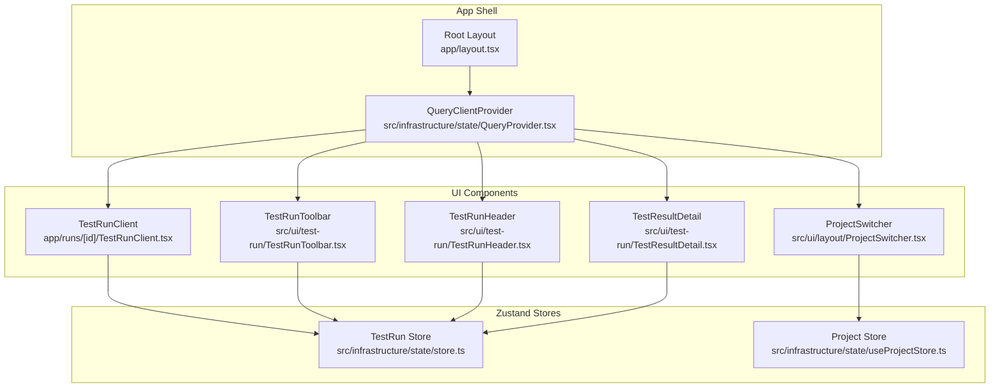
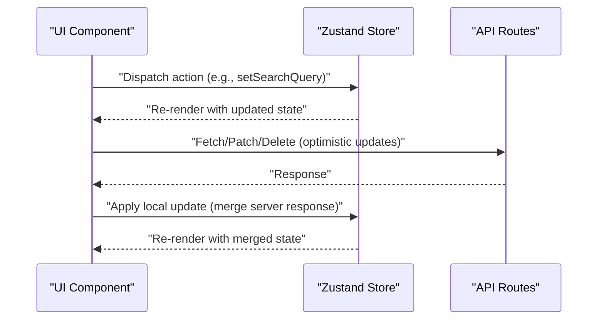
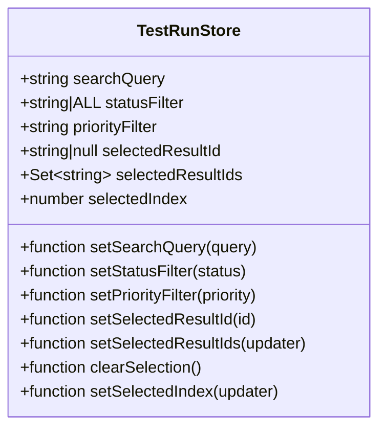
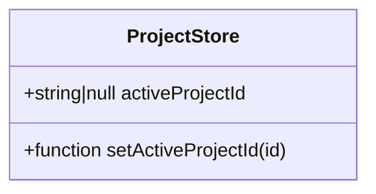
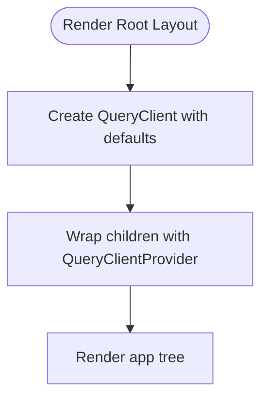
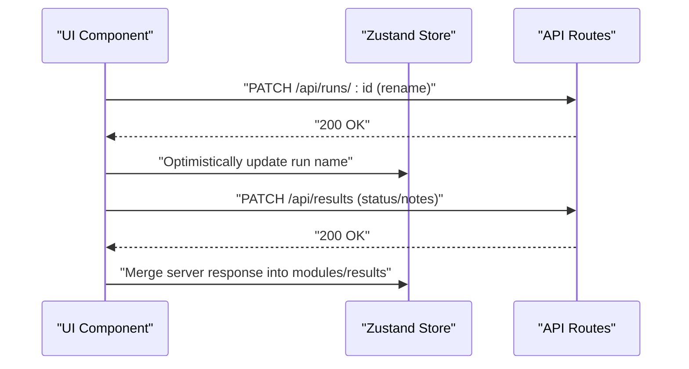
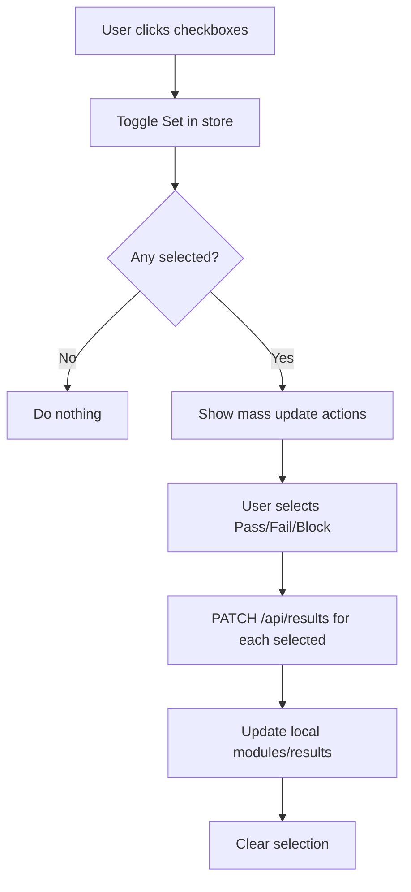
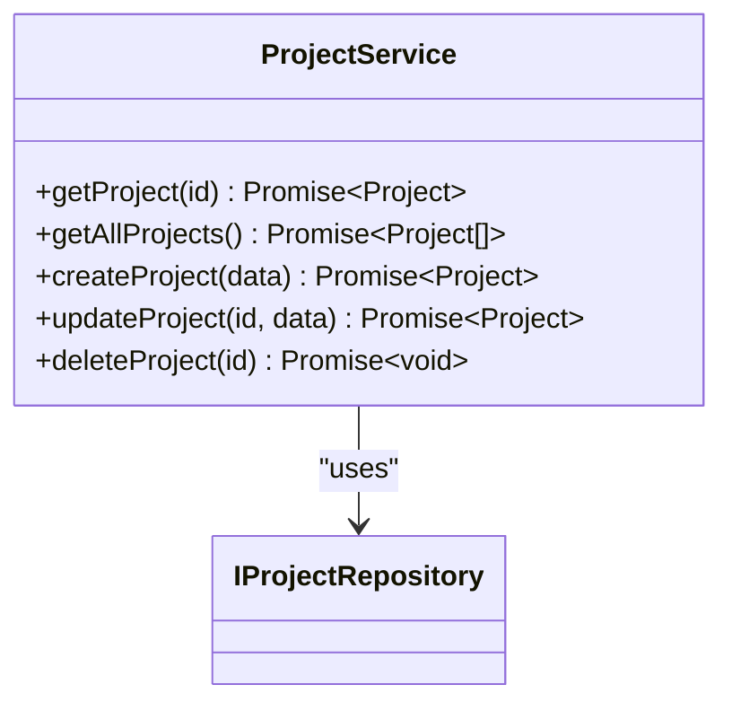
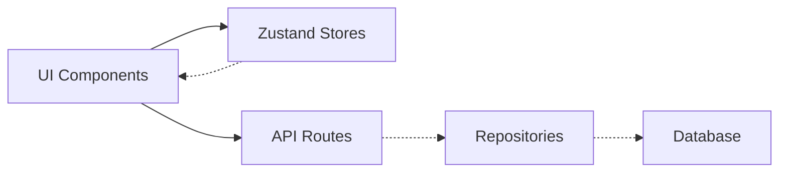

# State Management

<cite>
**Referenced Files in This Document**
- [store.ts](file://src/infrastructure/state/store.ts)
- [useProjectStore.ts](file://src/infrastructure/state/useProjectStore.ts)
- [QueryProvider.tsx](file://src/infrastructure/state/QueryProvider.tsx)
- [layout.tsx](file://app/layout.tsx)
- [TestRunClient.tsx](file://app/runs/[id]/TestRunClient.tsx)
- [TestRunToolbar.tsx](file://src/ui/test-run/TestRunToolbar.tsx)
- [ProjectSwitcher.tsx](file://src/ui/layout/ProjectSwitcher.tsx)
- [TestRunHeader.tsx](file://src/ui/test-run/TestRunHeader.tsx)
- [TestResultDetail.tsx](file://src/ui/test-run/TestResultDetail.tsx)
- [index.ts](file://src/domain/types/index.ts)
- [container.ts](file://src/infrastructure/container.ts)
- [ProjectService.ts](file://src/domain/services/ProjectService.ts)
</cite>

## Table of Contents
1. [Introduction](#introduction)
2. [Project Structure](#project-structure)
3. [Core Components](#core-components)
4. [Architecture Overview](#architecture-overview)
5. [Detailed Component Analysis](#detailed-component-analysis)
6. [Dependency Analysis](#dependency-analysis)
7. [Performance Considerations](#performance-considerations)
8. [Troubleshooting Guide](#troubleshooting-guide)
9. [Conclusion](#conclusion)

## Introduction
This document explains the state management architecture built with Zustand for local UI state and React Query for server state synchronization. It covers:
- Global stores for test run filters and active project selection
- Provider setup for React Query
- Practical usage patterns in components
- State update strategies, subscriptions, and optimistic updates
- Persistence considerations and cleanup patterns
- Performance and debugging guidance

## Project Structure
The state management stack is organized as follows:
- Zustand stores live under infrastructure/state
- React Query provider is wired at the root layout
- UI components consume stores and drive server interactions
- Domain services and repositories provide backend integration

**Diagram sources**
- [layout.tsx:12-41](file://app/layout.tsx#L12-L41)
- [QueryProvider.tsx:6-21](file://src/infrastructure/state/QueryProvider.tsx#L6-L21)
- [store.ts:22-45](file://src/infrastructure/state/store.ts#L22-L45)
- [useProjectStore.ts:15-18](file://src/infrastructure/state/useProjectStore.ts#L15-L18)
- [TestRunClient.tsx:14-23](file://app/runs/[id]/TestRunClient.tsx#L14-L23)
- [TestRunToolbar.tsx:9-15](file://src/ui/test-run/TestRunToolbar.tsx#L9-L15)
- [ProjectSwitcher.tsx:29-30](file://src/ui/layout/ProjectSwitcher.tsx#L29-L30)
- [TestRunHeader.tsx:17-47](file://src/ui/test-run/TestRunHeader.tsx#L17-L47)
- [TestResultDetail.tsx:19-26](file://src/ui/test-run/TestResultDetail.tsx#L19-L26)

**Section sources**
- [layout.tsx:12-41](file://app/layout.tsx#L12-L41)
- [QueryProvider.tsx:6-21](file://src/infrastructure/state/QueryProvider.tsx#L6-L21)

## Core Components
- TestRun Store: Manages UI filters, selection state, and current index for test run results.
- Project Store: Tracks the active project ID for the application context.
- QueryProvider: Wraps the app with a React Query client configured with default caching and refetch policies.

Key responsibilities:
- TestRun Store: Centralized filter and selection state for test run UI, enabling keyboard navigation and bulk actions.
- Project Store: Keeps the active project context, ensuring UI and server interactions align with the selected project.
- QueryProvider: Provides caching and background refetching for server data across the app.

**Section sources**
- [store.ts:6-20](file://src/infrastructure/state/store.ts#L6-L20)
- [store.ts:22-45](file://src/infrastructure/state/store.ts#L22-L45)
- [useProjectStore.ts:5-8](file://src/infrastructure/state/useProjectStore.ts#L5-L8)
- [useProjectStore.ts:15-18](file://src/infrastructure/state/useProjectStore.ts#L15-L18)
- [QueryProvider.tsx:7-14](file://src/infrastructure/state/QueryProvider.tsx#L7-L14)

## Architecture Overview
The architecture combines local UI state (Zustand) with server state synchronization (React Query). Components subscribe to stores for fast UI updates and perform server mutations via imperative fetch calls. The root layout injects the QueryClientProvider so that any part of the app can benefit from caching and background updates.

[No sources needed since this diagram shows conceptual workflow, not actual code structure]

## Detailed Component Analysis

### TestRun Store
The TestRun Store encapsulates:
- Filters: search query, status filter, priority filter
- Selection: single selection ID, multi-selection set, and index for keyboard navigation
- Actions: setters for filters, selection helpers, and index updates

Implementation highlights:
- Uses functional updaters for index and selection to safely derive next state from previous state.
- Maintains a Set for multi-selection to efficiently toggle selections.

**Diagram sources**
- [store.ts:6-20](file://src/infrastructure/state/store.ts#L6-L20)
- [store.ts:22-45](file://src/infrastructure/state/store.ts#L22-L45)

Practical usage in components:
- Filtering and selection are consumed in the test run toolbar and client component.
- Keyboard navigation updates the selected index and resolves the selected result.

**Section sources**
- [store.ts:6-20](file://src/infrastructure/state/store.ts#L6-L20)
- [store.ts:22-45](file://src/infrastructure/state/store.ts#L22-L45)
- [TestRunToolbar.tsx:9-15](file://src/ui/test-run/TestRunToolbar.tsx#L9-L15)
- [TestRunClient.tsx:50-57](file://app/runs/[id]/TestRunClient.tsx#L50-L57)
- [TestRunClient.tsx:149-184](file://app/runs/[id]/TestRunClient.tsx#L149-L184)

### Project Store
The Project Store maintains the active project ID and exposes a setter to change it. It is separated from the TestRun Store to keep concerns distinct.

**Diagram sources**
- [useProjectStore.ts:5-8](file://src/infrastructure/state/useProjectStore.ts#L5-L8)
- [useProjectStore.ts:15-18](file://src/infrastructure/state/useProjectStore.ts#L15-L18)

Usage:
- ProjectSwitcher fetches projects and sets the active project ID when none is present.
- Other parts of the UI can rely on the active project ID for server requests.

**Section sources**
- [useProjectStore.ts:5-8](file://src/infrastructure/state/useProjectStore.ts#L5-L8)
- [useProjectStore.ts:15-18](file://src/infrastructure/state/useProjectStore.ts#L15-L18)
- [ProjectSwitcher.tsx:61-79](file://src/ui/layout/ProjectSwitcher.tsx#L61-L79)
- [ProjectSwitcher.tsx:133-145](file://src/ui/layout/ProjectSwitcher.tsx#L133-L145)

### QueryProvider Setup
The QueryProvider creates a QueryClient with default options:
- Stale time: 5 minutes
- Refetch on window focus: disabled

It wraps the app shell so that all pages and components can benefit from caching and background updates.

**Diagram sources**
- [QueryProvider.tsx:7-14](file://src/infrastructure/state/QueryProvider.tsx#L7-L14)
- [layout.tsx:21-37](file://app/layout.tsx#L21-L37)

**Section sources**
- [QueryProvider.tsx:7-14](file://src/infrastructure/state/QueryProvider.tsx#L7-L14)
- [layout.tsx:21-37](file://app/layout.tsx#L21-L37)

### State Hydration and Updates
- Hydration: The test run client receives initial data from the server and hydrates the UI state. The store remains local; UI components merge server responses into local state.
- Optimistic updates: Components update the UI immediately upon user actions (e.g., renaming a run, updating status, adding attachments) and reconcile with server responses afterward.

**Diagram sources**
- [TestRunHeader.tsx:24-47](file://src/ui/test-run/TestRunHeader.tsx#L24-L47)
- [TestRunClient.tsx:110-127](file://app/runs/[id]/TestRunClient.tsx#L110-L127)
- [TestResultDetail.tsx:83-90](file://src/ui/test-run/TestResultDetail.tsx#L83-L90)

**Section sources**
- [TestRunHeader.tsx:24-47](file://src/ui/test-run/TestRunHeader.tsx#L24-L47)
- [TestRunClient.tsx:110-146](file://app/runs/[id]/TestRunClient.tsx#L110-L146)
- [TestResultDetail.tsx:83-90](file://src/ui/test-run/TestResultDetail.tsx#L83-L90)

### Bulk Actions and Selection
The test run client supports multi-selection and bulk status updates:
- Selection toggles update the Set in the store
- Bulk actions dispatch PATCH requests to the server and update local state accordingly

**Diagram sources**
- [TestRunToolbar.tsx:58-66](file://src/ui/test-run/TestRunToolbar.tsx#L58-L66)
- [TestRunClient.tsx:25-48](file://app/runs/[id]/TestRunClient.tsx#L25-L48)

**Section sources**
- [TestRunToolbar.tsx:58-66](file://src/ui/test-run/TestRunToolbar.tsx#L58-L66)
- [TestRunClient.tsx:25-48](file://app/runs/[id]/TestRunClient.tsx#L25-L48)

### Server State Integration Patterns
- Project management service demonstrates repository-driven server interactions.
- UI components orchestrate server calls and update local state optimistically.

**Diagram sources**
- [ProjectService.ts:9-37](file://src/domain/services/ProjectService.ts#L9-L37)

**Section sources**
- [ProjectService.ts:9-37](file://src/domain/services/ProjectService.ts#L9-L37)
- [container.ts:16-61](file://src/infrastructure/container.ts#L16-L61)

## Dependency Analysis
- Zustand stores are consumed directly by UI components.
- React Query provider is injected at the root and enables caching for server data.
- Domain services depend on repositories for persistence and integrate with external systems.

[No sources needed since this diagram shows conceptual relationships, not specific code structure]

## Performance Considerations
- Prefer functional updaters in stores to avoid stale closures and ensure predictable updates.
- Keep store state minimal and flat to reduce re-renders.
- Use optimistic updates for immediate feedback; reconcile with server responses to maintain consistency.
- Leverage React Query’s caching to minimize redundant network calls; tune staleTime and refetch policies per route needs.
- Avoid unnecessary deep merges; prefer targeted updates to local state arrays and objects.

## Troubleshooting Guide
Common issues and remedies:
- State not updating after server mutation
  - Verify the component updates local state after receiving a successful response.
  - Ensure the store updater targets the correct keys and avoids shallow copies that do not trigger re-renders.
- Selection not clearing after bulk actions
  - Confirm the store’s clearSelection action is invoked after successful batch updates.
- Active project mismatch
  - Ensure ProjectSwitcher sets the active project ID when the list is empty.
  - Confirm downstream components use the active project ID for server requests.
- Debugging store state
  - Log store state in components to inspect filters, selections, and indices.
  - Temporarily disable optimistic updates to isolate server-side issues.
- React Query cache inconsistencies
  - Invalidate or update query caches after mutations.
  - Adjust staleTime and refetchOnWindowFocus to balance freshness and performance.

**Section sources**
- [TestRunClient.tsx:44-48](file://app/runs/[id]/TestRunClient.tsx#L44-L48)
- [ProjectSwitcher.tsx:66-68](file://src/ui/layout/ProjectSwitcher.tsx#L66-L68)
- [QueryProvider.tsx:10-12](file://src/infrastructure/state/QueryProvider.tsx#L10-L12)

## Conclusion
The state management architecture cleanly separates local UI state (Zustand) from server state (React Query). Stores provide efficient, reactive state for filters, selections, and indices, while components orchestrate server interactions with optimistic updates. The QueryProvider ensures caching and background synchronization across the app. Following the recommended patterns yields responsive UIs with predictable state behavior.