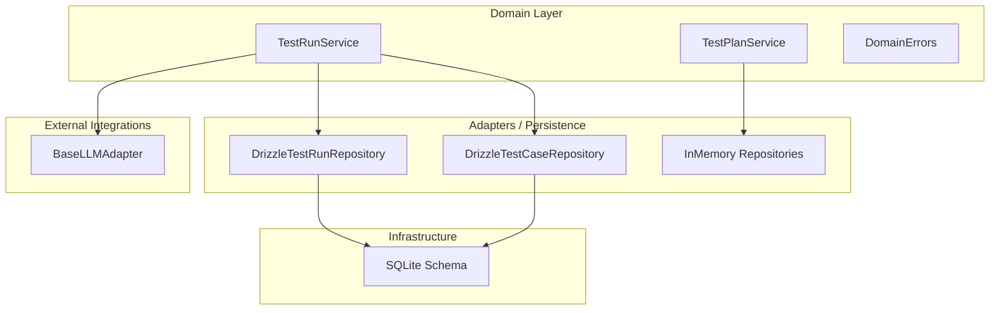
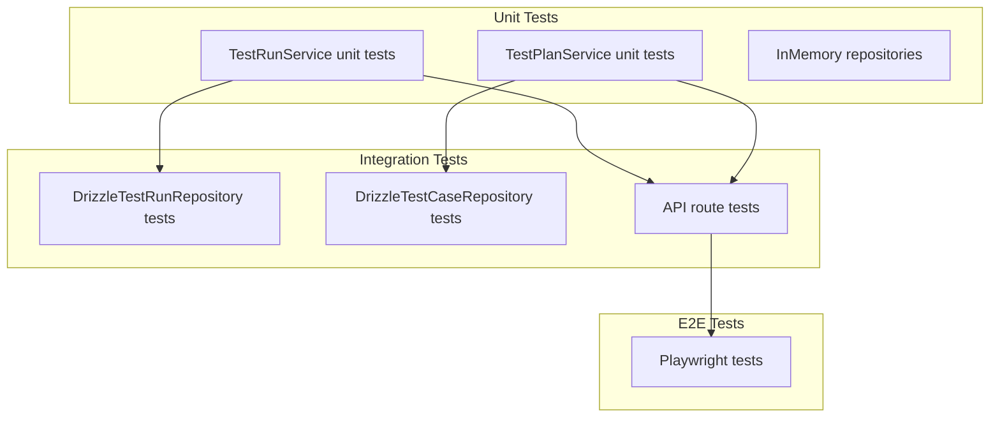
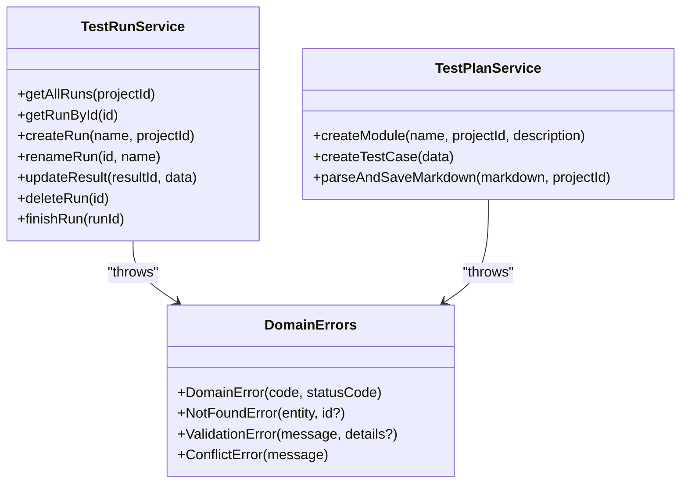
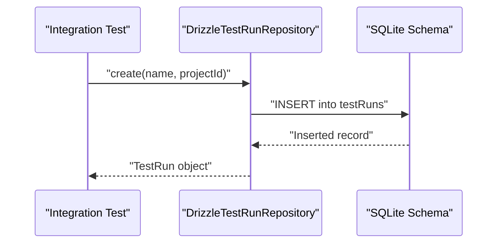
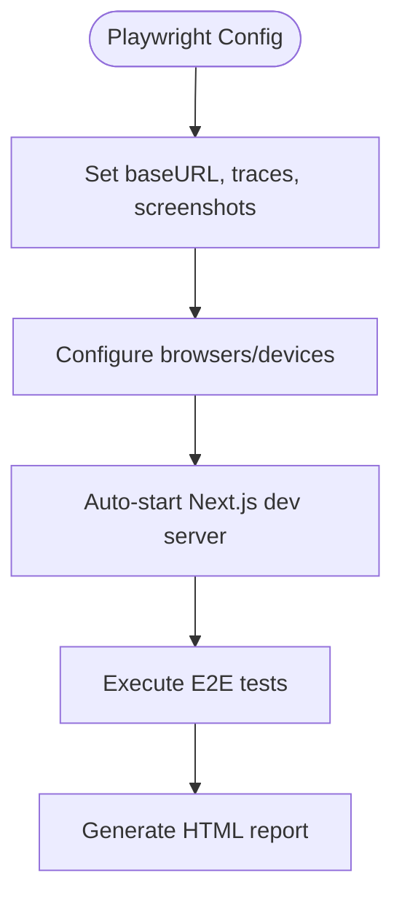
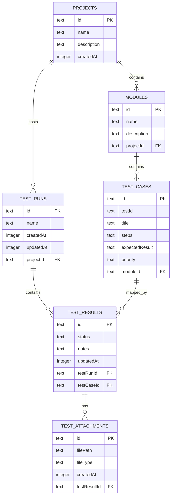
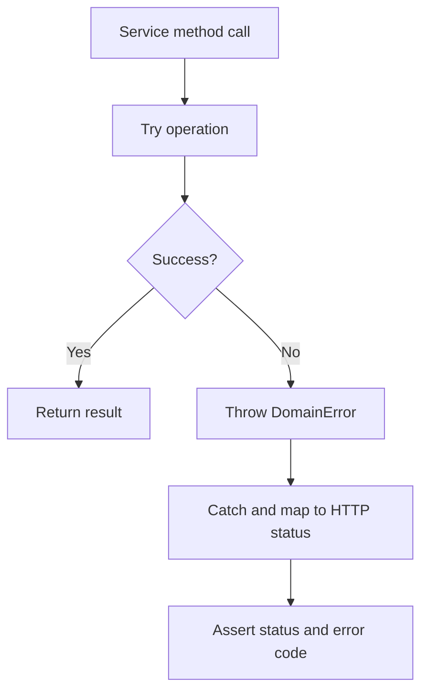
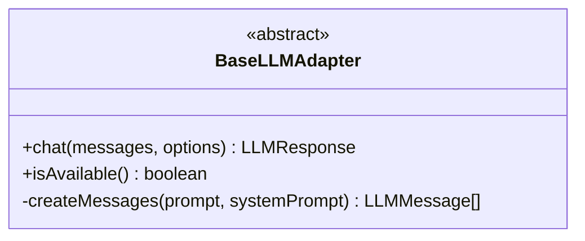
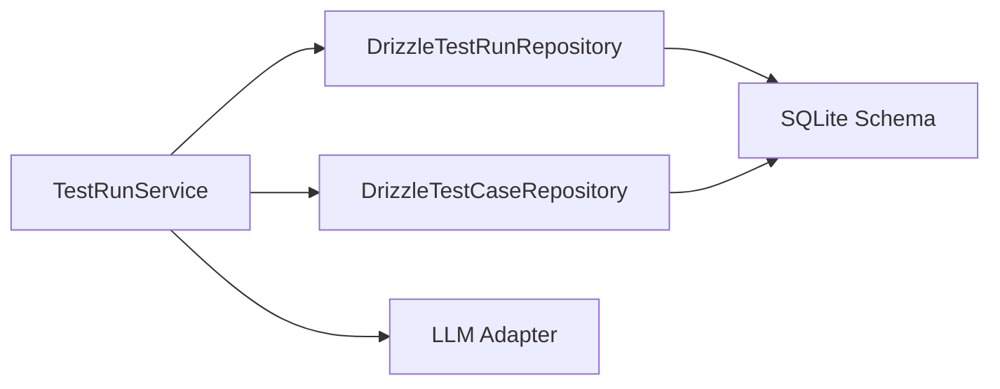

# Testing Strategy

<cite>
**Referenced Files in This Document**
- [playwright.config.ts](file://playwright.config.ts)
- [package.json](file://package.json)
- [src/domain/services/TestRunService.ts](file://src/domain/services/TestRunService.ts)
- [src/domain/services/TestPlanService.ts](file://src/domain/services/TestPlanService.ts)
- [src/adapters/persistence/drizzle/DrizzleTestRunRepository.ts](file://src/adapters/persistence/drizzle/DrizzleTestRunRepository.ts)
- [src/adapters/persistence/drizzle/DrizzleTestCaseRepository.ts](file://src/adapters/persistence/drizzle/DrizzleTestCaseRepository.ts)
- [src/adapters/persistence/in-memory/index.ts](file://src/adapters/persistence/in-memory/index.ts)
- [src/infrastructure/db/schema.ts](file://src/infrastructure/db/schema.ts)
- [src/domain/errors/DomainErrors.ts](file://src/domain/errors/DomainErrors.ts)
- [src/adapters/llm/BaseLLMAdapter.ts](file://src/adapters/llm/BaseLLMAdapter.ts)
</cite>

## Table of Contents
1. [Introduction](#introduction)
2. [Project Structure](#project-structure)
3. [Core Components](#core-components)
4. [Architecture Overview](#architecture-overview)
5. [Detailed Component Analysis](#detailed-component-analysis)
6. [Dependency Analysis](#dependency-analysis)
7. [Performance Considerations](#performance-considerations)
8. [Troubleshooting Guide](#troubleshooting-guide)
9. [Conclusion](#conclusion)
10. [Appendices](#appendices)

## Introduction
This document defines a comprehensive multi-layered testing strategy for the SaaS test management application. It covers:
- Unit testing for domain services and business logic
- Integration testing for repository implementations and API endpoints
- End-to-end testing using Playwright for complete user workflows
- Schema validation testing, error handling verification, and performance testing approaches
- Test data management and mocking strategies for external dependencies
- Continuous integration testing pipelines and quality assurance processes
- Best practices, debugging techniques, and maintenance of test suites
- Special considerations for AI integrations, database operations, and desktop application functionality

## Project Structure
The project follows a layered architecture:
- Domain layer: Services encapsulate business logic and orchestrate repositories and external integrations
- Adapters/Persistence: Implementations for repositories and external providers (e.g., LLMs)
- Infrastructure: Database schema and client
- API: Next.js routes implementing REST endpoints
- UI: React components and pages
- Electron: Desktop application wrapper

**Diagram sources**
- [src/domain/services/TestRunService.ts:1-125](file://src/domain/services/TestRunService.ts#L1-L125)
- [src/domain/services/TestPlanService.ts:1-110](file://src/domain/services/TestPlanService.ts#L1-L110)
- [src/adapters/persistence/drizzle/DrizzleTestRunRepository.ts:1-96](file://src/adapters/persistence/drizzle/DrizzleTestRunRepository.ts#L1-L96)
- [src/adapters/persistence/drizzle/DrizzleTestCaseRepository.ts:1-71](file://src/adapters/persistence/drizzle/DrizzleTestCaseRepository.ts#L1-L71)
- [src/adapters/persistence/in-memory/index.ts:1-67](file://src/adapters/persistence/in-memory/index.ts#L1-L67)
- [src/infrastructure/db/schema.ts:1-60](file://src/infrastructure/db/schema.ts#L1-L60)
- [src/adapters/llm/BaseLLMAdapter.ts:1-26](file://src/adapters/llm/BaseLLMAdapter.ts#L1-L26)

**Section sources**
- [src/domain/services/TestRunService.ts:1-125](file://src/domain/services/TestRunService.ts#L1-L125)
- [src/domain/services/TestPlanService.ts:1-110](file://src/domain/services/TestPlanService.ts#L1-L110)
- [src/adapters/persistence/drizzle/DrizzleTestRunRepository.ts:1-96](file://src/adapters/persistence/drizzle/DrizzleTestRunRepository.ts#L1-L96)
- [src/adapters/persistence/drizzle/DrizzleTestCaseRepository.ts:1-71](file://src/adapters/persistence/drizzle/DrizzleTestCaseRepository.ts#L1-L71)
- [src/adapters/persistence/in-memory/index.ts:1-67](file://src/adapters/persistence/in-memory/index.ts#L1-L67)
- [src/infrastructure/db/schema.ts:1-60](file://src/infrastructure/db/schema.ts#L1-L60)
- [src/domain/errors/DomainErrors.ts:1-39](file://src/domain/errors/DomainErrors.ts#L1-L39)
- [src/adapters/llm/BaseLLMAdapter.ts:1-26](file://src/adapters/llm/BaseLLMAdapter.ts#L1-L26)

## Core Components
- Domain services encapsulate business logic and coordinate repositories and external integrations. They are ideal candidates for unit testing because they are framework-agnostic and rely on interfaces.
- Repository implementations provide persistence abstractions. Integration tests validate correctness against the SQLite schema and Drizzle ORM queries.
- In-memory repositories enable fast unit tests without a database.
- Error types unify domain exceptions and map to HTTP status codes.
- LLM adapters define a common interface for AI integrations, enabling mocking and deterministic tests.

Key testing targets:
- Unit tests for TestRunService and TestPlanService
- Integration tests for Drizzle repositories and API routes
- E2E tests via Playwright for user workflows
- Mocking strategies for LLM providers and external services

**Section sources**
- [src/domain/services/TestRunService.ts:1-125](file://src/domain/services/TestRunService.ts#L1-L125)
- [src/domain/services/TestPlanService.ts:1-110](file://src/domain/services/TestPlanService.ts#L1-L110)
- [src/adapters/persistence/drizzle/DrizzleTestRunRepository.ts:1-96](file://src/adapters/persistence/drizzle/DrizzleTestRunRepository.ts#L1-L96)
- [src/adapters/persistence/drizzle/DrizzleTestCaseRepository.ts:1-71](file://src/adapters/persistence/drizzle/DrizzleTestCaseRepository.ts#L1-L71)
- [src/adapters/persistence/in-memory/index.ts:1-67](file://src/adapters/persistence/in-memory/index.ts#L1-L67)
- [src/domain/errors/DomainErrors.ts:1-39](file://src/domain/errors/DomainErrors.ts#L1-L39)
- [src/adapters/llm/BaseLLMAdapter.ts:1-26](file://src/adapters/llm/BaseLLMAdapter.ts#L1-L26)

## Architecture Overview
The testing architecture spans three layers:
- Unit: Domain services and in-memory repositories
- Integration: Drizzle repositories and API routes
- End-to-End: Playwright browser tests against a local Next.js server

**Diagram sources**
- [src/domain/services/TestRunService.ts:1-125](file://src/domain/services/TestRunService.ts#L1-L125)
- [src/domain/services/TestPlanService.ts:1-110](file://src/domain/services/TestPlanService.ts#L1-L110)
- [src/adapters/persistence/drizzle/DrizzleTestRunRepository.ts:1-96](file://src/adapters/persistence/drizzle/DrizzleTestRunRepository.ts#L1-L96)
- [src/adapters/persistence/drizzle/DrizzleTestCaseRepository.ts:1-71](file://src/adapters/persistence/drizzle/DrizzleTestCaseRepository.ts#L1-L71)
- [playwright.config.ts:1-45](file://playwright.config.ts#L1-L45)

## Detailed Component Analysis

### Unit Testing Strategy
Focus on domain services and in-memory repositories:
- TestRunService: Validate run lifecycle operations (create, rename, update result, delete, finish), webhook dispatch, and notifications. Use mocks for INotifier and IWebhookDispatcher.
- TestPlanService: Validate Markdown parsing and persistence of modules and test cases. Use InMemory repositories to avoid database overhead.
- DomainErrors: Verify error codes and status mappings.

**Diagram sources**
- [src/domain/services/TestRunService.ts:1-125](file://src/domain/services/TestRunService.ts#L1-L125)
- [src/domain/services/TestPlanService.ts:1-110](file://src/domain/services/TestPlanService.ts#L1-L110)
- [src/domain/errors/DomainErrors.ts:1-39](file://src/domain/errors/DomainErrors.ts#L1-L39)

**Section sources**
- [src/domain/services/TestRunService.ts:1-125](file://src/domain/services/TestRunService.ts#L1-L125)
- [src/domain/services/TestPlanService.ts:1-110](file://src/domain/services/TestPlanService.ts#L1-L110)
- [src/domain/errors/DomainErrors.ts:1-39](file://src/domain/errors/DomainErrors.ts#L1-L39)

### Integration Testing Strategy
Target repository implementations and API routes:
- Drizzle repositories: Validate CRUD operations, joins, and constraints defined in the schema.
- API routes: Use a test harness to hit endpoints and assert responses, request validation, and error handling.

**Diagram sources**
- [src/adapters/persistence/drizzle/DrizzleTestRunRepository.ts:1-96](file://src/adapters/persistence/drizzle/DrizzleTestRunRepository.ts#L1-L96)
- [src/infrastructure/db/schema.ts:1-60](file://src/infrastructure/db/schema.ts#L1-L60)

**Section sources**
- [src/adapters/persistence/drizzle/DrizzleTestRunRepository.ts:1-96](file://src/adapters/persistence/drizzle/DrizzleTestRunRepository.ts#L1-L96)
- [src/adapters/persistence/drizzle/DrizzleTestCaseRepository.ts:1-71](file://src/adapters/persistence/drizzle/DrizzleTestCaseRepository.ts#L1-L71)
- [src/infrastructure/db/schema.ts:1-60](file://src/infrastructure/db/schema.ts#L1-L60)

### End-to-End Testing Strategy (Playwright)
- Playwright configuration defines test execution, browser targets, base URL, tracing, and automatic Next.js server startup.
- E2E tests cover complete user workflows (e.g., creating a test run, updating results, generating reports) and validate UI interactions and backend responses.

**Diagram sources**
- [playwright.config.ts:1-45](file://playwright.config.ts#L1-L45)

**Section sources**
- [playwright.config.ts:1-45](file://playwright.config.ts#L1-L45)
- [package.json:24-26](file://package.json#L24-L26)

### Schema Validation Testing
- Validate that repository queries align with schema definitions and enforce referential integrity and uniqueness constraints.
- Use negative tests to ensure invalid inputs are rejected by the database layer.

**Diagram sources**
- [src/infrastructure/db/schema.ts:1-60](file://src/infrastructure/db/schema.ts#L1-L60)

**Section sources**
- [src/infrastructure/db/schema.ts:1-60](file://src/infrastructure/db/schema.ts#L1-L60)

### Error Handling Verification
- DomainErrors provide typed exceptions mapped to HTTP status codes. Unit tests should assert correct error propagation from services to API handlers.
- Integration tests should verify that repository-level constraint violations surface as expected errors.

**Diagram sources**
- [src/domain/errors/DomainErrors.ts:1-39](file://src/domain/errors/DomainErrors.ts#L1-L39)
- [src/domain/services/TestRunService.ts:1-125](file://src/domain/services/TestRunService.ts#L1-L125)

**Section sources**
- [src/domain/errors/DomainErrors.ts:1-39](file://src/domain/errors/DomainErrors.ts#L1-L39)
- [src/domain/services/TestRunService.ts:1-125](file://src/domain/services/TestRunService.ts#L1-L125)

### AI Integrations Testing
- LLM adapters implement a common interface. Use mock adapters to simulate provider responses and validate service logic that depends on AI outputs.
- Validate prompt formatting helpers and response parsing.

**Diagram sources**
- [src/adapters/llm/BaseLLMAdapter.ts:1-26](file://src/adapters/llm/BaseLLMAdapter.ts#L1-L26)

**Section sources**
- [src/adapters/llm/BaseLLMAdapter.ts:1-26](file://src/adapters/llm/BaseLLMAdapter.ts#L1-L26)

### Database Operations Testing
- Use in-memory repositories for unit tests to isolate domain logic.
- Use Drizzle repositories for integration tests to validate SQL correctness and schema alignment.
- Maintain test data via repository methods (create, deleteAll) to keep tests deterministic.

**Section sources**
- [src/adapters/persistence/in-memory/index.ts:1-67](file://src/adapters/persistence/in-memory/index.ts#L1-L67)
- [src/adapters/persistence/drizzle/DrizzleTestRunRepository.ts:1-96](file://src/adapters/persistence/drizzle/DrizzleTestRunRepository.ts#L1-L96)
- [src/adapters/persistence/drizzle/DrizzleTestCaseRepository.ts:1-71](file://src/adapters/persistence/drizzle/DrizzleTestCaseRepository.ts#L1-L71)

### Desktop Application Functionality Testing
- Electron builds and scripts are defined in package.json. While dedicated UI tests for the desktop app are not present in the repository, the E2E suite can be extended to cover Electron-specific flows if needed.
- For now, focus on web UI coverage and ensure API routes remain compatible with desktop packaging.

**Section sources**
- [package.json:7-26](file://package.json#L7-L26)

## Dependency Analysis
- Domain services depend on repository interfaces and external integrations via ports.
- Drizzle repositories depend on the SQLite schema and Drizzle ORM.
- Playwright tests depend on the Next.js dev server and browser devices.

**Diagram sources**
- [src/domain/services/TestRunService.ts:1-125](file://src/domain/services/TestRunService.ts#L1-L125)
- [src/adapters/persistence/drizzle/DrizzleTestRunRepository.ts:1-96](file://src/adapters/persistence/drizzle/DrizzleTestRunRepository.ts#L1-L96)
- [src/adapters/persistence/drizzle/DrizzleTestCaseRepository.ts:1-71](file://src/adapters/persistence/drizzle/DrizzleTestCaseRepository.ts#L1-L71)
- [src/infrastructure/db/schema.ts:1-60](file://src/infrastructure/db/schema.ts#L1-L60)
- [src/adapters/llm/BaseLLMAdapter.ts:1-26](file://src/adapters/llm/BaseLLMAdapter.ts#L1-L26)

**Section sources**
- [src/domain/services/TestRunService.ts:1-125](file://src/domain/services/TestRunService.ts#L1-L125)
- [src/adapters/persistence/drizzle/DrizzleTestRunRepository.ts:1-96](file://src/adapters/persistence/drizzle/DrizzleTestRunRepository.ts#L1-L96)
- [src/adapters/persistence/drizzle/DrizzleTestCaseRepository.ts:1-71](file://src/adapters/persistence/drizzle/DrizzleTestCaseRepository.ts#L1-L71)
- [src/infrastructure/db/schema.ts:1-60](file://src/infrastructure/db/schema.ts#L1-L60)
- [src/adapters/llm/BaseLLMAdapter.ts:1-26](file://src/adapters/llm/BaseLLMAdapter.ts#L1-L26)

## Performance Considerations
- Prefer in-memory repositories for unit tests to minimize latency.
- Use database fixtures and transaction rollbacks for integration tests to reduce setup/teardown costs.
- Parallelize Playwright tests across multiple devices to improve throughput while maintaining isolation.
- Profile API endpoints under load to identify bottlenecks in repository queries and external provider calls.

## Troubleshooting Guide
Common issues and resolutions:
- Playwright tests failing to connect: Ensure the Next.js dev server starts successfully and the baseURL matches the configured port.
- E2E flakiness: Enable trace collection on first retry and capture screenshots on failure to diagnose intermittent issues.
- API validation errors: Add schema validation tests and assert explicit error responses for malformed requests.
- Mock provider variability: Use deterministic mocks for AI providers and pin model parameters to ensure reproducible outputs.

**Section sources**
- [playwright.config.ts:15-19](file://playwright.config.ts#L15-L19)
- [package.json:24-26](file://package.json#L24-L26)

## Conclusion
This testing strategy leverages unit, integration, and E2E layers to comprehensively validate business logic, persistence, and user workflows. By combining typed domain errors, repository abstractions, and robust mocking, the suite remains maintainable and resilient. Extending Playwright coverage and enforcing CI pipelines will further strengthen quality assurance.

## Appendices

### Test Coverage Requirements
- Unit tests: Aim for high coverage of domain services and critical business logic paths.
- Integration tests: Cover repository CRUD operations, joins, and schema constraints.
- E2E tests: Cover end-to-end user journeys and regressions across supported browsers.

### Continuous Integration Testing Pipelines
- Configure CI to run unit, integration, and E2E tests in parallel stages.
- Reuse existing server in CI to speed up E2E execution.
- Publish Playwright HTML reports and enforce minimal coverage thresholds.

**Section sources**
- [playwright.config.ts:10-12](file://playwright.config.ts#L10-L12)
- [package.json:24-26](file://package.json#L24-L26)

### Quality Assurance Processes
- Enforce pre-commit checks for linting and basic formatting.
- Gate merges on passing tests and adherence to coverage policies.
- Rotate browser targets in CI to detect cross-browser regressions.

### Best Practices and Maintenance
- Keep domain services pure and testable by injecting dependencies via constructors.
- Use small, focused test suites per module to simplify debugging.
- Maintain deterministic test data and reset state between tests.
- Document test assumptions and edge cases to aid future maintenance.