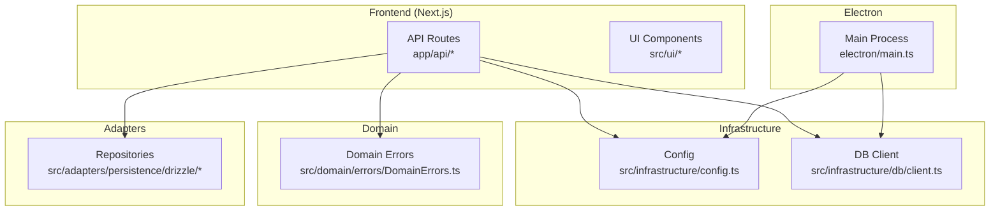
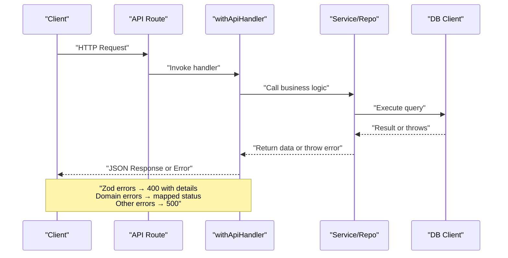
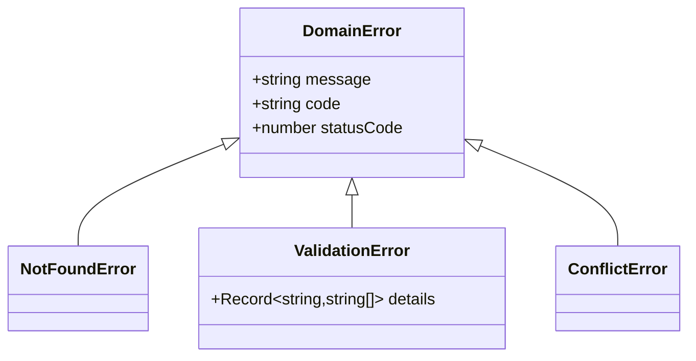
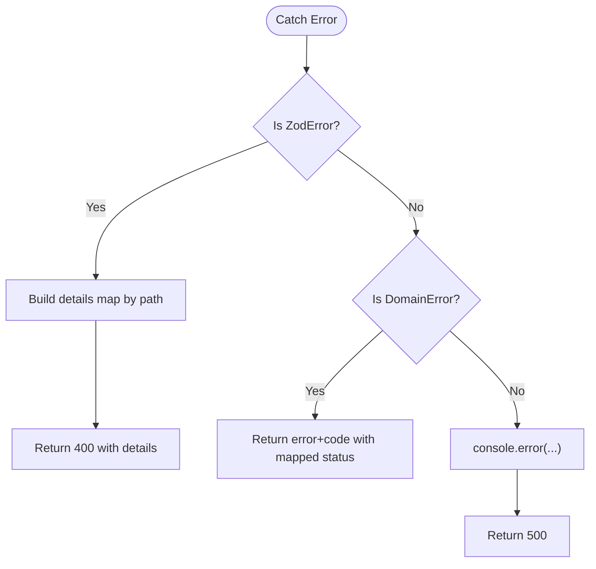
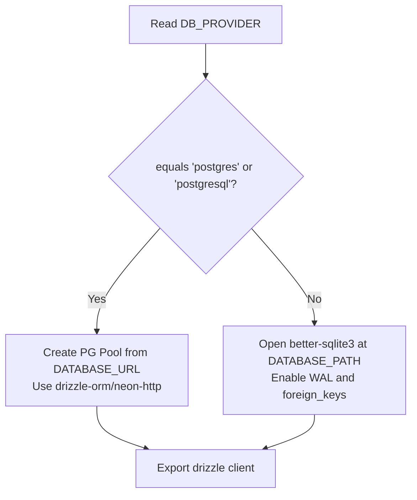
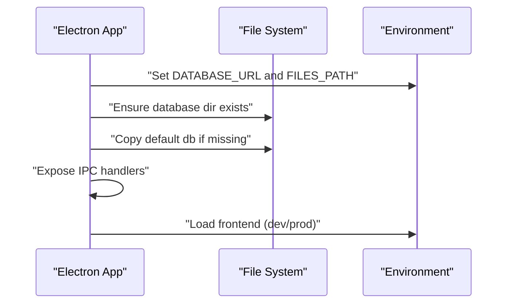
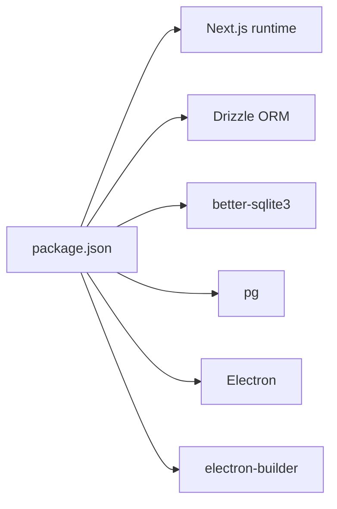

# Troubleshooting and FAQ

<cite>
**Referenced Files in This Document**
- [DomainErrors.ts](file://src/domain/errors/DomainErrors.ts)
- [index.ts (errors)](file://src/domain/errors/index.ts)
- [withApiHandler.ts](file://app/api/_lib/withApiHandler.ts)
- [schemas.ts](file://app/api/_lib/schemas.ts)
- [config.ts](file://src/infrastructure/config.ts)
- [client.ts (db)](file://src/infrastructure/db/client.ts)
- [DrizzleProjectRepository.ts](file://src/adapters/persistence/drizzle/DrizzleProjectRepository.ts)
- [main.ts (Electron)](file://electron/main.ts)
- [package.json](file://package.json)
- [README.md](file://README.md)
</cite>

## Table of Contents
1. [Introduction](#introduction)
2. [Project Structure](#project-structure)
3. [Core Components](#core-components)
4. [Architecture Overview](#architecture-overview)
5. [Detailed Component Analysis](#detailed-component-analysis)
6. [Dependency Analysis](#dependency-analysis)
7. [Performance Considerations](#performance-considerations)
8. [Troubleshooting Guide](#troubleshooting-guide)
9. [Conclusion](#conclusion)
10. [Appendices](#appendices)

## Introduction
This document provides comprehensive troubleshooting guidance for the Test Plan Manager application. It covers error handling patterns, domain error types, API error responses, common setup issues (dependencies, environment configuration, database connectivity), performance troubleshooting (slow API responses, memory usage, database query optimization), debugging techniques for UI and desktop application issues, error monitoring and log analysis, and a dedicated FAQ section. The goal is to help both developers and operators diagnose and resolve issues quickly and efficiently.

## Project Structure
The application follows a layered architecture:
- Frontend (Next.js app) under app/
- Electron desktop wrapper under electron/
- Domain layer under src/domain/ with typed domain errors
- Infrastructure layer under src/infrastructure/ with database client, configuration, and state management
- Adapters under src/adapters/ implementing domain ports (repositories, LLM providers, storage, webhooks)
- UI components under src/ui/

**Diagram sources**
- [withApiHandler.ts:1-65](file://app/api/_lib/withApiHandler.ts#L1-L65)
- [config.ts:1-28](file://src/infrastructure/config.ts#L1-L28)
- [client.ts (db):1-32](file://src/infrastructure/db/client.ts#L1-L32)
- [DomainErrors.ts:1-39](file://src/domain/errors/DomainErrors.ts#L1-L39)
- [DrizzleProjectRepository.ts:1-52](file://src/adapters/persistence/drizzle/DrizzleProjectRepository.ts#L1-L52)
- [main.ts (Electron):1-180](file://electron/main.ts#L1-L180)

**Section sources**
- [withApiHandler.ts:1-65](file://app/api/_lib/withApiHandler.ts#L1-L65)
- [config.ts:1-28](file://src/infrastructure/config.ts#L1-L28)
- [client.ts (db):1-32](file://src/infrastructure/db/client.ts#L1-L32)
- [DomainErrors.ts:1-39](file://src/domain/errors/DomainErrors.ts#L1-L39)
- [DrizzleProjectRepository.ts:1-52](file://src/adapters/persistence/drizzle/DrizzleProjectRepository.ts#L1-L52)
- [main.ts (Electron):1-180](file://electron/main.ts#L1-L180)

## Core Components
- Domain errors: A typed hierarchy mapping to HTTP status codes, enabling consistent error responses across the API.
- API error handler: A higher-order function that standardizes error responses, handles Zod validation errors, and maps domain errors to appropriate HTTP statuses.
- Configuration: Centralized environment-driven configuration for database, LLM, storage, and app settings.
- Database client: Provider-aware client creation supporting SQLite and PostgreSQL via environment variables.
- Electron main process: Manages app lifecycle, initializes database and file paths, and exposes IPC handlers for renderer.

Key implementation references:
- Domain errors and mapping: [DomainErrors.ts:7-39](file://src/domain/errors/DomainErrors.ts#L7-L39)
- API error handler and response shape: [withApiHandler.ts:8-64](file://app/api/_lib/withApiHandler.ts#L8-L64)
- Configuration consolidation: [config.ts:7-27](file://src/infrastructure/config.ts#L7-L27)
- Database provider selection and SQLite pragmas: [client.ts (db):6-25](file://src/infrastructure/db/client.ts#L6-L25)
- Electron database initialization and file paths: [main.ts (Electron):23-60](file://electron/main.ts#L23-L60)

**Section sources**
- [DomainErrors.ts:7-39](file://src/domain/errors/DomainErrors.ts#L7-L39)
- [withApiHandler.ts:8-64](file://app/api/_lib/withApiHandler.ts#L8-L64)
- [config.ts:7-27](file://src/infrastructure/config.ts#L7-L27)
- [client.ts (db):6-25](file://src/infrastructure/db/client.ts#L6-L25)
- [main.ts (Electron):23-60](file://electron/main.ts#L23-L60)

## Architecture Overview
The API routes are wrapped by a centralized error handler that:
- Catches exceptions
- Converts Zod validation errors into structured 400 responses with field-level details
- Maps domain errors to their associated HTTP status codes
- Logs unexpected errors and returns a generic 500 response

**Diagram sources**
- [withApiHandler.ts:22-64](file://app/api/_lib/withApiHandler.ts#L22-L64)
- [client.ts (db):6-25](file://src/infrastructure/db/client.ts#L6-L25)

**Section sources**
- [withApiHandler.ts:22-64](file://app/api/_lib/withApiHandler.ts#L22-L64)
- [client.ts (db):6-25](file://src/infrastructure/db/client.ts#L6-L25)

## Detailed Component Analysis

### Domain Error Types and API Responses
- DomainError: Base error with code and statusCode.
- NotFoundError: Maps to 404.
- ValidationError: Maps to 400; supports optional field-level details.
- ConflictError: Maps to 409.

API error response shape:
- Fields: error, code, details (optional).
- Validation failures: 400 with details keyed by field path.
- Domain errors: 400/404/409 depending on type.
- Unknown errors: 500 with logged stack trace.

References:
- Error classes: [DomainErrors.ts:7-39](file://src/domain/errors/DomainErrors.ts#L7-L39)
- API error handler: [withApiHandler.ts:8-64](file://app/api/_lib/withApiHandler.ts#L8-L64)
- Export re-exports: [index.ts (errors):1-2](file://src/domain/errors/index.ts#L1-L2)

**Diagram sources**
- [DomainErrors.ts:7-39](file://src/domain/errors/DomainErrors.ts#L7-L39)

**Section sources**
- [DomainErrors.ts:7-39](file://src/domain/errors/DomainErrors.ts#L7-L39)
- [withApiHandler.ts:8-64](file://app/api/_lib/withApiHandler.ts#L8-L64)
- [index.ts (errors):1-2](file://src/domain/errors/index.ts#L1-L2)

### API Error Handling Pattern
- ZodError: Aggregates field-level validation messages into a structured details object.
- DomainError: Returns error and code with statusCode.
- Unknown errors: Logged and returned as 500.

References:
- Handler logic: [withApiHandler.ts:28-64](file://app/api/_lib/withApiHandler.ts#L28-L64)
- Validation schemas: [schemas.ts:5-92](file://app/api/_lib/schemas.ts#L5-L92)

**Diagram sources**
- [withApiHandler.ts:28-64](file://app/api/_lib/withApiHandler.ts#L28-L64)

**Section sources**
- [withApiHandler.ts:28-64](file://app/api/_lib/withApiHandler.ts#L28-L64)
- [schemas.ts:5-92](file://app/api/_lib/schemas.ts#L5-L92)

### Database Connectivity and Provider Selection
- Provider selection: Environment variable DB_PROVIDER chooses between postgresql/postgres and sqlite.
- PostgreSQL mode: Uses DATABASE_URL with node-postgres pool and drizzle-orm/neon-http.
- SQLite mode: Uses DATABASE_PATH with better-sqlite3, sets journal_mode=WAL and foreign_keys=ON.
- Electron: Sets DATABASE_URL to a user-data-scoped file path and ensures directories exist.

References:
- Provider logic and pragmas: [client.ts (db):6-25](file://src/infrastructure/db/client.ts#L6-L25)
- Electron database init: [main.ts (Electron):36-60](file://electron/main.ts#L36-L60)

**Diagram sources**
- [client.ts (db):6-25](file://src/infrastructure/db/client.ts#L6-L25)
- [main.ts (Electron):36-60](file://electron/main.ts#L36-L60)

**Section sources**
- [client.ts (db):6-25](file://src/infrastructure/db/client.ts#L6-L25)
- [main.ts (Electron):36-60](file://electron/main.ts#L36-L60)

### Electron Desktop Initialization and Paths
- Initializes database directory under user data and copies default database if missing.
- Sets FILES_PATH for attachments.
- Exposes IPC handlers for app paths, store operations, and shell actions.
- Enforces navigation security and opens external URLs in default browser.

References:
- Database path and copy logic: [main.ts (Electron):23-60](file://electron/main.ts#L23-L60)
- File path setup: [main.ts (Electron):62-72](file://electron/main.ts#L62-L72)
- IPC handlers: [main.ts (Electron):150-180](file://electron/main.ts#L150-L180)

**Diagram sources**
- [main.ts (Electron):23-72](file://electron/main.ts#L23-L72)

**Section sources**
- [main.ts (Electron):23-72](file://electron/main.ts#L23-L72)

## Dependency Analysis
- Runtime dependencies include Next.js, Drizzle ORM, better-sqlite3, pg, and others.
- Scripts orchestrate development, building, packaging, and database tooling.
- Electron scripts coordinate Next.js dev/build with Electron and electron-builder.

References:
- Dependencies and scripts: [package.json:28-75](file://package.json#L28-L75)

**Diagram sources**
- [package.json:28-75](file://package.json#L28-L75)

**Section sources**
- [package.json:28-75](file://package.json#L28-L75)

## Performance Considerations
- Database provider choice impacts performance:
  - PostgreSQL: Suitable for production scale; ensure DATABASE_URL and credentials are correct.
  - SQLite: WAL mode enabled; consider foreign keys and indexing for heavy workloads.
- API latency:
  - Validate payloads with Zod schemas to fail fast and reduce backend overhead.
  - Minimize unnecessary round trips; batch operations where possible.
- Memory usage:
  - Monitor Node.js heap with standard tools; avoid retaining large datasets in memory.
  - Use streaming or pagination for large lists.
- Query optimization:
  - Add indexes for frequent filters (e.g., project ID).
  - Prefer selective queries with WHERE clauses and LIMIT.
  - Avoid N+1 queries; fetch related data in joins or separate requests.

[No sources needed since this section provides general guidance]

## Troubleshooting Guide

### Common Setup Issues
- Missing environment variables:
  - LLM API key required for AI features; set GEMINI_API_KEY or equivalent.
  - DATABASE_URL must be present for PostgreSQL mode; DATABASE_PATH for SQLite.
  - APP_URL and NODE_ENV influence app behavior.
  References: [config.ts:7-27](file://src/infrastructure/config.ts#L7-L27), [README.md:16-26](file://README.md#L16-L26)
- Dependency installation:
  - Run npm install to install all dependencies.
  References: [package.json:7-27](file://package.json#L7-L27)
- Database GUI and commands:
  - Use npm run db:studio to open Drizzle Studio.
  - Use npm run db:generate, db:migrate, db:push for schema management.
  References: [README.md:27-47](file://README.md#L27-L47), [package.json:20-26](file://package.json#L20-L26)

**Section sources**
- [config.ts:7-27](file://src/infrastructure/config.ts#L7-L27)
- [README.md:16-26](file://README.md#L16-L26)
- [README.md:27-47](file://README.md#L27-L47)
- [package.json:7-27](file://package.json#L7-L27)
- [package.json:20-26](file://package.json#L20-L26)

### Environment Configuration Errors
- Symptoms:
  - API returns 500 Internal Server Error after logging an unhandled error.
  - LLM calls fail due to missing API key.
  - Database connection fails with invalid URL or permission denied.
- Diagnostics:
  - Verify environment variables in your shell session and .env.local.
  - Confirm DB_PROVIDER and DATABASE_URL match your deployment target.
  - Check that LLM provider and API key are set according to selected provider.
- Fixes:
  - Set GEMINI_API_KEY or LLM_API_KEY as applicable.
  - Correct DATABASE_URL for PostgreSQL or DATABASE_PATH for SQLite.
  - Re-run with updated environment.

**Section sources**
- [withApiHandler.ts:56-62](file://app/api/_lib/withApiHandler.ts#L56-L62)
- [config.ts:7-27](file://src/infrastructure/config.ts#L7-L27)

### Database Connectivity Issues
- Symptoms:
  - API routes throw errors when querying the database.
  - SQLite file cannot be opened or locked.
  - PostgreSQL connection refused or invalid credentials.
- Diagnostics:
  - Check DB_PROVIDER and DATABASE_URL/DATABASE_PATH.
  - Verify file permissions for SQLite path.
  - Validate PostgreSQL credentials and network access.
- Fixes:
  - Switch DB_PROVIDER to postgres and set DATABASE_URL for cloud deployments.
  - Ensure DATABASE_PATH exists and is writable for local SQLite.
  - Use WAL mode and foreign keys for SQLite; confirm indexes exist.

**Section sources**
- [client.ts (db):6-25](file://src/infrastructure/db/client.ts#L6-L25)

### API Error Responses and Validation Failures
- Symptoms:
  - 400 responses with error and code fields.
  - Field-level validation details returned for Zod errors.
  - 404 for missing resources; 409 for conflicts.
- Diagnostics:
  - Inspect the error payload for code and details.
  - Review request payload against the relevant Zod schema.
- Fixes:
  - Provide required fields and adhere to length/type constraints.
  - Use existing resource IDs for update/delete operations.
  - Resolve conflicting states before retrying.

**Section sources**
- [withApiHandler.ts:28-54](file://app/api/_lib/withApiHandler.ts#L28-L54)
- [schemas.ts:5-92](file://app/api/_lib/schemas.ts#L5-L92)

### Desktop Application (Electron) Issues
- Symptoms:
  - App fails to start or crashes immediately.
  - Database not initialized or corrupted.
  - Attachments not saved or cannot be opened.
- Diagnostics:
  - Check Electron logs and DevTools in development mode.
  - Verify database directory under user data and default db copied.
  - Confirm FILES_PATH exists and is writable.
- Fixes:
  - Reinstall dependencies and rebuild Electron artifacts.
  - Clear user data or reset database path if corrupted.
  - Ensure file permissions for user data directories.

**Section sources**
- [main.ts (Electron):23-72](file://electron/main.ts#L23-L72)
- [main.ts (Electron):115-139](file://electron/main.ts#L115-L139)

### UI and State Management Problems
- Symptoms:
  - Components render incorrectly or flicker.
  - State not persisting across reloads.
  - Tailwind classes not applied as expected.
- Diagnostics:
  - Inspect Tailwind class merging utility usage.
  - Verify Zustand store subscriptions and updates.
- Fixes:
  - Use the provided cn utility for safe class merging.
  - Ensure store updates are dispatched correctly and components subscribe to state.

**Section sources**
- [utils.ts (UI):5-7](file://src/ui/shared/lib/utils.ts#L5-L7)

### Error Monitoring, Log Analysis, and Diagnostic Tools
- Logging:
  - Unexpected errors are logged to the console with a standardized tag.
- Monitoring:
  - Integrate with your platform’s logging and alerting systems.
  - Correlate timestamps with API request IDs if available.
- Diagnostic tools:
  - Use Drizzle Studio for schema inspection and ad-hoc queries.
  - Use database CLI tools for PostgreSQL diagnostics.
  - Enable Node.js inspector for profiling in development.

**Section sources**
- [withApiHandler.ts:57-62](file://app/api/_lib/withApiHandler.ts#L57-L62)
- [README.md:31-36](file://README.md#L31-L36)

### Escalation Procedures and Support Resources
- Collect:
  - Environment variables snapshot and DB provider setting.
  - Full error logs and timestamps.
  - Steps to reproduce and affected endpoints.
- Escalate:
  - Open an issue with repository maintainers including collected data.
  - Provide OS, Node.js, and Electron versions.
- Support resources:
  - Review README for setup and database commands.
  - Consult Drizzle ORM documentation for schema and migration issues.

**Section sources**
- [README.md:1-47](file://README.md#L1-L47)

## Conclusion
This guide consolidates error handling patterns, API responses, and practical troubleshooting steps for the Test Plan Manager application. By leveraging typed domain errors, a centralized API error handler, provider-aware database configuration, and Electron’s robust initialization, most issues can be diagnosed and resolved systematically. Use the provided references to locate relevant code and adapt the troubleshooting steps to your environment.

[No sources needed since this section summarizes without analyzing specific files]

## Appendices

### Frequently Asked Questions (FAQ)

- How do I run the app locally?
  - Install dependencies and run the development server; optionally run the Electron desktop app.
  References: [README.md:16-26](file://README.md#L16-L26), [package.json:7-27](file://package.json#L7-L27)

- How do I connect to PostgreSQL instead of SQLite?
  - Set DB_PROVIDER to postgres or postgresql and DATABASE_URL to your connection string.
  References: [config.ts:8-12](file://src/infrastructure/config.ts#L8-L12), [client.ts (db):9-17](file://src/infrastructure/db/client.ts#L9-L17)

- Why am I getting validation errors from the API?
  - Ensure your request payload matches the expected Zod schema and required fields are present.
  References: [schemas.ts:5-92](file://app/api/_lib/schemas.ts#L5-L92)

- How do I manage the database schema?
  - Use Drizzle Kit commands to generate, migrate, push, and view the schema.
  References: [README.md:44-46](file://README.md#L44-L46), [package.json:20-26](file://package.json#L20-L26)

- How does the Electron app handle files and database?
  - It manages user data directories, initializes the database, and exposes IPC handlers for renderer.
  References: [main.ts (Electron):23-72](file://electron/main.ts#L23-L72), [main.ts (Electron):150-180](file://electron/main.ts#L150-L180)

- What should I check if the app crashes on startup?
  - Verify environment variables, database path existence, and file permissions.
  References: [main.ts (Electron):115-139](file://electron/main.ts#L115-L139), [config.ts:7-27](file://src/infrastructure/config.ts#L7-L27)

**Section sources**
- [README.md:16-26](file://README.md#L16-L26)
- [package.json:7-27](file://package.json#L7-L27)
- [config.ts:8-12](file://src/infrastructure/config.ts#L8-L12)
- [client.ts (db):9-17](file://src/infrastructure/db/client.ts#L9-L17)
- [schemas.ts:5-92](file://app/api/_lib/schemas.ts#L5-L92)
- [README.md:44-46](file://README.md#L44-L46)
- [main.ts (Electron):23-72](file://electron/main.ts#L23-L72)
- [main.ts (Electron):150-180](file://electron/main.ts#L150-L180)
- [main.ts (Electron):115-139](file://electron/main.ts#L115-L139)