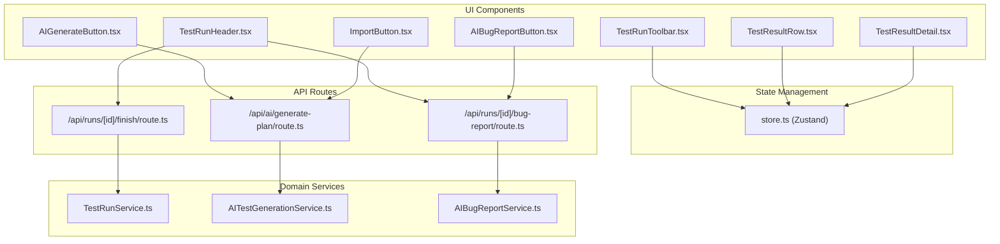
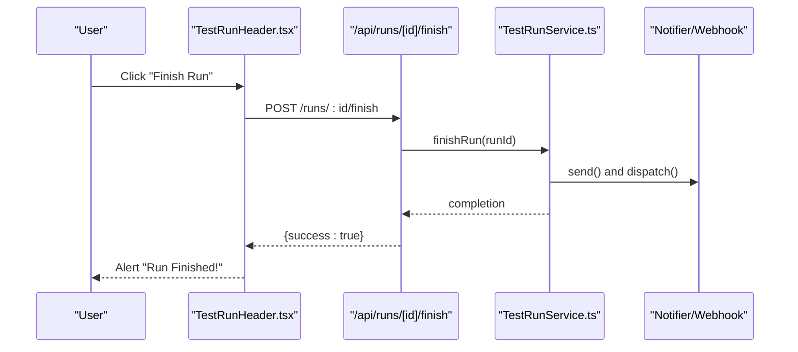
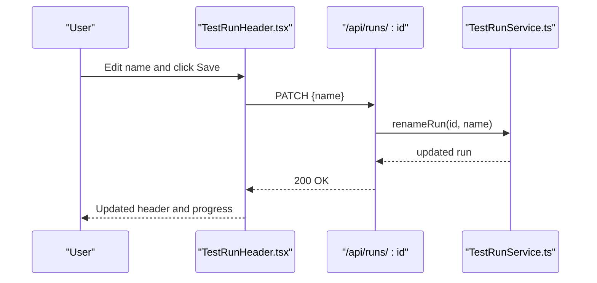
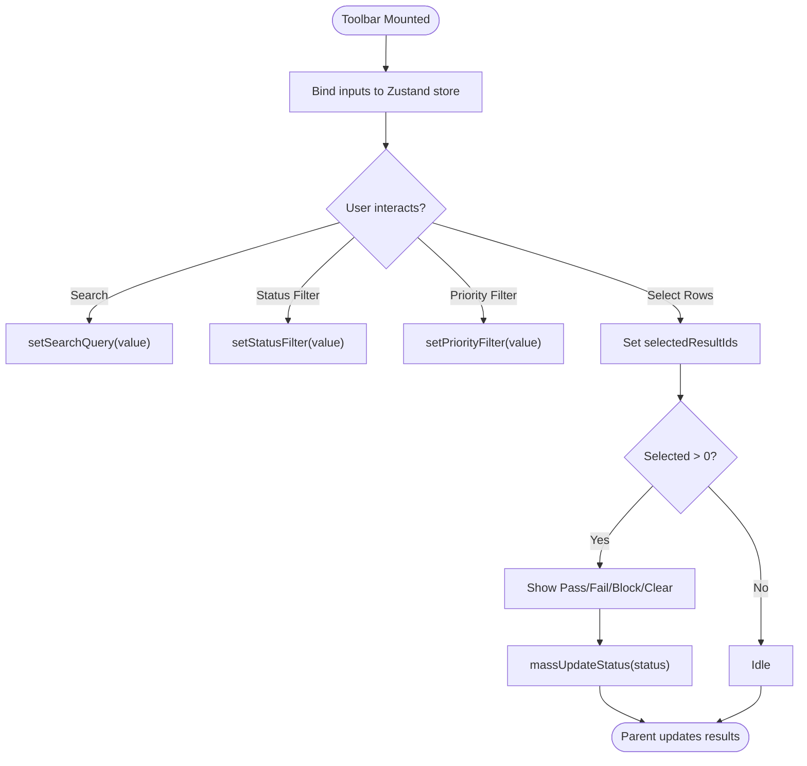
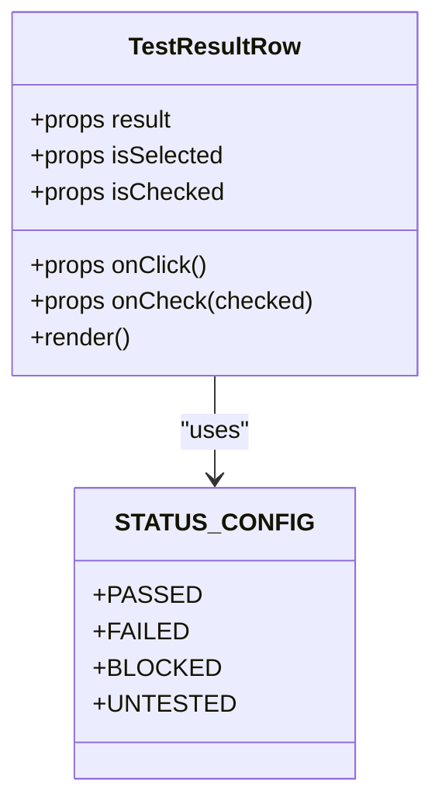
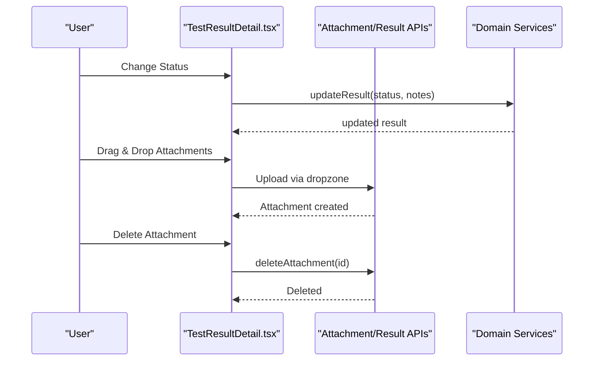
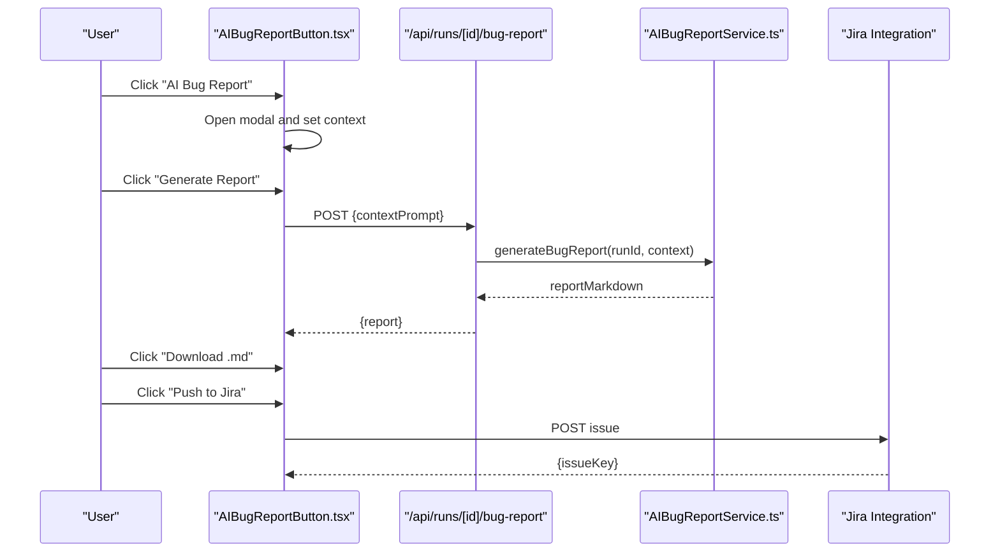
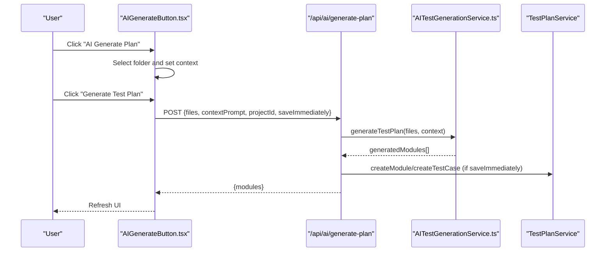
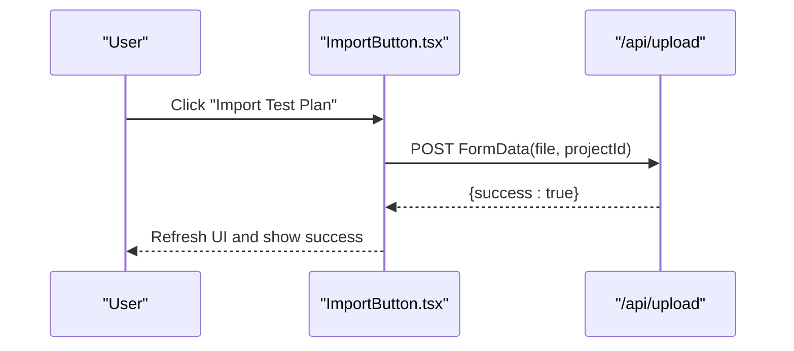
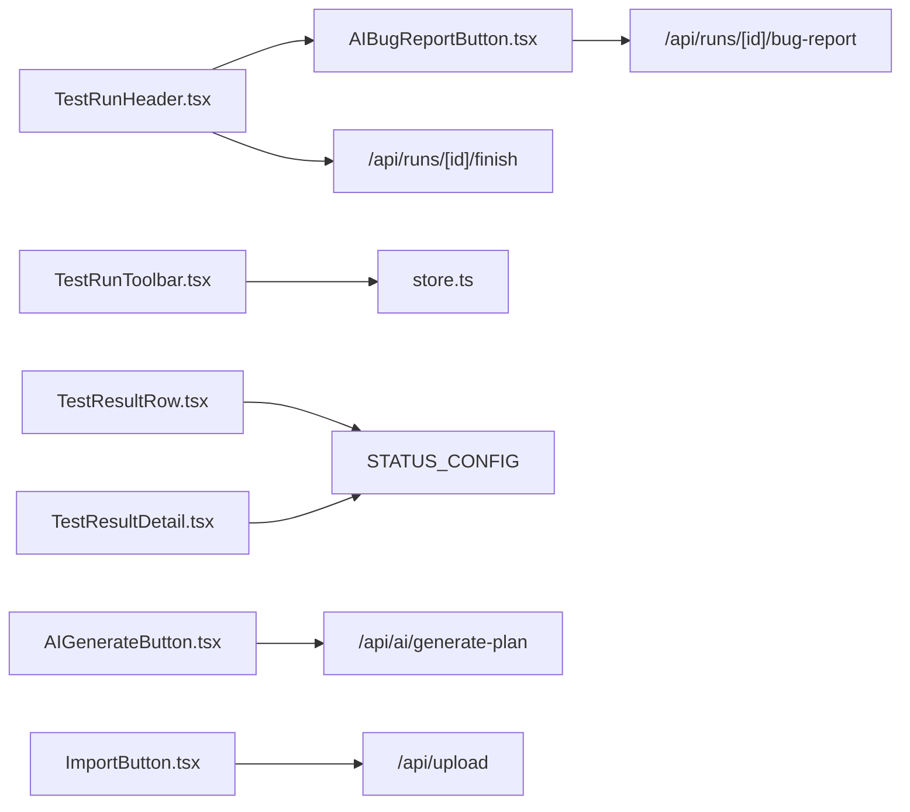

# Custom Test Components

<cite>
**Referenced Files in This Document**
- [TestRunHeader.tsx](file://src/ui/test-run/TestRunHeader.tsx)
- [TestRunToolbar.tsx](file://src/ui/test-run/TestRunToolbar.tsx)
- [TestResultRow.tsx](file://src/ui/test-run/TestResultRow.tsx)
- [TestResultDetail.tsx](file://src/ui/test-run/TestResultDetail.tsx)
- [AIBugReportButton.tsx](file://src/ui/test-run/AIBugReportButton.tsx)
- [AIGenerateButton.tsx](file://src/ui/test-design/AIGenerateButton.tsx)
- [ImportButton.tsx](file://src/ui/test-design/ImportButton.tsx)
- [store.ts](file://src/infrastructure/state/store.ts)
- [index.ts](file://src/domain/types/index.ts)
- [TestRunService.ts](file://src/domain/services/TestRunService.ts)
- [AITestGenerationService.ts](file://src/domain/services/AITestGenerationService.ts)
- [AIBugReportService.ts](file://src/domain/services/AIBugReportService.ts)
- [route.ts](file://app/api/runs/[id]/bug-report/route.ts)
- [route.ts](file://app/api/ai/generate-plan/route.ts)
- [route.ts](file://app/api/runs/[id]/finish/route.ts)
</cite>

## Table of Contents
1. [Introduction](#introduction)
2. [Project Structure](#project-structure)
3. [Core Components](#core-components)
4. [Architecture Overview](#architecture-overview)
5. [Detailed Component Analysis](#detailed-component-analysis)
6. [Dependency Analysis](#dependency-analysis)
7. [Performance Considerations](#performance-considerations)
8. [Troubleshooting Guide](#troubleshooting-guide)
9. [Conclusion](#conclusion)
10. [Appendices](#appendices)

## Introduction
This document provides comprehensive documentation for specialized test management components focused on test execution and AI-assisted workflows. It covers:
- TestRunHeader for run metadata display and editing
- TestRunToolbar for filtering, searching, and mass actions
- TestResultRow for individual test result presentation
- TestResultDetail for detailed result editing and attachments
- AIBugReportButton for automated bug report generation
- AI-powered test design components (AIGenerateButton, ImportButton)

It explains data binding patterns, state management integration via a centralized store, user interaction workflows, and the components’ roles in the test execution lifecycle. It also details integration with domain services and repository patterns, along with guidelines for extending components and adding new functionality.

## Project Structure
The test management UI components live under src/ui/test-run and src/ui/test-design. State management is handled by a Zustand store. Domain services encapsulate business logic and coordinate with repositories and external systems. API routes act as façades to services.

**Diagram sources**
- [TestRunHeader.tsx:1-139](file://src/ui/test-run/TestRunHeader.tsx#L1-L139)
- [TestRunToolbar.tsx:1-70](file://src/ui/test-run/TestRunToolbar.tsx#L1-L70)
- [TestResultRow.tsx:1-63](file://src/ui/test-run/TestResultRow.tsx#L1-L63)
- [TestResultDetail.tsx:1-154](file://src/ui/test-run/TestResultDetail.tsx#L1-L154)
- [AIBugReportButton.tsx:1-195](file://src/ui/test-run/AIBugReportButton.tsx#L1-L195)
- [AIGenerateButton.tsx:1-166](file://src/ui/test-design/AIGenerateButton.tsx#L1-L166)
- [ImportButton.tsx:1-74](file://src/ui/test-design/ImportButton.tsx#L1-L74)
- [store.ts:1-46](file://src/infrastructure/state/store.ts#L1-L46)
- [TestRunService.ts:1-125](file://src/domain/services/TestRunService.ts#L1-L125)
- [AITestGenerationService.ts:1-82](file://src/domain/services/AITestGenerationService.ts#L1-L82)
- [AIBugReportService.ts:1-70](file://src/domain/services/AIBugReportService.ts#L1-L70)
- [route.ts:1-19](file://app/api/runs/[id]/bug-report/route.ts#L1-L19)
- [route.ts:1-32](file://app/api/ai/generate-plan/route.ts#L1-L32)
- [route.ts:1-15](file://app/api/runs/[id]/finish/route.ts#L1-L15)

**Section sources**
- [TestRunHeader.tsx:1-139](file://src/ui/test-run/TestRunHeader.tsx#L1-L139)
- [TestRunToolbar.tsx:1-70](file://src/ui/test-run/TestRunToolbar.tsx#L1-L70)
- [TestResultRow.tsx:1-63](file://src/ui/test-run/TestResultRow.tsx#L1-L63)
- [TestResultDetail.tsx:1-154](file://src/ui/test-run/TestResultDetail.tsx#L1-L154)
- [AIBugReportButton.tsx:1-195](file://src/ui/test-run/AIBugReportButton.tsx#L1-L195)
- [AIGenerateButton.tsx:1-166](file://src/ui/test-design/AIGenerateButton.tsx#L1-L166)
- [ImportButton.tsx:1-74](file://src/ui/test-design/ImportButton.tsx#L1-L74)
- [store.ts:1-46](file://src/infrastructure/state/store.ts#L1-L46)
- [index.ts:1-196](file://src/domain/types/index.ts#L1-L196)
- [TestRunService.ts:1-125](file://src/domain/services/TestRunService.ts#L1-L125)
- [AITestGenerationService.ts:1-82](file://src/domain/services/AITestGenerationService.ts#L1-L82)
- [AIBugReportService.ts:1-70](file://src/domain/services/AIBugReportService.ts#L1-L70)
- [route.ts:1-19](file://app/api/runs/[id]/bug-report/route.ts#L1-L19)
- [route.ts:1-32](file://app/api/ai/generate-plan/route.ts#L1-L32)
- [route.ts:1-15](file://app/api/runs/[id]/finish/route.ts#L1-L15)

## Core Components
This section summarizes each component’s purpose, props, state, and integration points.

- TestRunHeader
  - Purpose: Render run metadata, inline edit run name, finish run, export report, and show progress bar.
  - Props: run, stats.
  - State: Editing mode, saving state, local name copy.
  - Integration: Calls API routes for renaming and finishing; composes AIBugReportButton.
  - Lifecycle role: Entry point for run-level actions; displays run statistics.

- TestRunToolbar
  - Purpose: Provide search, status filter, priority filter, and mass status update controls.
  - Props: massUpdateStatus callback.
  - State: Uses Zustand store for filters and selection.
  - Integration: Updates global selection and filters; triggers bulk status changes.

- TestResultRow
  - Purpose: Present a single test result row with status icon, priority badge, and navigation affordance.
  - Props: result, isSelected, isChecked, onClick, onCheck.
  - State: None; purely presentational with controlled props.
  - Integration: Consumes shared STATUS_CONFIG for consistent visuals.

- TestResultDetail
  - Purpose: Detail view for a selected test result: status buttons, steps, expected result, notes, attachments.
  - Props: selectedResult, onClose, updateStatus, updateNotes, deleteAttachment, dropzoneProps.
  - State: None; delegates state to parent via callbacks.
  - Integration: Uses shared STATUS_CONFIG; integrates with attachment upload/drop zone.

- AIBugReportButton
  - Purpose: Modal-driven AI bug report generation from failed/blocked results; optional push to Jira.
  - Props: runId.
  - State: Modal open/closed, generating, context prompt, report text, Jira push state.
  - Integration: Calls /api/runs/[id]/bug-report; optionally posts to Jira integration endpoint.

- AIGenerateButton
  - Purpose: AI-powered test plan generation from selected source code; optionally saves immediately.
  - Props: none.
  - State: Modal open/closed, generating, context prompt, file list, project selection.
  - Integration: Calls /api/ai/generate-plan; refreshes UI after successful save.

- ImportButton
  - Purpose: Import test plan from markdown or HTML into the active project.
  - Props: none.
  - State: Loading, message feedback.
  - Integration: Posts to /api/upload with FormData; refreshes UI on success.

**Section sources**
- [TestRunHeader.tsx:6-15](file://src/ui/test-run/TestRunHeader.tsx#L6-L15)
- [TestRunHeader.tsx:17-47](file://src/ui/test-run/TestRunHeader.tsx#L17-L47)
- [TestRunToolbar.tsx:5-7](file://src/ui/test-run/TestRunToolbar.tsx#L5-L7)
- [TestRunToolbar.tsx:9-68](file://src/ui/test-run/TestRunToolbar.tsx#L9-L68)
- [TestResultRow.tsx:12-18](file://src/ui/test-run/TestResultRow.tsx#L12-L18)
- [TestResultRow.tsx:20-61](file://src/ui/test-run/TestResultRow.tsx#L20-L61)
- [TestResultDetail.tsx:6-17](file://src/ui/test-run/TestResultDetail.tsx#L6-L17)
- [TestResultDetail.tsx:19-151](file://src/ui/test-run/TestResultDetail.tsx#L19-L151)
- [AIBugReportButton.tsx:7-18](file://src/ui/test-run/AIBugReportButton.tsx#L7-L18)
- [AIBugReportButton.tsx:11-84](file://src/ui/test-run/AIBugReportButton.tsx#L11-L84)
- [AIGenerateButton.tsx:9-80](file://src/ui/test-design/AIGenerateButton.tsx#L9-L80)
- [ImportButton.tsx:8-51](file://src/ui/test-design/ImportButton.tsx#L8-L51)

## Architecture Overview
The components follow a unidirectional data flow:
- UI components render based on props and store state.
- Actions trigger API calls via route handlers.
- Domain services orchestrate repositories and external integrations.
- Results update the store or trigger UI refresh.

**Diagram sources**
- [TestRunHeader.tsx:104-113](file://src/ui/test-run/TestRunHeader.tsx#L104-L113)
- [route.ts:7-14](file://app/api/runs/[id]/finish/route.ts#L7-L14)
- [TestRunService.ts:86-123](file://src/domain/services/TestRunService.ts#L86-L123)

## Detailed Component Analysis

### TestRunHeader
- Data binding patterns
  - Controlled input for run name with optimistic update on success.
  - Stats percentage computed from totals; progress bar widths reflect counts.
- State management integration
  - Uses local component state for editing and saving; relies on parent-provided run object.
- User interaction workflows
  - Inline edit: Enter to save, Escape to cancel; Save button triggers PATCH to /api/runs/:id.
  - Finish run: Confirms action, then POSTs to /api/runs/:id/finish; alerts on completion.
  - Export report: Opens download link to /api/runs/:id/export.
- Role in lifecycle
  - Run metadata display and control; signals completion and notification dispatch.

**Diagram sources**
- [TestRunHeader.tsx:24-46](file://src/ui/test-run/TestRunHeader.tsx#L24-L46)
- [route.ts:1-200](file://app/api/runs/[id]/route.ts#L1-L200)
- [TestRunService.ts:53-62](file://src/domain/services/TestRunService.ts#L53-L62)

**Section sources**
- [TestRunHeader.tsx:17-139](file://src/ui/test-run/TestRunHeader.tsx#L17-L139)
- [TestRunService.ts:53-62](file://src/domain/services/TestRunService.ts#L53-L62)

### TestRunToolbar
- Data binding patterns
  - Two-way binding for search and filter inputs; controlled via Zustand store setters.
- State management integration
  - Reads and writes searchQuery, statusFilter, priorityFilter, selectedResultIds, and selectedIndex via useTestRunStore.
- User interaction workflows
  - Search: Updates search term; filtered rows rendered by parent.
  - Filters: Update status/priority filters; parent re-renders lists accordingly.
  - Mass update: When items are selected, buttons call massUpdateStatus with chosen status.
- Role in lifecycle
  - Provides global filtering and selection context for result list and detail panes.

**Diagram sources**
- [TestRunToolbar.tsx:9-68](file://src/ui/test-run/TestRunToolbar.tsx#L9-L68)
- [store.ts:22-45](file://src/infrastructure/state/store.ts#L22-L45)

**Section sources**
- [TestRunToolbar.tsx:9-68](file://src/ui/test-run/TestRunToolbar.tsx#L9-L68)
- [store.ts:6-20](file://src/infrastructure/state/store.ts#L6-L20)

### TestResultRow
- Data binding patterns
  - Checkbox bound to isChecked; click toggles selection; click handler stops propagation to avoid row selection conflicts.
- State management integration
  - Delegates selection and check actions to parent via callbacks; uses shared STATUS_CONFIG for consistent visuals.
- User interaction workflows
  - Click row navigates to detail view; checkbox toggles selection.
- Role in lifecycle
  - Entry point for drill-down into TestResultDetail; supports bulk operations via toolbar.

**Diagram sources**
- [TestResultRow.tsx:12-18](file://src/ui/test-run/TestResultRow.tsx#L12-L18)
- [TestResultRow.tsx:20-61](file://src/ui/test-run/TestResultRow.tsx#L20-L61)

**Section sources**
- [TestResultRow.tsx:20-63](file://src/ui/test-run/TestResultRow.tsx#L20-L63)

### TestResultDetail
- Data binding patterns
  - Status buttons iterate over statuses; active status highlighted.
  - Notes textarea uses controlled onBlur to persist changes.
  - Attachments list renders images, videos, or generic documents; delete via callback.
- State management integration
  - Receives selectedResult from parent; delegates updates to parent callbacks.
- User interaction workflows
  - Update status: Click status button invokes updateStatus.
  - Update notes: Blur textarea invokes updateNotes.
  - Upload attachments: Dropzone integration via getRootProps/getInputProps/isDragActive.
  - Delete attachment: Click trash invokes deleteAttachment.
- Role in lifecycle
  - Final stage for result editing; integrates with attachment service and persistence.

**Diagram sources**
- [TestResultDetail.tsx:19-26](file://src/ui/test-run/TestResultDetail.tsx#L19-L26)
- [TestResultDetail.tsx:47-65](file://src/ui/test-run/TestResultDetail.tsx#L47-L65)
- [TestResultDetail.tsx:84-89](file://src/ui/test-run/TestResultDetail.tsx#L84-L89)
- [TestResultDetail.tsx:95-104](file://src/ui/test-run/TestResultDetail.tsx#L95-L104)
- [TestResultDetail.tsx:137-144](file://src/ui/test-run/TestResultDetail.tsx#L137-L144)

**Section sources**
- [TestResultDetail.tsx:19-151](file://src/ui/test-run/TestResultDetail.tsx#L19-L151)

### AIBugReportButton
- Data binding patterns
  - Context prompt stored locally; modal toggled via isOpen.
- State management integration
  - Uses local state for UI flow; integrates with domain service via API route.
- User interaction workflows
  - Open modal, optionally set context prompt, generate report, download as Markdown, or push to Jira.
- Role in lifecycle
  - Post-execution analysis; transforms failed/blocked results into actionable developer artifacts.

**Diagram sources**
- [AIBugReportButton.tsx:20-41](file://src/ui/test-run/AIBugReportButton.tsx#L20-L41)
- [AIBugReportButton.tsx:56-84](file://src/ui/test-run/AIBugReportButton.tsx#L56-L84)
- [route.ts:8-18](file://app/api/runs/[id]/bug-report/route.ts#L8-L18)
- [AIBugReportService.ts:16-68](file://src/domain/services/AIBugReportService.ts#L16-L68)

**Section sources**
- [AIBugReportButton.tsx:11-195](file://src/ui/test-run/AIBugReportButton.tsx#L11-L195)
- [AIBugReportService.ts:10-70](file://src/domain/services/AIBugReportService.ts#L10-L70)
- [route.ts:1-19](file://app/api/runs/[id]/bug-report/route.ts#L1-L19)

### AIGenerateButton
- Data binding patterns
  - Context prompt stored locally; file list populated via folder selection.
- State management integration
  - Uses local state for UI flow; reads activeProjectId from project store.
- User interaction workflows
  - Choose project folder, set context, generate plan, optionally save immediately to project.
- Role in lifecycle
  - Pre-execution planning; generates modules and test cases for future runs.

**Diagram sources**
- [AIGenerateButton.tsx:17-43](file://src/ui/test-design/AIGenerateButton.tsx#L17-L43)
- [AIGenerateButton.tsx:45-80](file://src/ui/test-design/AIGenerateButton.tsx#L45-L80)
- [route.ts:8-31](file://app/api/ai/generate-plan/route.ts#L8-L31)
- [AITestGenerationService.ts:28-80](file://src/domain/services/AITestGenerationService.ts#L28-L80)

**Section sources**
- [AIGenerateButton.tsx:9-166](file://src/ui/test-design/AIGenerateButton.tsx#L9-L166)
- [AITestGenerationService.ts:25-82](file://src/domain/services/AITestGenerationService.ts#L25-L82)
- [route.ts:1-32](file://app/api/ai/generate-plan/route.ts#L1-L32)

### ImportButton
- Data binding patterns
  - Hidden file input triggers upload; controlled loading and message states.
- State management integration
  - Uses local state for feedback; reads activeProjectId from project store.
- User interaction workflows
  - Click label opens file dialog; uploads to /api/upload with FormData; refreshes UI on success.
- Role in lifecycle
  - Alternative pre-execution planning; imports external test plans.

**Diagram sources**
- [ImportButton.tsx:14-51](file://src/ui/test-design/ImportButton.tsx#L14-L51)
- [route.ts:1-200](file://app/api/upload/route.ts#L1-L200)

**Section sources**
- [ImportButton.tsx:8-74](file://src/ui/test-design/ImportButton.tsx#L8-L74)

## Dependency Analysis
- Component coupling
  - TestRunHeader depends on AIBugReportButton and API routes.
  - TestRunToolbar depends on Zustand store and massUpdateStatus prop.
  - TestResultRow and TestResultDetail depend on shared STATUS_CONFIG and parent callbacks.
  - AI components depend on domain services and API routes.
- External dependencies
  - Zustand for state management.
  - Lucide icons for UI.
  - Modal component for AI modals.
- Potential circular dependencies
  - None observed among these components; services are injected via DI container in routes.

**Diagram sources**
- [TestRunHeader.tsx:4-114](file://src/ui/test-run/TestRunHeader.tsx#L4-L114)
- [TestRunToolbar.tsx:3-15](file://src/ui/test-run/TestRunToolbar.tsx#L3-L15)
- [TestResultRow.tsx:5-10](file://src/ui/test-run/TestResultRow.tsx#L5-L10)
- [TestResultDetail.tsx:4-25](file://src/ui/test-run/TestResultDetail.tsx#L4-L25)
- [AIBugReportButton.tsx:1-195](file://src/ui/test-run/AIBugReportButton.tsx#L1-L195)
- [AIGenerateButton.tsx:1-166](file://src/ui/test-design/AIGenerateButton.tsx#L1-L166)
- [ImportButton.tsx:1-74](file://src/ui/test-design/ImportButton.tsx#L1-L74)
- [store.ts:1-46](file://src/infrastructure/state/store.ts#L1-L46)
- [route.ts:1-19](file://app/api/runs/[id]/bug-report/route.ts#L1-L19)
- [route.ts:1-32](file://app/api/ai/generate-plan/route.ts#L1-L32)
- [route.ts:1-15](file://app/api/runs/[id]/finish/route.ts#L1-L15)

**Section sources**
- [index.ts:3-5](file://src/domain/types/index.ts#L3-L5)
- [store.ts:1-46](file://src/infrastructure/state/store.ts#L1-L46)

## Performance Considerations
- Rendering
  - Keep result lists virtualized for large datasets to reduce DOM nodes.
  - Memoize derived stats and computed percentages in parent containers.
- Network
  - Debounce search queries; throttle API calls.
  - Batch mass updates where possible to minimize network requests.
- AI operations
  - Limit file count and prompt sizes for AI generation to control latency.
  - Cache AI prompts and results where appropriate to avoid repeated processing.
- State updates
  - Use selective state updates in Zustand to avoid unnecessary re-renders.

## Troubleshooting Guide
- Finish run does nothing
  - Verify run exists and user confirmed action; check /api/runs/[id]/finish response.
- Rename run fails
  - Ensure runId is valid; confirm PATCH request succeeds; check service error handling.
- AI Bug Report modal closes unexpectedly
  - Opening while generating is disabled; wait for generation to complete.
- AI Generate Plan shows “Please select a project”
  - Ensure active project is selected before generating; confirm projectId is present.
- Import fails
  - Confirm file type is accepted (.md, .html); ensure project is selected; check server response.

**Section sources**
- [TestRunHeader.tsx:104-113](file://src/ui/test-run/TestRunHeader.tsx#L104-L113)
- [TestRunHeader.tsx:24-46](file://src/ui/test-run/TestRunHeader.tsx#L24-L46)
- [AIBugReportButton.tsx:89-94](file://src/ui/test-run/AIBugReportButton.tsx#L89-L94)
- [AIGenerateButton.tsx:46-49](file://src/ui/test-design/AIGenerateButton.tsx#L46-L49)
- [ImportButton.tsx:19-23](file://src/ui/test-design/ImportButton.tsx#L19-L23)

## Conclusion
These components form a cohesive test execution and planning toolkit:
- TestRunHeader and TestRunToolbar manage run-level metadata and filtering.
- TestResultRow and TestResultDetail enable efficient result review and editing.
- AIBugReportButton streamlines defect reporting post-execution.
- AIGenerateButton and ImportButton support AI-driven and manual test plan creation.

They integrate cleanly with domain services and API routes, leveraging a centralized store for consistent state management and scalable extension points.

## Appendices

### Component Composition Guidelines
- Prefer passing minimal props; derive computed values in parents.
- Centralize shared constants (e.g., STATUS_CONFIG) for consistency.
- Encapsulate side effects behind callbacks to keep components testable.

### Prop Requirements Reference
- TestRunHeader
  - run: object with id and name
  - stats: object with PASSED, FAILED, BLOCKED, UNTESTED, total
- TestRunToolbar
  - massUpdateStatus: function(status)
- TestResultRow
  - result: object with testCase and status
  - isSelected: boolean
  - isChecked: boolean
  - onClick: function
  - onCheck: function(checked)
- TestResultDetail
  - selectedResult: object with testCase, attachments, notes
  - onClose: function
  - updateStatus: function(id, status)
  - updateNotes: function(id, notes) -> Promise<void>
  - deleteAttachment: function(id) -> Promise<void>
  - dropzoneProps: { getRootProps, getInputProps, isDragActive }
- AIBugReportButton
  - runId: string
- AIGenerateButton
  - none
- ImportButton
  - none

### Event Handling Patterns
- Controlled inputs: onBlur or onChange with immediate persistence.
- Bulk actions: Use selection set from store; apply massUpdateStatus callback.
- AI flows: Guard against concurrent operations; disable controls during async work.

### Extending Test Components
- Add new filters: Extend Zustand store with new filter fields and update toolbar selectors.
- New status values: Update domain types and STATUS_CONFIG; ensure services handle new states.
- New AI features: Introduce new domain services and API routes; wire into existing modals or new ones.
- Integrations: Add new external endpoints (e.g., Jira, Slack) and surface controls in relevant components.