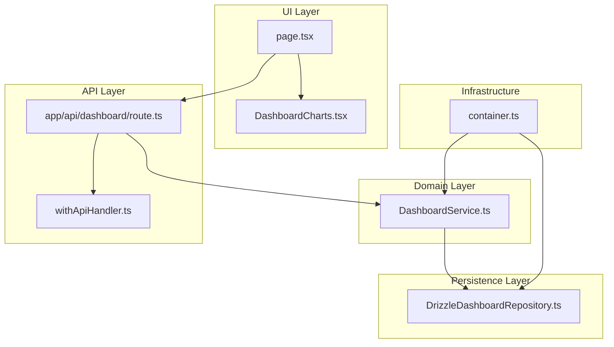
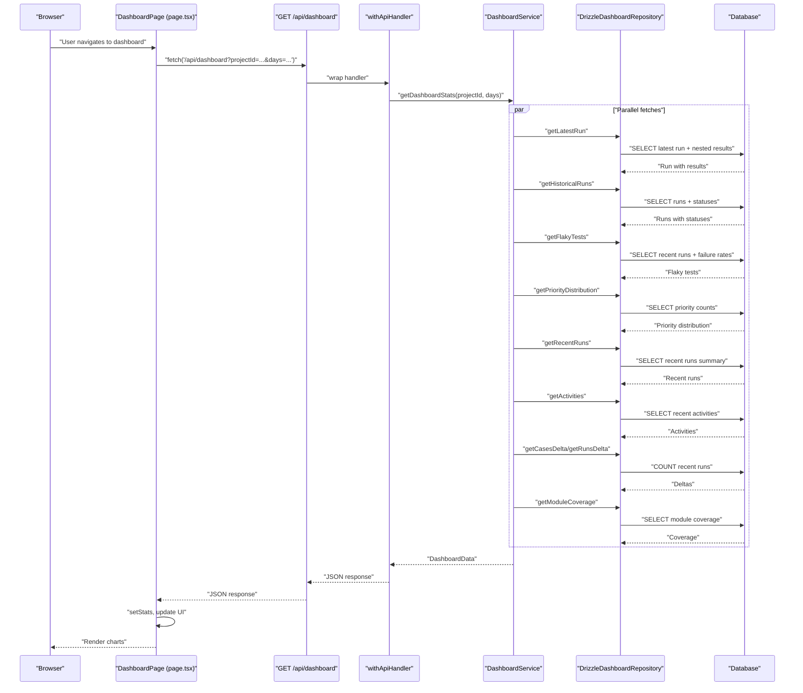
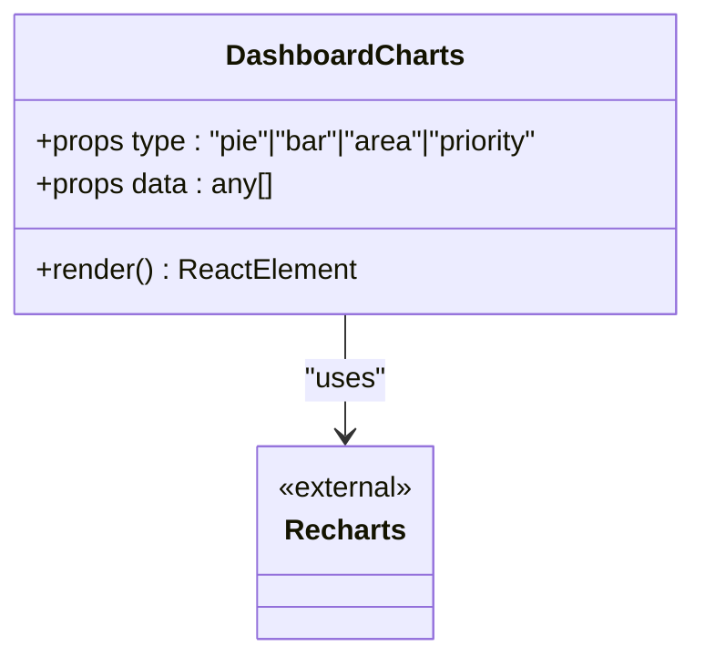
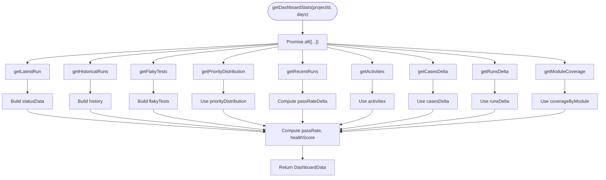
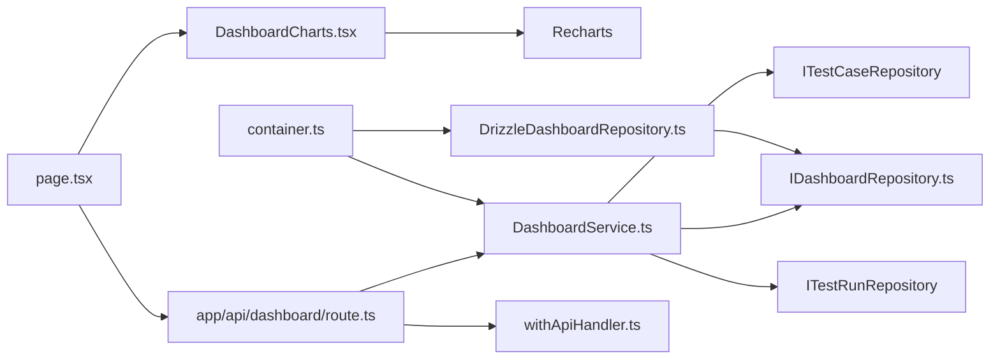

# Dashboard Components

<cite>
**Referenced Files in This Document**
- [DashboardCharts.tsx](file://src/ui/dashboard/DashboardCharts.tsx)
- [DashboardService.ts](file://src/domain/services/DashboardService.ts)
- [DrizzleDashboardRepository.ts](file://src/adapters/persistence/drizzle/DrizzleDashboardRepository.ts)
- [route.ts](file://app/api/dashboard/route.ts)
- [page.tsx](file://app/page.tsx)
- [container.ts](file://src/infrastructure/container.ts)
- [withApiHandler.ts](file://app/api/_lib/withApiHandler.ts)
- [DomainErrors.ts](file://src/domain/errors/DomainErrors.ts)
- [index.ts](file://src/domain/types/index.ts)
- [IDashboardRepository.ts](file://src/domain/ports/repositories/IDashboardRepository.ts)
</cite>

## Table of Contents
1. [Introduction](#introduction)
2. [Project Structure](#project-structure)
3. [Core Components](#core-components)
4. [Architecture Overview](#architecture-overview)
5. [Detailed Component Analysis](#detailed-component-analysis)
6. [Dependency Analysis](#dependency-analysis)
7. [Performance Considerations](#performance-considerations)
8. [Troubleshooting Guide](#troubleshooting-guide)
9. [Conclusion](#conclusion)
10. [Appendices](#appendices)

## Introduction
This document provides comprehensive documentation for the dashboard-specific components and data visualization elements, focusing on the DashboardCharts component and its integration with analytics data from the DashboardService. It explains chart types, data formatting, interactive features, responsive design, and the end-to-end data pipeline from API to UI. It also covers configuration options, color schemes, tooltips, drill-down capabilities, and guidelines for extending the system with new chart types and optimizing performance for large datasets.

## Project Structure
The dashboard visualization is composed of:
- UI component: DashboardCharts renders multiple chart types using Recharts.
- Domain service: DashboardService orchestrates data aggregation from repositories.
- Persistence adapter: DrizzleDashboardRepository implements repository methods for analytics queries.
- API endpoint: app/api/dashboard/route.ts exposes a REST endpoint backed by the service.
- Page integration: app/page.tsx fetches data, manages loading states, and renders charts.
- DI container: src/infrastructure/container.ts wires services and repositories.

**Diagram sources**
- [DashboardCharts.tsx:1-178](file://src/ui/dashboard/DashboardCharts.tsx#L1-L178)
- [DashboardService.ts:1-182](file://src/domain/services/DashboardService.ts#L1-L182)
- [DrizzleDashboardRepository.ts:1-313](file://src/adapters/persistence/drizzle/DrizzleDashboardRepository.ts#L1-L313)
- [route.ts:1-24](file://app/api/dashboard/route.ts#L1-L24)
- [page.tsx:228-619](file://app/page.tsx#L228-L619)
- [container.ts:1-126](file://src/infrastructure/container.ts#L1-L126)
- [withApiHandler.ts:1-65](file://app/api/_lib/withApiHandler.ts#L1-L65)

**Section sources**
- [DashboardCharts.tsx:1-178](file://src/ui/dashboard/DashboardCharts.tsx#L1-L178)
- [DashboardService.ts:1-182](file://src/domain/services/DashboardService.ts#L1-L182)
- [DrizzleDashboardRepository.ts:1-313](file://src/adapters/persistence/drizzle/DrizzleDashboardRepository.ts#L1-L313)
- [route.ts:1-24](file://app/api/dashboard/route.ts#L1-L24)
- [page.tsx:228-619](file://app/page.tsx#L228-L619)
- [container.ts:1-126](file://src/infrastructure/container.ts#L1-L126)
- [withApiHandler.ts:1-65](file://app/api/_lib/withApiHandler.ts#L1-L65)

## Core Components
- DashboardCharts: A reusable chart renderer supporting pie, area, priority bar, and module success rate bar charts. It uses Recharts primitives and Tailwind classes for responsive sizing and theme-aware styling.
- DashboardService: Aggregates dashboard analytics by fetching and computing metrics from repositories in parallel, including status distributions, historical pass rates, module success rates, priority distributions, recent runs, activities, and health scores.
- DrizzleDashboardRepository: Implements repository methods for analytics queries against the database, including latest run with nested results, historical runs, flaky tests, priority distribution, recent runs, activities, run deltas, and module coverage.
- API route: Exposes a GET endpoint to fetch dashboard stats with validation and standardized error handling.
- Page integration: Fetches data, manages loading and refresh states, and renders charts in a responsive grid layout.

**Section sources**
- [DashboardCharts.tsx:10-178](file://src/ui/dashboard/DashboardCharts.tsx#L10-L178)
- [DashboardService.ts:10-182](file://src/domain/services/DashboardService.ts#L10-L182)
- [DrizzleDashboardRepository.ts:14-313](file://src/adapters/persistence/drizzle/DrizzleDashboardRepository.ts#L14-L313)
- [route.ts:7-22](file://app/api/dashboard/route.ts#L7-L22)
- [page.tsx:228-619](file://app/page.tsx#L228-L619)

## Architecture Overview
The dashboard visualization follows a layered architecture:
- UI layer: DashboardCharts renders charts based on props.
- Domain layer: DashboardService orchestrates analytics computation.
- Persistence layer: DrizzleDashboardRepository executes database queries.
- API layer: Route validates inputs, delegates to service, and returns structured JSON.
- DI container: Wires dependencies for services and repositories.

**Diagram sources**
- [page.tsx:236-269](file://app/page.tsx#L236-L269)
- [route.ts:7-22](file://app/api/dashboard/route.ts#L7-L22)
- [withApiHandler.ts:22-64](file://app/api/_lib/withApiHandler.ts#L22-L64)
- [DashboardService.ts:17-147](file://src/domain/services/DashboardService.ts#L17-L147)
- [DrizzleDashboardRepository.ts:18-313](file://src/adapters/persistence/drizzle/DrizzleDashboardRepository.ts#L18-L313)

## Detailed Component Analysis

### DashboardCharts Component
- Purpose: Render multiple chart types with consistent styling and responsive behavior.
- Chart types:
  - Pie: Status distribution (Passed, Failed, Blocked, Untested).
  - Area: Historical pass rate over time.
  - Priority: Vertical bar chart of test case priorities.
  - Default bar: Module success rate.
- Data format expectations:
  - Pie: Array of objects with name, value, fill.
  - Area: Array of objects with date and passRate.
  - Priority: Array of objects with priority, count, fill.
  - Bar: Array of objects with name and successRate (or count for priority).
- Interactive features:
  - Tooltip with custom styling and formatters.
  - Legend for pie chart.
  - Responsive container for adaptive sizing.
- Styling and theming:
  - Uses Tailwind classes for sizing and spacing.
  - Theme-aware colors via CSS variables for popover, border, muted foreground, accent.
- Color schemes:
  - Status colors: Passed, Failed, Blocked, Untested.
  - Priority colors: P1, P2, P3, P4.
  - Area gradient for pass rate visualization.
- Drill-down:
  - Not implemented in the component itself; intended to be handled by parent page navigation to run/module details.

**Diagram sources**
- [DashboardCharts.tsx:25-178](file://src/ui/dashboard/DashboardCharts.tsx#L25-L178)

**Section sources**
- [DashboardCharts.tsx:10-178](file://src/ui/dashboard/DashboardCharts.tsx#L10-L178)

### DashboardService
- Responsibilities:
  - Aggregate dashboard analytics by orchestrating parallel repository calls.
  - Compute derived metrics: statusData, moduleData, history, flakyTests, passRate, passRateDelta, healthScore.
- Parallelization:
  - Uses Promise.all to fetch multiple datasets concurrently for performance.
- Data transformations:
  - Builds statusData from latest run results.
  - Computes module success rates grouped by module name.
  - Builds historical pass rate series.
  - Filters flaky tests based on recent runs and failure rate thresholds.
  - Calculates passRateDelta from recent runs.
  - Computes healthScore using weighted scoring of passRate, flakyCount, totalCases, totalRuns, and lastRunDate.
- Output:
  - Returns DashboardData with all computed fields.

**Diagram sources**
- [DashboardService.ts:17-147](file://src/domain/services/DashboardService.ts#L17-L147)

**Section sources**
- [DashboardService.ts:10-182](file://src/domain/services/DashboardService.ts#L10-L182)

### DrizzleDashboardRepository
- Methods:
  - getLatestRun: Fetch latest run with nested results, modules, and attachments.
  - getHistoricalRuns: Fetch runs with statuses for historical analysis.
  - getFlakyTests: Identify flaky tests from recent runs using failure rate thresholds.
  - getPriorityDistribution: Count test cases by priority with color mapping.
  - getRecentRuns: Summarize recent runs with pass/fail/block/untested counts.
  - getActivities: Generate activity feed messages for recent runs.
  - getCasesDelta: Placeholder returning zero (requires createdAt on TestCase).
  - getRunsDelta: Count runs within a date window.
  - getModuleCoverage: Compute pass rates per module based on latest run.
- Data shaping:
  - Normalizes results into arrays of objects suitable for UI rendering.
  - Applies color mapping for priority distribution.
  - Computes pass rates and aggregates counts.

**Section sources**
- [DrizzleDashboardRepository.ts:14-313](file://src/adapters/persistence/drizzle/DrizzleDashboardRepository.ts#L14-L313)

### API Endpoint and Error Handling
- Endpoint: GET /api/dashboard
- Query params:
  - projectId (required)
  - days (optional, defaults to 14)
- Validation:
  - Returns 400 with VALIDATION_ERROR if projectId is missing.
- Error handling:
  - withApiHandler centralizes error mapping:
    - ZodError -> 400 with details.
    - DomainError -> mapped HTTP status.
    - Other errors -> 500 Internal Server Error.
- Response:
  - JSON payload containing DashboardData.

**Section sources**
- [route.ts:7-22](file://app/api/dashboard/route.ts#L7-L22)
- [withApiHandler.ts:22-64](file://app/api/_lib/withApiHandler.ts#L22-L64)
- [DomainErrors.ts:7-39](file://src/domain/errors/DomainErrors.ts#L7-L39)

### Page Integration and Data Binding
- Data fetching:
  - Uses fetch to call /api/dashboard with projectId and days.
  - Manages loading, refreshing, and lastRefresh state.
  - Auto-refreshes every 30 seconds while active project is selected.
- Rendering:
  - Renders KPI cards and charts in a responsive grid.
  - Conditionally renders charts when data is available.
  - Integrates with other dashboard features like recent runs, flaky tests, and activity feed.
- Props to DashboardCharts:
  - type and data are passed based on computed stats.

**Section sources**
- [page.tsx:228-619](file://app/page.tsx#L228-L619)

## Dependency Analysis
- DashboardCharts depends on Recharts and Tailwind classes for rendering and styling.
- DashboardService depends on IDashboardRepository, ITestCaseRepository, and ITestRunRepository.
- DrizzleDashboardRepository implements IDashboardRepository and uses Drizzle ORM.
- API route depends on container.ts for dashboardService injection.
- Page depends on DashboardCharts and uses fetch to consume the API.

**Diagram sources**
- [DashboardCharts.tsx:3-8](file://src/ui/dashboard/DashboardCharts.tsx#L3-L8)
- [DashboardService.ts:1-4](file://src/domain/services/DashboardService.ts#L1-L4)
- [DrizzleDashboardRepository.ts:1-5](file://src/adapters/persistence/drizzle/DrizzleDashboardRepository.ts#L1-L5)
- [route.ts:4-5](file://app/api/dashboard/route.ts#L4-L5)
- [withApiHandler.ts:1-3](file://app/api/_lib/withApiHandler.ts#L1-L3)
- [page.tsx:228-619](file://app/page.tsx#L228-L619)
- [container.ts:19-42](file://src/infrastructure/container.ts#L19-L42)

**Section sources**
- [DashboardService.ts:1-15](file://src/domain/services/DashboardService.ts#L1-L15)
- [IDashboardRepository.ts:1-15](file://src/domain/ports/repositories/IDashboardRepository.ts#L1-L15)
- [container.ts:19-59](file://src/infrastructure/container.ts#L19-L59)

## Performance Considerations
- Parallel data fetching: DashboardService uses Promise.all to minimize latency by fetching multiple datasets concurrently.
- Efficient database queries: DrizzleDashboardRepository consolidates related queries and uses joins to reduce round trips.
- Responsive charts: DashboardCharts uses ResponsiveContainer to adapt to container size without manual resize listeners.
- Minimal re-renders: The page component updates state only when new data arrives, avoiding unnecessary renders.
- Recommendations for large datasets:
  - Paginate or downsample historical data (e.g., limit days or aggregate weekly).
  - Virtualize long lists (recent runs, flaky tests) if data grows significantly.
  - Cache frequently accessed metrics (e.g., health score) to avoid recomputation.
  - Consider precomputing aggregates in the database for complex analytics.

[No sources needed since this section provides general guidance]

## Troubleshooting Guide
- Validation errors:
  - Missing projectId returns 400 with VALIDATION_ERROR.
  - Inspect query parameters and ensure projectId is present.
- Domain errors:
  - DomainError subclasses map to specific HTTP status codes; check error code and message.
- Unknown errors:
  - All unexpected errors are logged and returned as 500 INTERNAL_ERROR.
- UI loading states:
  - The page displays a loading spinner until data is fetched; ensure network connectivity and API availability.
- Chart rendering:
  - Verify that data arrays are non-empty before passing to DashboardCharts.
  - Ensure data keys match expected shapes (e.g., name/value for pie, date/passRate for area, priority/count for priority).

**Section sources**
- [route.ts:12-17](file://app/api/dashboard/route.ts#L12-L17)
- [withApiHandler.ts:28-62](file://app/api/_lib/withApiHandler.ts#L28-L62)
- [DomainErrors.ts:7-39](file://src/domain/errors/DomainErrors.ts#L7-L39)
- [page.tsx:283-292](file://app/page.tsx#L283-L292)

## Conclusion
The dashboard visualization integrates a clean separation of concerns: a reusable chart component, a domain service for analytics orchestration, a persistence layer for efficient queries, and a standardized API with robust error handling. The system supports multiple chart types, responsive design, and scalable data fetching patterns. Extending the system with new chart types or visualizations is straightforward by adding new chart variants in DashboardCharts and corresponding data preparation in DashboardService and repositories.

[No sources needed since this section summarizes without analyzing specific files]

## Appendices

### Chart Configuration Options and Customization
- Tooltip customization:
  - DashboardCharts defines a custom tooltip style and formatters for percentage and pass rate labels.
- Color schemes:
  - Status colors for pie chart.
  - Priority colors for priority distribution.
  - Area gradient for pass rate visualization.
- Axis and grid customization:
  - X/Y axes configured with theme-aware colors and tick formatters.
  - Grid lines styled for readability.
- Responsive design:
  - Fixed height containers with ResponsiveContainer enable adaptive scaling.

**Section sources**
- [DashboardCharts.tsx:15-23](file://src/ui/dashboard/DashboardCharts.tsx#L15-L23)
- [DashboardCharts.tsx:46-52](file://src/ui/dashboard/DashboardCharts.tsx#L46-L52)
- [DashboardCharts.tsx:95-98](file://src/ui/dashboard/DashboardCharts.tsx#L95-L98)
- [DashboardCharts.tsx:136](file://src/ui/dashboard/DashboardCharts.tsx#L136)
- [DashboardCharts.tsx:168-171](file://src/ui/dashboard/DashboardCharts.tsx#L168-L171)

### Adding New Chart Types
- Steps:
  - Extend the type union in DashboardCharts props to include the new type.
  - Add a new branch in DashboardCharts to render the chart with appropriate Recharts components.
  - Prepare data in DashboardService and/or repository to match the new chart’s expected shape.
  - Integrate the new chart in the page layout and pass data from stats.
- Example patterns:
  - Use existing patterns for area, bar, and pie charts as templates.
  - Ensure data keys align with chart components (e.g., dataKey, name/value).

**Section sources**
- [DashboardCharts.tsx:10-13](file://src/ui/dashboard/DashboardCharts.tsx#L10-L13)
- [DashboardCharts.tsx:25-178](file://src/ui/dashboard/DashboardCharts.tsx#L25-L178)
- [DashboardService.ts:17-147](file://src/domain/services/DashboardService.ts#L17-L147)
- [DrizzleDashboardRepository.ts:127-149](file://src/adapters/persistence/drizzle/DrizzleDashboardRepository.ts#L127-L149)

### Data Binding Patterns
- From API to UI:
  - Page fetches /api/dashboard and sets stats state.
  - Stats are destructured and passed to DashboardCharts with type and data props.
- Derived metrics:
  - DashboardService computes passRate, passRateDelta, healthScore, and moduleData from raw repository data.
- Repository responsibilities:
  - DrizzleDashboardRepository returns normalized arrays ready for chart consumption.

**Section sources**
- [page.tsx:236-269](file://app/page.tsx#L236-L269)
- [page.tsx:426-466](file://app/page.tsx#L426-L466)
- [DashboardService.ts:46-147](file://src/domain/services/DashboardService.ts#L46-L147)
- [DrizzleDashboardRepository.ts:18-313](file://src/adapters/persistence/drizzle/DrizzleDashboardRepository.ts#L18-L313)

### Types and Contracts
- DashboardData and related types define the shape of analytics data.
- IDashboardRepository defines the contract for analytics queries.
- Domain types describe entities, DTOs, and aggregated analytics.

**Section sources**
- [index.ts:150-175](file://src/domain/types/index.ts#L150-L175)
- [IDashboardRepository.ts:3-12](file://src/domain/ports/repositories/IDashboardRepository.ts#L3-L12)
- [index.ts:88-196](file://src/domain/types/index.ts#L88-L196)