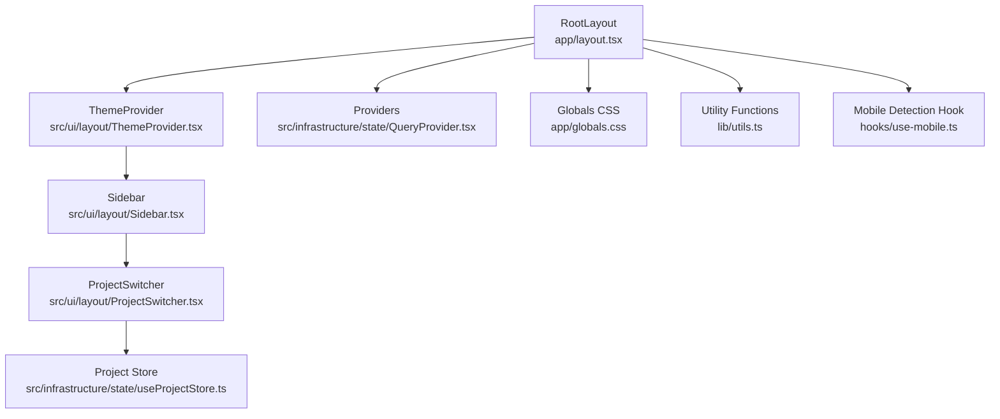
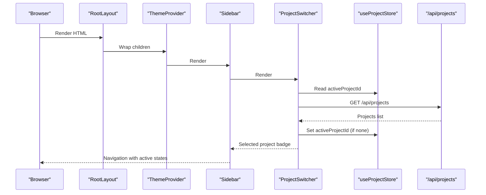
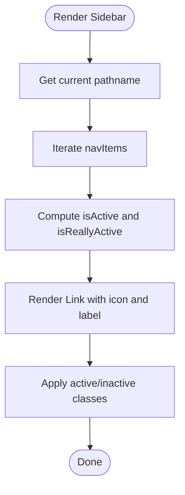
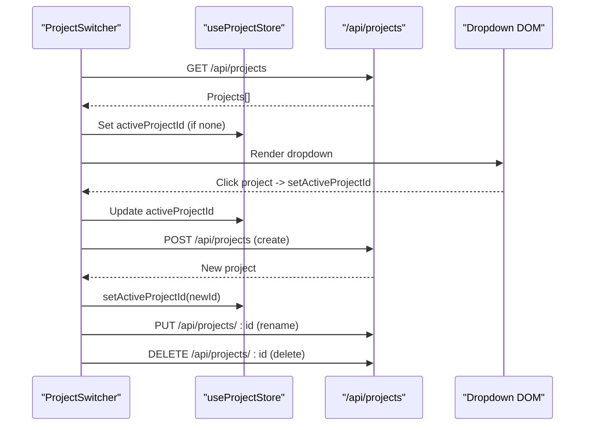
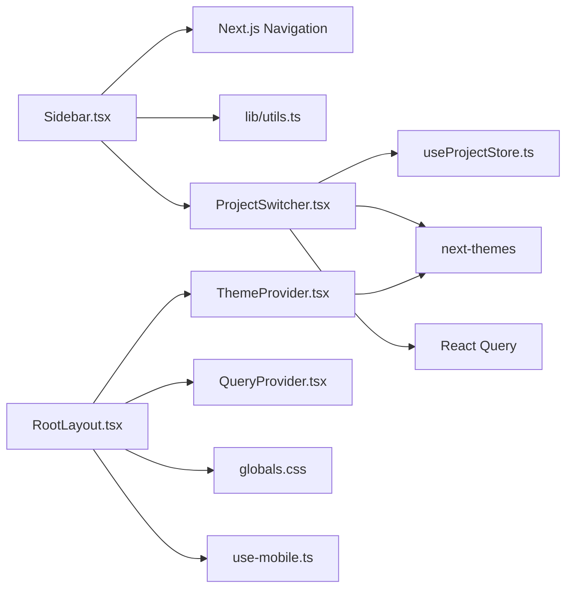

# Layout Components

<cite>
**Referenced Files in This Document**
- [Sidebar.tsx](file://src/ui/layout/Sidebar.tsx)
- [ProjectSwitcher.tsx](file://src/ui/layout/ProjectSwitcher.tsx)
- [ThemeProvider.tsx](file://src/ui/layout/ThemeProvider.tsx)
- [RootLayout.tsx](file://app/layout.tsx)
- [useProjectStore.ts](file://src/infrastructure/state/useProjectStore.ts)
- [QueryProvider.tsx](file://src/infrastructure/state/QueryProvider.tsx)
- [use-mobile.ts](file://hooks/use-mobile.ts)
- [globals.css](file://app/globals.css)
- [utils.ts](file://lib/utils.ts)
</cite>

## Table of Contents
1. [Introduction](#introduction)
2. [Project Structure](#project-structure)
3. [Core Components](#core-components)
4. [Architecture Overview](#architecture-overview)
5. [Detailed Component Analysis](#detailed-component-analysis)
6. [Dependency Analysis](#dependency-analysis)
7. [Performance Considerations](#performance-considerations)
8. [Accessibility and Responsive Design](#accessibility-and-responsive-design)
9. [Troubleshooting Guide](#troubleshooting-guide)
10. [Extending the Layout System](#extending-the-layout-system)
11. [Conclusion](#conclusion)

## Introduction
This document explains the layout components that define the application’s structure and navigation. It focuses on:
- Sidebar: navigation items, active state detection, and integration with the project switcher
- ProjectSwitcher: project selection, CRUD-like actions, and state synchronization via a global store
- ThemeProvider: theme management and CSS variable handling
- Integration with the overall application architecture, including state management and providers
- Accessibility, responsive behavior, and extension guidelines

## Project Structure
The layout system is composed of three primary UI components and supporting infrastructure:
- Sidebar renders the main navigation and integrates the project selector
- ProjectSwitcher manages project selection and related actions
- ThemeProvider wraps the app to enable theme switching
- Root layout composes these components and applies global styles and providers

**Diagram sources**
- [RootLayout.tsx:12-41](file://app/layout.tsx#L12-L41)
- [ThemeProvider.tsx:6-11](file://src/ui/layout/ThemeProvider.tsx#L6-L11)
- [Sidebar.tsx:16-48](file://src/ui/layout/Sidebar.tsx#L16-L48)
- [ProjectSwitcher.tsx:29-396](file://src/ui/layout/ProjectSwitcher.tsx#L29-L396)
- [QueryProvider.tsx:6-21](file://src/infrastructure/state/QueryProvider.tsx#L6-L21)
- [useProjectStore.ts:15-18](file://src/infrastructure/state/useProjectStore.ts#L15-L18)
- [globals.css:1-15](file://app/globals.css#L1-L15)
- [utils.ts:4-6](file://lib/utils.ts#L4-L6)
- [use-mobile.ts:1-19](file://hooks/use-mobile.ts#L1-L19)

**Section sources**
- [RootLayout.tsx:12-41](file://app/layout.tsx#L12-L41)
- [ThemeProvider.tsx:6-11](file://src/ui/layout/ThemeProvider.tsx#L6-L11)
- [Sidebar.tsx:16-48](file://src/ui/layout/Sidebar.tsx#L16-L48)
- [ProjectSwitcher.tsx:29-396](file://src/ui/layout/ProjectSwitcher.tsx#L29-L396)
- [QueryProvider.tsx:6-21](file://src/infrastructure/state/QueryProvider.tsx#L6-L21)
- [useProjectStore.ts:15-18](file://src/infrastructure/state/useProjectStore.ts#L15-L18)
- [globals.css:1-15](file://app/globals.css#L1-L15)
- [utils.ts:4-6](file://lib/utils.ts#L4-L6)
- [use-mobile.ts:1-19](file://hooks/use-mobile.ts#L1-L19)

## Core Components
- Sidebar: Renders a fixed-width vertical sidebar with navigation links and integrates the project switcher. It computes active states based on the current path.
- ProjectSwitcher: Provides a dropdown to select the active project, supports creation, renaming, and deletion, and synchronizes with the global project store.
- ThemeProvider: Wraps the application to enable theme switching and respects system preference.

**Section sources**
- [Sidebar.tsx:9-48](file://src/ui/layout/Sidebar.tsx#L9-L48)
- [ProjectSwitcher.tsx:29-396](file://src/ui/layout/ProjectSwitcher.tsx#L29-L396)
- [ThemeProvider.tsx:6-11](file://src/ui/layout/ThemeProvider.tsx#L6-L11)

## Architecture Overview
The layout components are orchestrated by the root layout. Providers wrap the app to supply React Query and Zustand stores. ThemeProvider enables theme switching. Sidebar consumes Next.js navigation hooks to compute active states. ProjectSwitcher coordinates with the project store and performs API calls to manage projects.

**Diagram sources**
- [RootLayout.tsx:12-41](file://app/layout.tsx#L12-L41)
- [ThemeProvider.tsx:6-11](file://src/ui/layout/ThemeProvider.tsx#L6-L11)
- [Sidebar.tsx:16-48](file://src/ui/layout/Sidebar.tsx#L16-L48)
- [ProjectSwitcher.tsx:46-79](file://src/ui/layout/ProjectSwitcher.tsx#L46-L79)
- [useProjectStore.ts:15-18](file://src/infrastructure/state/useProjectStore.ts#L15-L18)

## Detailed Component Analysis

### Sidebar Component
Responsibilities:
- Define navigation items (Dashboard, Test Cases, Test Runs, Settings)
- Compute active state based on the current pathname
- Render icons and apply active/inactive styles
- Integrate the ProjectSwitcher component

Key behaviors:
- Uses Next.js navigation hook to detect the current path
- Computes active state with special handling for the root path
- Applies Tailwind-based conditional classes via a utility function

**Diagram sources**
- [Sidebar.tsx:16-48](file://src/ui/layout/Sidebar.tsx#L16-L48)

**Section sources**
- [Sidebar.tsx:9-48](file://src/ui/layout/Sidebar.tsx#L9-L48)
- [utils.ts:4-6](file://lib/utils.ts#L4-L6)

### ProjectSwitcher Component
Responsibilities:
- Fetch and display projects
- Allow selecting a project to update the active project in the store
- Create, rename, and delete projects
- Show project statistics (case counts) and confirmation modals for destructive actions

State and effects:
- Manages local state for open/closed dropdown, creation/edit/delete flows
- Uses a ref to handle clicks outside the dropdown
- Synchronizes with the global project store

API interactions:
- Fetch projects on mount
- Create, update, and delete projects via REST endpoints
- Compute per-project case counts

**Diagram sources**
- [ProjectSwitcher.tsx:46-79](file://src/ui/layout/ProjectSwitcher.tsx#L46-L79)
- [ProjectSwitcher.tsx:81-97](file://src/ui/layout/ProjectSwitcher.tsx#L81-L97)
- [ProjectSwitcher.tsx:99-111](file://src/ui/layout/ProjectSwitcher.tsx#L99-L111)
- [ProjectSwitcher.tsx:133-145](file://src/ui/layout/ProjectSwitcher.tsx#L133-L145)
- [useProjectStore.ts:15-18](file://src/infrastructure/state/useProjectStore.ts#L15-L18)

**Section sources**
- [ProjectSwitcher.tsx:29-396](file://src/ui/layout/ProjectSwitcher.tsx#L29-L396)
- [useProjectStore.ts:15-18](file://src/infrastructure/state/useProjectStore.ts#L15-L18)

### ThemeProvider Component
Responsibilities:
- Wrap the application to enable theme switching
- Respect system preference and allow manual overrides
- Manage CSS variables for theme-aware styling

Integration:
- Consumed by the root layout to wrap the entire app
- Works with Tailwind’s dark variant and CSS custom properties

**Section sources**
- [ThemeProvider.tsx:6-11](file://src/ui/layout/ThemeProvider.tsx#L6-L11)
- [RootLayout.tsx:22](file://app/layout.tsx#L22)
- [globals.css:1-2](file://app/globals.css#L1-L2)

## Dependency Analysis
The layout components depend on:
- Next.js navigation and theming libraries
- Zustand for global project state
- React Query for caching and data fetching
- Tailwind CSS and a utility function for class merging

**Diagram sources**
- [Sidebar.tsx:3-7](file://src/ui/layout/Sidebar.tsx#L3-L7)
- [utils.ts:4-6](file://lib/utils.ts#L4-L6)
- [ProjectSwitcher.tsx:3-15](file://src/ui/layout/ProjectSwitcher.tsx#L3-L15)
- [useProjectStore.ts:3](file://src/infrastructure/state/useProjectStore.ts#L3)
- [ThemeProvider.tsx:4](file://src/ui/layout/ThemeProvider.tsx#L4)
- [RootLayout.tsx:3-5](file://app/layout.tsx#L3-L5)
- [QueryProvider.tsx:3-4](file://src/infrastructure/state/QueryProvider.tsx#L3-L4)
- [globals.css:1-2](file://app/globals.css#L1-L2)
- [use-mobile.ts:1](file://hooks/use-mobile.ts#L1)

**Section sources**
- [Sidebar.tsx:3-7](file://src/ui/layout/Sidebar.tsx#L3-L7)
- [ProjectSwitcher.tsx:3-15](file://src/ui/layout/ProjectSwitcher.tsx#L3-L15)
- [useProjectStore.ts:3](file://src/infrastructure/state/useProjectStore.ts#L3)
- [ThemeProvider.tsx:4](file://src/ui/layout/ThemeProvider.tsx#L4)
- [RootLayout.tsx:3-5](file://app/layout.tsx#L3-L5)
- [QueryProvider.tsx:3-4](file://src/infrastructure/state/QueryProvider.tsx#L3-L4)
- [globals.css:1-2](file://app/globals.css#L1-L2)
- [use-mobile.ts:1](file://hooks/use-mobile.ts#L1)

## Performance Considerations
- Sidebar active state computation is lightweight and based on string comparisons.
- ProjectSwitcher fetches project lists on mount and per-project case counts asynchronously; consider debouncing or caching if the list grows large.
- ThemeProvider leverages system themes to reduce unnecessary re-renders.
- Root layout uses minimal wrappers and relies on efficient Tailwind utilities.

## Accessibility and Responsive Design
- Keyboard navigation: Links and buttons are focusable; ensure tab order follows visual hierarchy.
- Screen reader support: Use semantic elements and aria attributes where appropriate.
- Responsive breakpoints: A mobile detection hook exists; integrate it to adapt layout behavior on small screens.
- Dark mode: Tailwind’s dark variant is enabled; ensure sufficient contrast in both modes.

**Section sources**
- [use-mobile.ts:1-19](file://hooks/use-mobile.ts#L1-L19)
- [globals.css:1-2](file://app/globals.css#L1-L2)

## Troubleshooting Guide
Common issues and resolutions:
- Active state not updating: Verify pathname comparisons and special-case root handling.
- Project selection not persisting: Confirm the store is initialized and updates are applied.
- Dropdown not closing: Ensure click-outside handler is attached and cleaned up.
- Theme not switching: Check provider configuration and CSS variable usage.

**Section sources**
- [Sidebar.tsx:26-30](file://src/ui/layout/Sidebar.tsx#L26-L30)
- [ProjectSwitcher.tsx:50-59](file://src/ui/layout/ProjectSwitcher.tsx#L50-L59)
- [RootLayout.tsx:22](file://app/layout.tsx#L22)

## Extending the Layout System
Adding new navigation items:
- Extend the navigation array in Sidebar with name, href, and icon.
- Ensure routes exist and handle trailing slashes consistently.

Customizing the project switcher:
- Add new actions or modify existing ones in ProjectSwitcher.
- Keep state transitions predictable and update the store accordingly.

Theme customization:
- Adjust provider props to enforce a specific theme or disable system preference.
- Use CSS variables for brand-specific tokens.

Responsive adaptations:
- Use the mobile hook to conditionally render compact layouts or overlays.
- Consider collapsing the sidebar on smaller screens and using a top navigation bar.

**Section sources**
- [Sidebar.tsx:9-14](file://src/ui/layout/Sidebar.tsx#L9-L14)
- [ProjectSwitcher.tsx:29-396](file://src/ui/layout/ProjectSwitcher.tsx#L29-L396)
- [RootLayout.tsx:22](file://app/layout.tsx#L22)
- [use-mobile.ts:1-19](file://hooks/use-mobile.ts#L1-L19)

## Conclusion
The layout system combines a focused Sidebar, a robust ProjectSwitcher, and a flexible ThemeProvider to deliver a coherent navigation and theme experience. Its integration with the root layout, Zustand store, and React Query ensures predictable state management and efficient rendering. By following the extension guidelines and accessibility practices, teams can evolve the layout while maintaining usability and performance.