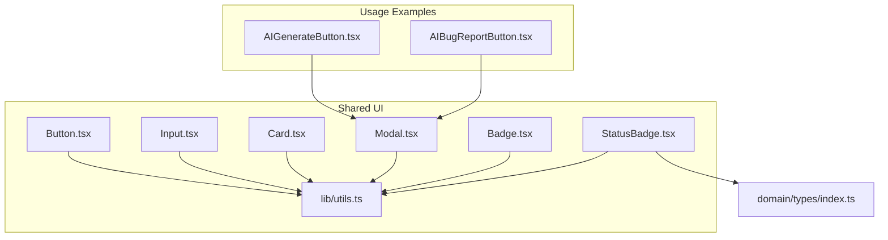
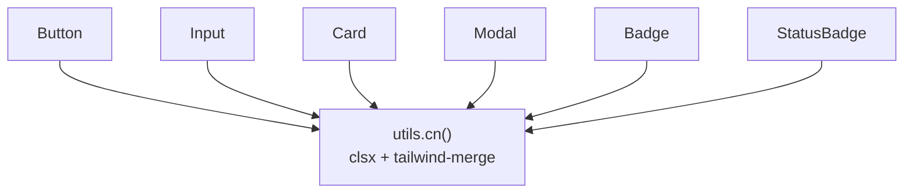
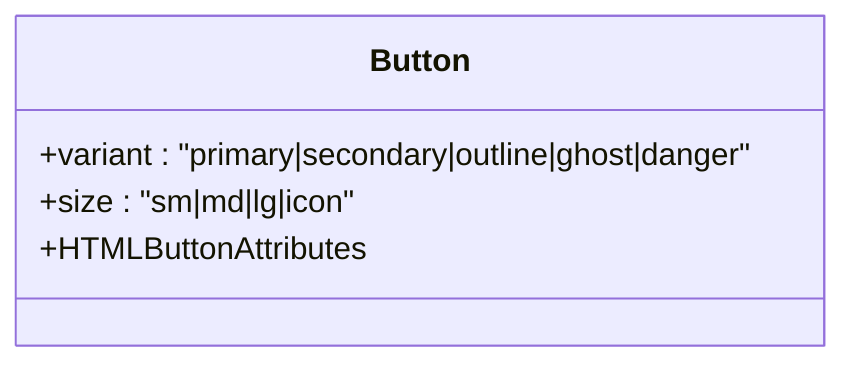
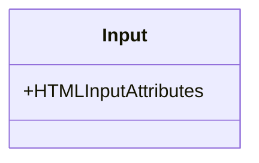
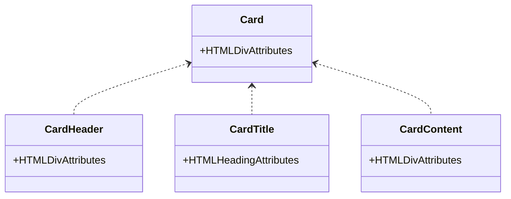
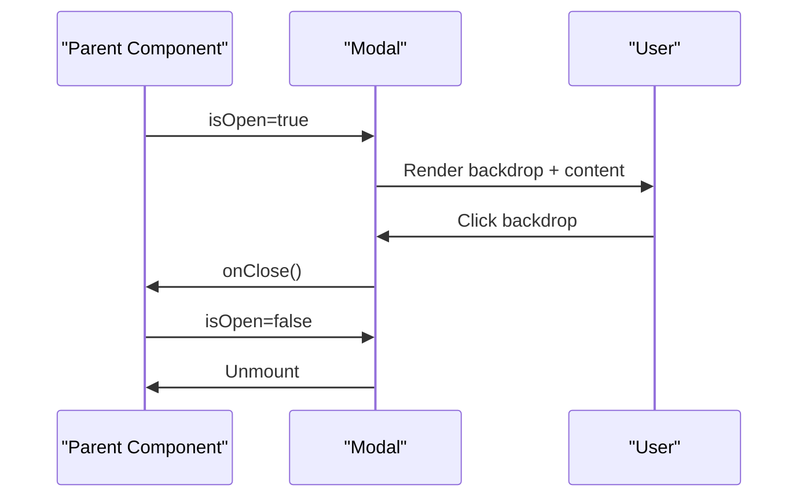
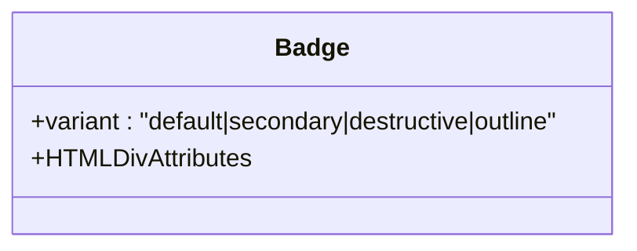
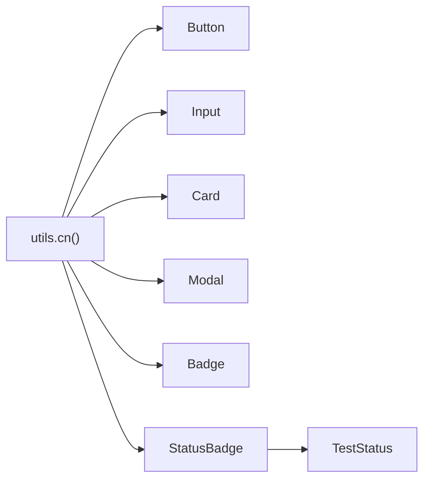

# Shared Components

<cite>
**Referenced Files in This Document**
- [Button.tsx](file://src/ui/shared/Button.tsx)
- [Input.tsx](file://src/ui/shared/Input.tsx)
- [Card.tsx](file://src/ui/shared/Card.tsx)
- [Modal.tsx](file://src/ui/shared/Modal.tsx)
- [Badge.tsx](file://src/ui/shared/Badge.tsx)
- [StatusBadge.tsx](file://src/ui/shared/StatusBadge.tsx)
- [utils.ts](file://src/ui/shared/lib/utils.ts)
- [index.ts](file://src/domain/types/index.ts)
- [AIGenerateButton.tsx](file://src/ui/test-design/AIGenerateButton.tsx)
- [AIBugReportButton.tsx](file://src/ui/test-run/AIBugReportButton.tsx)
- [package.json](file://package.json)
</cite>

## Table of Contents
1. [Introduction](#introduction)
2. [Project Structure](#project-structure)
3. [Core Components](#core-components)
4. [Architecture Overview](#architecture-overview)
5. [Detailed Component Analysis](#detailed-component-analysis)
6. [Dependency Analysis](#dependency-analysis)
7. [Performance Considerations](#performance-considerations)
8. [Troubleshooting Guide](#troubleshooting-guide)
9. [Conclusion](#conclusion)
10. [Appendices](#appendices)

## Introduction
This document describes the shared UI components that form the foundation of the design system. It focuses on:
- Button: variants and sizes, props, styling, and usage patterns
- Input: validation-ready styling, placeholders, and accessibility
- Card: content containers with header/title/content segments
- Modal: dialog management with backdrop and close controls
- Badge: generic status indicators
- StatusBadge: test result-specific status indicators

It also explains the styling approach using Tailwind CSS classes via a centralized utility, outlines prop interfaces, event handling patterns, and provides guidance for extending components while maintaining design consistency.

## Project Structure
The shared components live under src/ui/shared and are composed with:
- Tailwind CSS for styling
- A cn utility that merges classes safely using clsx and tailwind-merge
- Optional icons from lucide-react



**Diagram sources**
- [Button.tsx:1-35](file://src/ui/shared/Button.tsx#L1-L35)
- [Input.tsx:1-22](file://src/ui/shared/Input.tsx#L1-L22)
- [Card.tsx:1-24](file://src/ui/shared/Card.tsx#L1-L24)
- [Modal.tsx:1-47](file://src/ui/shared/Modal.tsx#L1-L47)
- [Badge.tsx:1-25](file://src/ui/shared/Badge.tsx#L1-L25)
- [StatusBadge.tsx:1-28](file://src/ui/shared/StatusBadge.tsx#L1-L28)
- [utils.ts:1-8](file://src/ui/shared/lib/utils.ts#L1-L8)
- [index.ts:1-196](file://src/domain/types/index.ts#L1-L196)
- [AIGenerateButton.tsx:1-166](file://src/ui/test-design/AIGenerateButton.tsx#L1-L166)
- [AIBugReportButton.tsx:1-195](file://src/ui/test-run/AIBugReportButton.tsx#L1-L195)

**Section sources**
- [Button.tsx:1-35](file://src/ui/shared/Button.tsx#L1-L35)
- [Input.tsx:1-22](file://src/ui/shared/Input.tsx#L1-L22)
- [Card.tsx:1-24](file://src/ui/shared/Card.tsx#L1-L24)
- [Modal.tsx:1-47](file://src/ui/shared/Modal.tsx#L1-L47)
- [Badge.tsx:1-25](file://src/ui/shared/Badge.tsx#L1-L25)
- [StatusBadge.tsx:1-28](file://src/ui/shared/StatusBadge.tsx#L1-L28)
- [utils.ts:1-8](file://src/ui/shared/lib/utils.ts#L1-L8)
- [index.ts:1-196](file://src/domain/types/index.ts#L1-L196)
- [AIGenerateButton.tsx:1-166](file://src/ui/test-design/AIGenerateButton.tsx#L1-L166)
- [AIBugReportButton.tsx:1-195](file://src/ui/test-run/AIBugReportButton.tsx#L1-L195)

## Core Components
This section documents each component’s purpose, props, styling approach, and usage patterns.

- Button
  - Purpose: Action control with multiple visual variants and sizing options
  - Variants: primary, secondary, outline, ghost, danger
  - Sizes: sm, md, lg, icon
  - Props: Inherits button attributes; adds variant and size
  - Accessibility: Focus-visible ring and disabled state handled
  - Styling: Uses Tailwind classes merged via cn; responsive dark mode support
  - Example usage: See Modal footer buttons in usage examples

- Input
  - Purpose: Text field with consistent focus, placeholder, and disabled styling
  - Props: Inherits input attributes; supports type and placeholder
  - Accessibility: Focus-visible ring and disabled pointer-events
  - Styling: Consistent height, padding, border, and dark mode palette

- Card
  - Purpose: Container for content with optional header, title, and content segments
  - Composition: Card, CardHeader, CardTitle, CardContent
  - Styling: Rounded borders, shadows, light/dark backgrounds

- Modal
  - Purpose: Dialog overlay with backdrop, close button, and scrollable content area
  - Props: isOpen, onClose, title, children, className
  - Behavior: Renders nothing when closed; handles click-to-close on backdrop
  - Accessibility: Close button includes screen-reader text; backdrop blur

- Badge
  - Purpose: Lightweight status indicator with multiple variants
  - Variants: default, secondary, destructive, outline
  - Styling: Rounded pill shape with color variants and dark mode support

- StatusBadge
  - Purpose: Test result status indicator using domain TestStatus
  - Props: status (from domain), className
  - Variants: PASSED, FAILED, BLOCKED, UNTESTED
  - Styling: Color-coded badges with dark mode variants

**Section sources**
- [Button.tsx:4-7](file://src/ui/shared/Button.tsx#L4-L7)
- [Button.tsx:9-34](file://src/ui/shared/Button.tsx#L9-L34)
- [Input.tsx:4-21](file://src/ui/shared/Input.tsx#L4-L21)
- [Card.tsx:4-23](file://src/ui/shared/Card.tsx#L4-L23)
- [Modal.tsx:5-11](file://src/ui/shared/Modal.tsx#L5-L11)
- [Modal.tsx:13-46](file://src/ui/shared/Modal.tsx#L13-L46)
- [Badge.tsx:4-6](file://src/ui/shared/Badge.tsx#L4-L6)
- [Badge.tsx:8-24](file://src/ui/shared/Badge.tsx#L8-L24)
- [StatusBadge.tsx:5-8](file://src/ui/shared/StatusBadge.tsx#L5-L8)
- [StatusBadge.tsx:10-27](file://src/ui/shared/StatusBadge.tsx#L10-L27)
- [index.ts:3-3](file://src/domain/types/index.ts#L3-L3)

## Architecture Overview
The design system relies on a small set of shared primitives styled with Tailwind. A central utility merges classes safely to avoid conflicts. Components expose minimal, consistent APIs and compose well together.



**Diagram sources**
- [utils.ts:1-8](file://src/ui/shared/lib/utils.ts#L1-L8)
- [Button.tsx:2-2](file://src/ui/shared/Button.tsx#L2-L2)
- [Input.tsx:2-2](file://src/ui/shared/Input.tsx#L2-L2)
- [Card.tsx:2-2](file://src/ui/shared/Card.tsx#L2-L2)
- [Modal.tsx:2-2](file://src/ui/shared/Modal.tsx#L2-L2)
- [Badge.tsx:2-2](file://src/ui/shared/Badge.tsx#L2-L2)
- [StatusBadge.tsx:3-3](file://src/ui/shared/StatusBadge.tsx#L3-L3)

## Detailed Component Analysis

### Button
- Props
  - variant: 'primary' | 'secondary' | 'outline' | 'ghost' | 'danger'
  - size: 'sm' | 'md' | 'lg' | 'icon'
  - Inherits button HTML attributes (e.g., onClick, disabled)
- Styling approach
  - Base: flex alignment, rounded corners, font, transitions, focus-visible ring, disabled states
  - Variants: background, text, hover, and shadow classes per variant
  - Sizes: height, padding, and text size classes per size
  - Dark mode: variant-specific dark classes applied
- Usage patterns
  - Variant examples: primary, secondary, outline, ghost, danger
  - Size examples: sm, md, lg, icon
  - Integration: Used inside Modal footers and standalone actions



**Diagram sources**
- [Button.tsx:4-7](file://src/ui/shared/Button.tsx#L4-L7)

**Section sources**
- [Button.tsx:4-7](file://src/ui/shared/Button.tsx#L4-L7)
- [Button.tsx:9-34](file://src/ui/shared/Button.tsx#L9-L34)

### Input
- Props
  - Inherits input HTML attributes (e.g., type, value, onChange, placeholder)
- Styling approach
  - Consistent height, padding, border, and placeholder colors
  - Focus-visible ring and disabled pointer-events/opacity
  - Dark mode placeholder and border adjustments
- Validation and accessibility
  - No built-in validation state; integrates with external validation libraries
  - Focus-visible ring improves keyboard navigation
- Usage patterns
  - Standard text inputs, textarea-like text areas in modals
  - Combined with labels and form controls



**Diagram sources**
- [Input.tsx:4-4](file://src/ui/shared/Input.tsx#L4-L4)

**Section sources**
- [Input.tsx:4-21](file://src/ui/shared/Input.tsx#L4-L21)

### Card
- Composition
  - Card: base container
  - CardHeader: column stack with vertical spacing and padding
  - CardTitle: heading with font and line-height
  - CardContent: inner content with top padding removal
- Styling approach
  - Rounded borders, shadows, and light/dark backgrounds
  - Consistent padding and typography hierarchy
- Usage patterns
  - Group related content in a bordered container
  - Combine with Badge and StatusBadge for metadata



**Diagram sources**
- [Card.tsx:4-11](file://src/ui/shared/Card.tsx#L4-L11)
- [Card.tsx:13-19](file://src/ui/shared/Card.tsx#L13-L19)
- [Card.tsx:21-23](file://src/ui/shared/Card.tsx#L21-L23)

**Section sources**
- [Card.tsx:4-23](file://src/ui/shared/Card.tsx#L4-L23)

### Modal
- Props
  - isOpen: boolean to control visibility
  - onClose: callback invoked on backdrop click or close button
  - title: optional modal title
  - children: render content
  - className: optional additional classes
- Behavior
  - Renders nothing when closed
  - Backdrop click triggers onClose
  - Close button labeled for screen readers
  - Scrollable content area with max height
- Accessibility
  - Close button includes sr-only label
  - Backdrop blur for visual focus
- Usage patterns
  - Host forms, dialogs, and ephemeral content
  - Controlled by parent state (open/closed)



**Diagram sources**
- [Modal.tsx:13-46](file://src/ui/shared/Modal.tsx#L13-L46)

**Section sources**
- [Modal.tsx:5-11](file://src/ui/shared/Modal.tsx#L5-L11)
- [Modal.tsx:13-46](file://src/ui/shared/Modal.tsx#L13-L46)

### Badge
- Props
  - variant: 'default' | 'secondary' | 'destructive' | 'outline'
  - Inherits div attributes
- Styling approach
  - Pill-shaped rounded badge with color variants
  - Focus ring and dark mode variants
- Usage patterns
  - Labels, categories, and lightweight status indicators



**Diagram sources**
- [Badge.tsx:4-6](file://src/ui/shared/Badge.tsx#L4-L6)

**Section sources**
- [Badge.tsx:4-6](file://src/ui/shared/Badge.tsx#L4-L6)
- [Badge.tsx:8-24](file://src/ui/shared/Badge.tsx#L8-L24)

### StatusBadge
- Props
  - status: TestStatus ('PASSED' | 'FAILED' | 'BLOCKED' | 'UNTESTED')
  - className: optional additional classes
- Styling approach
  - Color-coded badges per status with dark mode variants
  - Centered text and inline-flex layout
- Usage patterns
  - Display test result states in lists and dashboards

```mermaid
classDiagram
class StatusBadge {
+status : TestStatus
+HTMLSpanAttributes
}
class TestStatus {
<<enumeration>>
"PASSED"
"FAILED"
"BLOCKED"
"UNTESTED"
}
StatusBadge --> TestStatus
```

**Diagram sources**
- [StatusBadge.tsx:5-8](file://src/ui/shared/StatusBadge.tsx#L5-L8)
- [index.ts:3-3](file://src/domain/types/index.ts#L3-L3)

**Section sources**
- [StatusBadge.tsx:5-8](file://src/ui/shared/StatusBadge.tsx#L5-L8)
- [StatusBadge.tsx:10-27](file://src/ui/shared/StatusBadge.tsx#L10-L27)
- [index.ts:3-3](file://src/domain/types/index.ts#L3-L3)

## Dependency Analysis
- Internal dependencies
  - All components depend on the cn utility for safe class merging
  - StatusBadge depends on TestStatus from domain types
- External dependencies
  - Tailwind CSS and tailwind-merge for styling
  - lucide-react for icons in usage examples
- Coupling and cohesion
  - Components are cohesive and loosely coupled via props and className composition
  - Minimal cross-component logic reduces risk of tight coupling



**Diagram sources**
- [utils.ts:1-8](file://src/ui/shared/lib/utils.ts#L1-L8)
- [Button.tsx:2-2](file://src/ui/shared/Button.tsx#L2-L2)
- [Input.tsx:2-2](file://src/ui/shared/Input.tsx#L2-L2)
- [Card.tsx:2-2](file://src/ui/shared/Card.tsx#L2-L2)
- [Modal.tsx:2-2](file://src/ui/shared/Modal.tsx#L2-L2)
- [Badge.tsx:2-2](file://src/ui/shared/Badge.tsx#L2-L2)
- [StatusBadge.tsx:3-3](file://src/ui/shared/StatusBadge.tsx#L3-L3)
- [index.ts:3-3](file://src/domain/types/index.ts#L3-L3)

**Section sources**
- [utils.ts:1-8](file://src/ui/shared/lib/utils.ts#L1-L8)
- [StatusBadge.tsx:3-3](file://src/ui/shared/StatusBadge.tsx#L3-L3)
- [index.ts:3-3](file://src/domain/types/index.ts#L3-L3)
- [package.json:41-51](file://package.json#L41-L51)

## Performance Considerations
- Class merging
  - Using clsx and tailwind-merge prevents redundant or conflicting classes, reducing runtime style conflicts
- Rendering
  - Modal conditionally renders only when open to avoid unnecessary DOM nodes
- Icon usage
  - Icons are imported from lucide-react; keep icon usage scoped to minimize bundle impact

[No sources needed since this section provides general guidance]

## Troubleshooting Guide
- Button not responding to clicks
  - Verify disabled prop is not set; disabled buttons prevent pointer events
- Input focus ring not visible
  - Ensure focus-visible styles are not overridden by global CSS
- Modal backdrop click does nothing
  - Confirm onClose handler updates the controlling state and that isOpen reflects false
- StatusBadge color not applying
  - Ensure status value matches TestStatus enumeration exactly

**Section sources**
- [Button.tsx:15-15](file://src/ui/shared/Button.tsx#L15-L15)
- [Input.tsx:12-12](file://src/ui/shared/Input.tsx#L12-L12)
- [Modal.tsx:21-21](file://src/ui/shared/Modal.tsx#L21-L21)
- [StatusBadge.tsx:16-20](file://src/ui/shared/StatusBadge.tsx#L16-L20)

## Conclusion
These shared components provide a consistent, accessible, and extensible foundation for the UI. By composing them thoughtfully and leveraging the cn utility, teams can maintain visual and behavioral consistency across the application. Extend components by adding variant or size options while preserving existing APIs and adhering to the established styling patterns.

[No sources needed since this section summarizes without analyzing specific files]

## Appendices

### Styling Approach and Utilities
- cn utility
  - Merges class names using clsx and normalizes Tailwind duplicates with tailwind-merge
- Tailwind classes
  - Applied consistently across components for colors, spacing, typography, and focus states
- Dark mode
  - Many components include dark:border, dark:bg, and dark:text variants

**Section sources**
- [utils.ts:1-8](file://src/ui/shared/lib/utils.ts#L1-L8)
- [Button.tsx:15-28](file://src/ui/shared/Button.tsx#L15-L28)
- [Input.tsx:11-14](file://src/ui/shared/Input.tsx#L11-L14)
- [Card.tsx:7-7](file://src/ui/shared/Card.tsx#L7-L7)
- [Badge.tsx:11-20](file://src/ui/shared/Badge.tsx#L11-L20)
- [StatusBadge.tsx:13-22](file://src/ui/shared/StatusBadge.tsx#L13-L22)

### Usage Examples References
- Modal hosting forms and actions
  - AIGenerateButton demonstrates Modal with input and action buttons
  - AIBugReportButton demonstrates Modal with generated content and download/push actions

**Section sources**
- [AIGenerateButton.tsx:92-162](file://src/ui/test-design/AIGenerateButton.tsx#L92-L162)
- [AIBugReportButton.tsx:96-171](file://src/ui/test-run/AIBugReportButton.tsx#L96-L171)