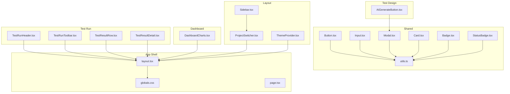
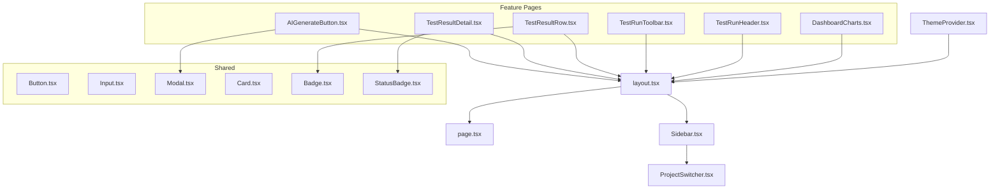
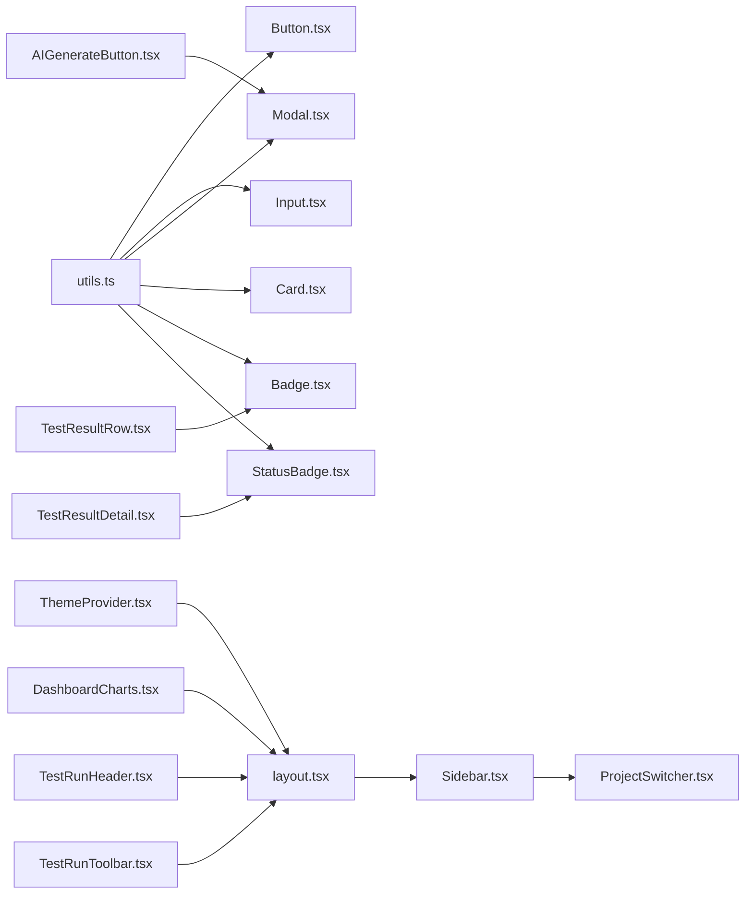

# UI Components and Design System

<cite>
**Referenced Files in This Document**
- [Button.tsx](file://src/ui/shared/Button.tsx)
- [Input.tsx](file://src/ui/shared/Input.tsx)
- [Modal.tsx](file://src/ui/shared/Modal.tsx)
- [Card.tsx](file://src/ui/shared/Card.tsx)
- [Badge.tsx](file://src/ui/shared/Badge.tsx)
- [StatusBadge.tsx](file://src/ui/shared/StatusBadge.tsx)
- [Sidebar.tsx](file://src/ui/layout/Sidebar.tsx)
- [ProjectSwitcher.tsx](file://src/ui/layout/ProjectSwitcher.tsx)
- [ThemeProvider.tsx](file://src/ui/layout/ThemeProvider.tsx)
- [DashboardCharts.tsx](file://src/ui/dashboard/DashboardCharts.tsx)
- [AIGenerateButton.tsx](file://src/ui/test-design/AIGenerateButton.tsx)
- [TestResultRow.tsx](file://src/ui/test-run/TestResultRow.tsx)
- [TestResultDetail.tsx](file://src/ui/test-run/TestResultDetail.tsx)
- [TestRunHeader.tsx](file://src/ui/test-run/TestRunHeader.tsx)
- [TestRunToolbar.tsx](file://src/ui/test-run/TestRunToolbar.tsx)
- [utils.ts](file://src/ui/shared/lib/utils.ts)
- [globals.css](file://app/globals.css)
- [layout.tsx](file://app/layout.tsx)
- [page.tsx](file://app/page.tsx)
- [store.ts](file://src/infrastructure/state/store.ts)
- [useProjectStore.ts](file://src/infrastructure/state/useProjectStore.ts)
</cite>

## Table of Contents
1. [Introduction](#introduction)
2. [Project Structure](#project-structure)
3. [Core Components](#core-components)
4. [Architecture Overview](#architecture-overview)
5. [Detailed Component Analysis](#detailed-component-analysis)
6. [Dependency Analysis](#dependency-analysis)
7. [Performance Considerations](#performance-considerations)
8. [Troubleshooting Guide](#troubleshooting-guide)
9. [Conclusion](#conclusion)
10. [Appendices](#appendices)

## Introduction
This document describes the UI component library and design system used across the application. It covers reusable shared components (Button, Input, Modal, Card, Badge, StatusBadge), layout components (Sidebar, ThemeProvider, ProjectSwitcher), and custom components for dashboards and test runs. For each component, we explain visual appearance, behavior, user interaction patterns, props, accessibility, responsive design, styling via Tailwind CSS, theming, state management, event handling, and integration with the application architecture. We also provide guidelines for extending the component library while maintaining design consistency.

## Project Structure
The UI system is organized by feature domains:
- Shared primitives under src/ui/shared
- Layout components under src/ui/layout
- Dashboard charts under src/ui/dashboard
- Test design and test run components under src/ui/test-design and src/ui/test-run respectively

Styling relies on Tailwind CSS with a utility helper for safe class merging. Theming is provided by a thin wrapper around next-themes. Global styles and theme provider setup live in the Next.js app directory.

**Diagram sources**
- [Button.tsx:1-35](file://src/ui/shared/Button.tsx#L1-L35)
- [Input.tsx:1-22](file://src/ui/shared/Input.tsx#L1-L22)
- [Modal.tsx:1-47](file://src/ui/shared/Modal.tsx#L1-L47)
- [Card.tsx:1-24](file://src/ui/shared/Card.tsx#L1-L24)
- [Badge.tsx:1-25](file://src/ui/shared/Badge.tsx#L1-L25)
- [StatusBadge.tsx:1-28](file://src/ui/shared/StatusBadge.tsx#L1-L28)
- [utils.ts:1-8](file://src/ui/shared/lib/utils.ts#L1-L8)
- [Sidebar.tsx:1-49](file://src/ui/layout/Sidebar.tsx#L1-L49)
- [ProjectSwitcher.tsx:1-397](file://src/ui/layout/ProjectSwitcher.tsx#L1-L397)
- [ThemeProvider.tsx:1-12](file://src/ui/layout/ThemeProvider.tsx#L1-L12)
- [DashboardCharts.tsx:1-178](file://src/ui/dashboard/DashboardCharts.tsx#L1-L178)
- [AIGenerateButton.tsx:1-166](file://src/ui/test-design/AIGenerateButton.tsx#L1-L166)
- [TestResultRow.tsx:1-63](file://src/ui/test-run/TestResultRow.tsx#L1-L63)
- [TestResultDetail.tsx:1-154](file://src/ui/test-run/TestResultDetail.tsx#L1-L154)
- [TestRunHeader.tsx:1-139](file://src/ui/test-run/TestRunHeader.tsx#L1-L139)
- [TestRunToolbar.tsx:1-70](file://src/ui/test-run/TestRunToolbar.tsx#L1-L70)
- [globals.css](file://app/globals.css)
- [layout.tsx](file://app/layout.tsx)
- [page.tsx](file://app/page.tsx)

**Section sources**
- [Button.tsx:1-35](file://src/ui/shared/Button.tsx#L1-L35)
- [Input.tsx:1-22](file://src/ui/shared/Input.tsx#L1-L22)
- [Modal.tsx:1-47](file://src/ui/shared/Modal.tsx#L1-L47)
- [Card.tsx:1-24](file://src/ui/shared/Card.tsx#L1-L24)
- [Badge.tsx:1-25](file://src/ui/shared/Badge.tsx#L1-L25)
- [StatusBadge.tsx:1-28](file://src/ui/shared/StatusBadge.tsx#L1-L28)
- [Sidebar.tsx:1-49](file://src/ui/layout/Sidebar.tsx#L1-L49)
- [ProjectSwitcher.tsx:1-397](file://src/ui/layout/ProjectSwitcher.tsx#L1-L397)
- [ThemeProvider.tsx:1-12](file://src/ui/layout/ThemeProvider.tsx#L1-L12)
- [DashboardCharts.tsx:1-178](file://src/ui/dashboard/DashboardCharts.tsx#L1-L178)
- [AIGenerateButton.tsx:1-166](file://src/ui/test-design/AIGenerateButton.tsx#L1-L166)
- [TestResultRow.tsx:1-63](file://src/ui/test-run/TestResultRow.tsx#L1-L63)
- [TestResultDetail.tsx:1-154](file://src/ui/test-run/TestResultDetail.tsx#L1-L154)
- [TestRunHeader.tsx:1-139](file://src/ui/test-run/TestRunHeader.tsx#L1-L139)
- [TestRunToolbar.tsx:1-70](file://src/ui/test-run/TestRunToolbar.tsx#L1-L70)
- [utils.ts:1-8](file://src/ui/shared/lib/utils.ts#L1-L8)
- [globals.css](file://app/globals.css)
- [layout.tsx](file://app/layout.tsx)
- [page.tsx](file://app/page.tsx)

## Core Components
This section documents the shared primitive components that form the foundation of the design system.

- Button
  - Purpose: Standard interactive button with variants and sizes.
  - Variants: primary, secondary, outline, ghost, danger.
  - Sizes: sm, md, lg, icon.
  - Props: Inherits button attributes; adds variant and size.
  - Accessibility: Uses focus-visible ring; disabled state applies pointer-events none and reduced opacity.
  - Styling: Tailwind classes with semantic variants; supports dark mode.
  - Usage example path: [Button usage example:84-90](file://src/ui/test-design/AIGenerateButton.tsx#L84-L90)

- Input
  - Purpose: Text input field with consistent focus and disabled states.
  - Props: Inherits input attributes.
  - Accessibility: Focus ring; disabled cursor and opacity.
  - Styling: Tailwind classes; dark mode compatible.
  - Usage example path: [Input usage example:58-72](file://src/ui/test-run/TestRunHeader.tsx#L58-L72)

- Modal
  - Purpose: Overlay dialog with backdrop and close affordance.
  - Props: isOpen, onClose, title, children, className.
  - Behavior: Renders nothing when closed; backdrop click triggers onClose; scrollable content area.
  - Accessibility: Close button includes screen-reader-only label; backdrop blur for focus.
  - Styling: Centered content with shadow and dark mode background.
  - Usage example path: [Modal usage example:92-162](file://src/ui/test-design/AIGenerateButton.tsx#L92-L162)

- Card
  - Purpose: Container with header, title, and content slots.
  - Composition: Card, CardHeader, CardTitle, CardContent.
  - Styling: Border, background, and dark mode variants; spacing handled per slot.
  - Usage example path: [Card usage example:25-65](file://src/ui/dashboard/DashboardCharts.tsx#L25-L65)

- Badge
  - Purpose: Small status or tag indicator.
  - Variants: default, secondary, destructive, outline.
  - Styling: Rounded pill shape; variant-specific colors; dark mode support.
  - Usage example path: [Badge usage example:50-57](file://src/ui/test-run/TestResultRow.tsx#L50-L57)

- StatusBadge
  - Purpose: Status-aware badge using domain status values.
  - Props: status (from domain types), className.
  - Behavior: Maps status to color scheme and text.
  - Usage example path: [StatusBadge usage example:10-27](file://src/ui/shared/StatusBadge.tsx#L10-L27)

**Section sources**
- [Button.tsx:1-35](file://src/ui/shared/Button.tsx#L1-L35)
- [Input.tsx:1-22](file://src/ui/shared/Input.tsx#L1-L22)
- [Modal.tsx:1-47](file://src/ui/shared/Modal.tsx#L1-L47)
- [Card.tsx:1-24](file://src/ui/shared/Card.tsx#L1-L24)
- [Badge.tsx:1-25](file://src/ui/shared/Badge.tsx#L1-L25)
- [StatusBadge.tsx:1-28](file://src/ui/shared/StatusBadge.tsx#L1-L28)
- [AIGenerateButton.tsx:84-90](file://src/ui/test-design/AIGenerateButton.tsx#L84-L90)
- [TestRunHeader.tsx:58-72](file://src/ui/test-run/TestRunHeader.tsx#L58-L72)
- [DashboardCharts.tsx:25-65](file://src/ui/dashboard/DashboardCharts.tsx#L25-L65)
- [TestResultRow.tsx:50-57](file://src/ui/test-run/TestResultRow.tsx#L50-L57)
- [StatusBadge.tsx:10-27](file://src/ui/shared/StatusBadge.tsx#L10-L27)

## Architecture Overview
The UI components integrate with global theming, routing, and state management. The ThemeProvider wraps the app shell, enabling light/dark modes. Layout components coordinate navigation and project switching. Shared components are used across pages and feature areas. Charts encapsulate visualization logic. Test run components manage selection, filtering, and detail views.

**Diagram sources**
- [ThemeProvider.tsx:1-12](file://src/ui/layout/ThemeProvider.tsx#L1-L12)
- [layout.tsx](file://app/layout.tsx)
- [page.tsx](file://app/page.tsx)
- [Sidebar.tsx:1-49](file://src/ui/layout/Sidebar.tsx#L1-L49)
- [ProjectSwitcher.tsx:1-397](file://src/ui/layout/ProjectSwitcher.tsx#L1-L397)
- [DashboardCharts.tsx:1-178](file://src/ui/dashboard/DashboardCharts.tsx#L1-L178)
- [TestRunHeader.tsx:1-139](file://src/ui/test-run/TestRunHeader.tsx#L1-L139)
- [TestRunToolbar.tsx:1-70](file://src/ui/test-run/TestRunToolbar.tsx#L1-L70)
- [TestResultRow.tsx:1-63](file://src/ui/test-run/TestResultRow.tsx#L1-L63)
- [TestResultDetail.tsx:1-154](file://src/ui/test-run/TestResultDetail.tsx#L1-L154)
- [AIGenerateButton.tsx:1-166](file://src/ui/test-design/AIGenerateButton.tsx#L1-L166)
- [Button.tsx:1-35](file://src/ui/shared/Button.tsx#L1-L35)
- [Input.tsx:1-22](file://src/ui/shared/Input.tsx#L1-L22)
- [Modal.tsx:1-47](file://src/ui/shared/Modal.tsx#L1-L47)
- [Card.tsx:1-24](file://src/ui/shared/Card.tsx#L1-L24)
- [Badge.tsx:1-25](file://src/ui/shared/Badge.tsx#L1-L25)
- [StatusBadge.tsx:1-28](file://src/ui/shared/StatusBadge.tsx#L1-L28)

## Detailed Component Analysis

### Button
- Visual appearance: Rounded, compact, with variant-specific colors and shadows; icon variant matches square aspect ratio.
- Behavior: Accepts native button props; variant and size classes are merged with user-provided className.
- Interaction: Focus-visible ring; disabled state prevents interaction and reduces opacity.
- Props: variant (primary | secondary | outline | ghost | danger), size (sm | md | lg | icon), plus button HTML attributes.
- Accessibility: Focus ring via focus-visible utilities; disabled state managed by attributes.
- Styling: Tailwind classes; dark mode variants applied conditionally.
- Usage example path: [Button usage example:84-90](file://src/ui/test-design/AIGenerateButton.tsx#L84-L90)

**Section sources**
- [Button.tsx:1-35](file://src/ui/shared/Button.tsx#L1-L35)
- [AIGenerateButton.tsx:84-90](file://src/ui/test-design/AIGenerateButton.tsx#L84-L90)

### Input
- Visual appearance: Consistent height and padding; placeholder and text colors adapt to dark mode.
- Behavior: Inherits all input attributes; focus-visible ring and disabled state handled.
- Props: type and all input HTML attributes.
- Accessibility: Focus ring; disabled cursor and opacity.
- Styling: Tailwind classes; dark mode compatible.
- Usage example path: [Input usage example:58-72](file://src/ui/test-run/TestRunHeader.tsx#L58-L72)

**Section sources**
- [Input.tsx:1-22](file://src/ui/shared/Input.tsx#L1-L22)
- [TestRunHeader.tsx:58-72](file://src/ui/test-run/TestRunHeader.tsx#L58-L72)

### Modal
- Visual appearance: Centered card with backdrop blur; optional title; close button with sr-only label.
- Behavior: Controlled via isOpen; clicking backdrop invokes onClose; scrollable content area.
- Props: isOpen, onClose, title, children, className.
- Accessibility: Screen-reader label on close; backdrop click closes modal.
- Styling: Relative z-index, max-width, rounded corners, shadow; dark mode background.
- Usage example path: [Modal usage example:92-162](file://src/ui/test-design/AIGenerateButton.tsx#L92-L162)

**Section sources**
- [Modal.tsx:1-47](file://src/ui/shared/Modal.tsx#L1-L47)
- [AIGenerateButton.tsx:92-162](file://src/ui/test-design/AIGenerateButton.tsx#L92-L162)

### Card
- Visual appearance: Container with border and background; header/title/content slots for consistent spacing.
- Behavior: Composed via named exports; CardHeader/CardContent handle padding and layout.
- Props: className for all parts; accepts HTML attributes.
- Accessibility: No special handling; rely on semantic headings and paragraphs.
- Styling: Tailwind classes; dark mode variants.
- Usage example path: [Card usage example:25-65](file://src/ui/dashboard/DashboardCharts.tsx#L25-L65)

**Section sources**
- [Card.tsx:1-24](file://src/ui/shared/Card.tsx#L1-L24)
- [DashboardCharts.tsx:25-65](file://src/ui/dashboard/DashboardCharts.tsx#L25-L65)

### Badge
- Visual appearance: Pill-shaped indicator with variant colors; outline vs filled variants.
- Behavior: Maps variant to color classes; supports custom className.
- Props: variant (default | secondary | destructive | outline), plus HTML attributes.
- Accessibility: No special handling; suitable for decorative status indicators.
- Styling: Tailwind classes; dark mode variants.
- Usage example path: [Badge usage example:50-57](file://src/ui/test-run/TestResultRow.tsx#L50-L57)

**Section sources**
- [Badge.tsx:1-25](file://src/ui/shared/Badge.tsx#L1-L25)
- [TestResultRow.tsx:50-57](file://src/ui/test-run/TestResultRow.tsx#L50-L57)

### StatusBadge
- Visual appearance: Status-specific color and background; maps domain status to visual style.
- Behavior: Receives a domain status and renders a concise badge.
- Props: status (from domain types), className.
- Accessibility: No special handling; text content is status label.
- Styling: Tailwind classes; dark mode variants.
- Usage example path: [StatusBadge usage example:10-27](file://src/ui/shared/StatusBadge.tsx#L10-L27)

**Section sources**
- [StatusBadge.tsx:1-28](file://src/ui/shared/StatusBadge.tsx#L1-L28)
- [StatusBadge.tsx:10-27](file://src/ui/shared/StatusBadge.tsx#L10-L27)

### Sidebar
- Visual appearance: Fixed sidebar with project header, navigation items, and active state highlighting.
- Behavior: Uses Next.js routing to compute active state; includes icons and hover/focus states.
- Props: None; reads current path via hook.
- Accessibility: Links and buttons use semantic elements; focus-visible states.
- Styling: Tailwind classes; dark mode compatible.
- Usage example path: [Sidebar usage example:16-48](file://src/ui/layout/Sidebar.tsx#L16-L48)

**Section sources**
- [Sidebar.tsx:1-49](file://src/ui/layout/Sidebar.tsx#L1-L49)

### ProjectSwitcher
- Visual appearance: Dropdown with project list, stats badges, actions (rename/delete), and create flow.
- Behavior: Manages local state for editing, creation, deletion confirmation; integrates with project store; handles clicks outside to close.
- Props: None; manages internal state and effects.
- Accessibility: Keyboard navigation via Enter/Escape; focus management; sr-only labels where appropriate.
- Styling: Tailwind classes; dark mode compatible; hover groups for contextual actions.
- Usage example path: [ProjectSwitcher usage example:149-396](file://src/ui/layout/ProjectSwitcher.tsx#L149-L396)

**Section sources**
- [ProjectSwitcher.tsx:1-397](file://src/ui/layout/ProjectSwitcher.tsx#L1-L397)

### ThemeProvider
- Visual appearance: Transparent wrapper around the app shell.
- Behavior: Delegates to next-themes provider; enables system, light, and dark modes.
- Props: Inherits next-themes provider props; children.
- Accessibility: No special handling; relies on system preferences and user choice.
- Styling: No component-level styles.
- Usage example path: [ThemeProvider usage example:6-11](file://src/ui/layout/ThemeProvider.tsx#L6-L11)

**Section sources**
- [ThemeProvider.tsx:1-12](file://src/ui/layout/ThemeProvider.tsx#L1-L12)

### DashboardCharts
- Visual appearance: Recharts-based charts (pie, area, priority vertical bar, module success rate bar) with tooltips and legends.
- Behavior: Responsive containers; gradient fills; custom tooltip styling; legend formatting.
- Props: type ('pie' | 'bar' | 'area' | 'priority'), data array.
- Accessibility: Charts are presentational; ensure data tables exist elsewhere for accessibility.
- Styling: Tailwind container heights; Recharts components styled via props.
- Usage example path: [DashboardCharts usage example:25-177](file://src/ui/dashboard/DashboardCharts.tsx#L25-L177)

**Section sources**
- [DashboardCharts.tsx:1-178](file://src/ui/dashboard/DashboardCharts.tsx#L1-L178)

### AIGenerateButton
- Visual appearance: Prominent primary button; opens modal with file selection and generation flow.
- Behavior: Modal-driven workflow; reads up to 50 files from selected folder; sends request to backend; refreshes page on success.
- Props: None; manages internal state.
- Accessibility: Modal with controlled open/close; disabled states during generation; keyboard navigation.
- Styling: Tailwind classes; dark mode compatible.
- Usage example path: [AIGenerateButton usage example:82-165](file://src/ui/test-design/AIGenerateButton.tsx#L82-L165)

**Section sources**
- [AIGenerateButton.tsx:1-166](file://src/ui/test-design/AIGenerateButton.tsx#L1-L166)

### TestResultRow
- Visual appearance: Row with checkbox, status icon badge, test ID, title, priority badge, and chevron.
- Behavior: Selection and check events bubble via callbacks; status icon determined by status mapping.
- Props: result, isSelected, isChecked, onClick, onCheck.
- Accessibility: Checkbox with proper event propagation; focusable row; readable labels.
- Styling: Tailwind classes; dark mode compatible.
- Usage example path: [TestResultRow usage example:20-62](file://src/ui/test-run/TestResultRow.tsx#L20-L62)

**Section sources**
- [TestResultRow.tsx:1-63](file://src/ui/test-run/TestResultRow.tsx#L1-L63)

### TestResultDetail
- Visual appearance: Side panel with status buttons, steps, expected result, notes textarea, and attachments grid.
- Behavior: Updates status via callback; manages notes and attachments; drag-and-drop upload area.
- Props: selectedResult, onClose, updateStatus, updateNotes, deleteAttachment, dropzoneProps.
- Accessibility: Proper labels; focus management; accessible file previews.
- Styling: Tailwind classes; dark mode compatible.
- Usage example path: [TestResultDetail usage example:19-153](file://src/ui/test-run/TestResultDetail.tsx#L19-L153)

**Section sources**
- [TestResultDetail.tsx:1-154](file://src/ui/test-run/TestResultDetail.tsx#L1-L154)

### TestRunHeader
- Visual appearance: Page header with back link, editable run name, finish/export actions, and progress bar.
- Behavior: Inline-editable name with save/cancel; finish run triggers API call; export opens report.
- Props: run, stats (PASSED, FAILED, BLOCKED, UNTESTED, total).
- Accessibility: Editable inputs with keyboard shortcuts; focus-visible states.
- Styling: Tailwind classes; dark mode compatible.
- Usage example path: [TestRunHeader usage example:17-138](file://src/ui/test-run/TestRunHeader.tsx#L17-L138)

**Section sources**
- [TestRunHeader.tsx:1-139](file://src/ui/test-run/TestRunHeader.tsx#L1-L139)

### TestRunToolbar
- Visual appearance: Toolbar with search, status filter, priority filter, and mass update actions.
- Behavior: Integrates with test run store for filters and selection; mass updates via callbacks.
- Props: massUpdateStatus.
- Accessibility: Select elements with keyboard navigation; focus-visible states.
- Styling: Tailwind classes; dark mode compatible.
- Usage example path: [TestRunToolbar usage example:9-69](file://src/ui/test-run/TestRunToolbar.tsx#L9-L69)

**Section sources**
- [TestRunToolbar.tsx:1-70](file://src/ui/test-run/TestRunToolbar.tsx#L1-L70)

## Dependency Analysis
The component library exhibits clear separation of concerns:
- Shared components depend on a utility for class merging.
- Layout components depend on routing and stores.
- Feature components depend on shared components and stores.
- Theming is centralized via ThemeProvider.

**Diagram sources**
- [utils.ts:1-8](file://src/ui/shared/lib/utils.ts#L1-L8)
- [Button.tsx:1-35](file://src/ui/shared/Button.tsx#L1-L35)
- [Input.tsx:1-22](file://src/ui/shared/Input.tsx#L1-L22)
- [Modal.tsx:1-47](file://src/ui/shared/Modal.tsx#L1-L47)
- [Card.tsx:1-24](file://src/ui/shared/Card.tsx#L1-L24)
- [Badge.tsx:1-25](file://src/ui/shared/Badge.tsx#L1-L25)
- [StatusBadge.tsx:1-28](file://src/ui/shared/StatusBadge.tsx#L1-L28)
- [ThemeProvider.tsx:1-12](file://src/ui/layout/ThemeProvider.tsx#L1-L12)
- [layout.tsx](file://app/layout.tsx)
- [Sidebar.tsx:1-49](file://src/ui/layout/Sidebar.tsx#L1-L49)
- [ProjectSwitcher.tsx:1-397](file://src/ui/layout/ProjectSwitcher.tsx#L1-L397)
- [AIGenerateButton.tsx:1-166](file://src/ui/test-design/AIGenerateButton.tsx#L1-L166)
- [TestResultDetail.tsx:1-154](file://src/ui/test-run/TestResultDetail.tsx#L1-L154)
- [TestResultRow.tsx:1-63](file://src/ui/test-run/TestResultRow.tsx#L1-L63)
- [DashboardCharts.tsx:1-178](file://src/ui/dashboard/DashboardCharts.tsx#L1-L178)
- [TestRunHeader.tsx:1-139](file://src/ui/test-run/TestRunHeader.tsx#L1-L139)
- [TestRunToolbar.tsx:1-70](file://src/ui/test-run/TestRunToolbar.tsx#L1-L70)

**Section sources**
- [utils.ts:1-8](file://src/ui/shared/lib/utils.ts#L1-L8)
- [Button.tsx:1-35](file://src/ui/shared/Button.tsx#L1-L35)
- [Input.tsx:1-22](file://src/ui/shared/Input.tsx#L1-L22)
- [Modal.tsx:1-47](file://src/ui/shared/Modal.tsx#L1-L47)
- [Card.tsx:1-24](file://src/ui/shared/Card.tsx#L1-L24)
- [Badge.tsx:1-25](file://src/ui/shared/Badge.tsx#L1-L25)
- [StatusBadge.tsx:1-28](file://src/ui/shared/StatusBadge.tsx#L1-L28)
- [ThemeProvider.tsx:1-12](file://src/ui/layout/ThemeProvider.tsx#L1-L12)
- [layout.tsx](file://app/layout.tsx)
- [Sidebar.tsx:1-49](file://src/ui/layout/Sidebar.tsx#L1-L49)
- [ProjectSwitcher.tsx:1-397](file://src/ui/layout/ProjectSwitcher.tsx#L1-L397)
- [AIGenerateButton.tsx:1-166](file://src/ui/test-design/AIGenerateButton.tsx#L1-L166)
- [TestResultDetail.tsx:1-154](file://src/ui/test-run/TestResultDetail.tsx#L1-L154)
- [TestResultRow.tsx:1-63](file://src/ui/test-run/TestResultRow.tsx#L1-L63)
- [DashboardCharts.tsx:1-178](file://src/ui/dashboard/DashboardCharts.tsx#L1-L178)
- [TestRunHeader.tsx:1-139](file://src/ui/test-run/TestRunHeader.tsx#L1-L139)
- [TestRunToolbar.tsx:1-70](file://src/ui/test-run/TestRunToolbar.tsx#L1-L70)

## Performance Considerations
- Prefer lightweight shared components and avoid unnecessary re-renders by passing memoized callbacks and stable references.
- Use responsive containers for charts to minimize layout shifts.
- Keep modal content lazy-loaded when possible to reduce initial render cost.
- Use CSS containment and transform-style for complex lists to improve scrolling performance.
- Debounce search inputs in toolbars to reduce API calls.

## Troubleshooting Guide
- Modal does not close: Ensure the backdrop click handler invokes the provided onClose prop and that the component re-renders when isOpen changes.
- Dark mode not applying: Verify ThemeProvider is wrapping the app shell and that Tailwind’s dark mode settings are configured.
- Chart rendering issues: Confirm data arrays are non-empty and formatted correctly; ensure responsive container dimensions are set.
- Test run selection not updating: Check that store selectors and callbacks are passed correctly to toolbar and rows.
- Project switcher dropdown stays open: Ensure click-outside listener is attached and cleaned up properly.

**Section sources**
- [Modal.tsx:13-46](file://src/ui/shared/Modal.tsx#L13-L46)
- [ThemeProvider.tsx:6-11](file://src/ui/layout/ThemeProvider.tsx#L6-L11)
- [DashboardCharts.tsx:25-177](file://src/ui/dashboard/DashboardCharts.tsx#L25-L177)
- [TestRunToolbar.tsx:9-69](file://src/ui/test-run/TestRunToolbar.tsx#L9-L69)
- [ProjectSwitcher.tsx:50-59](file://src/ui/layout/ProjectSwitcher.tsx#L50-L59)

## Conclusion
The UI component library emphasizes composability, consistency, and accessibility using Tailwind CSS and Recharts. Shared components provide a uniform foundation, while layout and feature components demonstrate practical integration patterns. Centralized theming and state management enable scalable development. Extending the library follows established patterns: define props, apply Tailwind classes, leverage the utility helper, and integrate with stores and providers.

## Appendices

### Accessibility Compliance Guidelines
- Use semantic HTML elements (button, input, nav, main).
- Ensure focus management and visible focus rings.
- Provide labels and aria attributes where implicit labeling is insufficient.
- Respect disabled states and reduced motion preferences.
- Test keyboard navigation and screen reader compatibility.

### Responsive Design Considerations
- Use width utilities and responsive breakpoints for layouts.
- Ensure modals and side panels remain usable on small screens.
- Prefer mobile-first spacing and typography scales.
- Test charts and tables on various viewport sizes.

### Styling Approach Using Tailwind CSS
- Centralize class merging via the utility helper to avoid conflicts.
- Use semantic variants for components (e.g., Button variants).
- Apply dark mode variants consistently across components.
- Keep component-specific styles scoped to component files.

### Theming Support
- Wrap the app with ThemeProvider to enable system/light/dark modes.
- Use CSS variables and Tailwind’s dark mode for consistent color tokens.
- Ensure all interactive states (hover, focus, active, disabled) are themed.

### Component State Management and Event Handling
- Prefer controlled components with explicit callbacks for parent coordination.
- Manage ephemeral UI state internally (e.g., modals, dropdowns).
- Integrate with domain stores for persistent state (e.g., project store, test run store).
- Handle asynchronous operations with loading and error states.

### Integration with Application Architecture
- Layout components coordinate navigation and project context.
- Feature components consume shared primitives and domain stores.
- Charts encapsulate visualization logic and are integrated into pages.
- ThemeProvider is placed at the app shell level for global availability.